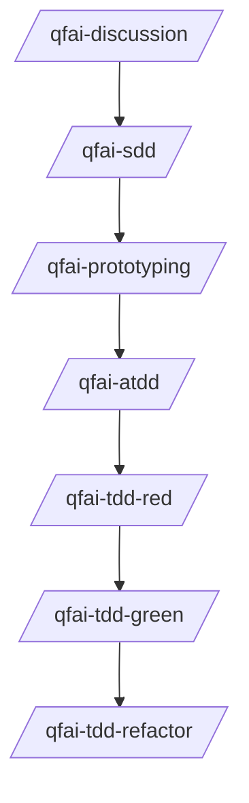

# .qfai (QFAI Workspace)

## Purpose

`.qfai/` is the single workspace for QFAI artifacts so requirements, contracts, spec packs, and automation stay aligned.

This folder is generated by `qfai init` and designed to be:

- predictable (stable layout),
- reviewable (human-readable Markdown/YAML/SQL),
- machine-checkable (validators enforce minimal structural rules).

## Recommended QFAI sequence (project)



> Formatting must follow the templates and checklists documented in each directory README.
> Deprecated legacy wrappers (`/qfai-sdd-refinement`, `/qfai-sdd-planning`) are no longer distributed by `qfai init`. Use `/qfai-sdd` instead.

## Directory map

```text
.qfai/
├── README.md
├── discuss/
│   └── README.md
├── assistant/
│   ├── skills/               # canonical skills (SSOT)
│   ├── skills.local/         # project-specific overrides
│   ├── agents/               # sub-agent missions
│   ├── templates/            # shared assistant templates (RCP footer SSOT)
│   ├── steering/             # project steering inputs and review roster
│   └── instructions/         # workflow and guardrail docs
├── require/
│   ├── README.md
│   └── require-YYYYMMDDhhmmssSSS/
│       ├── 01_Sources.md
│       ├── 02_Scope.md
│       ├── 03_REQ.md
│       ├── 04_NFR.md
│       ├── 05_Glossary.md
│       ├── 06_Constraints.md
│       ├── 07_Policy.md
│       ├── 08_OQ.md
│       └── 09_delta.md
├── report/
│   ├── .gitignore
│   └── README.md
├── review/
│   ├── .gitignore
│   └── README.md
├── contracts/
│   ├── README.md
│   ├── api/
│   │   └── README.md
│   ├── db/
│   │   └── README.md
│   └── ui/
│       └── README.md
├── specs/
│   └── README.md
└── evidence/
    ├── README.md
    ├── .gitignore
    └── <skill>-<run>.md
```

## Rules (global)

### R1. README-as-SSOT for formatting

Each directory `README.md` defines:

- required files,
- template expectations,
- quality checklist,
- anti-patterns.

Custom skills should read relevant README files before writing artifacts.

### R2. Evidence is not versioned by default

Evidence under `.qfai/evidence/` is gitignored by default.
It is useful for local review but should not pollute version control.

### R3. Keep artifacts atomic

- Prefer small stable identifiers (REQ/BR/AC/TC/EX/etc.) over long mixed paragraphs.
- If one line contains multiple independent constraints, split it.

### R4. Layered specs are runtime SSOT

- Runtime validators consume `_policies/**` and `spec-XXXX/**`.
- Execution skills enter from `spec-XXXX/01_Spec.md` and read `_policies/**` only through the spec's Escalation Hook.
- Split rule is fixed: `1 CAP = 1 spec`.
- Parent chain is fixed: `US -> CAP`, `AC -> US`, `BR -> AC`, `EX -> BR|AC`, `TC -> EX`.
- Derived outputs under `.qfai/report/**` are non-SSOT.

### R5. init is an empty scaffold

- `qfai init` creates README-centric directories for `discuss`, `require`, `report`, `contracts`, and `specs`.
- Sample artifacts are provided under skill templates (for example, `assistant/skills/qfai-sdd/templates/contracts/`).

## Skills (SSOT)

`assistant/skills/**` is the canonical source.
Invoke canonical skills from this tree directly.

## Where to look next

- Requirements format: `require/README.md`
- Review gate format: `review/README.md`
- Contracts format: `contracts/README.md` and child READMEs
- Layered spec format: `specs/README.md`
- Change classification: `assistant/instructions/change-classification.md`
- Evidence rules: `evidence/README.md`
