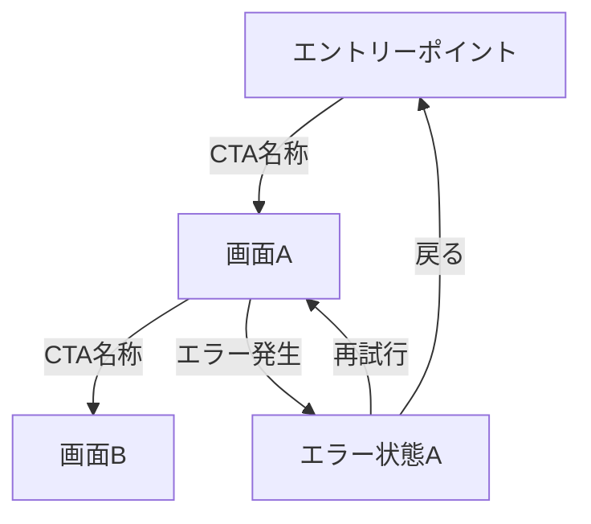

# 10 Plan

> **How-only.** What and Why live in 01_Spec.md. This file is the single source of truth for implementation order, test strategy, and risk mitigation.

---

## 1. Implementation Steps

### Step 1: Mermaid 遷移図テンプレートの策定

UI-bearing spec で使用する Mermaid 遷移図のテンプレートを策定する。

```text
spec-XXXX/
└── flows/
    ├── navigation-flow.md    (flowchart: 全画面遷移)
    ├── error-recovery.md     (flowchart: エラーリカバリーフロー)
    └── viewport-diff.md      (サブグラフ: desktop/mobile 差分)
```

#### テンプレート構造



### Step 2: ナビゲーション構造の定義

#### 2a. 全画面ノードの洗い出し

対象 UI の全画面を列挙し、以下を記録する:

| 項目         | 説明                                |
| ------------ | ----------------------------------- |
| ノード ID    | 一意識別子（kebab-case）            |
| 画面名称     | 日本語の表示名                      |
| 種別         | entry / normal / error / terminal   |
| ビューポート | desktop-only / mobile-only / shared |

#### 2b. エッジの定義

各遷移を定義し、ラベル（CTA 名称 / トリガーイベント名）を必ず付与する。

#### 2c. エラーリカバリーパスの定義

エラー種別ごとにリカバリーパスを定義する:

| エラー種別           | リカバリーパス              |
| -------------------- | --------------------------- |
| バリデーションエラー | 入力修正 → 再送信           |
| 認証エラー           | ログイン画面リダイレクト    |
| サーバーエラー       | 再試行 / フォールバック画面 |
| 通信エラー           | 再試行 / オフライン状態画面 |

### Step 3: ビューポート差分の記録

デスクトップとモバイルで遷移パスまたはナビゲーション要素が異なる場合:

1. 差分をサブグラフで明記する
2. 各ビューポートで全画面への到達可能性を確認する
3. 差分がない場合は「共通」と明記する

### Step 4: ディープリンク対応

1. ディープリンクで直接アクセス可能な画面を列挙する
2. 認証ガードによるリダイレクトフローを遷移図に追加する
3. ディープリンクエントリーポイントから正常フローへの合流を記録する

### Step 5: 整合性検証ルールの実装

#### 5a. 到達可能性チェック

- 遷移図のノード・エッジからグラフを構築
- エントリーポイントから BFS で全ノード到達可能性を検証
- 孤立ノードを報告

#### 5b. エッジラベルチェック

- 全エッジにラベルが付与されていることを検証
- 空文字列ラベルを検出

#### 5c. エラーリカバリーチェック

- エラーノードの出辺数を検証
- リカバリー先が正常フローのノードであることを確認

#### 5d. 遷移図・実装突合チェック

- 遷移図のノード名と UI 実装の画面一覧を突合
- 不整合をレビュー対象として報告

---

## 2. Test Strategy

### テスト配置

Mermaid 遷移図のバリデーションは以下の 2 段階で実施する:

1. **静的検証（unit）:** Mermaid 構文パース、エッジラベル存在、行き止まりノード検出
2. **構造検証（integration）:** 到達可能性分析、エラーリカバリーパス検証、ビューポート差分確認、実装突合

### テストケース

| TC ID        | Title                                    | Level       | AC-Refs      | Key Assertions                                              |
| ------------ | ---------------------------------------- | ----------- | ------------ | ----------------------------------------------------------- |
| TC-0020-0001 | Mermaid 遷移図の構文妥当性検証           | unit        | AC-0020-0001 | 全コードブロックが構文エラーなくパースできる                |
| TC-0020-0002 | 全画面ノードの到達可能性検証             | integration | AC-0020-0002 | 孤立ノード 0 件                                             |
| TC-0020-0003 | エッジラベルの存在検証                   | unit        | AC-0020-0003 | ラベルなしエッジ 0 件                                       |
| TC-0020-0004 | エラーノードのリカバリーパス存在検証     | integration | AC-0020-0004 | 全エラーノードに出辺 >= 1                                   |
| TC-0020-0005 | 行き止まりノード不在検証                 | unit        | AC-0020-0005 | 終了ノード以外の出辺 0 ノード = 0 件                        |
| TC-0020-0006 | デスクトップ／モバイル遷移差分記録の検証 | integration | AC-0020-0006 | 差分記録またはの「共通」明記が存在                          |
| TC-0020-0007 | 遷移図と UI 実装の整合性チェック         | integration | AC-0020-0007 | 遷移図ノード ⊇ UI 実装画面、かつ UI 実装画面 ⊇ 遷移図ノード |
| TC-0020-0008 | 遷移図未更新時の不整合検出               | integration | AC-0020-0008 | 不整合検出 → review gate FAIL                               |

### ATDD アノテーション

各テストにトレーサビリティコメントを付与する:

- Format: `// QFAI:SPEC-0020:TC-XXXX`

### テストヘルパー

- Mermaid パーサーライブラリ（例: `mermaid-js` の parse API）でフロー解析
- グラフ構造の BFS / DFS 到達可能性チェックは自前ユーティリティ
- ファイルシステムベースの突合（ルート定義ファイルとの照合）

---

## 3. Risk & Mitigation

| Risk                                 | Impact                                   | Likelihood | Mitigation                                                                   |
| ------------------------------------ | ---------------------------------------- | ---------- | ---------------------------------------------------------------------------- |
| Mermaid 構文の複雑化による可読性低下 | 遷移図が巨大化し、保守が困難になる       | Medium     | サブグラフで機能単位に分割。1 ファイル 1 フロー原則                          |
| エラーノードの命名規則不統一         | 自動検出が困難になる                     | Medium     | エラーノード命名規則を策定（接頭辞 `err-` またはスタイルクラス `:::error`）  |
| ビューポート差分の見落とし           | モバイルでのナビゲーション不具合         | Medium     | TC-0020-0006 で差分記録の存在を強制。レビュー時に desktop/mobile 両方で確認  |
| 遷移図と実装の同期忘れ               | 不整合が本番に流出する                   | High       | review gate での自動突合チェック（TC-0020-0007, TC-0020-0008）               |
| ディープリンク対応の認証ガード漏れ   | 未認証ユーザーが保護画面にアクセスできる | Medium     | ディープリンク対象画面の認証ガードフローを遷移図に明記し、テストケースで検証 |

---

## 4. Dependencies

### Upstream

- **discussion-20260324054332396** — 承認済み。REQ-0004（ナビゲーション・フロー Mermaid 化）、REQ-0005（スクリーンモック方向整合）を提供。
- **NFR-0002** — トレーサビリティ 100%。遷移図と実装の追跡率。
- **NFR-0003** — レスポンシブ。デスクトップ／モバイル両対応。
- **NFR-0004** — a11y ベースライン。キーボードナビゲーションパスの保証。

### Downstream

- `/qfai-prototyping` — 遷移図を入力として画面プロトタイプを生成する。
- `/qfai-implement` — 遷移図に基づいてルーティング・ナビゲーションを実装する。
- `/qfai-atdd` — 遷移図のテストケースを ATDD シナリオに変換する。

### Internal (no action required)

- DDP（Design Direction Pack）— CTA 階層定義の参照元。読み取り専用。

---

## 5. Deliverables Checklist

### 遷移図テンプレート

- [ ] Mermaid flowchart テンプレート（正常遷移用）
- [ ] Mermaid flowchart テンプレート（エラーリカバリー用）
- [ ] ビューポート差分サブグラフテンプレート

### 検証ルール

- [ ] 到達可能性チェックルール
- [ ] エッジラベル存在チェックルール
- [ ] エラーリカバリーパスチェックルール
- [ ] 遷移図・実装突合チェックルール

### テスト

- [ ] TC-0020-0001〜TC-0020-0008 の実装
