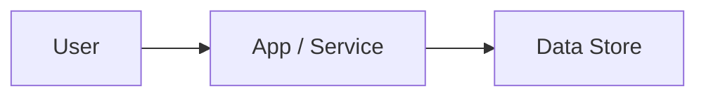

# 02 Inception Deck

## 1. Why Are We Here?

- Purpose:

## 2. Elevator Pitch

- For: <target users>
- Who: <need/problem>
- The: <product name>
- Is a: <category>
- That: <key benefit>
- Unlike: <alternatives>
- Our product: <differentiator>

## 3. Product Box (Feature highlights)

- Headline feature 1:
- Headline feature 2:
- Headline feature 3:

## 4. NOT List (Out of Scope)

| In Scope | Out of Scope |
| -------- | ------------ |
| Item 1   | Item A       |

## 5. Meet Your Neighbors (Stakeholders & Dependencies)

- Upstream dependencies:
- Downstream dependencies:
- External integrations:

## 6. Show the Solution (Architecture Overview)

- High-level architecture:
- Key components:

<!-- UX-INTENT: If UI-bearing, reference root DESIGN.md and uiux/40_screen_contracts.md for design direction alignment -->

## 7. What Keeps Us Up at Night (Risks)

| Risk | Probability | Impact | Mitigation |
| ---- | ----------- | ------ | ---------- |
| R1   | medium      | high   | TBD        |

## 8. Size It Up (Effort & Timeline)

- Estimated effort:
- Target timeline:

## 9. What's Going to Give (Trade-offs)

| Dimension | Priority | Notes |
| --------- | -------- | ----- |
| Scope     | 1        |       |
| Quality   | 2        |       |
| Time      | 3        |       |
| Budget    | 4        |       |

## 10. What's It Going to Take (Team & Resources)

- Required skills:
- Team composition:
- Infrastructure:
