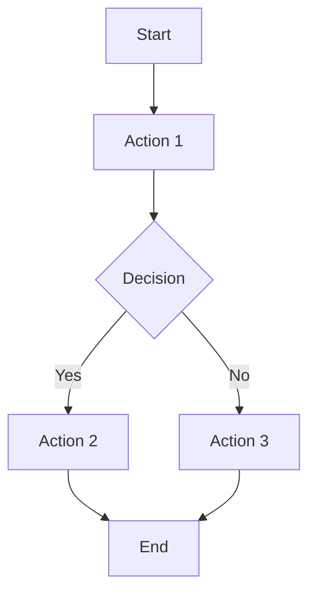

# 03 Story Workshop

## User Stories

### US-001: <Story Title>

- As a: <role>
- I want: <action>
- So that: <benefit>

#### Acceptance Criteria

- AC-001-01:
- AC-001-02:

#### Example Seeds

| Perspective         | Example          | Status |
| ------------------- | ---------------- | ------ |
| Happy path          | <example>        | seed   |
| Negative path       | <example>        | seed   |
| Edge / boundary     | <example>        | seed   |
| Permission / role   | <example>        | seed   |
| State transition    | <example or N/A> | seed   |
| Idempotency / retry | <example or N/A> | seed   |

## User Flows



## Flow Descriptions

- Flow 1:
  - Entry point:
  - Steps:
  - Exit point:

## Behavior Obligations

<!-- Primary focus for UI-bearing packs. Define behavioral requirements before visual mockups. -->

### State Coverage

| State     | Trigger   | Display   | Transitions   |
| --------- | --------- | --------- | ------------- |
| empty     | [trigger] | [display] | [transitions] |
| loading   | [trigger] | [display] | [transitions] |
| error     | [trigger] | [display] | [transitions] |
| populated | [trigger] | [display] | [transitions] |

### Interaction Contracts

| Element   | Action   | Expected Result | Error Handling |
| --------- | -------- | --------------- | -------------- |
| [element] | [action] | [result]        | [error case]   |

### Error Handling

- Input validation: [approach]
- Network failure: [approach]
- Timeout: [approach]

## Screen Mock — Fallback (HTML+CSS)

- Secondary: required when UI requirements exist, but subordinate to Behavior Obligations above.
- Visual mock only; do not include JavaScript behavior.
- This HTML/CSS mock is a fallback visual aid that supplements (not replaces) the behavioral definitions.

```html
<section class="screen-mock">
  <h1>Screen Title</h1>
  <p>Primary information shown to the user.</p>
  <button type="button">Primary Action</button>
</section>
```

```css
.screen-mock {
  max-width: 560px;
  margin: 24px auto;
  padding: 20px;
  border: 1px solid #d0d7de;
  border-radius: 12px;
}
```

## Design Direction Summary

<!-- Required for UI-bearing packs. Validated by QFAI-DDP-019..025. -->

### Option Comparison

<!-- List 2+ design options. Each must be a separate entry. (QFAI-DDP-020) -->

- **Option A**: [Name and description]
- **Option B**: [Name and description]

### Anchor Screen Selection

<!-- Select one of the compared options as the anchor. (QFAI-DDP-021) -->

Selected: [Option X] — [Reason for selection]

### Competitive References

<!-- Summarize competitive references from 04_Sources.md. (QFAI-DDP-022) -->

See 04_Sources.md for full competitive reference registry.

### CTA Hierarchy

<!-- Define CTA hierarchy with at least a primary CTA. (QFAI-DDP-023) -->

- Primary: [CTA label and placement]
- Secondary: [CTA label and placement]

### State Coverage

<!-- Define all 4 required states. (QFAI-DDP-024) -->
<!-- SSOT for state details: Behavior Obligations > State Coverage table above. Keep these bullets for validator compliance; fill display-level details or reference the table. -->

- empty: [Empty state display — see Behavior Obligations table for triggers/transitions]
- loading: [Loading state display — see Behavior Obligations table for triggers/transitions]
- error: [Error state display — see Behavior Obligations table for triggers/transitions]
- populated: [Populated state display — see Behavior Obligations table for triggers/transitions]

### Design Anti-goals

<!-- List 1+ design patterns to intentionally avoid. (QFAI-DDP-025) -->

- Anti-goal: [Pattern to avoid and reason]
