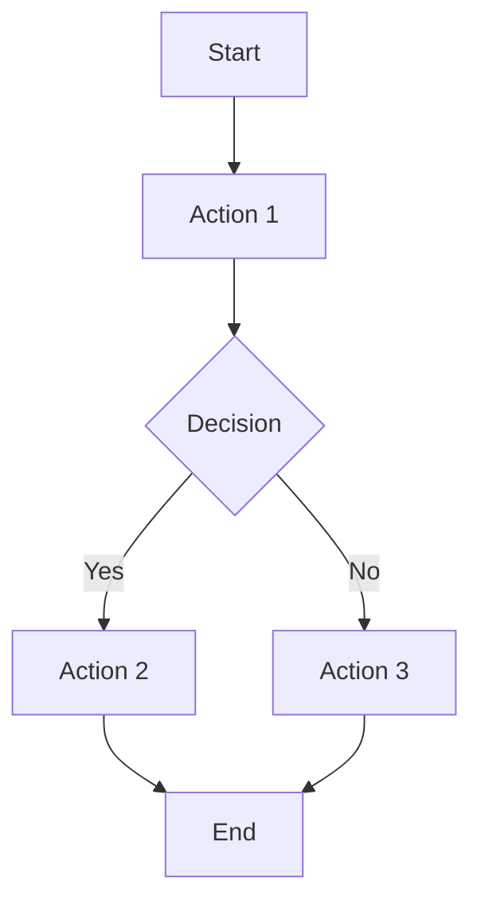

# 03 Story Workshop

## User Stories

### US-001: <Story Title>

- As a: <role>
- I want: <action>
- So that: <benefit>

#### Acceptance Criteria

- AC-001-01:
- AC-001-02:

#### Example Seeds

| Perspective         | Example          | Status |
| ------------------- | ---------------- | ------ |
| Happy path          | <example>        | seed   |
| Negative path       | <example>        | seed   |
| Edge / boundary     | <example>        | seed   |
| Permission / role   | <example>        | seed   |
| State transition    | <example or N/A> | seed   |
| Idempotency / retry | <example or N/A> | seed   |

## User Flows



## Flow Descriptions

- Flow 1:
  - Entry point:
  - Steps:
  - Exit point:

## Behavior Obligations

<!-- Primary focus for UI-bearing packs. Capture behavioral discovery before screen-level contracts.
     Screen-level contract SSOT lives in uiux/40_screen_contracts.md. -->

### State Coverage

| State / Risk    | Discovery Notes                                   | Handoff to Contract                                                           |
| --------------- | ------------------------------------------------- | ----------------------------------------------------------------------------- |
| [state or risk] | [what might trigger confusion, delay, or failure] | Reflect the final `required_states` contract in `uiux/40_screen_contracts.md` |

### Interaction Contracts

| Primary Task     | Key Action         | Priority Hint            | Expected Result | Error Handling |
| ---------------- | ------------------ | ------------------------ | --------------- | -------------- |
| [main user goal] | [main interaction] | [primary/high/secondary] | [result]        | [error case]   |

Screen-level contract details are finalized in `uiux/40_screen_contracts.md`. Primary tasks, required states, transitions, and observable outcomes are finalized there; Story Workshop is for discovery and handoff, not final contract fixation.

### Error Handling

- Input validation: [approach]
- Network failure: [approach]
- Timeout: [approach]

---

## Appendix: Screen Mock — Optional Fallback (HTML+CSS)

<!-- Optional fallback only — do not use as the primary UI definition artifact.
     Include only when it materially clarifies the selected anchor.
     Behavior Obligations and sidecar artifacts (uiux/) are the primary UI definitions.
     The required state SSOT is uiux/40_screen_contracts.md (`default/loading/empty/error`). -->

```html
<section class="screen-mock">
  <h1>Screen Title</h1>
  <p>Primary information shown to the user.</p>
  <button type="button">Primary Action</button>
</section>
```

```css
.screen-mock {
  max-width: 560px;
  margin: 24px auto;
  padding: 20px;
  border: 1px solid #d0d7de;
  border-radius: 12px;
}
```
