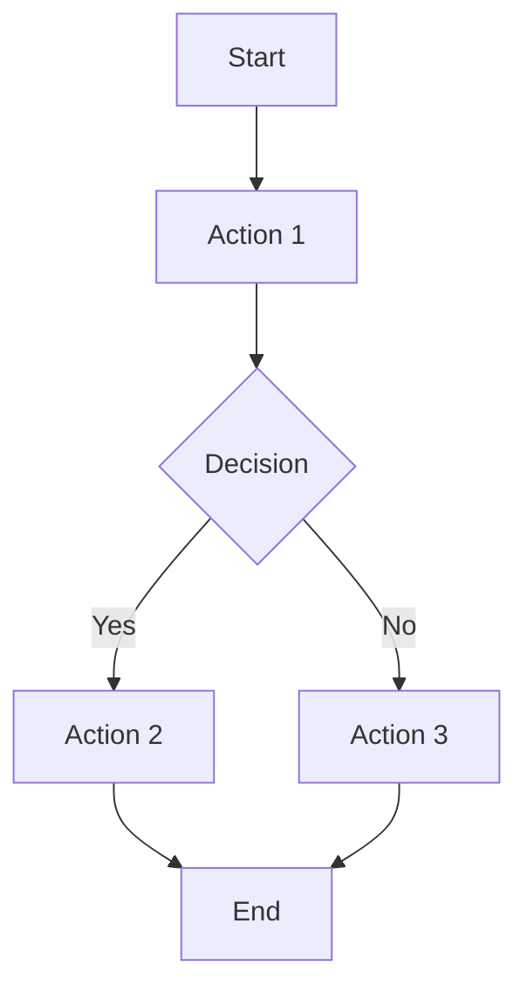

# 03 Story Workshop

## User Stories

### US-001: <Story Title>

- As a: <role>
- I want: <action>
- So that: <benefit>

#### Acceptance Criteria

- AC-001-01:
- AC-001-02:

#### Example Seeds

| Perspective         | Example          | Status |
| ------------------- | ---------------- | ------ |
| Happy path          | <example>        | seed   |
| Negative path       | <example>        | seed   |
| Edge / boundary     | <example>        | seed   |
| Permission / role   | <example>        | seed   |
| State transition    | <example or N/A> | seed   |
| Idempotency / retry | <example or N/A> | seed   |

## User Flows



## Flow Descriptions

- Flow 1:
  - Entry point:
  - Steps:
  - Exit point:

## Screen Mock (HTML+CSS)

- Use this section when UI requirements exist.
- Visual mock only; do not include JavaScript behavior.

```html
<section class="screen-mock">
  <h1>Screen Title</h1>
  <p>Primary information shown to the user.</p>
  <button type="button">Primary Action</button>
</section>
```

```css
.screen-mock {
  max-width: 560px;
  margin: 24px auto;
  padding: 20px;
  border: 1px solid #d0d7de;
  border-radius: 12px;
}
```
