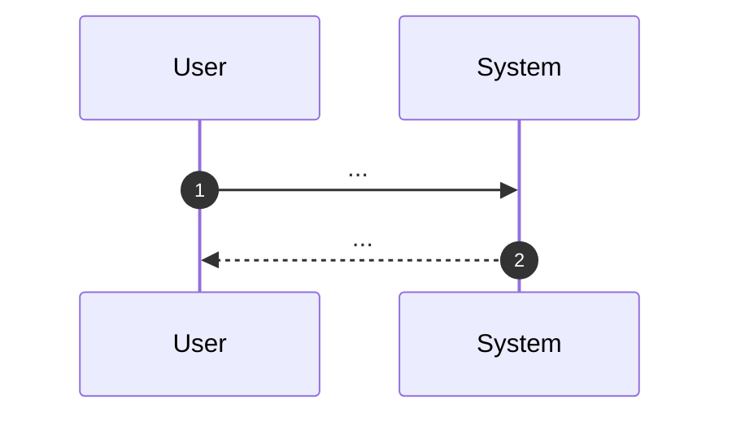

# 04 Business Flow

## Purpose

- Describe the high-level business process as policy-layer SSOT.
- Keep acceptance scenarios in each target spec's `03_Acceptance-Criteria.md`.

## Actors / Systems

- Actor:
- System:

## Preconditions

- Preconditions:

## Flow Overview

- BF-0001: <the happy path, in one line>

## Diagram (Mermaid required)



## Alternate / Exception Flows

- BF-0002: ALT-01 — <the alternate path>
- BF-0003: EXC-01 — <the exception path>

## Notes

- If required, add another ` ```mermaid ` block with `flowchart` or `sequenceDiagram`.
- Do not use ` ```text ` or language-less fences for Mermaid diagrams.
- Do not use Gherkin as the primary representation in this file.
- `ALT-` / `EXC-` label the flows above on purpose. Do not renumber them to
  `EX-NNNN`: `EX` is the Examples layer prefix and `_policies/**` must not
  define or own lower-layer IDs.
- `BF-NNNN` is the flow's ID, and it opens the entry — a list item or a
  heading. A `BF-` written mid-sentence cites a flow declared above; only the
  opening position declares one, so the same flow described twice is reported
  (`QFAI-BFLOW-006`) rather than counted twice.
- **A flow does not name its stories.** `_policies/**` must not define or own a
  lower-layer item, so the edge runs the other way: a story names its flows,
  with `- Flow: BF-0001` in its own block in `02_User-stories.md`. A test under
  `<testsDir>/e2e/**` may then annotate `QFAI:BF-0001`, which answers the E2E
  obligation of every story that names that flow — one test per flow, which is
  the grain E2E is for.
