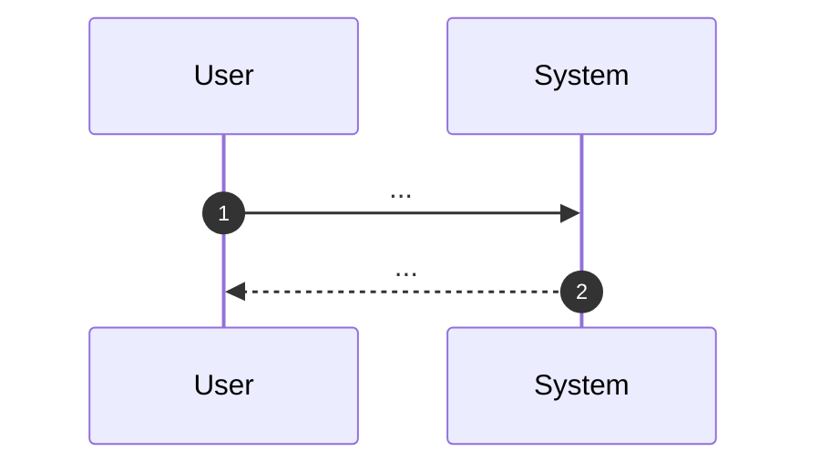

# 04 Business Flow

## Purpose

- Describe the high-level business process as policy-layer SSOT.
- Keep acceptance scenarios in each target spec's `03_Acceptance-Criteria.md`.

## Actors / Systems

- Actor:
- System:

## Preconditions

- Preconditions:

## Flow Overview

## Diagram (Mermaid required)



## Alternate / Exception Flows

- ALT-01:
- EXC-01:

## Notes

- If required, add another ` ```mermaid ` block with `flowchart` or `sequenceDiagram`.
- Do not use ` ```text ` or language-less fences for Mermaid diagrams.
- Do not use Gherkin as the primary representation in this file.
- `ALT-` / `EXC-` label the flows above on purpose. Do not renumber them to
  `EX-NNNN`: `EX` is the Examples layer prefix and `_policies/**` must not
  define or own lower-layer IDs.
