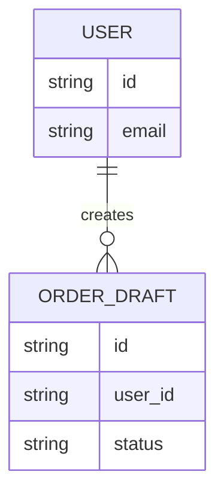

# 05 Contracts

## Purpose

- Keep contracts as SSOT under `.qfai/contracts/**` with deterministic IDs.
- Use this file as a readable policy-layer index with short IDs for planning and review.

## Contract Index

### DB Contracts

0 items

<!-- Example row (remove this comment block and add real rows when contracts exist):
| DB-001   | order_drafts | CON-DB-0001 | `.qfai/contracts/db/db-0001-<slug>.sql` | - | draft persistence |
-->

| Short ID | Entity | Declared ID | File | Depends On | Purpose |
| -------- | ------ | ----------- | ---- | ---------- | ------- |

### API Contracts

0 items

<!-- Example row:
| API-001  | /api/orders | CON-API-0001 | `.qfai/contracts/api/api-0001-<slug>.yaml` | CON-DB-0001 | create draft |
-->

| Short ID | Router | Declared ID | File | Depends On | Purpose |
| -------- | ------ | ----------- | ---- | ---------- | ------- |

### UI Contracts

0 items

<!-- Example row:
| UI-001   | order-create | CON-UI-0001 | `.qfai/contracts/ui/ui-0001-<slug>.yaml` | - | draft input form |
-->

| Short ID | Screen | Declared ID | File | Depends On | Purpose |
| -------- | ------ | ----------- | ---- | ---------- | ------- |

## Mapping Rules

- `Depends On` lists the contracts that must be applied **before** this one, as
  `CON-*` ids, or `-` when none. It mirrors the `-- Depends on:` line in a
  `.sql` contract and the top-level `x-qfai-depends-on` key in a `.yaml` one
  (or in an API `.json` one).
- A runtime reference is not an apply-order dependency. `QFAI-CONTRACT-011`
  forces a multi-table schema into N files, so this column is the only place the
  resulting composition is stated; without it every consumer reconstructs the
  apply graph by reading the DDL, and getting it wrong is silent.
- Leave no cell blank: a blank `Depends On` is "never stated", not "no
  dependencies", and only `-` says the second.
- `QFAI-CONTRACT-014` errors on a declared dependency that names no existing
  contract. `QFAI-CONTRACT-015` warns on a contract that states no apply order
  at all, `QFAI-CONTRACT-032` on a table that dropped this column,
  `QFAI-CONTRACT-033` on a row whose cell is blank or disagrees with the file it
  names, `QFAI-CONTRACT-034` on a contract with no row in any table, and
  `QFAI-CONTRACT-035` on a row whose `File` does not declare that row's id.

- If no contracts are needed, keep each table and state `0 items` explicitly.
- `<slug>` must be kebab-case from entity/router/screen.

<!-- Example mappings (add when contracts exist):
- `DB-001` maps to `CON-DB-0001`, file `db-0001-<slug>.sql`.
- `API-001` maps to `CON-API-0001`, file `api-0001-<slug>.yaml`.
- `UI-001` maps to `CON-UI-0001`, file `ui-0001-<slug>.yaml`.
-->

## Diagram (Mermaid required for ER/relationship)

