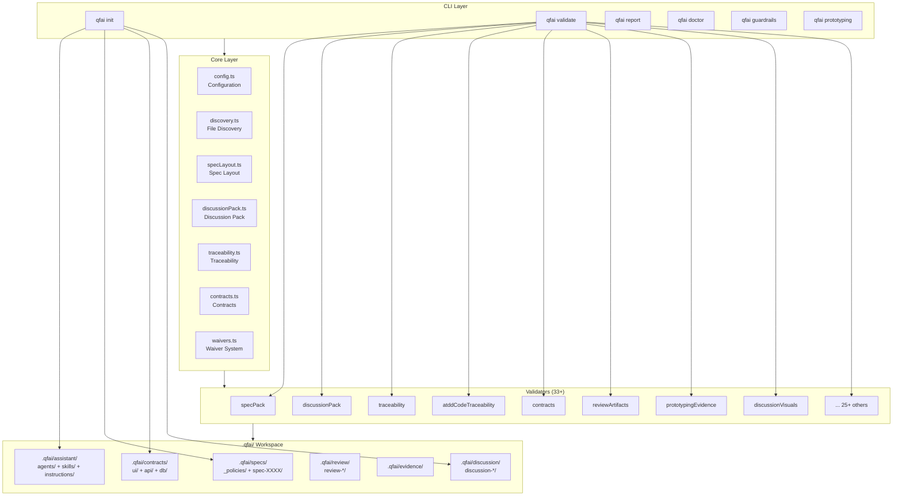

# 02 Inception Deck

## 1. Why Are We Here?

AI コーディングエージェントが生成するコードの品質を担保するための「品質第一開発キット」を提供する。エージェントは高速にコードを書けるが、要件の誤解・仕様ドリフト・ハルシネーションを検出する仕組みが欠如している。QFAI は SDD/ATDD/TDD のワークフローを CLIで強制し、客観的バリデーションゲートで品質を保証する。

## 2. Elevator Pitch

**QFAI** は、AI コーディングエージェント向けの品質第一開発キットです。`npx qfai init` でプロジェクトに導入し、仕様駆動開発（SDD）、受入テスト駆動開発（ATDD）、テスト駆動開発（TDD）の統合ワークフローをバリデーションゲートで強制します。50以上のルールでスペック→コントラクト→テストのトレーサビリティを検証し、CI/CD パイプラインに組み込めます。

## 3. Product Box

**表面（機能）**:

- `qfai validate`: 50以上のルールでスペック・コントラクト・トレーサビリティを包括検証
- `qfai init`: プロジェクトにQFAIワークスペースを一発セットアップ
- `qfai report`: 人間が読みやすいMarkdown/JSONレポート生成
- `qfai doctor`: 設定診断ツール
- `qfai guardrails`: 意思決定ガードレール抽出
- `qfai prototyping`: UIフィデリティ自動検証（DOM クローリング）

**裏面（価値）**:

- ハルシネーション検出: スペックとコードの乖離を自動検知
- トレーサビリティ: US → AC → BR → EX → TC の完全追跡
- CI/CD 統合: GitHub Actions アノテーション形式出力
- マルチツール対応: Claude Code, GitHub Copilot, Codex, Anthropic Agents

## 4. NOT List

| In Scope                                    | Out of Scope                            |
| ------------------------------------------- | --------------------------------------- |
| CLI バリデーション・レポート                | IDE プラグイン / GUI                    |
| スペック構造検証                            | コード品質分析（lint/静的解析の代替）   |
| コントラクト定義検証                        | コントラクト自体の自動生成              |
| テストファイルアノテーション検証            | テスト自体の自動生成                    |
| ディスカッションパック構造検証              | 自然言語の意味的正確性の判定            |
| UI フィデリティ自動検証（DOM クローリング） | ビジュアルリグレッションテスト          |
| マルチツールラッパー生成                    | AI エージェント自体のホスティング       |
| ウェイバーシステム                          | ワークフロー自動実行（CI ランナー機能） |

## 5. Stakeholders and Dependencies

| Stakeholder           | Interest                                 | Impact |
| --------------------- | ---------------------------------------- | ------ |
| AI エージェント開発者 | エージェントにQFAIワークフローを組み込む | High   |
| QA エンジニア         | バリデーションゲートで品質を保証         | High   |
| プロジェクトリード    | 仕様の一元管理とトレーサビリティ         | High   |
| CI/CD エンジニア      | パイプラインへのバリデーション統合       | Medium |
| OSS コントリビュータ  | フレームワーク改善・拡張                 | Medium |

**Dependencies**:

- Node.js >= 18.0.0
- pnpm >= 9.12.3
- @cucumber/gherkin（Gherkin パース）
- jsdom（DOM クローリング）

## 6. Architecture Overview

## 7. Risks

| Risk                                 | Probability | Impact | Mitigation                                 |
| ------------------------------------ | ----------- | ------ | ------------------------------------------ |
| バリデーションルールの誤検知         | Medium      | High   | ウェイバーシステムで例外管理               |
| 新しい AI ツールへの対応遅延         | Medium      | Medium | ラッパー生成の抽象化（init コマンド）      |
| レイヤードスペック移行の互換性問題   | Low         | High   | レガシー形式のフォールバック検出           |
| DOM クローリングの不安定性           | Medium      | Low    | jsdom のバージョン固定・テスト             |
| 大規模プロジェクトでのパフォーマンス | Low         | Medium | fast-glob のストリーム処理・ファイル数制限 |

## 8. Effort and Timeline

| Milestone        | Description                                  |
| ---------------- | -------------------------------------------- |
| v1.0 (完了)      | 基本バリデーション・レポート                 |
| v1.3 (完了)      | マルチツールラッパー                         |
| v1.4 (完了)      | レイヤードスペック・ATDD トレーサビリティ    |
| v1.5 (完了/現在) | 統合ディスカッションパック・ポリシー命名統一 |
| v2.0 (計画なし)  | 未定                                         |

## 9. Trade-offs

| Priority | Item                    | Rationale                          |
| -------- | ----------------------- | ---------------------------------- |
| 1        | 正確性（Correctness）   | 誤検知は信頼を損なうため最優先     |
| 2        | 網羅性（Completeness）  | トレーサビリティの穴は品質リスク   |
| 3        | 使いやすさ（Usability） | CLI の学習コストは低く保つ         |
| 4        | パフォーマンス          | 大規模プロジェクトでも実用的な速度 |
| 5        | 拡張性                  | プラグイン機構より安定性を優先     |

## 10. Team and Resources

| Role             | Assignment                                  |
| ---------------- | ------------------------------------------- |
| Maintainer       | aganesy（全機能開発・レビュー）             |
| AI Agent Support | Claude Code, GitHub Copilot, Codex ラッパー |
| CI/CD            | GitHub Actions ワークフロー                 |
| Testing          | Vitest ベースの自動テスト                   |
