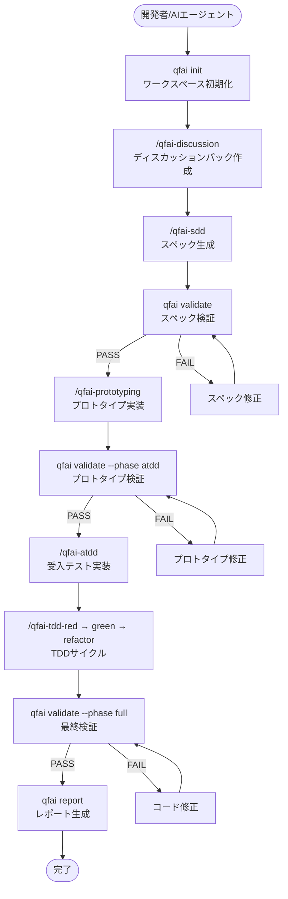
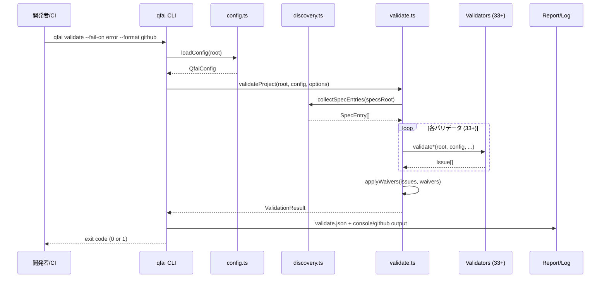

# 03 Story Workshop

## User Stories

### US-001: プロジェクト初期化

**As a** AI エージェント統合開発者,
**I want to** `npx qfai init` でプロジェクトに QFAI ワークスペースを導入できること,
**So that** 仕様駆動開発のディレクトリ構造・スキル・エージェント・テンプレートが即座に利用可能になる。

**Acceptance Criteria**:

- `.qfai/` ディレクトリが作成され、assistant/agents/, assistant/skills/, assistant/instructions/, assistant/steering/ が配置される
- qfai.config.yaml が生成される
- Claude Code (.claude/commands/), GitHub Copilot (.github/prompts/), Codex (.codex/skills/), Agents (.agents/skills/) のラッパーが生成される
- `--force` で既存スキルを上書き更新できる
- `skills.local/` は上書きから保護される
- `--dry-run` で変更内容をプレビューできる

**Example Seeds**:

| Perspective       | Example                                                        | Status   |
| ----------------- | -------------------------------------------------------------- | -------- |
| Happy path        | 空ディレクトリで `qfai init` → .qfai/ 全構造が生成される       | covered  |
| Negative path     | qfai.config.yaml が既に存在 → 上書きせずスキップ               | covered  |
| Edge / boundary   | `--force` で skills/ 更新、skills.local/ は保持                | covered  |
| Permission / role | 書き込み権限なし → エラーメッセージ表示                        | covered  |
| State transition  | v1.4 → v1.5 マイグレーション（レガシーファイル検出・退避）     | covered  |
| Idempotency       | 2回目の `qfai init` → 既存ファイルはスキップ、新規のみ追加     | covered  |

---

### US-002: スペックバリデーション

**As a** QA エンジニア / AI エージェント,
**I want to** `qfai validate` でスペック・コントラクト・トレーサビリティを包括検証できること,
**So that** 仕様の不整合やトレーサビリティの欠落を CI/CD で自動検出できる。

**Acceptance Criteria**:

- レイヤードスペック（`_policies/` + `spec-XXXX/`）の必須ファイル存在チェック
- ID フォーマット検証（CAP-XXXX, US-XXXX, AC-XXXX, BR-XXXX, EX-XXXX, TC-XXXX）
- トレーサビリティエッジ検証（AC→TC, BR→EX, EX→TC）
- コントラクト参照整合性チェック
- ATDD コードアノテーション検証（QFAI:SPEC-XXXX:US-YYYY 等）
- ディスカッションパック readiness チェック
- Mermaid 図の存在・形式チェック
- ウェイバー適用後のイシュー抑制/ダウングレード
- `--fail-on error|warning|never` で終了コード制御
- `--format github` で GitHub Actions アノテーション出力
- `--phase full|atdd|tdd|refinement` でバリデーションスコープ制御

**Example Seeds**:

| Perspective       | Example                                                          | Status   |
| ----------------- | ---------------------------------------------------------------- | -------- |
| Happy path        | 全スペック完備 → issues=0, exit code=0                           | covered  |
| Negative path     | spec-0001/01_Spec.md 欠落 → E_SPEC_MISSING_FILESET error        | covered  |
| Edge / boundary   | ウェイバーで suppress → issue は出力されるが suppressed=true      | covered  |
| Permission / role | testsDir が存在しない → ATDD チェックはスキップ                  | covered  |
| State transition  | レガシー spec-pack → layered 移行検出（QFAI-SPACK-000）         | covered  |
| Idempotency       | 2回連続実行 → 同一結果（冪等）                                  | covered  |

---

### US-003: レポート生成

**As a** プロジェクトリード,
**I want to** `qfai report` でバリデーション結果を人間可読な形式で出力できること,
**So that** チームメンバーが品質状態を簡単に把握できる。

**Acceptance Criteria**:

- Markdown 形式（`--format md`）でエグゼクティブサマリー、イシュー一覧、トレーサビリティマトリックスを出力
- JSON 形式（`--format json`）で構造化データを出力
- `--base-url` でリポジトリリンクを付与
- `--run-validate` で内部的にバリデーションを実行してからレポート生成
- 既存の validate.json を入力として使用可能

**Example Seeds**:

| Perspective       | Example                                                     | Status   |
| ----------------- | ----------------------------------------------------------- | -------- |
| Happy path        | validate.json 存在 → Markdown レポート出力                   | covered  |
| Negative path     | validate.json 不在 + --run-validate なし → エラー            | covered  |
| Edge / boundary   | issues=0 → サマリーに "No issues found" 表示                | covered  |
| Permission / role | 出力先ディレクトリ書き込み不可 → エラー                     | covered  |

---

### US-004: 診断ツール

**As a** 開発者,
**I want to** `qfai doctor` で設定・構造の診断を実行できること,
**So that** バリデーション実行前に問題を特定・修正できる。

**Acceptance Criteria**:

- 設定ファイルの存在・妥当性チェック
- ディレクトリ構造の存在チェック
- パス解決の正確性チェック
- レガシーファイルレイアウトの警告（v1.4.25+）
- `--format json` で機械可読な診断結果出力
- `--fail-on warning|error` で終了コード制御

**Example Seeds**:

| Perspective       | Example                                                     | Status   |
| ----------------- | ----------------------------------------------------------- | -------- |
| Happy path        | 正常な設定 → 全チェック ok, exit code=0                      | covered  |
| Negative path     | qfai.config.yaml 不在 → 設定エラー                          | covered  |
| Edge / boundary   | 非推奨の promptsDir → 情報レベル警告                        | covered  |

---

### US-005: ガードレール抽出

**As a** AI エージェント,
**I want to** `qfai guardrails` で意思決定ガードレールを抽出できること,
**So that** スペック作成・修正時にドリフトを防止できる。

**Acceptance Criteria**:

- `list` で全ガードレール一覧
- `extract` でキーワードフィルタリング
- `check` で現在の成果物との整合性チェック

**Example Seeds**:

| Perspective       | Example                                              | Status   |
| ----------------- | ---------------------------------------------------- | -------- |
| Happy path        | guardrails list → 全ルール一覧表示                   | covered  |
| Negative path     | 該当なし → 空結果                                    | covered  |

---

### US-006: プロトタイピング検証

**As a** フロントエンドエンジニア,
**I want to** `qfai prototyping` で UI フィデリティを自動検証できること,
**So that** UI コントラクトとプロトタイプ実装の整合性を確認できる。

**Acceptance Criteria**:

- `--autogen-ui-fidelity` で DOM クローリングによるフィデリティ自動生成
- UI コントラクト（`.qfai/contracts/ui/`）からの期待値抽出
- jsdom によるルートクローリング・ラベル/マーカー収集
- `.qfai/evidence/prototyping.json` への出力
- `data-qfai` 属性によるエレメントマーカー検出
- `--base-url` でクローリング対象指定

**Example Seeds**:

| Perspective       | Example                                                        | Status   |
| ----------------- | -------------------------------------------------------------- | -------- |
| Happy path        | UI コントラクト + 動作中のアプリ → fidelity 100%                | covered  |
| Negative path     | アプリ未起動（URL 応答なし） → エラー                           | covered  |
| Edge / boundary   | skeleton モード → uiFidelity.screens=[] で L1 evidence          | covered  |
| Idempotency       | 2回実行 → 同一の evidence.json（冪等）                          | covered  |

---

## User Flows



## Validation Flow Detail



## Screen Mock

CLIツールのため画面モックは対象外。ただし `qfai report --format md` の出力例を参考として示す:

```text
# QFAI Validation Report

## Summary
- Errors: 0
- Warnings: 2
- Info: 5
- Phase: full

## Issues

### Warning: QFAI-COV-201
AC-0003 is not referenced by any TC
File: .qfai/specs/spec-0001/03_Acceptance-Criteria.md

### Warning: QFAI-DPACK-003
03_Story-Workshop.md has insufficient content (< 200 chars)
File: .qfai/discussion/discussion-20260307.../03_Story-Workshop.md

## Traceability Matrix
| Spec   | US | AC | BR | EX | TC | Coverage |
|--------|----|----|----|----|-----| ---------|
| spec-0001 | 5 | 12 | 8 | 15 | 20 | 92%   |
```
