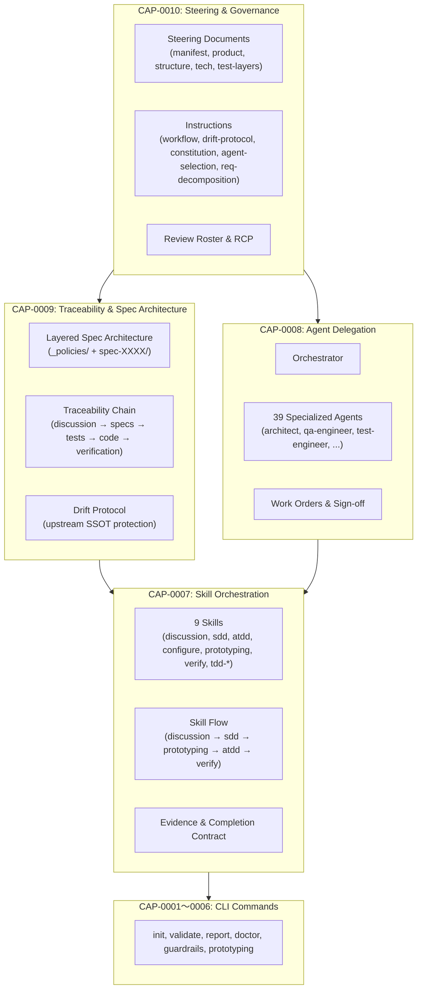

# 02 Inception Deck

## 1. Why Are We Here?

- Purpose: QFAIのspecsがCLIコマンド仕様（CAP-0001〜0006）のみをカバーしており、QFAIの価値の中核である「Assistant Framework」（Skill駆動ワークフロー、サブエージェント委任、トレーサビリティ、階層構造設計、ガバナンス制御）がspecsに反映されていない。この情報格差を解消し、QFAIの全体像を高解像度でspecsに記録する。

## 2. Elevator Pitch

- For: QFAIを利用するAIエージェント開発者・QAエンジニア
- Who: QFAIのAssistant Frameworkの設計意図・制約・ワークフローを理解する必要がある
- The: QFAI Assistant Framework Specs（CAP-0007〜0010）
- Is a: フレームワーク設計仕様
- That: Skill仕様、エージェント委任、トレーサビリティ連鎖、ガバナンス構造を体系的に文書化する
- Unlike: 現状の暗黙知（SKILL.md, agent定義ファイル, steering文書への分散）
- Our product: specsレベルでの一元的な設計仕様を提供し、QFAIの拡張・保守・レビューを容易にする

## 3. Product Box (Feature highlights)

- Headline feature 1: **Skill Orchestration仕様** — 9つのSkillの入出力・前提条件・完了条件・依存関係・実行フローをspecsで定義
- Headline feature 2: **Agent Delegation仕様** — 39のサブエージェントの役割・責務・委任ルール・停止条件をspecsで体系化
- Headline feature 3: **Traceability & Spec Architecture仕様** — discussion→specs→tests→code→verificationの連鎖構造とLayered Spec設計思想をspecsで明文化
- Headline feature 4: **Steering & Governance仕様** — steering/instructions/review-roster/RCPの制御構造と意思決定メカニズムをspecsで定義

## 4. NOT List (Out of Scope)

| In Scope | Out of Scope |
| -------- | ------------ |
| CAP-0007〜0010の新規Capability定義 | 既存spec-0001〜0006の変更 |
| _policies/の拡充（03_Capabilities, 04_Business-Flow, 06_Glossary等） | CLIコマンドの新規追加 |
| フレームワーク設計仕様の文書化 | 実装コードの変更 |
| Skill/Agent/Traceability/Governanceの仕様定義 | IDE pluginやGUI仕様 |
| 既存のsteering/instructions/agentsファイルの参照・体系化 | steering/instructionsファイル自体の書き換え |

## 5. Meet Your Neighbors (Stakeholders & Dependencies)

- Upstream dependencies:
  - `.qfai/assistant/steering/*` — ステアリング文書（manifest, product, structure, tech, test-layers）
  - `.qfai/assistant/instructions/*` — 操作プレイブック（workflow, drift-protocol, requirements-decomposition, agent-selection, constitution）
  - `.qfai/assistant/agents/*` — 39のエージェント定義ファイル
  - `.qfai/assistant/skills/*/SKILL.md` — 9つのスキル定義
- Downstream dependencies:
  - `.qfai/specs/_policies/*` — 拡充対象
  - `.qfai/specs/spec-0007〜0010/` — 新規作成対象
  - `qfai validate` — 新規specの検証対象追加
- External integrations: なし（リポジトリ内完結）

## 6. Show the Solution (Architecture Overview)

- High-level architecture: QFAIのAssistant Frameworkは4つの層で構成される
- Key components: Skill Layer, Agent Layer, Traceability Layer, Governance Layer

## 7. What Keeps Us Up at Night (Risks)

| Risk | Probability | Impact | Mitigation |
| ---- | ----------- | ------ | ---------- |
| R1: 既存specs（spec-0001〜0006）との整合性が崩れる | low | high | _policies/拡充は追記のみ、既存CAP IDに触れない |
| R2: フレームワーク仕様が実装と乖離する | medium | high | リポジトリ内の既存ファイル（SKILL.md, agent定義）をSSOTとして参照し、specsは設計意図の記録に限定 |
| R3: 新規CAPの粒度が粗すぎ/細かすぎる | medium | medium | C-3案（4 CAP）を採用済み。reviewで粒度を検証 |
| R4: qfai validateが新規specを正しく検証できない | low | medium | 既存のlayered spec構造に準拠することでvalidatorの変更不要 |
| R5: Skill/Agent仕様の頻繁な変更でspecsが陳腐化する | medium | medium | specsは設計意図と制約を記録し、実装詳細はSKILL.md/agent定義をSSOTとする |

## 8. Size It Up (Effort & Timeline)

- Estimated effort: 中規模 — 4つの新規spec-XXXX + _policies拡充
- Target timeline: 本discussionで全体方針を確定し、/qfai-sddで一括生成

## 9. What's Going to Give (Trade-offs)

| Dimension | Priority | Notes |
| --------- | -------- | ----- |
| Accuracy  | 1        | リポジトリの実態と一致するspecsを最優先 |
| Coverage  | 2        | 4つの新規CAPで主要な情報格差を解消 |
| Usability | 3        | specの読みやすさ・ナビゲーション容易性 |
| Performance | 4      | validate実行時間への影響は最小限 |

## 10. What's It Going to Take (Team & Resources)

- Required skills: Spec Writer, Traceability Builder, Architect, QA Engineer
- Team composition: AI agent（Claude Code）による自動生成 + ユーザーレビュー
- Infrastructure: 既存の `.qfai/specs/` 構造 + `qfai validate` パイプライン
