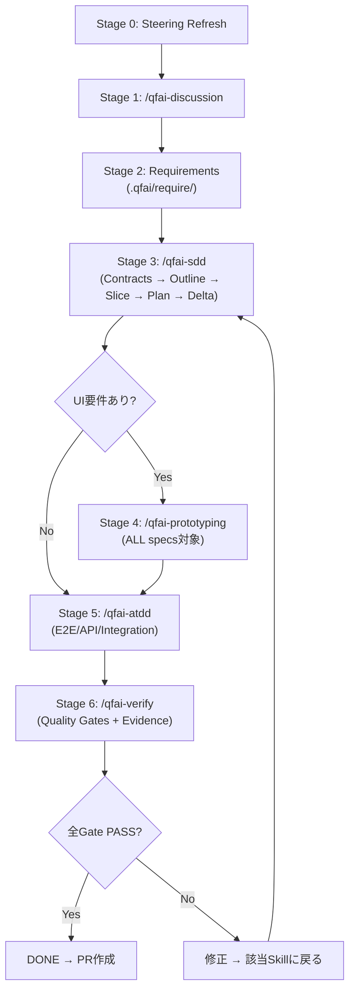
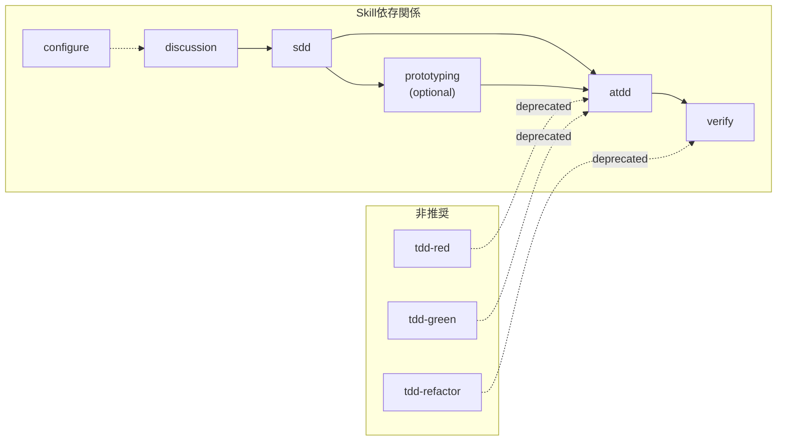

# 03 Story Workshop

## User Stories

### US-007: Skill Orchestration仕様の定義

- As a: AIエージェント開発者
- I want: QFAIの9つのSkillそれぞれの入出力・前提条件・完了条件・依存関係・実行フローがspecsで定義されている
- So that: Skillを正しく利用・拡張・デバッグでき、ワークフロー全体の流れを把握できる

#### Acceptance Criteria

- AC-007-01: spec-0007に9つのSkillのカタログ（名前、目的、引数、ロール、必須出力）が記載されている
- AC-007-02: Skill間の依存関係と実行順序がspecで定義されている
- AC-007-03: 各Skillの完了契約（Completion Contract）がspecで定義されている
- AC-007-04: 各SkillのEvidence要件がspecで定義されている
- AC-007-05: 非推奨Skill（tdd-red/green/refactor）の移行先が明記されている

#### Example Seeds

| Perspective         | Example                                                               | Status |
| ------------------- | --------------------------------------------------------------------- | ------ |
| Happy path          | /qfai-discussion → /qfai-sdd → /qfai-atdd → /qfai-verify の正常フロー | seed   |
| Negative path       | discussion-packが不完全な状態で/qfai-sddを実行 → 停止                 | seed   |
| Edge / boundary     | --autoフラグ付きの場合、インタビューをスキップして自動推論            | seed   |
| Permission / role   | OrchestratorがSkillの第一草稿を直接生成してはならない                 | seed   |
| State transition    | Skill状態: pending → in_progress → completed/revise                   | seed   |
| Idempotency / retry | 同じSkillの再実行で既存成果物を上書きせずdeltaを生成                  | seed   |

---

### US-008: Agent Delegation仕様の定義

- As a: QAエンジニア
- I want: 39のサブエージェントの役割・責務・委任ルール・停止条件がspecsで体系化されている
- So that: レビュー時にどのエージェントが何を担当し、どのような成果物を出すか明確に判断できる

#### Acceptance Criteria

- AC-008-01: spec-0008に39のエージェントのカタログ（ID、名前、ミッション、カテゴリ）が記載されている
- AC-008-02: エージェントの標準契約構造（Mission, Inputs, Deliverables, Stop Conditions, Sign-off）がspecで定義されている
- AC-008-03: Orchestrator Protocol（委任のみ・直接生成禁止・自己承認禁止）がspecで明文化されている
- AC-008-04: Capability Probe（サブエージェント利用可否確認）とSimulation Mode（フォールバック）がspecで定義されている
- AC-008-05: Work Orders Summary（テーブルスキーマ）がspecで定義されている

#### Example Seeds

| Perspective         | Example                                                                        | Status |
| ------------------- | ------------------------------------------------------------------------------ | ------ |
| Happy path          | Orchestratorが作業命令を発行 → 専門エージェントが成果物を生成 → Reviewerが承認 | seed   |
| Negative path       | サブエージェントが利用不可 → Simulation Mode承認なし → 停止                    | seed   |
| Edge / boundary     | 1つのSkillに対して10以上のエージェントが関与する場合の委任順序                 | seed   |
| Permission / role   | Reviewerは成果物を編集してはならない（non-edit gate）                          | seed   |
| State transition    | エージェント状態: assigned → working → sign-off(PASS/REVISE)                   | seed   |
| Idempotency / retry | エージェントのRE-OPEN（却下済みオプションの再検討）にはCR承認が必要            | seed   |

---

### US-009: Traceability & Spec Architecture仕様の定義

- As a: プロジェクトリード
- I want: QFAIのトレーサビリティ連鎖構造とLayered Spec Architectureの設計思想がspecsで明文化されている
- So that: なぜこの構造を採用したか、参照方向のルール、Escalation Hookの意味を理解でき、拡張時に設計原則を遵守できる

#### Acceptance Criteria

- AC-009-01: spec-0009にトレーサビリティ連鎖（discussion → specs → tests → code → verification）の定義が記載されている
- AC-009-02: Layered Spec Architecture（\_policies/ + spec-XXXX/、1 CAP = 1 spec directory）の設計根拠がspecで説明されている
- AC-009-03: 参照方向ルール（upper-to-lower禁止、lower-to-upper許可）がspecで定義されている
- AC-009-04: Escalation Hook（spec → \_policiesへの参照委譲）がspecで定義されている
- AC-009-05: Drift Protocolの全体像（upstream SSOT保護、Change Request、owner skill rerun）がspecで体系化されている
- AC-009-06: 必須トレーサビリティエッジ（Spec→CAP, AC→TC, BR→EX, EX→TC）がspecで定義されている

#### Example Seeds

| Perspective         | Example                                                                    | Status |
| ------------------- | -------------------------------------------------------------------------- | ------ |
| Happy path          | REQ-0001 → CAP-0001 → spec-0001 → US-0001 → AC-0001 → TC-0001 の正常な連鎖 | seed   |
| Negative path       | ACにTCが紐づかない → qfai validate がエラーを出力                          | seed   |
| Edge / boundary     | \_policies/のポリシーが複数specに跨って適用される場合のEscalation          | seed   |
| Permission / role   | 下流フェーズが上流SSOTを直接編集しようとした → Drift Protocol発動          | seed   |
| State transition    | OQ: open → resolved（discussion中）→ spec反映 → test反映                   | seed   |
| Idempotency / retry | N/A — トレーサビリティは状態遷移ではなく静的構造                           | seed   |

---

### US-010: Steering & Governance仕様の定義

- As a: OSS貢献者
- I want: QFAIの意思決定メカニズム（steering, instructions, review-roster, RCP）がspecsで定義されている
- So that: 貢献時にどのルールに従い、どのレビュープロセスを経るか明確に理解できる

#### Acceptance Criteria

- AC-010-01: spec-0010にSteering文書の構造（manifest, product, structure, tech, test-layers）と役割がspecで定義されている
- AC-010-02: Instructions文書の構造（workflow, drift-protocol, constitution, agent-selection, requirements-decomposition）と役割がspecで定義されている
- AC-010-03: Review Roster & RCPの仕組み（10 reviewers、PASS/FAIL/N/A、ループ復帰ルール）がspecで定義されている
- AC-010-04: Constitution（非交渉条項 Article I〜IX）の位置づけがspecで説明されている
- AC-010-05: Canonical Workflow Stages（Stage 0〜6）の全体像がspecで定義されている

#### Example Seeds

| Perspective         | Example                                                                                  | Status |
| ------------------- | ---------------------------------------------------------------------------------------- | ------ |
| Happy path          | Stage 0（steering refresh）→ Stage 1（discussion）→ ... → Stage 6（verify）の正常フロー  | seed   |
| Negative path       | Reviewer FAILが1つ → 即修正に戻り、全reviewerを先頭から再実行                            | seed   |
| Edge / boundary     | N/Aが許可されるreviewer（na_rule条件付き）と禁止されるreviewer（qa-lead, qa-gatekeeper） | seed   |
| Permission / role   | Constitution Article IVに違反（specとcodeの不整合を放置）→ 修正必須                      | seed   |
| State transition    | Review cycle: draft → review → changes_requested → fix → new review pack → PASS          | seed   |
| Idempotency / retry | Review packはappend-only; 修正後は新規packを作成し既存を変更しない                       | seed   |

---

## User Flows

## Flow Descriptions

- Flow 1: Canonical Workflow（正常系）
  - Entry point: Stage 0 — Steering Refresh（project memory bootstrap）
  - Steps: discussion → requirements → sdd → (prototyping) → atdd → verify
  - Exit point: 全Quality Gates PASS → PR作成
- Flow 2: Drift Recovery
  - Entry point: 下流フェーズでupstream SSOTとの不整合を検出
  - Steps: STOP → Change Request作成 → ユーザー承認 → owner skill rerun → resume
  - Exit point: upstream修正完了、下流work再開
- Flow 3: Review Cycle
  - Entry point: Skill完了 → Review Request
  - Steps: roster順にreview実行 → FAIL検出 → 修正 → 新review pack → roster先頭から再実行
  - Exit point: 全reviewer PASS（またはvalid N/A）

## Screen Mock (HTML+CSS)

- UI要件なし: QFAIはCLIツールであり、GUIは存在しない。
- このセクションは該当なし（N/A）。
