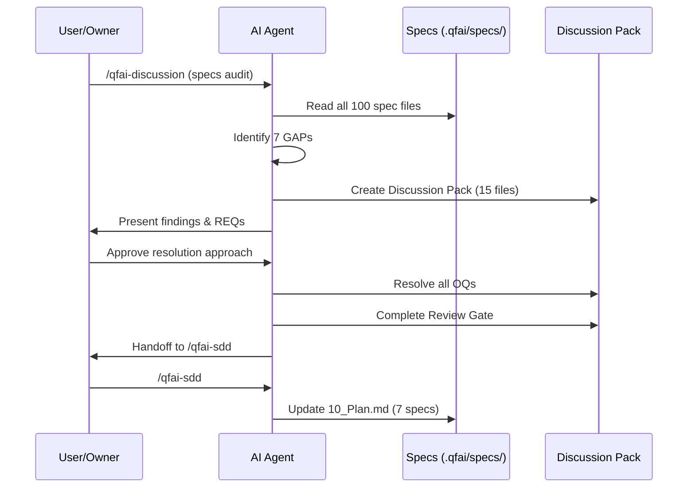

# 03_Story-Workshop

## User Stories

### STORY-01: AI Agent が spec-0002 を読んで validate コマンドを実装する

**ペルソナ**: AI Agent（実装者）
**ゴール**: spec-0002/10_Plan.md を読み、33+ バリデータを正確に実装する

> As an AI Agent implementing the validate command,
> I want to see an explicit list of all validators with their phase assignments,
> so that I can implement them without additional investigation.

**受容条件**:

- 10_Plan.md にバリデータ一覧テーブルが存在する
- 各バリデータにフェーズ（full/atdd/tdd/refinement）が割り当てられている

### STORY-02: AI Agent が spec-0005 を読んで guardrails コマンドを実装する

**ペルソナ**: AI Agent（実装者）
**ゴール**: spec-0005/04_Business-Rules.md を読み、ガードレール定義の解析処理を実装する

> As an AI Agent implementing the guardrails command,
> I want an explicit Markdown parsing format specification,
> so that I can implement the scanner without ambiguity.

**受容条件**:

- ガードレール定義のフォーマット（見出しレベル、テーブル構造）が明示されている
- 検出対象ソース（\_policies/, spec/）のパース仕様が定義されている

### STORY-03: AI Agent が spec-0004 を読んで日本語メッセージを実装する

**ペルソナ**: AI Agent（実装者）
**ゴール**: NFR-0041 に基づく日本語メッセージ出力を実装する

> As an AI Agent implementing the doctor command,
> I want to know the i18n implementation strategy,
> so that I can implement Japanese message output correctly.

**受容条件**:

- i18n 実装方式（ライブラリ or 静的辞書）が明示されている
- メッセージキー命名規則が定義されている

### STORY-04: 実装者が spec 間依存関係を把握する

**ペルソナ**: AI Agent / Developer
**ゴール**: 全 spec の依存関係グラフを正確に理解する

> As a developer reading QFAI specs,
> I want explicit cross-references between related specs,
> so that I can understand the dependency graph completely.

**受容条件**:

- spec-0006/10_Plan.md に依存関係セクションが存在する
- spec-0007/0008 間の相互参照が双方向に記述されている
- spec-0009/10_Plan.md にバリデーションルール → TC マッピングが存在する

## User Flow

## Example Seeds

### STORY-01 Example Seeds

| Perspective         | Seed                                                                         | Notes                                        |
| ------------------- | ---------------------------------------------------------------------------- | -------------------------------------------- |
| Happy path          | 10_Plan.md に 33+ バリデータがテーブルで列挙され、全フェーズが割り当て済み   | REQ-0001                                     |
| Negative path       | バリデータ名に typo がある場合 → spec-0002/06_Test-Cases.md の TC で検出可能 | 既存 TC で対応済み                           |
| Edge / boundary     | フェーズに属さないバリデータ → 全フェーズ（full）にデフォルト割当            | 要方針決定                                   |
| Permission / role   | バリデータ一覧の更新権限 → spec owner（agent）のみ                           | 既存ガバナンスで対応                         |
| State transition    | N/A（静的定義）                                                              | スキップ理由: バリデータ定義は状態を持たない |
| Idempotency / retry | N/A（ファイル編集）                                                          | スキップ理由: 外部 I/O なし                  |

### STORY-02 Example Seeds

| Perspective         | Seed                                                        | Notes                       |
| ------------------- | ----------------------------------------------------------- | --------------------------- |
| Happy path          | Markdown H2 見出し + テーブル形式でガードレールが検出される | REQ-0004                    |
| Negative path       | 非標準フォーマット（H1見出し、番号なしリスト）は検出対象外  | 明示が必要                  |
| Edge / boundary     | ガードレール0件のファイル → 空結果、エラーなし              | BR-0005-0008 で対応         |
| Permission / role   | N/A（CLI ツール）                                           | スキップ理由: 権限制御なし  |
| State transition    | N/A（ステートレス）                                         | スキップ理由: 状態遷移なし  |
| Idempotency / retry | N/A（ファイル読取）                                         | スキップ理由: 外部 I/O なし |

### STORY-03 Example Seeds

| Perspective         | Seed                                                     | Notes                       |
| ------------------- | -------------------------------------------------------- | --------------------------- |
| Happy path          | --lang ja オプション指定時に日本語メッセージが出力される | REQ-0003                    |
| Negative path       | 未対応言語指定時 → デフォルト（英語）にフォールバック    | 方針決定が必要              |
| Edge / boundary     | 翻訳キーが未定義 → 英語メッセージをフォールバック出力    | i18n 設計で対応             |
| Permission / role   | N/A                                                      | スキップ理由: 権限制御なし  |
| State transition    | N/A                                                      | スキップ理由: 状態遷移なし  |
| Idempotency / retry | N/A                                                      | スキップ理由: 外部 I/O なし |

### STORY-04 Example Seeds

| Perspective         | Seed                                                                | Notes                              |
| ------------------- | ------------------------------------------------------------------- | ---------------------------------- |
| Happy path          | 10_Plan.md に「依存関係」セクションが存在し、全依存が明示されている | REQ-0005, REQ-0006, REQ-0007       |
| Negative path       | 循環依存が記述された場合 → spec-0007/BR-0007-0005 で禁止            | 既存 BR で対応                     |
| Edge / boundary     | 依存先 spec が未作成の場合 → N/A（全10 spec 作成済み）              | 現状該当なし                       |
| Permission / role   | N/A                                                                 | スキップ理由: ドキュメント参照のみ |
| State transition    | N/A                                                                 | スキップ理由: 状態遷移なし         |
| Idempotency / retry | N/A                                                                 | スキップ理由: 外部 I/O なし        |
