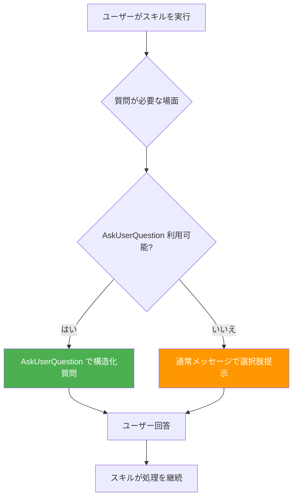

# 02_Inception-Deck

## Q1: なぜ作るか

エージェントの質問方法が不統一で、実行ごとに `AskUserQuestion` を使ったり使わなかったりする。スキル仕様に明示的な指示がないため、エージェント側の判断に依存している。

## Q2: エレベーターピッチ

> QFAI 全スキルで、ユーザーへの質問時に `AskUserQuestion` を統一的に使用するルールを明記し、エージェント実行時の UX を安定させる。

## Q3: プロダクトボックス

- **何を**: QFAI スキルテンプレート（SKILL.md）へのルール追加
- **誰のため**: QFAI 利用開発者、AI エージェント
- **価値**: 質問 UX の統一、予測可能な対話フロー

## Q4: NOT リスト（やらないこと）

| やらないこと | 理由 |
| --- | --- |
| CLI コード変更 | スキル定義（md）の変更のみ |
| テスト変更 | md ファイル編集のみでテスト影響なし |
| init テンプレート変更 | 今回は SSOT のみが対象 |
| AskUserQuestion の実装（ツール側） | 既存ツール機能を利用するだけ |
| 共通参照ファイルの外出し | 各スキル個別にセクション追加 |

## Q5: リスク

| リスク | 影響 | 軽減策 |
| --- | --- | --- |
| validator がセクション名検証している場合 | ビルドエラー | 事前に validator のセクション検証ロジックを確認 |
| 既存 Simulation mode セクションとの重複感 | 可読性低下 | 配置を DRIFT-PROTOCOL 直後に統一し、Simulation mode とは別セクションとして区別 |

## Q6: トレードオフ

| 選択肢 | 採用判断 | 理由 |
| --- | --- | --- |
| 各スキルに個別セクション追加 | **採用** | スキルごとに質問例をカスタマイズでき、自己完結 |
| 共通参照ファイル（rcp_footer 方式）に外出し | 不採用 | 質問タイミング・内容がスキルごとに異なるため、共通化のメリットが薄い |
| frontmatter の allowed-tools に追加 | 不採用 | allowed-tools は実行権限制御であり、質問方法のガイダンスとは性質が異なる |

## Q7: スケジュール

即時リリース可能。フェーズ分割不要。

## Q8: 依存関係

外部依存なし。md ファイル編集のみ。

## Q9: 成功基準

- 全 9 スキルの SKILL.md に `AskUserQuestion` セクションが存在する
- pr-merge と同等のフォールバックパターン（使えれば使う、使えなければ通常メッセージ）が記載されている
- 各スキル固有の質問例が記載されている

## Q10: 次ステップ

`/qfai-sdd` で仕様化 → 実装

## ワークフロー概観

