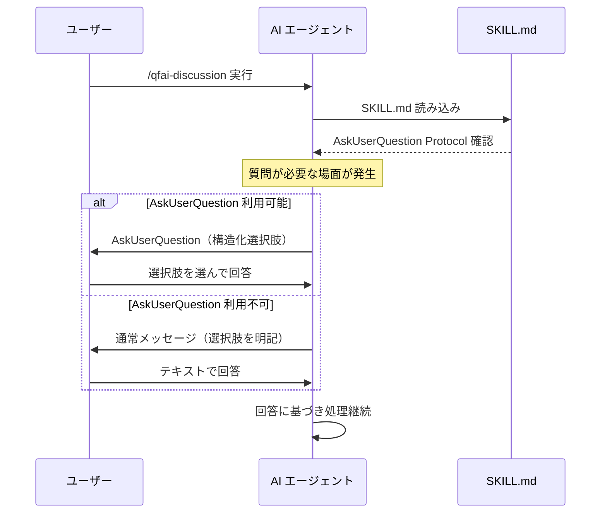

# 03_Story-Workshop

## ユーザーストーリー

### US-001: AskUserQuestion 優先使用

> QFAI スキルの利用者として、スキル実行中の質問が `AskUserQuestion` で構造化されて提示されることで、選択肢を明確に把握し、迅速に回答できる。

**受入基準:**
- AC-001: 全 9 スキルの SKILL.md に `AskUserQuestion Protocol` セクションが存在する
- AC-002: セクションに「AskUserQuestion 優先、フォールバックで通常メッセージ」の指示がある
- AC-003: 構造化選択肢（ラジオ/マルチセレクト）がフリーテキストより優先される旨が記載されている

### US-002: スキル固有の質問例

> QFAI スキルの実装者（AI エージェント）として、各スキルでどのような場面で `AskUserQuestion` を使うべきか具体例が記載されていることで、実行時に適切に判断できる。

**受入基準:**
- AC-004: 各スキルの AskUserQuestion Protocol セクションに、そのスキル固有の質問例が列挙されている
- AC-005: 質問例は既存のユーザー質問トリガーポイント（Simulation mode、OQ resolution 等）と整合している

### US-003: フォールバック動作

> AskUserQuestion が使えない環境（Claude Code、Codex等）の利用者として、同じ質問内容が通常メッセージで明確に提示されることで、機能差による情報欠落がない。

**受入基準:**
- AC-006: フォールバック時は「通常メッセージで同じ内容を明確に列挙」の指示がある

## ユーザーフロー

## Example Seeds

### BR-001: AskUserQuestion 優先ルール

| Perspective | Example | 結果 |
| --- | --- | --- |
| Happy path | Copilot Chat で Simulation mode 承認を AskUserQuestion で質問 | 3択（Yes/No/Custom）が構造化UI で表示される |
| Negative path | Claude Code で同じ質問が発生 | AskUserQuestion 不可→通常メッセージで3択を文字列提示 |
| Edge / boundary | AskUserQuestion が部分的にサポート（選択肢のみ、自由記述なし） | 選択肢で質問し、自由記述が必要な場合は追加メッセージ |
| Permission / role | Orchestrator が Simulation mode を質問 | Orchestrator は質問のみ許可、自己承認は不可（既存ルール） |
| State transition | N/A（ステートレスな質問動作） | — |
| Idempotency / retry | N/A（外部I/Oなし） | — |

### BR-002: スキル固有質問例の網羅性

| Perspective | Example | 結果 |
| --- | --- | --- |
| Happy path | qfai-discussion の質問例に「interview, OQ resolution, Simulation mode, Drift」が含まれる | 主要トリガーポイントをカバー |
| Negative path | deprecated スキル（tdd-red/green/refactor）に不必要な質問例が列挙される | Simulation mode のみに限定（notice-only のため） |
| Edge / boundary | qfai-configure で glob clarification が質問例に含まれる | 含まれる（Step 5 で発生する質問ポイント） |
| Permission / role | N/A | — |
| State transition | N/A | — |
| Idempotency / retry | N/A | — |
