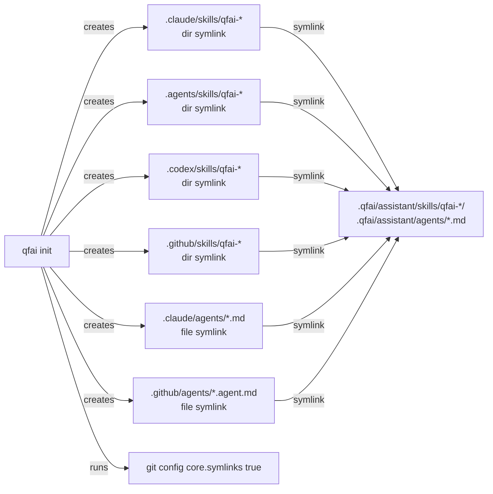

# 02_Inception-Deck

## 1. Why Are We Here?

- Purpose: QFAI の skill/agent ラッパーを薄いラッパーファイルからシンボリックリンクに移行し、保守コストを排除してマスターファイルとの一貫性を恒久的に担保する。

## 2. Elevator Pitch

- For: QFAI フレームワーク利用者（開発者・AI アシスタントツール統合）
- Who: ラッパーファイルとマスター skill の同期に煩わされている
- The: Symlink-based Wrapper Architecture
- Is a: ビルドツール改善（qfai init のアーキテクチャ変更）
- That: `.qfai/assistant/skills/` および `.qfai/assistant/agents/` をマスターとし、各ツール統合ディレクトリからシンボリックリンクで直接参照する
- Unlike: 現行の `writeFile()` によるラッパーファイル生成方式
- Our product: ラッパーの同期が不要になり、スキル本体を更新するだけで全ツールに即座に反映される

## 3. Product Box (Feature highlights)

- Headline feature 1: `.claude/commands/` と `.github/prompts/` の廃止（冗長レイヤー除去）
- Headline feature 2: Git symlink ベースのラッパー（ディレクトリリンク for skills、ファイルリンク for agents）
- Headline feature 3: `qfai init` での `git config core.symlinks true` 自動設定

## 4. NOT List (Out of Scope)

| In Scope                                                | Out of Scope                                                            |
| ------------------------------------------------------- | ----------------------------------------------------------------------- |
| qfai-\* skill の symlink 化                             | pr-fix / pr-merge skill の `.qfai/assistant/skills/` への移管           |
| qfai agent ラッパーの symlink 化                        | agent 定義ファイル自体の内容変更                                        |
| `.claude/commands/` 削除                                | `.claude/agents/README.md` 等の README 変更                             |
| `.github/prompts/` 削除                                 | `.github/instructions/` の変更                                          |
| `init.ts` の symlink 生成ロジック実装                   | QFAI CLI 全体のリファクタ                                               |
| `copilot-instructions.md` の参照先更新                  | 新規 skill の追加                                                       |
| Windows fallback 処理（symlink 失敗時の graceful 対応） | symlink 移行 / AskUserQuestion Protocol に直接関係しない CI/CD 追加改修 |

## 5. Meet Your Neighbors (Stakeholders & Dependencies)

- Upstream dependencies: `.qfai/assistant/skills/` (マスター skill SSOT)、`.qfai/assistant/agents/` (マスター agent SSOT)
- Downstream dependencies: Claude Code、Codex CLI、GitHub Copilot、Claude Agent SDK
- External integrations: Git（symlink tracking）、OS filesystem（symlink creation）

## 6. Show the Solution (Architecture Overview)

- High-level architecture: `qfai init` が各ツール統合ディレクトリにシンボリックリンクを作成する。全リンクは `.qfai/assistant/` 配下のマスターファイルを指す。
- Key components: `init.ts` の `syncIntegrationWrappers()` 関数

## 7. What Keeps Us Up at Night (Risks)

| Risk                                                            | Probability | Impact | Mitigation                               |
| --------------------------------------------------------------- | ----------- | ------ | ---------------------------------------- |
| Windows symlink 作成失敗（Developer Mode 未有効）               | medium      | high   | fallback 処理 + 明確なエラーメッセージ   |
| AI ツールが symlink を解決せずエラー                            | low         | high   | 主要ツールでの動作検証を SDD/TDD で実施  |
| GitHub agent の `.agent.md` 命名規約と canonical `.md` の不一致 | low         | medium | symlink 名は任意。ターゲット名と一致不要 |
| 既存プロジェクトの migration 時に旧ラッパーが残る               | medium      | low    | `--force` オプションで旧ファイル prune   |

## 8. Size It Up (Effort & Timeline)

- Estimated effort: Small（init.ts の関数書き換え + ラッパー削除 + テスト）
- Target timeline: v1.5.4 リリース内

## 9. What's Going to Give (Trade-offs)

| Dimension | Priority | Notes                           |
| --------- | -------- | ------------------------------- |
| Scope     | 1        | 全 qfai-\* skill + agent を対象 |
| Quality   | 2        | クロスプラットフォーム動作保証  |
| Time      | 3        | v1.5.4 に含める                 |
| Budget    | 4        | N/A（内部開発）                 |

## 10. What's It Going to Take (Team & Resources)

- Required skills: TypeScript、Node.js fs API、Git symlink 仕様、Windows/macOS/Linux の symlink 挙動
- Team composition: QFAI CLI 開発者
- Infrastructure: テスト環境（macOS + Windows）
