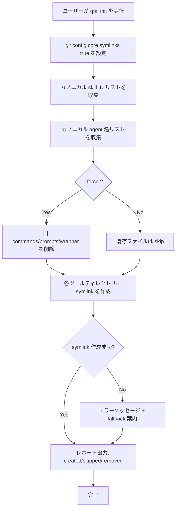

# 03_Story-Workshop

## User Stories

### US-0001: コマンド/プロンプト廃止と skill 統合

- As a: QFAI フレームワーク利用者
- I want: `.claude/commands/` と `.github/prompts/` が廃止され、各ツールの `skills/` ディレクトリにシンボリックリンクが配置されること
- So that: スラッシュコマンドとスキルの二重管理が不要になり、マスタースキルの更新が即座に全ツールへ反映される

#### Acceptance Criteria

- AC-0001: `qfai init` 実行後、`.claude/commands/qfai-*.md` が存在しないこと
- AC-0002: `qfai init` 実行後、`.github/prompts/qfai-*.prompt.md` が存在しないこと
- AC-0003: `.claude/skills/qfai-*` が `.qfai/assistant/skills/qfai-*` へのシンボリックリンクであること
- AC-0004: `.agents/skills/qfai-*`, `.codex/skills/qfai-*`, `.github/skills/qfai-*` が同様にシンボリックリンクであること

#### Example Seeds

| Perspective         | Example                                                                 | Status |
| ------------------- | ----------------------------------------------------------------------- | ------ |
| Happy path          | macOS で `qfai init` 実行 → 全 symlink が正しく作成される              | seed   |
| Negative path       | 既に `.claude/commands/` が存在しない状態で init → エラーなく完了       | seed   |
| Edge / boundary     | skill 名に特殊文字が含まれる場合 → 現状 qfai-* は全て ASCII のため N/A | seed   |
| Permission / role   | 一般ユーザー権限で実行 → macOS/Linux では問題なし                       | seed   |
| State transition    | 旧ラッパー → symlink への migration（`--force`）                        | seed   |
| Idempotency / retry | `qfai init` を2回実行 → 既存 symlink は skip される                    | seed   |

### US-0002: Agent ラッパーの symlink 化

- As a: QFAI フレームワーク利用者
- I want: `.claude/agents/` と `.github/agents/` の agent ラッパーが `.qfai/assistant/agents/` へのシンボリックリンクになること
- So that: agent 定義の更新がラッパーの再生成なしに全ツールへ即座に反映される

#### Acceptance Criteria

- AC-0005: `.claude/agents/<name>.md` が `.qfai/assistant/agents/<name>.md` へのファイルシンボリックリンクであること
- AC-0006: `.github/agents/<name>.agent.md` が `.qfai/assistant/agents/<name>.md` へのファイルシンボリックリンクであること（ファイル名が異なることを許容）
- AC-0007: README.md は通常ファイルのまま維持されること

#### Example Seeds

| Perspective         | Example                                                                              | Status |
| ------------------- | ------------------------------------------------------------------------------------ | ------ |
| Happy path          | `qfai init` → `.claude/agents/architect.md` symlink が正しく作成される               | seed   |
| Negative path       | カノニカル agent が存在しない → symlink は作成されない                                | seed   |
| Edge / boundary     | `.github/agents/architect.agent.md` → target `architect.md`（名前不一致）でも動作     | seed   |
| Permission / role   | N/A                                                                                  | seed   |
| State transition    | 旧ラッパーファイル → symlink への migration                                           | seed   |
| Idempotency / retry | 既存 symlink がある状態で init → skip                                                 | seed   |

### US-0003: Git symlink 設定と Windows 対応

- As a: Windows 環境の QFAI 利用者
- I want: `qfai init` が `git config core.symlinks true` を自動設定し、symlink が正しく作成されること
- So that: プラットフォーム固有の設定を手動で行う必要がない

#### Acceptance Criteria

- AC-0008: `qfai init` 実行時に `git config core.symlinks true` が実行されること
- AC-0009: Windows で symlink 作成に失敗した場合、明確なエラーメッセージと対処法が表示されること
- AC-0010: macOS/Linux では追加設定不要で symlink が作成されること

#### Example Seeds

| Perspective         | Example                                                                  | Status |
| ------------------- | ------------------------------------------------------------------------ | ------ |
| Happy path          | Windows + Developer Mode ON → symlink 正常作成                           | seed   |
| Negative path       | Windows + Developer Mode OFF → エラーメッセージ + fallback              | seed   |
| Edge / boundary     | Git リポジトリ外で `qfai init` → `git config` は skip（warn のみ）       | seed   |
| Permission / role   | 管理者権限 vs 一般ユーザー権限での挙動差                                  | seed   |
| State transition    | N/A                                                                      | seed   |
| Idempotency / retry | `git config core.symlinks` が既に true → 再設定しても問題なし            | seed   |

### US-0004: copilot-instructions.md の更新

- As a: GitHub Copilot 利用者
- I want: `.github/copilot-instructions.md` が削除された `.github/prompts/` ではなく `.github/skills/` を参照すること
- So that: Copilot が正しい skill 参照先を案内される

#### Acceptance Criteria

- AC-0011: `copilot-instructions.md` 内の `.github/prompts/` 参照が `.github/skills/` に更新されていること

#### Example Seeds

| Perspective         | Example                                                       | Status |
| ------------------- | ------------------------------------------------------------- | ------ |
| Happy path          | `qfai init --force` → copilot-instructions.md が更新される   | seed   |
| Negative path       | N/A                                                           | seed   |
| Edge / boundary     | カスタム copilot-instructions.md が存在 → `--force` 時のみ上書き | seed   |
| Permission / role   | N/A                                                           | seed   |
| State transition    | N/A                                                           | seed   |
| Idempotency / retry | N/A                                                           | seed   |

## User Flows

## Flow Descriptions

- Flow 1: qfai init の symlink 生成フロー
  - Entry point: ユーザーが `qfai init` または `qfai init --force` を実行
  - Steps:
    1. `git config core.symlinks true` を設定
    2. `.qfai/assistant/skills/` からカノニカル skill ID を収集
    3. `.qfai/assistant/agents/` からカノニカル agent 名を収集
    4. `--force` の場合、旧 `.claude/commands/qfai-*.md`、`.github/prompts/qfai-*.prompt.md`、旧ラッパーディレクトリを削除
    5. 各ツールディレクトリ（`.claude/skills/`, `.agents/skills/`, `.codex/skills/`, `.github/skills/`）にディレクトリ symlink を作成
    6. `.claude/agents/`, `.github/agents/` にファイル symlink を作成
    7. `copilot-instructions.md` を更新
    8. 結果レポートを出力
  - Exit point: created/skipped/removed の件数レポート

## Screen Mock (HTML+CSS)

- UI 要件なし（CLI ツール変更のため、スクリーンモック不要）。
