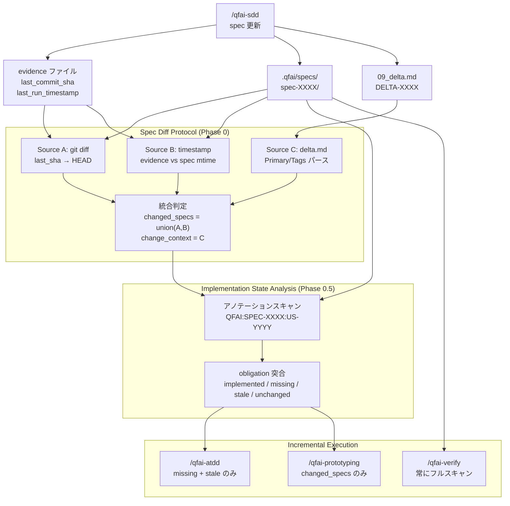

# 02_Inception-Deck

## 1. Why Are We Here?

- Purpose: QFAI の下流スキルにインクリメンタル実装機能を追加し、spec 変更時に変更箇所のみを効率的に処理する Spec Diff Protocol（SDP）を導入する。

## 2. Elevator Pitch

- For: QFAI フレームワーク利用者（開発者・品質管理チーム）
- Who: spec 変更のたびに全 spec の再処理を強いられている
- The: Spec Diff Protocol（SDP）
- Is a: スキルパイプラインの効率化改善
- That: spec 変更を自動検出し、変更された spec のみを対象にインクリメンタルな実装・テスト生成を行う
- Unlike: 現行の毎回フルスキャン方式
- Our product: spec 変更時の再処理範囲が最小化され、既存実装への不要な影響を排除できる

## 3. Product Box (Feature highlights)

- Headline feature 1: 複合差分検出（git diff + timestamp + delta.md パースの3層判定）
- Headline feature 2: Implementation State Analysis（QFAI アノテーションによる実装状態の自動分析）
- Headline feature 3: Incremental Execution（missing/stale obligations のみを処理するスキル実行モード）

## 4. NOT List (Out of Scope)

| In Scope                                              | Out of Scope                                  |
| ----------------------------------------------------- | --------------------------------------------- |
| Preflight Diff Protocol 共通定義                      | TypeScript コード（packages/qfai/src/）の変更 |
| `/qfai-atdd` SKILL.md のインクリメンタルモード追加    | `/qfai-verify` のインクリメンタル対応         |
| `/qfai-prototyping` SKILL.md のインクリメンタルモード | 新規スキルの追加                              |
| Evidence スキーマ拡張（last_commit_sha 等）           | CI/CD パイプラインの変更                      |
| `_policies` 変更時の影響波及判定                      | qfai validate コマンド自体の改修              |
| `--full` フラグによる強制フルスキャンモード           | delta.md パーサー（deltaV1.ts）の改修         |

## 5. Meet Your Neighbors (Stakeholders & Dependencies)

- Upstream dependencies: `/qfai-discussion`（討議出力）、`/qfai-sdd`（spec 生成・更新）
- Downstream dependencies: `/qfai-verify`（品質ゲート）、CI/CD
- Internal dependencies: `.qfai/evidence/` （基点情報の記録・読み取り）、`.qfai/specs/`（差分検出対象）、`09_delta.md`（変更意図の読み取り）

## 6. Show the Solution (Architecture Overview)

- High-level architecture: 下流スキル実行時に Preflight Diff Protocol が起動し、3つのソースから変更 spec を特定。Implementation State Analysis で既存実装を分析し、変更が必要な obligations のみを処理する。

## 7. What Keeps Us Up at Night (Risks)

| Risk                                           | Probability | Impact | Mitigation                                                   |
| ---------------------------------------------- | ----------- | ------ | ------------------------------------------------------------ |
| 差分検出漏れ（手動編集等）                     | medium      | high   | `--full` フラグで強制フルスキャンモードを用意                |
| stale 判定の誤検知（コメントのみ変更等）       | low         | medium | delta.md の Primary/Tags で変更意図を補強判定                |
| git 履歴がない環境での差分検出失敗             | low         | medium | Source B（timestamp）と Source C（delta.md）でフォールバック |
| `_policies` 変更の影響波及の過大評価           | medium      | low    | 保守的に全 spec 影響とし、ユーザー確認で絞り込み可能にする   |
| インクリメンタルモードでの obligation 見落とし | low         | high   | `/qfai-verify` は常にフルスキャンで最終品質ゲートを保証      |

## 8. Size It Up (Effort & Timeline)

- Estimated effort: Medium（共通 Protocol 定義 + 2 スキルの SKILL.md 改修 + Evidence スキーマ拡張）
- Target timeline: v1.5.5 リリース内

## 9. What's Going to Give (Trade-offs)

| Dimension | Priority | Notes                                          |
| --------- | -------- | ---------------------------------------------- |
| Scope     | 1        | 共通 Protocol + atdd + prototyping の3点セット |
| Quality   | 2        | verify フルスキャンで品質ゲート維持            |
| Time      | 3        | v1.5.5 に含める                                |
| Budget    | 4        | N/A（内部開発）                                |

## 10. What's It Going to Take (Team & Resources)

- Required skills: QFAI スキル定義（SKILL.md）の設計・記述、git diff の仕様理解、QFAI evidence/delta スキーマの理解
- Team composition: QFAI フレームワーク開発者
- Infrastructure: テスト用 QFAI プロジェクト（既存 spec + 実装がある状態）
