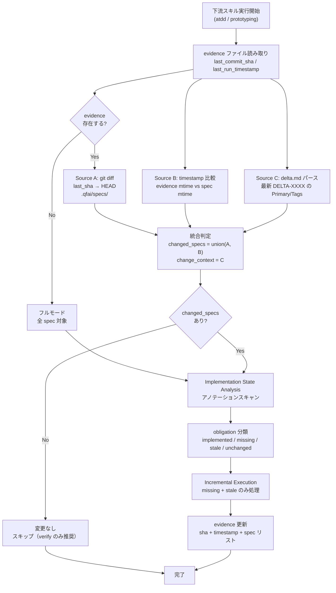

# 03_Story-Workshop

## User Stories

### US-0001: Spec 変更の自動検出

- As a: QFAI 利用開発者
- I want: 下流スキル実行時に、前回実行以降に変更された spec を自動検出してほしい
- So that: 変更のない spec の不要な再処理を避け、効率的にスキルを実行できる

#### Acceptance Criteria

- AC-0001: 下流スキル（atdd, prototyping）実行時に Preflight Diff が自動実行される
- AC-0002: git diff、timestamp 比較、delta.md パースの3つのソースから変更 spec が特定される
- AC-0003: 変更 spec の一覧が Diff Summary としてユーザーに提示される
- AC-0004: 初回実行時（evidence なし）は全 spec を対象とする（フルモードフォールバック）

#### Example Seeds

| Perspective         | Example                                                                   | Status |
| ------------------- | ------------------------------------------------------------------------- | ------ |
| Happy path          | spec-0003 の US を1件追加後に /qfai-atdd → spec-0003 のみ処理される       | seed   |
| Negative path       | git が利用不可 → Source A スキップ、Source B + C で判定                   | seed   |
| Edge / boundary     | 全 spec が変更されている → フルスキャンと同等の処理                       | seed   |
| Permission / role   | N/A（スキル実行権限はユーザー操作に依存）                                 | seed   |
| State transition    | evidence 未作成 → 初回フルスキャン → evidence 作成 → 次回インクリメンタル | seed   |
| Idempotency / retry | 同じ diff 状態で2回実行 → 2回目は「変更なし」と判定                       | seed   |

### US-0002: 実装状態の分析

- As a: QFAI 利用開発者
- I want: 変更された spec に対して、既存の実装/テストの状態（implemented/missing/stale）を自動判定してほしい
- So that: 新規追加分のみテストを書き、変更分のみ既存テストを更新できる

#### Acceptance Criteria

- AC-0005: QFAI アノテーション（`QFAI:SPEC-XXXX:US-YYYY`）を grep でスキャンし、実装済み obligations を特定する
- AC-0006: spec の obligation リストと突合し、implemented / missing / stale / unchanged に分類される
- AC-0007: stale 判定は spec テキストの変更（delta.md の Primary が Behavior または Initial）に基づく

#### Example Seeds

| Perspective         | Example                                                    | Status |
| ------------------- | ---------------------------------------------------------- | ------ |
| Happy path          | US-0003 追加 → missing として検出 → 新規テスト生成         | seed   |
| Negative path       | アノテーションが不正形式 → 「untracked」として警告出力     | seed   |
| Edge / boundary     | 全 obligations が implemented → 「no action needed」で終了 | seed   |
| Permission / role   | N/A                                                        | seed   |
| State transition    | US-0001 の AC 変更 → 対応テストが stale → テスト更新       | seed   |
| Idempotency / retry | stale テストを更新後に再実行 → implemented に遷移          | seed   |

### US-0003: インクリメンタルなスケルトン更新

- As a: QFAI 利用開発者
- I want: `/qfai-prototyping` 実行時に、変更された spec のスケルトンのみ更新されてほしい
- So that: 既存の安定したスケルトンに影響を与えずに、新規・変更分のみ反映できる

#### Acceptance Criteria

- AC-0008: changed_specs のスケルトンのみが生成・更新される
- AC-0009: unchanged specs は Runtime Gate 検証のみ実行される（コード生成なし）
- AC-0010: change_context の Tags（@api, @db）に基づき、更新対象を API/DB/UI に絞り込める

#### Example Seeds

| Perspective         | Example                                                               | Status |
| ------------------- | --------------------------------------------------------------------- | ------ |
| Happy path          | spec-0005 に新 API 追加 → spec-0005 のルート/エンドポイントのみ生成   | seed   |
| Negative path       | changed_spec のコントラクトが未定義 → ブロッキング条件として報告      | seed   |
| Edge / boundary     | \_policies/07_Constraints.md 変更 → 全 spec に影響波及 → ユーザー確認 | seed   |
| Permission / role   | N/A                                                                   | seed   |
| State transition    | N/A（prototyping はステートレス）                                     | seed   |
| Idempotency / retry | 同じ変更で2回実行 → 2回目は既存スケルトンと一致し実質 no-op           | seed   |

### US-0004: Evidence への基点情報記録

- As a: QFAI フレームワーク
- I want: 各スキル実行後に evidence ファイルに差分基点情報を記録したい
- So that: 次回実行時の Preflight Diff で正確な差分検出ができる

#### Acceptance Criteria

- AC-0011: evidence ファイルに `last_commit_sha`（git HEAD）が記録される
- AC-0012: evidence ファイルに `last_run_timestamp` が記録される
- AC-0013: evidence ファイルに処理した spec のリストと実行モード（incremental/full）が記録される

#### Example Seeds

| Perspective         | Example                                                              | Status |
| ------------------- | -------------------------------------------------------------------- | ------ |
| Happy path          | /qfai-atdd 完了 → evidence に sha + timestamp + spec リスト記録      | seed   |
| Negative path       | git 環境なし → sha は「N/A」、timestamp のみ記録                     | seed   |
| Edge / boundary     | evidence ファイルが既存 → 新しいセクションとして追記（上書きしない） | seed   |
| Permission / role   | N/A                                                                  | seed   |
| State transition    | N/A                                                                  | seed   |
| Idempotency / retry | N/A                                                                  | seed   |

## User Flows

## Flow Descriptions

- Flow 1: Preflight Diff → Incremental Execution
  - Entry point: 下流スキル（atdd / prototyping）の実行開始
  - Steps:
    1. Evidence ファイルから前回実行の基点情報を読み取る
    2. Evidence が存在しない場合はフルモードにフォールバック
    3. 3つのソース（git diff, timestamp, delta.md）で変更 spec を検出
    4. 変更 spec がない場合はスキップ（verify のみ推奨と報告）
    5. 変更 spec に対して Implementation State Analysis を実行
    6. missing + stale obligations のみを処理対象として実行
    7. Evidence ファイルに基点情報を記録
  - Exit point: 完了（evidence 更新済み）

- Flow 2: Policy 変更時の影響波及
  - Entry point: Source A または B で `_policies/` 配下の変更を検出
  - Steps:
    1. 変更された policy ファイルを特定
    2. `_policies/03_Capabilities.md` から全 CAP の spec マッピングを取得
    3. 保守的に全 spec を affected_specs に追加
    4. ユーザーに影響範囲を提示し確認を取る
    5. 確認後、affected_specs に対してインクリメンタル処理を実行
  - Exit point: 確認済みの affected_specs に対する処理完了

## Screen Mock (HTML+CSS)

- UI 要件なし（SKILL.md のプロンプト改修のため、ユーザー向け画面は存在しない）
