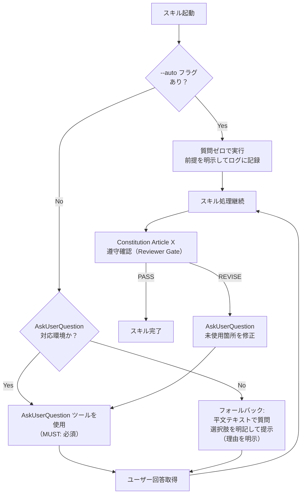

# 02 Inception Deck

## Q1. なぜこれをやるのか？（Why are we here?）

AskUserQuestion Protocol は既に全 SKILL.md に存在するが、「優先して使用する」という弱い表現のため、エージェントが平文テキストで質問を投げてプロトコルを迂回するケースが継続発生している。ユーザー体験の一貫性と品質を守るためには、MUST レベルへの昇格と constitution への記載が不可欠である。

## Q2. エレベーターピッチ

```text
QFAI エージェントが AskUserQuestion を使わずに質問してしまう問題に悩む
QFAI ユーザーのために、
全スキルで AskUserQuestion 使用を MUST 化する constitution 改訂を行います。
これは単なるガイドラインと異なり、
非交渉条項（constitution）に明記された強制ルールです。
```

## Q3. NOT リスト（やらないこと）

| やること                           | やらないこと                         |
| ---------------------------------- | ------------------------------------ |
| constitution に Article X を追加   | TypeScript コードの変更              |
| 全 9 SKILL.md の文言を MUST に改訂 | AskUserQuestion ツール自体の実装変更 |
| communication.md に義務記載を追加  | 新しいスキルの追加                   |
| \_policies/10_delta.md に記録      | 既存の Article I〜IX の変更          |
| スペックデルタに仕様影響を記録     | UI/UX の変更                         |

## Q4. 隣人は誰か？（Who are our neighbors?）

- **上流**: ユーザー（QFAI 利用者）—— 質問方法の変化を体験する直接の受益者
- **下流**: 各スキルの実行エージェント —— MUST ルールに従って動作を変える主体
- **横断**: constitution.md / communication.md —— MUST ルールの権威的定義元
- **監視**: レビュアー（review-roster.yml の 10 名）—— ルール遵守の確認者

## Q5. 技術的解決策

変更はすべてマークダウンファイルの編集のみ（TypeScript 変更なし）：

1. `constitution.md` → Article X 追加（3〜5 行の明確なルール）
2. `communication.md` → AskUserQuestion 義務セクション追加
3. 各 SKILL.md（9 ファイル）→ Protocol セクションの SHOULD → MUST 改訂
4. `_policies/10_delta.md` → 採用エントリ追加

## Q6. リスク

| リスク                                             | 可能性 | 影響 | 対策                                    |
| -------------------------------------------------- | ------ | ---- | --------------------------------------- |
| AskUserQuestion 非対応環境でのフォールバック未定義 | 中     | 高   | フォールバック手順を明示的に定義する    |
| --auto フラグとの競合                              | 中     | 中   | --auto 時は質問ゼロ（前提を明示）を明記 |
| 既存エージェントが新ルールを無視する               | 低     | 中   | constitution 記載により最高優先度を付与 |
| スキル間で MUST 表現が不統一になる                 | 低     | 低   | テンプレート文言を SDD で統一定義する   |

## Q7. タイムライン

| フェーズ   | 内容                                                          | 期限               |
| ---------- | ------------------------------------------------------------- | ------------------ |
| Discussion | 本ファイル群の作成・OQ 解決                                   | 2026-03-14（即日） |
| SDD        | 仕様変更の詳細記述・delta 更新                                | 2026-03-14（即日） |
| 実装       | SKILL.md 9 ファイル・constitution・communication の実際の編集 | 2026-03-14〜15     |
| Verify     | qfai validate での確認                                        | 2026-03-15         |

## Q8. トレードオフ

- **MUST 化のコスト**: エージェントの自由度が下がり、フォールバック処理の記述が増える
- **MUST 化の利益**: ユーザー体験の一貫性、ルール遵守の明確な基準
- **選択**: MUST 化を採用。一貫性のコストは文言統一で吸収可能

## Q9. 夜眠れなくなること

- AskUserQuestion が使えない環境（非 VS Code Copilot Chat 環境）でのフォールバック定義が不明確な場合、エージェントが停止する可能性
- --auto フラグ利用時との整合性が曖昧なまま MUST 化すると矛盾が生じる

## Q10. ステークホルダー整理

| ステークホルダー  | 期待するもの             | 懸念事項                   |
| ----------------- | ------------------------ | -------------------------- |
| QFAI ユーザー     | 常に構造化質問が使われる | フォールバック時の動作不明 |
| QFAI エージェント | 明確なルールで判断不要   | --auto との競合            |
| QFAI メンテナー   | constitution で一元管理  | 将来の改訂コスト           |
| レビュアー        | 統一基準でのレビュー     | ルール解釈の揺れ           |

## ルール適用フロー（Mermaid）


