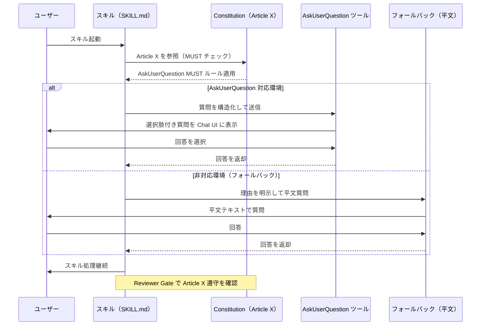

# 03 Story Workshop

## ユーザーストーリー一覧

### US-001: エージェントが AskUserQuestion で質問する

**As a** QFAI ユーザー
**I want** エージェントが質問するときに必ず AskUserQuestion ツールを使ってほしい
**So that** Chat UI 上で構造化された選択肢を見ながら回答できる

**受入条件（AC）**:
- AC-001-01: すべての QFAI スキルで、エージェントがユーザーに質問する場合は AskUserQuestion ツールを使用しなければならない（MUST）
- AC-001-02: 平文テキストのみでの質問は、AskUserQuestion が技術的に利用不可能な場合のみ許容される
- AC-001-03: フォールバック時は理由を明示しなければならない

---

### US-002: --auto フラグ使用時のルール整合性

**As a** QFAI ユーザー
**I want** `--auto` フラグ使用時に AskUserQuestion ルールと矛盾しないほしい
**So that** 自動実行でも期待通りの動作が保証される

**受入条件（AC）**:
- AC-002-01: `--auto` フラグ使用時はユーザーへの質問をゼロとし、前提を明示してスキルを進行する
- AC-002-02: `--auto` 使用時の前提ログは成果物に記録されなければならない

---

### US-003: constitution による最高優先度の保証

**As a** QFAI メンテナー
**I want** AskUserQuestion 使用ルールが constitution に記載されてほしい
**So that** どのスキルでも非交渉条項として最高優先度が保証される

**受入条件（AC）**:
- AC-003-01: `constitution.md` に Article X として AskUserQuestion MUST ルールが追加される
- AC-003-02: Article X は他の全 Article と同じ権威レベルで扱われる
- AC-003-03: コンパクト実行後もルールが消失しない

---

### US-004: communication.md への追加記載

**As a** QFAI エージェント
**I want** communication.md に AskUserQuestion 使用義務が明記されてほしい
**So that** 通信ルールのまとまった場所でルールを参照できる

**受入条件（AC）**:
- AC-004-01: `communication.md` に AskUserQuestion Protocol セクションが追加される
- AC-004-02: 対応環境・非対応環境のフォールバック手順が明記される

---

## AskUserQuestion 強制適用シーケンス図（Mermaid）

---

## Example Seeds（6 観点）

### BR-001: AskUserQuestion は質問時に MUST 使用

#### 1. ハッピーパス
- **前提**: VS Code Copilot Chat 環境でスキルが動作している
- **操作**: エージェントが仕様の曖昧な点を発見し、ユーザーに質問する必要がある
- **期待**: AskUserQuestion ツールが呼び出され、Chat UI に選択肢付きで表示される
- **結果**: ユーザーが選択肢から回答し、スキルが継続する

#### 2. ネガティブパス
- **前提**: AskUserQuestion 対応環境だが、エージェントが平文テキストのみで質問した
- **操作**: Reviewer が Article X 遵守を確認する
- **期待**: REVISE 判定となり、AskUserQuestion を使うよう修正が求められる
- **結果**: エージェントが AskUserQuestion を使って質問をやり直す

#### 3. エッジ／境界ケース
- **前提**: 環境が AskUserQuestion に非対応（例：ターミナルのみの環境）
- **操作**: エージェントが質問する必要があるが AskUserQuestion が使えない
- **期待**: フォールバックとして平文質問を使用し、理由（「AskUserQuestion 非対応環境のため」）を明示する
- **結果**: フォールバック使用が記録され、Reviewer がフォールバック理由を確認してPASS

#### 4. パーミッション／ロール
- **前提**: Reviewer ロールが Article X 遵守チェックを担当している
- **操作**: Reviewer が成果物を確認し、AskUserQuestion 非使用を発見
- **期待**: Reviewer が REVISE を返し、修正を要求する権限を持つ
- **結果**: Orchestrator が REVISE を受け取り、スキルを修正フローに戻す

#### 5. 状態遷移
- **前提**: スキルが `--auto` フラグで起動された
- **操作**: スキル実行中に曖昧な点が発生
- **期待**: `--auto` フラグのため質問はゼロ、前提を明示してスキルを継続する
- **遷移**: 質問あり状態 → 前提明示状態 → スキル継続状態
- **結果**: 前提が成果物に記録され、スキルが正常完了する

#### 6. 冪等性／リトライ
- **前提**: スキルがコンパクト実行後に再起動された
- **操作**: 再起動後も AskUserQuestion MUST ルールが適用されているか確認
- **期待**: constitution に記載された Article X は再起動・コンパクト実行後も有効
- **結果**: 同じスキルを何度実行しても AskUserQuestion 使用ルールが維持される
