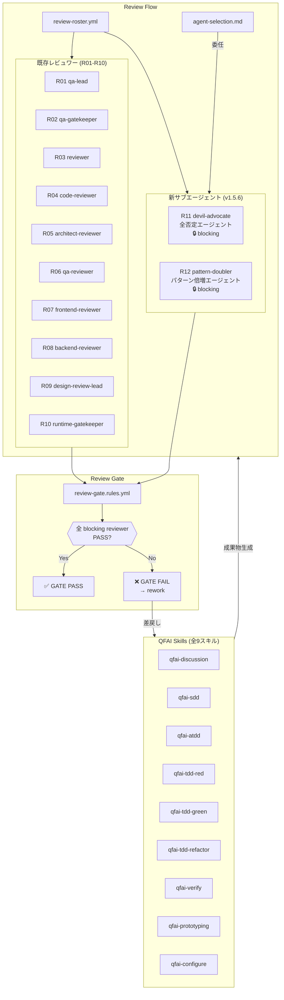
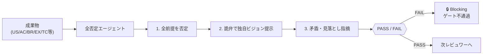

# 02 Inception Deck -- QFAI v1.5.6: 全否定エージェント & パターン倍増エージェント

> discussion-id: discussion-20260315033313220
> date: 2026-03-15

---

## 1. なぜ我々はここにいるのか？ (Why Are We Here?)

- **目的**: QFAI のレビュー品質とアーティファクト網羅性を飛躍的に向上させるため、2つの新サブエージェントを追加する。
- **背景**: 現行の 10 人レビューロスター (qa-lead 〜 runtime-gatekeeper) は各専門領域をカバーしているが、「現状を全面的に疑う視点」と「パターン数の十分性を担保する視点」が構造的に欠落している。
- **動機**:
  - レビューが合意形成に偏り、根本的な前提の誤りを見逃すリスクがある。
  - US, AC, BR, EX, TC, テストなどのパターン数が過少のまま PASS される傾向がある。
- **ゴール**: 全否定エージェント (Devil's Advocate) とパターン倍増エージェント (Pattern Doubler) を導入し、全 QFAI スキルで blocking power を持たせることで品質の底上げを実現する。

---

## 2. エレベーターピッチ (Elevator Pitch)

- **For**: QFAI を利用してソフトウェア仕様策定・レビューを行う開発チーム
- **Who**: レビューの同調バイアスとパターン不足による品質リスクを抱えている
- **The**: 全否定エージェント & パターン倍増エージェント
- **Is a**: QFAI レビュープロセスに組み込まれるサブエージェント 2 体
- **That**: 全面否定による前提破壊と、パターン倍増による網羅性強制を自動実行する
- **Unlike**: 既存の 10 レビュワーが各専門領域のチェックに留まるのに対し
- **Our product**: 詭弁的全否定と逆張りロジックにより、見落としの構造的排除とパターン数の底上げを blocking power 付きで保証する

---

## 3. パッケージデザイン (Product Box)

### ヘッドライン機能

1. **全否定エージェント (Devil's Advocate Agent)**
   - 全成果物を「すべて間違っている」前提でレビュー
   - 詭弁・全面否定を駆使して独自のビジョンを押し付ける
   - review-roster.yml の 11 番目のレビュワーとして blocking power を保持
   - agent-selection.md に追加され全 QFAI スキルから呼び出し可能

2. **パターン倍増エージェント (Pattern Doubler Agent)**
   - US, AC, BR, EX, TC, テストなど全アーティファクトのパターン数倍増を要求
   - 逆張りロジック (contrarian logic) で不足を指摘
   - 全 QFAI スキル (qfai-discussion, qfai-sdd, qfai-atdd, qfai-tdd-red, qfai-tdd-green, qfai-tdd-refactor, qfai-verify, qfai-prototyping, qfai-configure) に blocking power 付きで統合

3. **既存フローとのシームレス統合**
   - review-gate.rules.yml の既存ゲート基準にブロッキング条件として追加
   - 既存 10 レビュワーの判定に加え、新エージェント 2 体が FAIL を出した場合はゲート不通過

---

## 4. やらないことリスト (NOT List)

| スコープ内 (In Scope) | スコープ外 (Out of Scope) |
| --- | --- |
| 全否定エージェントの review-roster.yml への追加 (R11) | 既存 10 レビュワーのロジック変更 |
| パターン倍増エージェントの全スキルへの統合 | パターン数の具体的な上限値の自動設定 |
| agent-selection.md への 2 エージェント追加 | 新エージェント用の独立 UI/ダッシュボード |
| blocking power の付与と review-gate 連携 | 人間レビュワーの追加・削除 |
| 全 9 スキルでの呼び出しフック実装 | CI/CD パイプラインの変更 |
| 詭弁・全面否定ロジックのプロンプト設計 | 外部 API 連携・LLM プロバイダ変更 |
| 逆張りパターン倍増ロジックのプロンプト設計 | パフォーマンス最適化・キャッシュ導入 |

---

## 5. ご近所さんを知ろう (Stakeholders & Dependencies)

### 上流依存

- **review-roster.yml**: 現行 10 レビュワー定義 -- 11 番目・12 番目として追加
- **agent-selection.md**: 既存の委任マップ -- 2 ロール追加
- **review-gate.rules.yml**: ゲート基準 -- blocking 条件追加

### 下流依存

- **全 QFAI スキル** (9 スキル): qfai-discussion, qfai-sdd, qfai-atdd, qfai-tdd-red, qfai-tdd-green, qfai-tdd-refactor, qfai-verify, qfai-prototyping, qfai-configure
- **レビューレポート出力**: R11, R12 のレビュー結果ファイル生成

### ステークホルダー

| 役割 | 関心事 |
| --- | --- |
| QFAI 利用開発者 | レビュー品質向上、パターン不足の早期検出 |
| プロジェクトオーナー | 品質ゲートの強化による手戻り削減 |
| QA チーム | テストケース・受入基準の網羅性向上 |
| アーキテクト | 前提の妥当性検証の自動化 |

---

## 6. 解決策を見せて (Show the Solution)

### アーキテクチャ概要

既存のレビューフローに 2 つの新エージェントが blocking reviewer として統合される。全 QFAI スキルの実行時に両エージェントが自動呼び出しされ、FAIL 判定でゲート不通過となる。

### 全否定エージェントの動作フロー

---

## 7. 夜も眠れなくなる問題 (Risks)

| # | リスク | 確率 | 影響度 | 緩和策 |
| --- | --- | --- | --- | --- |
| R1 | 全否定エージェントが過剰に FAIL を出し、開発速度が著しく低下する | 高 | 高 | FAIL 理由の具体性と建設的代替案の提示を必須とするプロンプト制約を設ける |
| R2 | パターン倍増エージェントが無意味な重複パターンを要求する | 中 | 中 | 倍増要求には「追加パターンの価値根拠」の明示を義務付ける |
| R3 | 既存レビュワーとの判定矛盾により混乱が生じる | 中 | 高 | 新エージェントの判定は既存レビュワーと独立に扱い、矛盾時の優先ルールを review-gate.rules.yml に明記する |
| R4 | blocking power 付与により単一エージェントの障害でフロー全体が停止する | 低 | 高 | waiver メカニズム (waivers.yml) による緊急バイパスを用意する |
| R5 | 詭弁ロジックの品質が LLM の能力に強く依存する | 中 | 中 | プロンプトにおける詭弁パターンのテンプレート化とテストケースによる検証 |
| R6 | 全 9 スキルへの統合作業が大規模で回帰バグを誘発する | 中 | 高 | スキルごとの段階的統合とスモークテストによる段階的リリース |

---

## 8. サイズを見積もれ (Size It Up)

### 見積もり工数

| 作業項目 | 規模 | 備考 |
| --- | --- | --- |
| 全否定エージェントのプロンプト設計 | M | 詭弁パターンの定義、テンプレート作成 |
| パターン倍増エージェントのプロンプト設計 | M | 逆張りロジックの定義、倍増判定基準 |
| review-roster.yml への R11/R12 追加 | S | 既存フォーマット準拠 |
| agent-selection.md への 2 ロール追加 | S | 既存フォーマット準拠 |
| review-gate.rules.yml の blocking 条件追加 | S | 既存ルールへの条件追加 |
| 全 9 スキルへの呼び出しフック統合 | L | 各スキルの instruction/template に統合 |
| テスト・検証 | L | 全スキル横断のスモークテスト |
| ドキュメント更新 | S | CHANGELOG, product.md 等 |

### 目標タイムライン

- **Phase 1** (1-2日): プロンプト設計 + roster/agent-selection 更新
- **Phase 2** (2-3日): 全 9 スキルへの統合実装
- **Phase 3** (1-2日): テスト・検証・修正
- **合計**: 約 4-7 日

---

## 9. トレードオフスライダー (Trade-off Sliders)

| 次元 | 優先度 (1=最優先, 4=最低) | 方針 |
| --- | --- | --- |
| **品質** | 1 | 最優先。全否定・パターン倍増の本質は品質強化であり、品質を犠牲にしない |
| **スコープ** | 2 | 2 エージェント + 全 9 スキル統合は必須。削減不可 |
| **時間** | 3 | 段階的リリースで調整可能。Phase 1-2 を先行リリースし Phase 3 は後追い可 |
| **コスト** | 4 | LLM 呼び出し回数増加によるトークンコスト増は許容する |

### 品質 vs 速度のトレードオフ

- 全否定エージェントの blocking power は開発速度を低下させる可能性があるが、品質ゲートの強化が本リリースの主目的であるため速度低下は許容する。
- パターン倍増による作業量増加も同様に許容する。ただし、無意味な倍増を防ぐ安全弁 (価値根拠の明示義務) を設ける。

---

## 10. 何にどのくらいかかるか (Cost & Resources)

### 必要スキル・チーム構成

| 役割 | 人数 | 担当内容 |
| --- | --- | --- |
| プロンプトエンジニア | 1 | 全否定・パターン倍増エージェントのプロンプト設計 |
| QFAI コア開発者 | 1 | roster/gate/agent-selection の更新、スキル統合 |
| QA エンジニア | 1 | 全スキル横断テスト、回帰テスト |

### インフラ・リソース

- 追加インフラ不要 (既存の QFAI ランタイム上で動作)
- LLM トークン消費量: 各スキル実行あたり +2 エージェント分の呼び出しが追加 (約 20-40% のトークン増)

### 変更対象ファイル一覧

| ファイル | 変更種別 |
| --- | --- |
| `.qfai/assistant/steering/review-roster.yml` | R11, R12 追加 |
| `.qfai/assistant/instructions/agent-selection.md` | 2 ロール追加 |
| `.qfai/assistant/steering/review-gate.rules.yml` | blocking 条件追加 |
| `packages/qfai/assets/init/.qfai/assistant/steering/review-roster.yml` | R11, R12 追加 (テンプレート) |
| `packages/qfai/assets/init/.qfai/assistant/instructions/agent-selection.md` | 2 ロール追加 (テンプレート) |
| 全 9 スキルの instruction/template ファイル | 呼び出しフック追加 |
| `CHANGELOG.md` | v1.5.6 エントリ追加 |
| `package.json` | バージョンバンプ |
