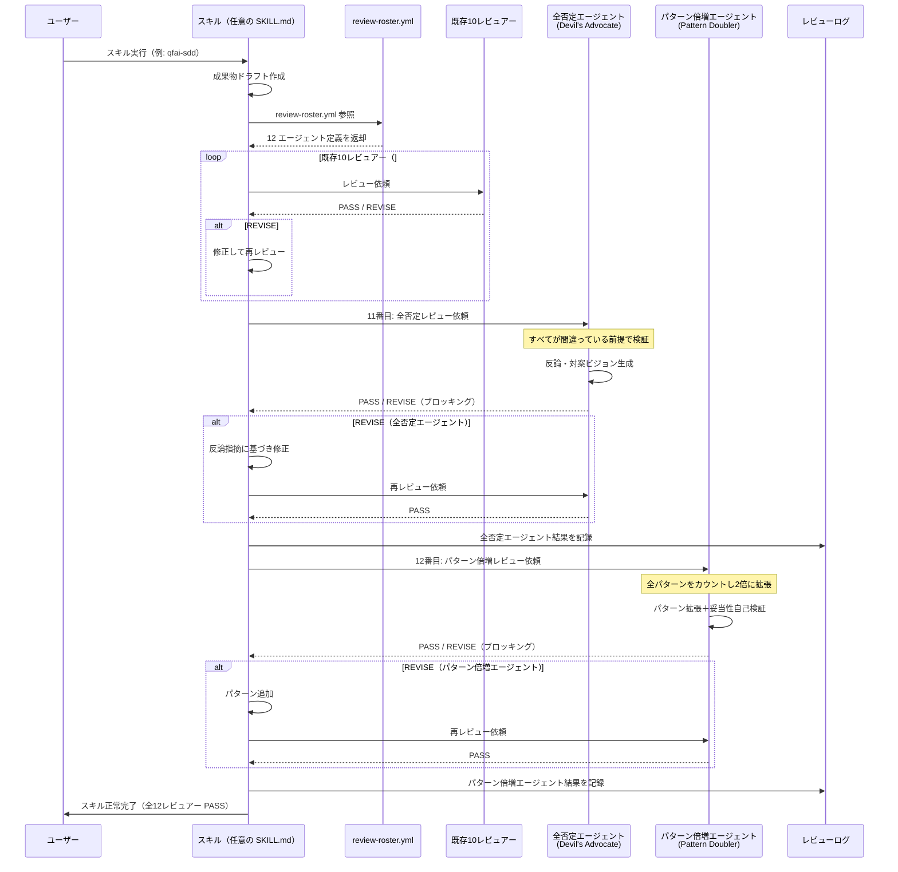
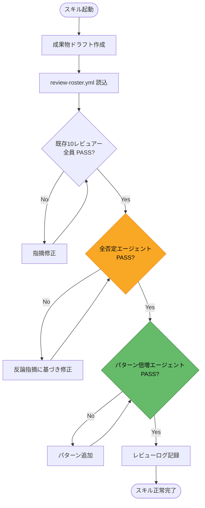

# 03 Story Workshop

## 対象バージョン

QFAI v1.5.6

## 機能概要

2 つの新規サブエージェントを追加し、全 QFAI スキルに統合する。

1. **全否定エージェント（Devil's Advocate Agent）** -- すべてを「間違っている」前提でレビューし、自分のビジョンを強く押し通す。review-roster.yml に 11 番目のブロッキングレビュアーとして登録。
2. **パターン倍増エージェント（Pattern Doubler Agent）** -- 全成果物のパターン数を 2 倍にする。ブロッキング権限を持つ。

対象スキル: qfai-discussion, qfai-sdd, qfai-configure, qfai-prototyping, qfai-atdd, qfai-tdd-red, qfai-tdd-green, qfai-tdd-refactor, qfai-verify

---

## ユーザーストーリー一覧

### US-0001: 全否定エージェントの定義と登録

**As a** QFAI メンテナー
**I want** 全否定エージェント（Devil's Advocate Agent）を review-roster.yml と agent-selection.md に定義・登録したい
**So that** 全スキルのレビューフローで「全否定」視点のブロッキングレビューが自動的に適用される

**ユーザーフロー**:

1. メンテナーが review-roster.yml を開く
2. 11 番目のエントリとして `devils-advocate` を追加する
   - `id: devils-advocate`
   - `name: Devil's Advocate`
   - `scope: [discuss, require, sdd, prototype, atdd, tdd-red, tdd-green, tdd-refactor, verify]`（全スキルスコープ）
   - `can_be_na: false`（ブロッキング: N/A 不可）
   - `must_check`: すべてが間違っている前提で検証 / 対案ビジョンの提示
3. agent-selection.md にシナリオ行と「迷ったときの基準」を追加する
4. QFAI の `qfai init` 実行時にテンプレートへ反映されることを確認する

**受入条件（AC）**:

- AC-0001-01: review-roster.yml に `devils-advocate` エントリが 11 番目として存在する
- AC-0001-02: `can_be_na: false` が設定されており、全スコープで SKIP 不可である
- AC-0001-03: agent-selection.md の代表シナリオに「全否定レビュー」行が追加されている
- AC-0001-04: `qfai init` で生成されるテンプレートに新エントリが含まれる
- AC-0001-05: 既存の 10 エージェント定義が変更されていない

---

### US-0002: 全否定エージェントのレビュー実行フロー

**As a** QFAI ユーザー
**I want** 全否定エージェントがすべての成果物を「間違っている」前提でレビューし、対案を提示してほしい
**So that** 見落としやバイアスを排除した堅牢な成果物が得られる

**ユーザーフロー**:

1. ユーザーが任意のスキル（例: `qfai-sdd`）を実行する
2. 成果物ドラフトが完成し、レビューフェーズに入る
3. 既存 10 レビュアーがレビューを実行する
4. 11 番目として全否定エージェントが起動する
5. 全否定エージェントが以下を実行する:
   - すべての前提・結論を「間違っている」と仮定して検証
   - 反論・対案ビジョンを提示
   - PASS / REVISE 判定を返す
6. REVISE の場合、修正フローが起動される（ブロッキング）
7. PASS の場合、次のレビュアー（パターン倍増エージェント）に進む

**受入条件（AC）**:

- AC-0002-01: 全否定エージェントが REVISE を返した場合、スキルは次のフェーズに進めない（ブロッキング）
- AC-0002-02: レビュー結果に「反論理由」と「対案ビジョン」が必ず含まれる
- AC-0002-03: 全否定エージェントの PASS 判定には「否定観点で問題なし」の根拠が必須である
- AC-0002-04: REVISE 時の修正指示は具体的かつ再現可能な内容である

---

### US-0003: パターン倍増エージェントの定義と登録

**As a** QFAI メンテナー
**I want** パターン倍増エージェント（Pattern Doubler Agent）を review-roster.yml と agent-selection.md に定義・登録したい
**So that** 全成果物のパターン網羅性が自動的に倍増される

**ユーザーフロー**:

1. メンテナーが review-roster.yml を開く
2. 12 番目のエントリとして `pattern-doubler` を追加する
   - `id: pattern-doubler`
   - `name: Pattern Doubler`
   - `scope: [discuss, require, sdd, prototype, atdd, tdd-red, tdd-green, tdd-refactor, verify]`（全スキルスコープ）
   - `can_be_na: false`（ブロッキング: N/A 不可）
   - `must_check`: パターン数が倍増されているか / 新規パターンの妥当性
3. agent-selection.md にシナリオ行を追加する
4. QFAI の `qfai init` 実行時にテンプレートへ反映されることを確認する

**受入条件（AC）**:

- AC-0003-01: review-roster.yml に `pattern-doubler` エントリが 12 番目として存在する
- AC-0003-02: `can_be_na: false` が設定されており、全スコープで SKIP 不可である
- AC-0003-03: agent-selection.md の代表シナリオに「パターン倍増」行が追加されている
- AC-0003-04: `qfai init` で生成されるテンプレートに新エントリが含まれる
- AC-0003-05: 既存の 11 エージェント定義（全否定エージェント含む）が変更されていない

---

### US-0004: パターン倍増エージェントのレビュー実行フロー

**As a** QFAI ユーザー
**I want** パターン倍増エージェントが全成果物のパターン数を 2 倍に拡張してほしい
**So that** テストケース・シナリオ・境界条件のカバレッジが大幅に向上する

**ユーザーフロー**:

1. ユーザーが任意のスキル（例: `qfai-atdd`）を実行する
2. 成果物ドラフトが完成し、レビューフェーズに入る
3. 既存 10 レビュアー + 全否定エージェントがレビューを完了する
4. 12 番目としてパターン倍増エージェントが起動する
5. パターン倍増エージェントが以下を実行する:
   - 成果物内の全パターン（テストケース、シナリオ、Example Seeds 等）をカウント
   - 各パターンカテゴリで数を 2 倍に拡張
   - 追加パターンの妥当性を自己検証
   - PASS / REVISE 判定を返す
6. REVISE の場合、パターン不足箇所を指摘して修正フローが起動される（ブロッキング）
7. PASS の場合、レビューフェーズが完了する

**受入条件（AC）**:

- AC-0004-01: パターン倍増エージェントが REVISE を返した場合、スキルは次のフェーズに進めない（ブロッキング）
- AC-0004-02: 成果物内のパターン数が実行前の 2 倍以上になっている
- AC-0004-03: 追加されたパターンは既存パターンと重複しない
- AC-0004-04: 追加パターンの妥当性根拠がレビュー結果に記載されている
- AC-0004-05: パターン倍増はすべての成果物タイプ（Discussion, SDD, ATDD, TDD 等）に適用される

---

### US-0005: 全 skill への統合

**As a** QFAI ユーザー
**I want** 全 9 スキルで全否定エージェントとパターン倍増エージェントが自動起動してほしい
**So that** どのスキルを使っても一貫して「全否定レビュー」と「パターン倍増」が適用される

**ユーザーフロー**:

1. ユーザーが任意のスキル（qfai-discussion / qfai-sdd / qfai-configure / qfai-prototyping / qfai-atdd / qfai-tdd-red / qfai-tdd-green / qfai-tdd-refactor / qfai-verify）を実行する
2. スキルのレビューフェーズで review-roster.yml を参照する
3. 既存 10 レビュアーに続き、全否定エージェント（11 番目）とパターン倍増エージェント（12 番目）が順次起動する
4. 両エージェントが PASS するまでスキルは完了しない
5. 全エージェント PASS 後、スキルが正常完了する

**受入条件（AC）**:

- AC-0005-01: 全 9 スキルの SKILL.md にて、新規 2 エージェントの起動手順が記載されている
- AC-0005-02: 各スキルのレビューフェーズで全否定エージェントとパターン倍増エージェントが必ず起動する
- AC-0005-03: 起動順序は「既存 10 → 全否定（11 番目）→ パターン倍増（12 番目）」で固定される
- AC-0005-04: `--auto` フラグ使用時でも両エージェントは SKIP されない
- AC-0005-05: 各スキルでのエージェント起動結果がレビューログに記録される

---

## レビューフロー全体シーケンス図（Mermaid）

---

## 全スキル統合フローチャート（Mermaid）

---

## Example Seeds（6 観点）

### US-0001: 全否定エージェントの定義と登録

#### 1. ハッピーパス

- **前提**: review-roster.yml に既存 10 エージェントが登録済み
- **操作**: `devils-advocate` エントリを 11 番目に追加し、`can_be_na: false` を設定する
- **期待**: YAML バリデーション PASS、既存エントリに影響なし
- **結果**: review-roster.yml が 11 エントリを持ち、スキーマ検証に合格する

#### 2. ネガティブパス

- **前提**: `devils-advocate` の `must_check` が空リストで登録された
- **操作**: YAML バリデーションを実行する
- **期待**: `must_check` が空であるためバリデーション失敗
- **結果**: エラーメッセージ「must_check requires at least one item」が出力される

#### 3. エッジ／境界ケース

- **前提**: review-roster.yml に同名の `devils-advocate` が既に存在する（重複登録）
- **操作**: `qfai init` を実行する
- **期待**: 重複 ID が検出され、初期化が中断される
- **結果**: エラー「Duplicate roster ID: devils-advocate」が出力される

#### 4. パーミッション／ロール

- **前提**: メンテナー以外のユーザーが review-roster.yml を編集しようとする
- **操作**: Git の保護ブランチ上で直接コミットを試みる
- **期待**: ブランチ保護ルールにより直接コミットが拒否される
- **結果**: PR 経由でのマージが必要になる

#### 5. 状態遷移

- **前提**: review-roster.yml が 10 エントリの状態
- **操作**: `devils-advocate` を追加し、agent-selection.md を更新する
- **遷移**: 10 エントリ状態 → 11 エントリ状態 → agent-selection.md 更新済み状態
- **結果**: 両ファイルが整合性を持つ状態に遷移完了する

#### 6. 冪等性／リトライ

- **前提**: `devils-advocate` が既に正しく登録されている
- **操作**: 同じ追加操作を再度実行する
- **期待**: 既に存在するため変更なし（冪等）または重複エラーで中断
- **結果**: ファイルの内容が変わらない、または明確なエラーが返る

---

### US-0002: 全否定エージェントのレビュー実行フロー

#### 1. ハッピーパス

- **前提**: 成果物ドラフトが完成し、既存 10 レビュアーが全員 PASS 済み
- **操作**: 全否定エージェントがレビューを実行する
- **期待**: 反論と対案ビジョンを生成したうえで「否定観点で問題なし」として PASS を返す
- **結果**: レビューログに PASS 判定と根拠が記録される

#### 2. ネガティブパス

- **前提**: 成果物に重大な前提ミスが含まれている
- **操作**: 全否定エージェントがレビューを実行する
- **期待**: REVISE 判定が返され、具体的な反論と修正指示が提示される
- **結果**: スキルがブロックされ、修正フローが起動する

#### 3. エッジ／境界ケース

- **前提**: 成果物が極めて単純（1 行のみの変更）
- **操作**: 全否定エージェントが「全否定」を試みる
- **期待**: 単純変更でも必ず否定観点検証を実行し、PASS/REVISE を返す
- **結果**: 「否定すべき点がないことを確認」として PASS が返る（空振りにならない）

#### 4. パーミッション／ロール

- **前提**: 全否定エージェントが REVISE を返したが、ユーザーがオーバーライドを試みる
- **操作**: ユーザーが手動で全否定エージェントの結果を PASS に変更しようとする
- **期待**: ブロッキングレビュアーのためオーバーライド不可
- **結果**: 「can_be_na: false のためスキップ不可」エラーが返る

#### 5. 状態遷移

- **前提**: 全否定エージェントが 1 回目で REVISE を返した
- **操作**: 修正後に再レビューを依頼する
- **遷移**: REVISE 状態 → 修正中状態 → 再レビュー状態 → PASS 状態
- **結果**: 2 回目のレビューで PASS となり、パターン倍増エージェントに進む

#### 6. 冪等性／リトライ

- **前提**: 全否定エージェントが PASS を返した後、ネットワークエラーで結果が保存されなかった
- **操作**: 同じ成果物に対して全否定エージェントを再実行する
- **期待**: 同じ成果物に対して同じ判定（PASS）が返る
- **結果**: レビュー結果は冪等であり、再実行しても判定が変わらない

---

### US-0003: パターン倍増エージェントの定義と登録

#### 1. ハッピーパス

- **前提**: review-roster.yml に 11 エージェント（全否定エージェント含む）が登録済み
- **操作**: `pattern-doubler` エントリを 12 番目に追加し、`can_be_na: false` を設定する
- **期待**: YAML バリデーション PASS、既存エントリに影響なし
- **結果**: review-roster.yml が 12 エントリを持ち、スキーマ検証に合格する

#### 2. ネガティブパス

- **前提**: `pattern-doubler` の `scope` が空リストで登録された
- **操作**: YAML バリデーションを実行する
- **期待**: `scope` が空であるためバリデーション失敗
- **結果**: エラーメッセージ「scope requires at least one item」が出力される

#### 3. エッジ／境界ケース

- **前提**: review-roster.yml のスキーマバージョンが古い（schema_version: "0.9"）
- **操作**: 新しいエージェント形式で `pattern-doubler` を追加する
- **期待**: スキーマバージョン不一致が検出され、マイグレーションが案内される
- **結果**: 「schema_version 1.0 required」の警告が出力される

#### 4. パーミッション／ロール

- **前提**: パターン倍増エージェントが agent-selection.md に追加されていない
- **操作**: ユーザーが「パターン網羅性を高めたい」場合の選択ガイドを参照する
- **期待**: agent-selection.md にパターン倍増エージェントの記載がなく、選択できない
- **結果**: agent-selection.md の更新漏れが検出される

#### 5. 状態遷移

- **前提**: review-roster.yml が 11 エントリの状態（全否定エージェント追加済み）
- **操作**: `pattern-doubler` を追加し、agent-selection.md を更新する
- **遷移**: 11 エントリ状態 → 12 エントリ状態 → agent-selection.md 更新済み状態
- **結果**: 全定義ファイルが v1.5.6 の最終形に遷移完了する

#### 6. 冪等性／リトライ

- **前提**: `pattern-doubler` が既に正しく登録されている
- **操作**: `qfai init` を再実行する
- **期待**: テンプレート生成が冪等であり、既存設定を上書きしない
- **結果**: 既に登録済みの場合は「already exists, skipping」ログが出力される

---

### US-0004: パターン倍増エージェントのレビュー実行フロー

#### 1. ハッピーパス

- **前提**: 成果物に 5 パターンのテストケースがある
- **操作**: パターン倍増エージェントがレビューを実行する
- **期待**: 5 パターン → 10 パターンに拡張され、PASS が返る
- **結果**: 追加された 5 パターンは既存パターンと重複せず、妥当性根拠がログに記録される

#### 2. ネガティブパス

- **前提**: 成果物に 3 パターンがあるが、倍増後に 4 パターンしか生成されなかった
- **操作**: パターン倍増エージェントが自己検証を実行する
- **期待**: 2 倍基準（6 パターン）に未達のため REVISE が返る
- **結果**: 「2 パターン不足」の具体的な不足箇所が指摘される

#### 3. エッジ／境界ケース

- **前提**: 成果物にパターンが 0 件（パターン記載なし）
- **操作**: パターン倍増エージェントがレビューを実行する
- **期待**: 0 × 2 = 0 ではなく、最低基準パターンの追加を REVISE として要求する
- **結果**: 「パターンゼロは許容されない。最低 N パターンを追加せよ」と指摘される

#### 4. パーミッション／ロール

- **前提**: パターン倍増エージェントが REVISE を返した
- **操作**: ユーザーが `--auto` モードで実行中であり、手動介入ができない
- **期待**: `--auto` モードでもブロッキングのためスキルが一時停止し、自動修正を試みる
- **結果**: 自動修正後に再レビューが行われ、PASS になるまで繰り返す

#### 5. 状態遷移

- **前提**: パターン倍増エージェントが 1 回目で REVISE、2 回目で REVISE、3 回目で PASS
- **操作**: 3 回のレビューサイクルを実行する
- **遷移**: REVISE(1) → 修正 → REVISE(2) → 修正 → PASS(3)
- **結果**: 3 回目で最終的にパターン数が 2 倍基準を満たし、レビュー完了する

#### 6. 冪等性／リトライ

- **前提**: パターン倍増エージェントが PASS を返し、パターンが 10 件に拡張された
- **操作**: 何らかの理由で同じ成果物に対してパターン倍増エージェントを再実行する
- **期待**: 既に 10 件のパターンに対して 20 件への再倍増は行わない（冪等）
- **結果**: 「既に倍増済み」として PASS が返り、パターン数は 10 件のまま維持される

---

### US-0005: 全 skill への統合

#### 1. ハッピーパス

- **前提**: 全 9 スキルの SKILL.md が更新済みで、review-roster.yml に 12 エージェントが登録済み
- **操作**: `qfai-sdd` を実行する
- **期待**: 既存 10 → 全否定（11）→ パターン倍増（12）の順でレビューが実行される
- **結果**: 全 12 レビュアーが PASS し、スキルが正常完了する

#### 2. ネガティブパス

- **前提**: qfai-tdd-red の SKILL.md が更新されていない（新エージェント参照なし）
- **操作**: `qfai-tdd-red` を実行する
- **期待**: review-roster.yml には 12 エージェントが定義されているが、SKILL.md との不整合が検出される
- **結果**: 整合性チェックで警告が出力される

#### 3. エッジ／境界ケース

- **前提**: ユーザーが `qfai-configure`（設定系スキル）を実行する
- **操作**: 設定ファイル生成に対して全否定エージェントとパターン倍増エージェントが起動する
- **期待**: 設定ファイルにも「パターン」概念が適用される（設定バリエーション倍増）
- **結果**: 設定系スキルでも両エージェントが正常動作し、PASS/REVISE を返す

#### 4. パーミッション／ロール

- **前提**: 新規 2 エージェントが `can_be_na: false` のブロッキング設定
- **操作**: ユーザーが waiver（免除）を申請して 2 エージェントをスキップしようとする
- **期待**: `can_be_na: false` のエージェントは waiver 対象外
- **結果**: 「ブロッキングレビュアーは免除できません」エラーが返る

#### 5. 状態遷移

- **前提**: 9 スキルのうち 5 スキルの SKILL.md が更新済み、残り 4 スキルが未更新
- **操作**: 残り 4 スキルの SKILL.md を順次更新する
- **遷移**: 5/9 統合済み → 6/9 → 7/9 → 8/9 → 9/9 統合完了
- **結果**: 全 9 スキルが新エージェントを参照する状態に遷移完了する

#### 6. 冪等性／リトライ

- **前提**: 全 9 スキルが既に新エージェント統合済み
- **操作**: 同じスキルを複数回実行する
- **期待**: 毎回同じ 12 レビュアーが同じ順序で起動する
- **結果**: レビュー順序とブロッキング動作が毎回同一であり、冪等性が保証される
