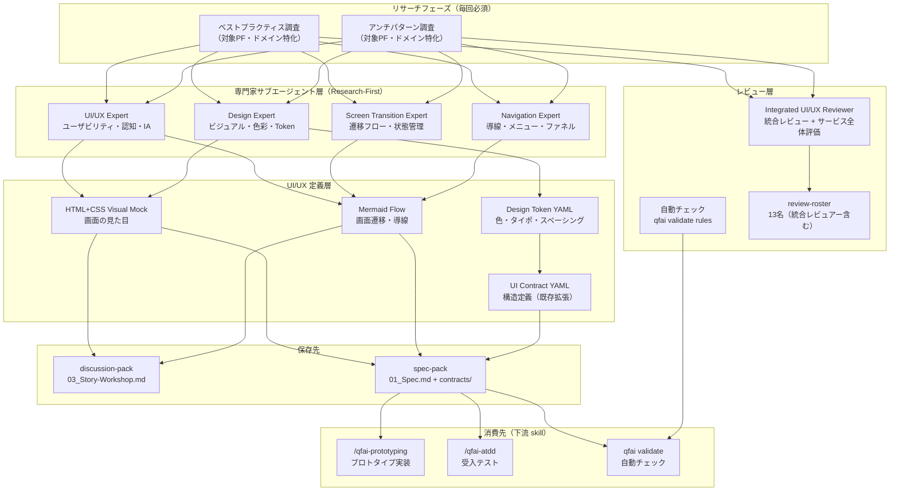

# 02_Inception-Deck

## Q1: なぜ今これを作るのか？ (Why are we here?)

QFAI v1.5.7 で UI/UX 定義体系を強化する動機は 3 つある：

1. **プロトタイプ品質向上**: 現状の YAML ベース UI Contract ではビジュアル情報が欠落しており、prototyping skill による実装時に仕様との認識齟齬が発生する。HTML+CSS mock を導入し、見た目レベルの仕様一致を実現する。
2. **QFAI の包括性強化**: QFAI をあらゆるプロジェクト（Web/Windows/Mobile）の UI/UX 品質を担保できるツールにするため、プラットフォーム非依存の UI/UX 定義・レビュー体系が必要。
3. **下流 skill の実装準備**: prototyping/ATDD/TDD skill が UI 定義を正確に消費するプロトコルを整備し、spec → 実装 → 検証の一気通貫を実現する。

## Q2: エレベーターピッチ

**QFAI v1.5.7** は、ソフトウェアプロジェクトの **UI/UX 品質を体系的に定義・レビュー・検証する仕組み** を必要とする **開発チーム** のための機能強化です。

現状の **YAML ベースの構造定義のみ** では不十分な UI/UX 情報を、**HTML+CSS visual mock + Mermaid 画面遷移図 + Design Token YAML** の 3 点セットで保持し、**ベストプラクティス/アンチパターンに基づく自動+手動ハイブリッドレビュー** と **下流 skill への正確な情報伝達** を提供します。

## Q3: パッケージデザイン（製品の箱）

### 表面（売り文句）
- 🎯 **See What You Spec**: UI 仕様を見た目レベルで定義し、認識齟齬ゼロへ
- 🔄 **Flow as Code**: 画面遷移を Mermaid で記述し、導線設計をレビュー可能に
- 🎨 **Token-Driven Design**: Design Token で色・タイポ・スペーシングを一元管理
- ✅ **Anti-Pattern Guard**: UI/UX アンチパターンを自動+手動で検出

### 裏面（主な特徴）
- プラットフォーム非依存（Web/Windows/Mobile）
- 時代適応型の UI/UX レビュー基準
- discussion → spec → prototyping → ATDD/TDD の一気通貫
- 既存 UI Contract（CON-UI-XXXX）との後方互換性

## Q4: やらないことリスト (NOT List)

| Item | IN / OUT | Reason |
|------|----------|--------|
| Figma/Sketch 等のデザインツール直接連携 | OUT | v1.5.7 では text-based で完結する。将来検討可 |
| ビジュアルリグレッションテスト（スクリーンショット比較） | OUT | 別途検討が必要。v1.5.7 では DOM ベース検証に集中 |
| QFAI 自身の GUI/Web UI | OUT | QFAI は CLI ツール。対象プロジェクトの UI を定義する |
| 特定 FW/プラットフォーム限定対応 | OUT | プラットフォーム非依存を維持 |

## Q5: ご近所さん（関連プロジェクト/機能）

- **既存 UI Contract（CON-UI-XXXX）**: 拡張するが破壊しない
- **spec-0006（prototyping command）**: UI fidelity autogen の仕組みと統合
- **ui-ux-reviewer エージェント**: レビュー基準を強化
- **qfai validate**: UI/UX 自動チェックルールを追加

## Q6: 技術的な解決策の概要

## Q7: 夜も眠れない問題（リスク）

| Risk | Likelihood | Impact | Mitigation |
|------|-----------|--------|------------|
| 既存 UI Contract YAML との不整合 | **高** | **高** | 拡張のみ行い破壊的変更を禁止。マイグレーションパスを用意 |
| 定義の過剰複雑化 | 中 | 高 | 最小必須セットを定義し、オプショナル項目は段階的に追加 |
| プラットフォーム差異の吸収困難 | 中 | 中 | 共通レイヤー + プラットフォーム固有レイヤーの 2 層構造 |
| 下流 skill の解釈ブレ | 中 | 高 | 消費プロトコルを明文化し、解釈テストを設ける |

## Q8: 期間とマイルストーン

| Milestone | Content |
|-----------|---------|
| M1: Discussion | UI/UX 定義体系の要件・方針決定（本ディスカッション） |
| M2: SDD | spec-pack への反映、Design Token スキーマ、HTML mock テンプレート定義 |
| M3: Prototyping | 新体系による prototyping skill の実装・検証 |
| M4: ATDD/Validate | UI/UX レビュールールの実装・検証 |

## Q9: トレードオフスライダー

| Value | Priority |
|-------|----------|
| 定義の正確性・完全性 | ★★★★★ |
| 柔軟性・拡張性 | ★★★★★ |
| 下流 skill との整合性 | ★★★★★ |
| 実装コスト（工数） | ★★★☆☆ |
| 後方互換性 | ★★★★☆ |

> ユーザー指示：正確性・柔軟性・整合性は**すべて同等に最重要**。実装コストは二の次。

## Q10: 何がどれだけ必要か？

### チーム構成（エージェントロール）

| Role | Responsibility | Research-First |
|------|---------------|----------------|
| Orchestrator | discussion/spec 生成の統括、専門家サブエージェント統括 | — |
| UI/UX Expert | ユーザビリティ評価・認知負荷分析・情報設計・インタラクション設計 | **必須**: 作業冒頭で最新の UI/UX ベストプラクティス/アンチパターンをリサーチ |
| Design Expert | ビジュアルデザイン・色彩・タイポグラフィ・レイアウト・Design Token 設計 | **必須**: 作業冒頭で最新のデザインベストプラクティス/アンチパターンをリサーチ |
| Screen Transition Expert | 画面遷移フロー設計・状態管理・条件分岐・エラー遷移 | **必須**: 作業冒頭で最新の画面遷移ベストプラクティス/アンチパターンをリサーチ |
| Navigation Expert | IA 構造設計・メニュー/タブ/サイドバー設計・ブレッドクラム・導線最適化 | **必須**: 作業冒頭で最新の導線設計ベストプラクティス/アンチパターンをリサーチ |
| Integrated UI/UX Reviewer | 4専門家の成果物を統合レビュー + サービス全体の使い勝手評価 | **必須**: 作業冒頭で最新の UX 評価ベストプラクティス/アンチパターンをリサーチ |
| Frontend Reviewer | 実装可能性・技術整合性チェック | — |
| Architect Reviewer | 全体アーキテクチャとの整合性チェック | — |
| Design Token Specialist | Design Token スキーマ設計 | — |

> **Research-First Protocol**: 5 つの専門家サブエージェント（UI/UX Expert, Design Expert, Screen Transition Expert, Navigation Expert, Integrated UI/UX Reviewer）は、作業開始前に必ず対象プラットフォーム・対象ドメインに関する最新のベストプラクティスとアンチパターンを調査し、その結果を作業の基盤とする。この調査は毎回実施し、固定的なルールセットに依存しない。

> **活動フェーズ**: 全フェーズ（discussion, SDD, prototyping, ATDD）で各専門家が関与する。discussion で方針策定、SDD で詳細定義、prototyping/ATDD で実装・検証の品質担保。

> **責務境界**: 4 専門家の領域はゆるやかに分離する。重複する領域（例: フォーム設計はデザインとインタラクションの両方に跨る）は複数の専門家が協調して担当し、統合レビュアーが最終調整を行う。
