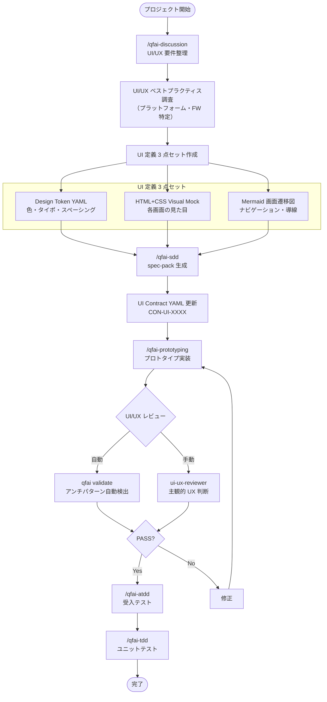
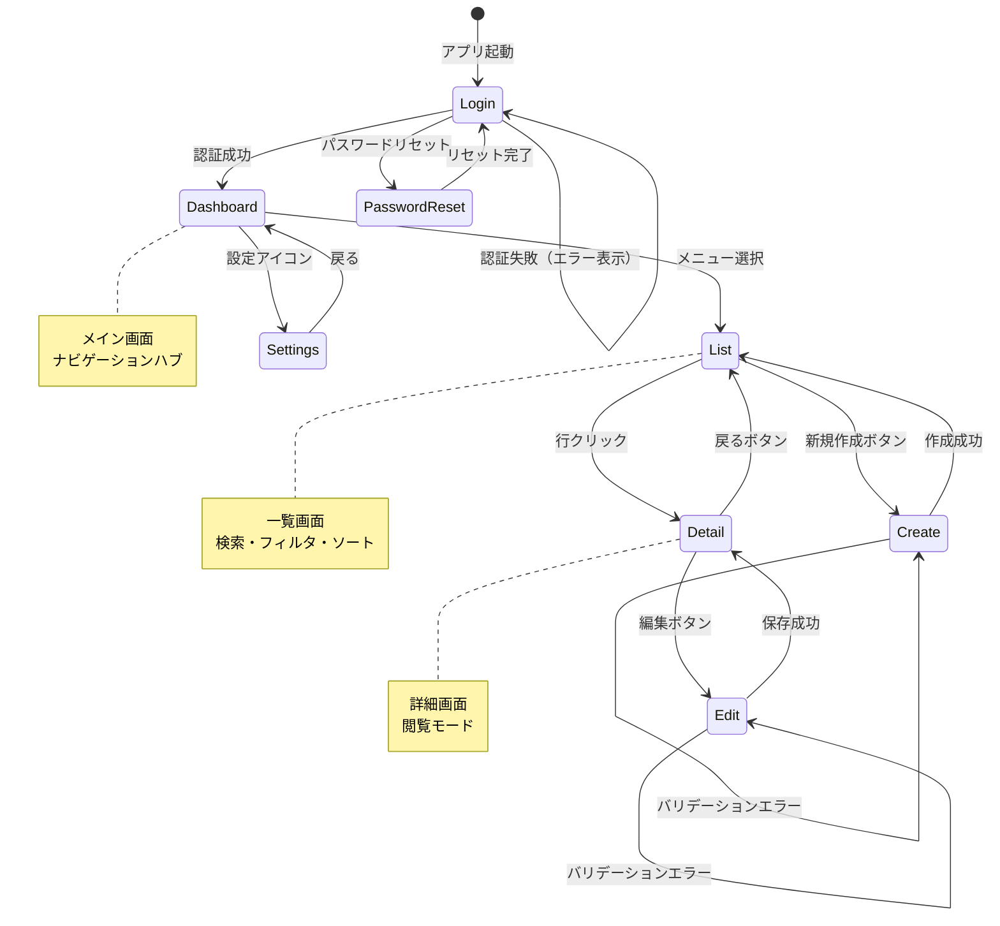

# 03_Story-Workshop

## User Stories

### US-D001: Design Token によるビジュアル定義

**As a** QFAI ユーザー（対象プロジェクトの開発者）
**I want to** Design Token YAML で色・タイポグラフィ・スペーシング等のビジュアル属性を一元管理できる
**So that** UI の見た目に関する仕様が明確に定義され、実装時の認識齟齬がなくなる

### US-D002: HTML+CSS Visual Mock による画面定義

**As a** QFAI ユーザー
**I want to** discussion-pack/spec-pack 内に HTML+CSS のインラインモックを記述できる
**So that** 画面の具体的な見た目を人間が直接確認でき、prototyping skill が正確に実装できる

### US-D003: Mermaid による画面遷移定義

**As a** QFAI ユーザー
**I want to** Mermaid 図で画面遷移・ナビゲーション・条件分岐を記述できる
**So that** アプリケーション全体の導線を俯瞰でき、UX の一貫性をレビューできる

### US-D004: UI/UX ベストプラクティス・アンチパターン体系

**As a** QFAI ユーザー
**I want to** UI/UX のベストプラクティスとアンチパターンが体系化されたレビュー基準を持てる
**So that** prototyping/実装のレビュー時にアンチパターンを検出し、品質を担保できる

### US-D005: 自動+手動ハイブリッドレビュー

**As a** QFAI ユーザー
**I want to** `qfai validate` で自動チェック可能な項目と、ui-ux-reviewer が手動チェックする項目が明確に分離されている
**So that** 効率的かつ網羅的な UI/UX 品質チェックが実行できる

### US-D006: プラットフォーム適応型定義

**As a** QFAI ユーザー
**I want to** 対象プロジェクトのプラットフォーム（Web/Windows/Mobile）に応じて UI/UX 定義とレビュー基準が適応される
**So that** プラットフォーム固有のベストプラクティスとアンチパターンが適切に適用される

### US-D007: 下流 skill の UI 定義消費プロトコル

**As a** QFAI skill 開発者
**I want to** discussion/spec の UI 定義（Design Token + HTML mock + Mermaid flow + UI Contract）を下流 skill が正確に読み取り解釈するプロトコルが定義されている
**So that** prototyping/ATDD/TDD skill が UI 仕様通りに実装・テストを生成できる

### US-D008: UI/UX 調査の都度実行

**As a** QFAI ユーザー
**I want to** 新しいプロジェクトやプラットフォームに取り組む際に、最新の UI/UX ベストプラクティスを都度調査・更新できる
**So that** 時代遅れのルールに縛られず、最新の基準でレビューできる

## User Flow: UI/UX 定義ライフサイクル



## Screen Flow: 画面遷移パターンの定義例



## HTML+CSS Visual Mock: 一覧画面の例

以下は対象プロジェクトの典型的な一覧画面のビジュアルモック。Design Token を参照したスタイリング。

<!-- Screen Mock: List View (Desktop) -->
<div style="font-family: var(--font-sans, 'Inter', system-ui, sans-serif); max-width: 1024px; margin: 0 auto; background: var(--color-bg-primary, #ffffff); border: 1px solid var(--color-border-default, #e5e7eb); border-radius: var(--radius-lg, 8px); overflow: hidden;">

  <!-- Header -->
  <header style="display: flex; justify-content: space-between; align-items: center; padding: var(--spacing-4, 16px) var(--spacing-6, 24px); border-bottom: 1px solid var(--color-border-default, #e5e7eb);">
    <h1 style="font-size: var(--font-size-xl, 20px); font-weight: var(--font-weight-semibold, 600); color: var(--color-text-primary, #111827); margin: 0;">Orders</h1>
    <button style="background: var(--color-primary, #2563eb); color: var(--color-text-on-primary, #ffffff); padding: var(--spacing-2, 8px) var(--spacing-4, 16px); border-radius: var(--radius-md, 6px); border: none; font-size: var(--font-size-sm, 14px); font-weight: var(--font-weight-medium, 500); cursor: pointer;">+ New Order</button>
  </header>

  <!-- Search & Filter Row -->
  <div style="display: flex; gap: var(--spacing-3, 12px); padding: var(--spacing-3, 12px) var(--spacing-6, 24px); border-bottom: 1px solid var(--color-border-subtle, #f3f4f6);">
    <input style="flex-grow: 1; padding: var(--spacing-2, 8px) var(--spacing-3, 12px); border: 1px solid var(--color-border-default, #d1d5db); border-radius: var(--radius-md, 6px); font-size: var(--font-size-sm, 14px);" placeholder="Search orders..." />
    <button style="padding: var(--spacing-2, 8px) var(--spacing-3, 12px); border: 1px solid var(--color-border-default, #d1d5db); border-radius: var(--radius-md, 6px); background: var(--color-bg-primary, #ffffff); font-size: var(--font-size-sm, 14px); cursor: pointer;">Filter</button>
  </div>

  <!-- Table -->
  <table style="width: 100%; border-collapse: collapse;">
    <thead>
      <tr style="background: var(--color-bg-secondary, #f9fafb);">
        <th style="text-align: left; padding: var(--spacing-3, 12px) var(--spacing-6, 24px); font-size: var(--font-size-xs, 12px); font-weight: var(--font-weight-medium, 500); color: var(--color-text-secondary, #6b7280); text-transform: uppercase; letter-spacing: 0.05em;">Order ID</th>
        <th style="text-align: left; padding: var(--spacing-3, 12px); font-size: var(--font-size-xs, 12px); font-weight: var(--font-weight-medium, 500); color: var(--color-text-secondary, #6b7280); text-transform: uppercase; letter-spacing: 0.05em;">Customer</th>
        <th style="text-align: left; padding: var(--spacing-3, 12px); font-size: var(--font-size-xs, 12px); font-weight: var(--font-weight-medium, 500); color: var(--color-text-secondary, #6b7280); text-transform: uppercase; letter-spacing: 0.05em;">Status</th>
        <th style="text-align: right; padding: var(--spacing-3, 12px) var(--spacing-6, 24px); font-size: var(--font-size-xs, 12px); font-weight: var(--font-weight-medium, 500); color: var(--color-text-secondary, #6b7280); text-transform: uppercase; letter-spacing: 0.05em;">Amount</th>
      </tr>
    </thead>
    <tbody>
      <tr style="border-bottom: 1px solid var(--color-border-subtle, #f3f4f6); cursor: pointer;">
        <td style="padding: var(--spacing-3, 12px) var(--spacing-6, 24px); font-size: var(--font-size-sm, 14px); color: var(--color-primary, #2563eb); font-weight: var(--font-weight-medium, 500);">ORD-001</td>
        <td style="padding: var(--spacing-3, 12px); font-size: var(--font-size-sm, 14px); color: var(--color-text-primary, #111827);">Acme Corp</td>
        <td style="padding: var(--spacing-3, 12px);"><span style="display: inline-block; padding: 2px 8px; border-radius: 9999px; font-size: var(--font-size-xs, 12px); font-weight: var(--font-weight-medium, 500); background: var(--color-success-bg, #d1fae5); color: var(--color-success-text, #065f46);">Completed</span></td>
        <td style="padding: var(--spacing-3, 12px) var(--spacing-6, 24px); text-align: right; font-size: var(--font-size-sm, 14px); color: var(--color-text-primary, #111827);">¥125,000</td>
      </tr>
      <tr style="border-bottom: 1px solid var(--color-border-subtle, #f3f4f6); cursor: pointer;">
        <td style="padding: var(--spacing-3, 12px) var(--spacing-6, 24px); font-size: var(--font-size-sm, 14px); color: var(--color-primary, #2563eb); font-weight: var(--font-weight-medium, 500);">ORD-002</td>
        <td style="padding: var(--spacing-3, 12px); font-size: var(--font-size-sm, 14px); color: var(--color-text-primary, #111827);">Beta Industries</td>
        <td style="padding: var(--spacing-3, 12px);"><span style="display: inline-block; padding: 2px 8px; border-radius: 9999px; font-size: var(--font-size-xs, 12px); font-weight: var(--font-weight-medium, 500); background: var(--color-warning-bg, #fef3c7); color: var(--color-warning-text, #92400e);">Pending</span></td>
        <td style="padding: var(--spacing-3, 12px) var(--spacing-6, 24px); text-align: right; font-size: var(--font-size-sm, 14px); color: var(--color-text-primary, #111827);">¥89,500</td>
      </tr>
      <tr style="cursor: pointer;">
        <td style="padding: var(--spacing-3, 12px) var(--spacing-6, 24px); font-size: var(--font-size-sm, 14px); color: var(--color-primary, #2563eb); font-weight: var(--font-weight-medium, 500);">ORD-003</td>
        <td style="padding: var(--spacing-3, 12px); font-size: var(--font-size-sm, 14px); color: var(--color-text-primary, #111827);">Gamma LLC</td>
        <td style="padding: var(--spacing-3, 12px);"><span style="display: inline-block; padding: 2px 8px; border-radius: 9999px; font-size: var(--font-size-xs, 12px); font-weight: var(--font-weight-medium, 500); background: var(--color-error-bg, #fee2e2); color: var(--color-error-text, #991b1b);">Cancelled</span></td>
        <td style="padding: var(--spacing-3, 12px) var(--spacing-6, 24px); text-align: right; font-size: var(--font-size-sm, 14px); color: var(--color-text-primary, #111827);">¥45,200</td>
      </tr>
    </tbody>
  </table>

  <!-- Pagination -->
  <div style="display: flex; justify-content: space-between; align-items: center; padding: var(--spacing-3, 12px) var(--spacing-6, 24px); border-top: 1px solid var(--color-border-default, #e5e7eb); background: var(--color-bg-secondary, #f9fafb);">
    <span style="font-size: var(--font-size-sm, 14px); color: var(--color-text-secondary, #6b7280);">Showing 1-3 of 24 results</span>
    <div style="display: flex; gap: var(--spacing-1, 4px);">
      <button style="padding: var(--spacing-1, 4px) var(--spacing-2, 8px); border: 1px solid var(--color-border-default, #d1d5db); border-radius: var(--radius-md, 6px); background: var(--color-bg-primary, #ffffff); font-size: var(--font-size-sm, 14px); cursor: pointer;">← Prev</button>
      <button style="padding: var(--spacing-1, 4px) var(--spacing-2, 8px); border: 1px solid var(--color-primary, #2563eb); border-radius: var(--radius-md, 6px); background: var(--color-primary, #2563eb); color: var(--color-text-on-primary, #ffffff); font-size: var(--font-size-sm, 14px); cursor: pointer;">1</button>
      <button style="padding: var(--spacing-1, 4px) var(--spacing-2, 8px); border: 1px solid var(--color-border-default, #d1d5db); border-radius: var(--radius-md, 6px); background: var(--color-bg-primary, #ffffff); font-size: var(--font-size-sm, 14px); cursor: pointer;">2</button>
      <button style="padding: var(--spacing-1, 4px) var(--spacing-2, 8px); border: 1px solid var(--color-border-default, #d1d5db); border-radius: var(--radius-md, 6px); background: var(--color-bg-primary, #ffffff); font-size: var(--font-size-sm, 14px); cursor: pointer;">Next →</button>
    </div>
  </div>
</div>

## HTML+CSS Visual Mock: フォーム画面の例

<!-- Screen Mock: Create/Edit Form -->
<div style="font-family: var(--font-sans, 'Inter', system-ui, sans-serif); max-width: 640px; margin: 0 auto; background: var(--color-bg-primary, #ffffff); border: 1px solid var(--color-border-default, #e5e7eb); border-radius: var(--radius-lg, 8px); overflow: hidden;">

  <!-- Header -->
  <header style="display: flex; justify-content: space-between; align-items: center; padding: var(--spacing-4, 16px) var(--spacing-6, 24px); border-bottom: 1px solid var(--color-border-default, #e5e7eb);">
    <h1 style="font-size: var(--font-size-xl, 20px); font-weight: var(--font-weight-semibold, 600); color: var(--color-text-primary, #111827); margin: 0;">New Order</h1>
    <button style="background: none; border: none; font-size: var(--font-size-lg, 18px); color: var(--color-text-secondary, #6b7280); cursor: pointer;">✕</button>
  </header>

  <!-- Form Body -->
  <div style="padding: var(--spacing-6, 24px);">
    <!-- Customer Field -->
    <div style="margin-bottom: var(--spacing-5, 20px);">
      <label style="display: block; font-size: var(--font-size-sm, 14px); font-weight: var(--font-weight-medium, 500); color: var(--color-text-primary, #111827); margin-bottom: var(--spacing-1, 4px);">Customer <span style="color: var(--color-error-text, #dc2626);">*</span></label>
      <input style="width: 100%; padding: var(--spacing-2, 8px) var(--spacing-3, 12px); border: 1px solid var(--color-border-default, #d1d5db); border-radius: var(--radius-md, 6px); font-size: var(--font-size-sm, 14px); box-sizing: border-box;" placeholder="Select or type customer name..." />
    </div>

    <!-- Amount Field with Error -->
    <div style="margin-bottom: var(--spacing-5, 20px);">
      <label style="display: block; font-size: var(--font-size-sm, 14px); font-weight: var(--font-weight-medium, 500); color: var(--color-text-primary, #111827); margin-bottom: var(--spacing-1, 4px);">Amount <span style="color: var(--color-error-text, #dc2626);">*</span></label>
      <input style="width: 100%; padding: var(--spacing-2, 8px) var(--spacing-3, 12px); border: 2px solid var(--color-error-border, #dc2626); border-radius: var(--radius-md, 6px); font-size: var(--font-size-sm, 14px); box-sizing: border-box;" value="abc" />
      <p style="margin: var(--spacing-1, 4px) 0 0 0; font-size: var(--font-size-xs, 12px); color: var(--color-error-text, #dc2626);">Please enter a valid number.</p>
    </div>

    <!-- Status Field -->
    <div style="margin-bottom: var(--spacing-5, 20px);">
      <label style="display: block; font-size: var(--font-size-sm, 14px); font-weight: var(--font-weight-medium, 500); color: var(--color-text-primary, #111827); margin-bottom: var(--spacing-1, 4px);">Status</label>
      <select style="width: 100%; padding: var(--spacing-2, 8px) var(--spacing-3, 12px); border: 1px solid var(--color-border-default, #d1d5db); border-radius: var(--radius-md, 6px); font-size: var(--font-size-sm, 14px); background: var(--color-bg-primary, #ffffff); box-sizing: border-box;">
        <option>Draft</option>
        <option>Pending</option>
        <option>Confirmed</option>
      </select>
    </div>

    <!-- Notes Field -->
    <div style="margin-bottom: var(--spacing-6, 24px);">
      <label style="display: block; font-size: var(--font-size-sm, 14px); font-weight: var(--font-weight-medium, 500); color: var(--color-text-primary, #111827); margin-bottom: var(--spacing-1, 4px);">Notes</label>
      <textarea style="width: 100%; padding: var(--spacing-2, 8px) var(--spacing-3, 12px); border: 1px solid var(--color-border-default, #d1d5db); border-radius: var(--radius-md, 6px); font-size: var(--font-size-sm, 14px); min-height: 80px; resize: vertical; box-sizing: border-box;" placeholder="Optional notes..."></textarea>
    </div>
  </div>

  <!-- Footer Actions -->
  <div style="display: flex; justify-content: flex-end; gap: var(--spacing-3, 12px); padding: var(--spacing-4, 16px) var(--spacing-6, 24px); border-top: 1px solid var(--color-border-default, #e5e7eb); background: var(--color-bg-secondary, #f9fafb);">
    <button style="padding: var(--spacing-2, 8px) var(--spacing-4, 16px); border: 1px solid var(--color-border-default, #d1d5db); border-radius: var(--radius-md, 6px); background: var(--color-bg-primary, #ffffff); font-size: var(--font-size-sm, 14px); cursor: pointer;">Cancel</button>
    <button style="padding: var(--spacing-2, 8px) var(--spacing-4, 16px); border: none; border-radius: var(--radius-md, 6px); background: var(--color-primary, #2563eb); color: var(--color-text-on-primary, #ffffff); font-size: var(--font-size-sm, 14px); font-weight: var(--font-weight-medium, 500); cursor: pointer;">Create Order</button>
  </div>
</div>

## HTML+CSS Visual Mock: エラー・空状態の例

<!-- Screen Mock: Empty State -->
<div style="font-family: var(--font-sans, 'Inter', system-ui, sans-serif); max-width: 640px; margin: 0 auto; padding: var(--spacing-12, 48px) var(--spacing-6, 24px); text-align: center; background: var(--color-bg-primary, #ffffff); border: 1px solid var(--color-border-default, #e5e7eb); border-radius: var(--radius-lg, 8px);">
  <div style="font-size: 48px; margin-bottom: var(--spacing-4, 16px);">📋</div>
  <h2 style="font-size: var(--font-size-lg, 18px); font-weight: var(--font-weight-semibold, 600); color: var(--color-text-primary, #111827); margin: 0 0 var(--spacing-2, 8px) 0;">No orders yet</h2>
  <p style="font-size: var(--font-size-sm, 14px); color: var(--color-text-secondary, #6b7280); margin: 0 0 var(--spacing-6, 24px) 0;">Create your first order to get started.</p>
  <button style="background: var(--color-primary, #2563eb); color: var(--color-text-on-primary, #ffffff); padding: var(--spacing-2, 8px) var(--spacing-4, 16px); border-radius: var(--radius-md, 6px); border: none; font-size: var(--font-size-sm, 14px); font-weight: var(--font-weight-medium, 500); cursor: pointer;">+ Create Order</button>
</div>

## Design Token YAML 構造例

以下は Design Token YAML の構造定義例。W3C DTCG 仕様に準拠した形式。

```yaml
# design-tokens.yaml
# W3C Design Tokens Community Group compatible format
version: "1.0"
platform: web  # web | windows | mobile-ios | mobile-android

primitive:
  color:
    blue:
      50: { value: "#eff6ff", type: "color" }
      100: { value: "#dbeafe", type: "color" }
      500: { value: "#3b82f6", type: "color" }
      600: { value: "#2563eb", type: "color" }
      700: { value: "#1d4ed8", type: "color" }
    gray:
      50: { value: "#f9fafb", type: "color" }
      100: { value: "#f3f4f6", type: "color" }
      200: { value: "#e5e7eb", type: "color" }
      300: { value: "#d1d5db", type: "color" }
      500: { value: "#6b7280", type: "color" }
      700: { value: "#374151", type: "color" }
      900: { value: "#111827", type: "color" }
    green:
      50: { value: "#d1fae5", type: "color" }
      800: { value: "#065f46", type: "color" }
    yellow:
      50: { value: "#fef3c7", type: "color" }
      800: { value: "#92400e", type: "color" }
    red:
      50: { value: "#fee2e2", type: "color" }
      600: { value: "#dc2626", type: "color" }
      800: { value: "#991b1b", type: "color" }
  spacing:
    1: { value: "4px", type: "dimension" }
    2: { value: "8px", type: "dimension" }
    3: { value: "12px", type: "dimension" }
    4: { value: "16px", type: "dimension" }
    5: { value: "20px", type: "dimension" }
    6: { value: "24px", type: "dimension" }
    8: { value: "32px", type: "dimension" }
    12: { value: "48px", type: "dimension" }
  font:
    family:
      sans: { value: "'Inter', system-ui, sans-serif", type: "fontFamily" }
      mono: { value: "'JetBrains Mono', monospace", type: "fontFamily" }
    size:
      xs: { value: "12px", type: "dimension" }
      sm: { value: "14px", type: "dimension" }
      base: { value: "16px", type: "dimension" }
      lg: { value: "18px", type: "dimension" }
      xl: { value: "20px", type: "dimension" }
      2xl: { value: "24px", type: "dimension" }
    weight:
      normal: { value: "400", type: "fontWeight" }
      medium: { value: "500", type: "fontWeight" }
      semibold: { value: "600", type: "fontWeight" }
      bold: { value: "700", type: "fontWeight" }
  radius:
    sm: { value: "4px", type: "dimension" }
    md: { value: "6px", type: "dimension" }
    lg: { value: "8px", type: "dimension" }
    full: { value: "9999px", type: "dimension" }

semantic:
  color:
    primary: { value: "{primitive.color.blue.600}", type: "color" }
    bg-primary: { value: "{primitive.color.gray.50}", type: "color" }
    bg-secondary: { value: "{primitive.color.gray.100}", type: "color" }
    text-primary: { value: "{primitive.color.gray.900}", type: "color" }
    text-secondary: { value: "{primitive.color.gray.500}", type: "color" }
    text-on-primary: { value: "#ffffff", type: "color" }
    border-default: { value: "{primitive.color.gray.200}", type: "color" }
    border-subtle: { value: "{primitive.color.gray.100}", type: "color" }
    success-bg: { value: "{primitive.color.green.50}", type: "color" }
    success-text: { value: "{primitive.color.green.800}", type: "color" }
    warning-bg: { value: "{primitive.color.yellow.50}", type: "color" }
    warning-text: { value: "{primitive.color.yellow.800}", type: "color" }
    error-bg: { value: "{primitive.color.red.50}", type: "color" }
    error-text: { value: "{primitive.color.red.800}", type: "color" }
    error-border: { value: "{primitive.color.red.600}", type: "color" }
```

## Example Seeds

### US-D001: Design Token によるビジュアル定義

| Perspective | Example Seed | Notes |
|------------|-------------|-------|
| Happy path | Design Token YAML を定義し、HTML mock が正しく参照する | primitive → semantic 参照解決 |
| Negative path | 未定義の Token を参照した場合にエラーを検出する | `{primitive.color.purple.500}` が未定義 |
| Edge / boundary | Token 値が空文字列またはnullの場合 | バリデーションルール必要 |
| Permission / role | Token ファイルの編集権限（誰が変更可能か） | discussion 段階では N/A、SDD で検討 |
| State transition | Token の値を変更した場合の影響範囲検出 | 依存解析が必要 |
| Idempotency / retry | 同じ Token YAML を2回読み込んでも結果が同じ | 読み込みの冪等性 |
| Concurrency | 2人が同時に同じ Design Token YAML を編集し保存した場合のコンフリクト検出 | 同時編集時の競合検知 |
| Data volume | Token 定義が 1000 件超の場合のパース性能と可読性 | 大規模 Token ファイルの性能 |
| Security | Design Token の値に `<script>` タグが含まれる場合の sanitization | XSS 防止 |
| Backward compat | Token YAML のスキーマバージョンアップ時の既存ファイルマイグレーション | スキーマ移行 |
| Error recovery | Token YAML が構文不正（インデント崩れ）の場合のエラーメッセージ品質 | ユーザーフレンドリーなエラー |

### US-D002: HTML+CSS Visual Mock による画面定義

| Perspective | Example Seed | Notes |
|------------|-------------|-------|
| Happy path | HTML mock をブラウザで開き、設計通りの表示を確認 | Design Token のフォールバック値で直接表示可能 |
| Negative path | HTML 構文エラーがある mock の検出 | バリデーション必要 |
| Edge / boundary | 超長文テキスト、大量データ行でのレイアウト崩れ | overflow 処理の定義 |
| Permission / role | ロールごとに表示が異なる画面の mock | 複数バリアント定義 |
| State transition | ローディング状態、空状態、エラー状態の mock | 各状態の mock を用意 |
| Idempotency / retry | N/A（静的HTML）| — |
| Concurrency | 複数 mock を並行で validate した場合の結果混在防止 | 並行バリデーション分離 |
| Data volume | 1ファイルに 50 画面分の HTML mock が含まれる場合のレンダリング性能 | 大規模 mock の性能 |
| Security | HTML mock 内に悪意ある JavaScript が含まれる場合の検出・無害化 | スクリプト無害化 |
| Backward compat | HTML mock のテンプレートバージョン変更時の既存 mock 互換性 | テンプレート移行 |

### US-D003: Mermaid による画面遷移定義

| Perspective | Example Seed | Notes |
|------------|-------------|-------|
| Happy path | 正常フローで Login → Dashboard → List → Detail と遷移 | 基本ユーザーフロー |
| Negative path | 未認証ユーザーが直接 Detail にアクセスした場合のリダイレクト | 認証ガード |
| Edge / boundary | ブラウザの戻る/進む操作時の状態管理 | 履歴スタック考慮 |
| Permission / role | 管理者のみアクセス可能な画面への遷移 | ロールベース遷移 |
| State transition | オフライン → オンライン復帰時の画面状態 | 接続状態遷移 |
| Idempotency / retry | 同じ遷移を2回連続で実行した場合 | 二重遷移防止 |
| Concurrency | 2人が同時に画面遷移図を変更した場合のマージ整合性 | 同時編集のマージ |
| Data volume | 画面数が 100 超の遷移図の Mermaid レンダリング | 大規模遷移図の性能 |
| Error recovery | Mermaid 構文エラーがある場合のフォールバック表示 | 構文エラー時の代替表示 |

### US-D004: UI/UX ベストプラクティス・アンチパターン体系

| Perspective | Example Seed | Notes |
|------------|-------------|-------|
| Happy path | チェックリストに従いレビューを実行し、問題なく PASS | 標準レビューフロー |
| Negative path | アンチパターンを検出し FAIL を返す | 具体的な修正提案を含む |
| Edge / boundary | ベストプラクティスとアンチパターンが矛盾する場合 | 優先順位ルール必要 |
| Permission / role | レビュアーの役割による観点の違い | ui-ux-reviewer vs frontend-reviewer |
| State transition | N/A | — |
| Idempotency / retry | 同じ成果物を2回レビューしても同じ結果 | レビューの再現性 |
| Data volume | ベストプラクティス DB が 500 ルール超の場合のレビュー実行時間 | 大規模ルールセットの性能 |
| Security | アンチパターン DB のルール定義に YAML injection がある場合 | ルール定義の安全性 |
| Backward compat | ベストプラクティス DB のルール形式変更時の既存ルール互換性 | ルール形式移行 |

### US-D005: 自動+手動ハイブリッドレビュー

| Perspective | Example Seed | Notes |
|------------|-------------|-------|
| Happy path | 自動チェック PASS → 手動レビュー PASS → 完了 | 標準レビューフロー |
| Negative path | 自動チェック FAIL → 修正 → 再チェック | FAIL 時のフィードバック品質 |
| Edge / boundary | 自動チェックと手動レビューの判断が矛盾する場合 | 手動レビューが優先 |
| Permission / role | 自動チェックの範囲 vs 手動レビューの範囲 | 明確な責務分離 |
| State transition | N/A | — |
| Idempotency / retry | N/A | — |
| Error recovery | 自動チェック実行中にタイムアウトした場合の部分結果報告 | タイムアウト時の部分結果 |

### US-D006: プラットフォーム適応型定義

| Perspective | Example Seed | Notes |
|------------|-------------|-------|
| Happy path | Web プロジェクトで Web 固有のベストプラクティスが適用される | プラットフォーム検出 |
| Negative path | 不明なプラットフォームが指定された場合のフォールバック | 共通ルールのみ適用 |
| Edge / boundary | クロスプラットフォーム（Electron 等）の場合 | 複数ルールの合成 |
| Permission / role | N/A | — |
| State transition | プロジェクト途中でプラットフォームが追加された場合 | ルール再評価 |
| Idempotency / retry | N/A | — |
| Error recovery | プラットフォーム固有ルールの読み込み失敗時の共通ルールフォールバック | 読み込み失敗時のフォールバック |

### US-D007: 下流 skill の UI 定義消費プロトコル

| Perspective | Example Seed | Notes |
|------------|-------------|-------|
| Happy path | prototyping skill が Design Token + HTML mock + UI Contract を読み取り正確に実装 | エンドツーエンドフロー |
| Negative path | UI Contract と HTML mock の間に矛盾がある場合のエラー検出 | 整合性チェック |
| Edge / boundary | 一部の定義が欠落している場合（Token のみ、mock なし等） | 段階的定義対応 |
| Permission / role | N/A | — |
| State transition | UI 定義が更新された場合の下流への伝播 | 変更検知 |
| Idempotency / retry | 同じ定義を2回消費しても同じ結果 | 消費の冪等性 |
| Concurrency | 上流 UI 定義が更新中に下流 skill が読み取りを開始した場合 | 読み取り一貫性 |
| Backward compat | UI 定義消費プロトコルのバージョンアップ時の下流 skill 互換性 | プロトコル移行 |

### US-D008: UI/UX 調査の都度実行

| Perspective | Example Seed | Notes |
|------------|-------------|-------|
| Happy path | 新プロジェクト開始時に最新の UI/UX ベストプラクティスを調査・適用 | 調査ワークフロー |
| Negative path | 調査結果が既存ルールと矛盾する場合 | 更新プロトコル |
| Edge / boundary | 調査対象が非常にニッチなプラットフォームの場合 | 情報不足時のフォールバック |
| Permission / role | N/A | — |
| State transition | 調査結果による既存ルールの更新 | バージョニング |
| Idempotency / retry | N/A | — |
| Error recovery | Web 調査が失敗（ネットワーク不通）した場合のキャッシュ利用 | オフライン時のフォールバック |

### US-D009: 専門家サブエージェント体制

**As a** QFAI ユーザー（対象プロジェクトの開発者）
**I want to** UI/UX Expert、Design Expert、Screen Transition Expert、Navigation Expert の 4 専門家サブエージェントが各専門領域で最新リサーチに基づいた定義・提案を行う
**So that** 各専門領域のベストプラクティスに基づいた高品質な UI/UX 定義が実現し、専門的な観点の見落としがなくなる

### US-D010: 統合 UI/UX レビュー

**As a** QFAI ユーザー
**I want to** Integrated UI/UX Reviewer が 4 専門家の成果物を統合的にレビューし、個別評価だけでなくサービス全体の使い勝手の良さを評価する
**So that** 個別最適化の寄せ集めではなく、ユーザー体験として一貫した高品質なサービスが設計される

## Example Seeds (Drift 追加分)

### US-D009: 専門家サブエージェント体制

| Perspective | Example Seed | Notes |
|------------|-------------|-------|
| Happy path | 4 専門家が各自リサーチ→定義を実施し、Orchestrator が統合。各成果物がベストプラクティスに準拠 | 標準ワークフロー |
| Negative path | 専門家のリサーチ結果が相互に矛盾する場合（例: UX Expert は簡素さ推奨、Design Expert はリッチ表現推奨） | 統合レビュアーが調整 |
| Edge / boundary | 対象プラットフォームが非常にニッチで、一部専門家のリサーチが情報不足の場合 | 共通ベストプラクティスにフォールバック |
| Permission / role | 各専門家の責務境界が曖昧な領域（フォーム設計等）での協調 | ゆるやかな分離 + 統合レビュアー |
| State transition | discussion → SDD → prototyping → ATDD のフェーズ遷移時に各専門家の関与範囲が変化 | フェーズごとの活動定義 |
| Idempotency / retry | 同じプロジェクトに対して 2 回リサーチしても同等品質の結果が得られる | リサーチプロトコルの標準化 |
| Concurrency | 4専門家が同時にリサーチ結果を書き込む際のファイルロック | 並行書き込み制御 |
| Data volume | 5専門家が各自 50 件のリサーチ結果を出力した場合の統合負荷 | 大量リサーチ結果の統合 |
| Backward compat | リサーチプロトコル更新時の過去リサーチ結果との互換性 | プロトコル移行 |

### US-D010: 統合 UI/UX レビュー

| Perspective | Example Seed | Notes |
|------------|-------------|-------|
| Happy path | 統合レビュアーが 4 専門家の成果物を統合評価し、サービス全体の UX 一貫性を確認して PASS | 統合レビューフロー |
| Negative path | 個別の専門家成果物は各自 PASS だが、統合すると UX の一貫性に問題がある場合 | 統合レビュアーが FAIL + 具体的修正提案 |
| Edge / boundary | 専門家間の成果物に微妙な不整合がある場合（Design Token の参照と画面遷移の状態表現が噛み合わない等） | 不整合検出と調整プロトコル |
| Permission / role | 統合レビュアーと review-roster の既存レビュアーの評価範囲の違い | 統合レビュアーは 13 番目として review-roster に統合 |
| State transition | 統合レビューで FAIL → 修正 → 再レビューのサイクル | REVISE ループ |
| Idempotency / retry | 同じ成果物を 2 回統合レビューしても同じ結果 | レビュー基準の標準化 |
| Concurrency | 統合レビュー実行中に専門家が成果物を更新した場合 | レビュー中の更新制御 |
| Data volume | レビュー対象が 30 画面分の統合成果物の場合 | 大規模レビューの性能 |
| Error recovery | 統合レビュー中に1専門家の成果物が欠落している場合の部分レビュー | 欠落時の部分レビュー |
