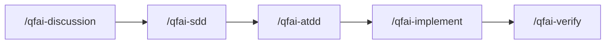
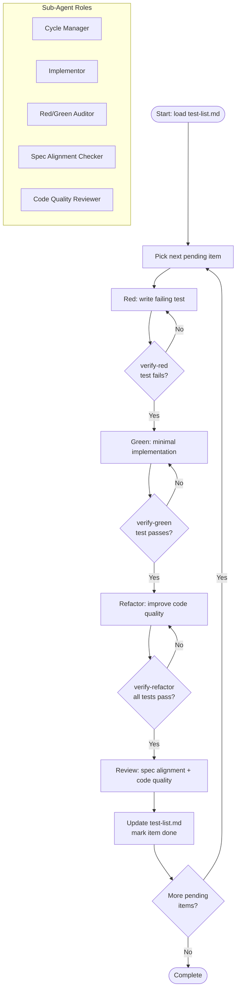

# 02_Inception-Deck

## Q1: Why are we here?

QFAI's implementation phase is currently split across three independent TDD skills (`/qfai-tdd-red`, `/qfai-tdd-green`, `/qfai-tdd-refactor`). This creates a half-migration state where:

1. **Workflow fragmentation** — Users manually juggle three commands per micro-cycle, breaking the natural TDD rhythm.
2. **No execution ledger** — There is no persistent record of which test items have been implemented, leading to skipped or duplicated work.
3. **Wrapper maintenance burden** — Each skill requires its own entry in `.agents`, `.claude`, and `.codex`, tripling synchronization effort.

v1.6.0 eliminates this half-migration state by unifying the implementation entry point into a single `/qfai-implement` skill with a strict TDD micro-cycle embedded and a persistent execution ledger (`test-list.md`).

## Q2: Elevator Pitch

**QFAI v1.6.0** replaces 3 fragmented TDD skills with a single `/qfai-implement` that enforces strict Red-Green-Refactor micro-cycles, one test at a time. It introduces `test-list.md` as an execution ledger, provides a Phase 1 validator for ledger correctness, and purges all orphan references to the abolished skills.

## Q3: Product Box

### Front (Tagline)

- **One Skill, Full Cycle**: A single `/qfai-implement` command drives the entire Red-Green-Refactor loop.
- **Ledger-Driven TDD**: `test-list.md` tracks every test item from pending to done — no item skipped, no item duplicated.
- **Zero Orphans**: All references to the 3 old TDD skills are purged from the codebase and wrappers.

### Back (Key Features)

- Strict TDD micro-cycle enforcement: Red, verify-red, Green, verify-green, Refactor, verify-refactor.
- Persistent execution ledger per spec at `.qfai/specs/spec-XXXX/tdd/test-list.md`.
- Phase 1 structural validator for `test-list.md`.
- Atomic wrapper synchronization across `.agents`, `.claude`, `.codex`.
- Single PR delivery with all old skill references removed.

## Q4: NOT List

| Item | IN / OUT | Reason |
|---|---|---|
| TC coverage hardening | OUT | Deferred beyond v1.6.0; Phase 1 focuses on structural validation only |
| Exception DR-ID hardening | OUT | Requires broader error taxonomy work; not in scope for this release |
| Sub-agent roster formalization | OUT | Internal orchestration roles are defined but formal roster spec is deferred |
| Evidence contract hardening | OUT | Evidence schema tightening is a separate initiative |
| Parallel rule hardening | OUT | Concurrency constraints remain as-is for v1.6.0 |

## Q5: Meet Your Neighbors

| Neighbor | Relationship |
|---|---|
| `/qfai-atdd` | Produces acceptance test specs that `/qfai-implement` consumes as input |
| `/qfai-verify` | Hard gate that validates implementation output after `/qfai-implement` completes |
| `/qfai-sdd` | Produces the spec design that feeds into ATDD and ultimately into implementation |
| Wrappers (`.agents`, `.claude`, `.codex`) | Must be synchronized: old skill entries removed, new `qfai-implement` entry added |
| `test-list.md` | New artifact consumed and updated by `/qfai-implement`; validated by Phase 1 validator |

## Q6: Show the Solution

The architecture replaces the 3 discrete skill invocations with a single `qfai-implement` skill body that contains an internal TDD orchestrator. The orchestrator manages sub-agent roles to enforce the micro-cycle per test item.

### New Skill Flow (Outer)

### Internal TDD Orchestrator (Inside /qfai-implement)

### Sub-Agent Responsibilities

| Sub-Agent | Responsibility |
|---|---|
| Cycle Manager | Orchestrates the micro-cycle loop; picks next item; enforces ordering |
| Implementor | Writes test code (Red) and production code (Green/Refactor) |
| Red/Green Auditor | Verifies that the test fails at Red and passes at Green |
| Spec Alignment Checker | Validates implementation against spec and acceptance criteria |
| Code Quality Reviewer | Reviews refactored code for maintainability, naming, and structure |

## Q7: What Keeps Us Up at Night?

| Risk | Likelihood | Impact | Mitigation |
|---|---|---|---|
| Breaking change: users rely on old skill names | Medium | High | Complete purge of old references; clear migration in changelog |
| Wrapper sync incompleteness | Medium | High | Automated grep-based sweep for orphan references across `.agents`, `.claude`, `.codex` |
| Orphan reference leaks in docs or configs | Medium | Medium | Full-text search for `qfai-tdd-red`, `qfai-tdd-green`, `qfai-tdd-refactor` before merge |
| test-list.md schema drift across specs | Low | Medium | Phase 1 validator enforces structural correctness on every cycle |

## Q8: Size It Up

| Dimension | Estimate |
|---|---|
| Delivery vehicle | Single PR |
| Files changed | ~20 files |
| Complexity | Moderate — new skill body + orchestrator logic + validator + wrapper sync + reference purge |
| New artifacts | `test-list.md` template, Phase 1 validator, `qfai-implement` skill body |
| Removed artifacts | `/qfai-tdd-red`, `/qfai-tdd-green`, `/qfai-tdd-refactor` skill bodies and wrappers |

## Q9: What's Going to Give?

| Dimension | Flexibility |
|---|---|
| **Scope** | Fixed — no hardening beyond Phase 1 (see NOT list) |
| **Timeline** | Flexible — delivery date can slide if quality demands it |
| **Quality** | Non-negotiable — all tests must pass; verify-pack must be green |
| **Budget** | Not a constraint for this release |

> Priority order: Quality > Scope > Timeline. The scope is deliberately constrained to Phase 1 structural validation. No feature creep into hardening territory.

## Q10: What's It Going to Take?

| Resource | Quantity | Notes |
|---|---|---|
| Developer | 1 | Single developer drives implementation |
| Automated test coverage | Full | All new code covered by unit and integration tests |
| verify-pack | Passing | Hard gate: `/qfai-verify` must pass before merge |
| Wrapper sync | Complete | `.agents`, `.claude`, `.codex` all updated atomically |
| Orphan reference sweep | Clean | Zero hits for abolished skill names across the entire repo |
