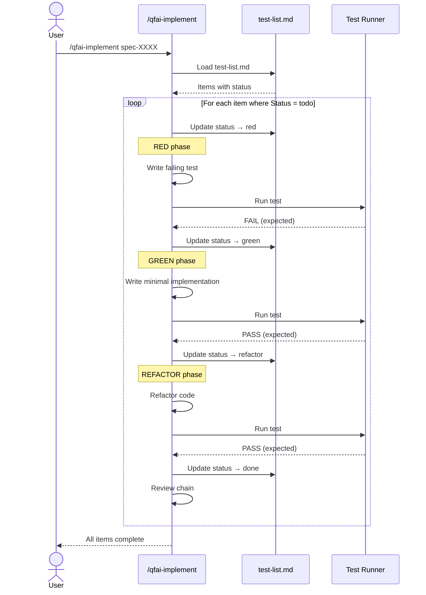

# 03_Story-Workshop

## User Stories

### US-D001: Unified Implementation Entry

**As a** QFAI user
**I want to** run a single `/qfai-implement` command that orchestrates the full TDD micro-cycle (Red/Green/Refactor)
**So that** I don't need to manually invoke separate `/qfai-tdd-red`, `/qfai-tdd-green`, and `/qfai-tdd-refactor` skills

### US-D002: Execution Ledger

**As a** QFAI user
**I want to** have `test-list.md` under `.qfai/specs/spec-XXXX/tdd/test-list.md` that tracks my TDD progress per spec
**So that** I can see which items are done, which are in progress, and what remains to be implemented

### US-D003: Old Skill Removal

**As a** QFAI maintainer
**I want to** completely remove the old `/qfai-tdd-red`, `/qfai-tdd-green`, and `/qfai-tdd-refactor` skills
**So that** there is no confusion about which workflow to use and no dead code remains

### US-D004: Validator Phase 1

**As a** QFAI maintainer
**I want to** validate `test-list.md` for structural integrity (file existence, table existence, required columns, valid status enum, TC ref existence)
**So that** malformed test-list.md files are caught early with clear error codes

### US-D005: Wrapper Synchronization

**As a** QFAI maintainer
**I want to** synchronize all wrapper configurations (`.agents`, `.claude`, `.codex`) to reflect the new skill structure
**So that** every tool entry point consistently references `/qfai-implement` and no longer references abolished skills

## TDD Micro-Cycle: `/qfai-implement` Internal Flow

## Example Seeds

### US-D001: Unified Implementation Entry

| # | Perspective | Example Seed | Follow-up |
|---|-------------|-------------|-----------|
| 1 | Happy path | User runs `/qfai-implement spec-0012` with a valid spec containing 3 TC items in test-list.md. The skill executes 3 full TDD micro-cycles (Red/Green/Refactor) sequentially and reports completion. | — |
| 2 | Negative path | Spec `spec-0012` has a test-list.md with zero active items (all filtered or empty). The skill reports "no items to implement" and exits cleanly without error. | — |
| 3 | Edge / boundary | test-list.md contains exactly 1 item with status `todo`. A single TDD micro-cycle executes and the skill reports done. | — |
| 4 | Permission / role | **Skipped.** QFAI is a CLI tool with no role/permission distinction; all users have identical access. | No follow-up needed. CLI-only tool. |
| 5 | State transition | A test-list item progresses through: `todo` → `red` → `green` → `refactor` → `done`. If the Red phase test unexpectedly passes, the skill halts the item and marks it `exception` with a DR-ID reference. | — |
| 6 | Idempotency / retry | User re-runs `/qfai-implement spec-0012` after a partial run (2 of 3 items done). The skill skips items with status `done` and resumes from the next `todo` item. Running again when all items are `done` produces a "nothing to do" message. | — |

### US-D002: Execution Ledger

| # | Perspective | Example Seed | Follow-up |
|---|-------------|-------------|-----------|
| 1 | Happy path | `test-list.md` is created from the standard template with all required columns: TDD-ID, TC-Refs, Layer, Test file, Selector, Status. Validator confirms PASS. | — |
| 2 | Negative path | `test-list.md` has a missing required column (e.g., `Selector` is absent). Validator returns `TDDLIST_REQUIRED_COLUMN_MISSING` with the column name in the error detail. | — |
| 3 | Edge / boundary | `test-list.md` contains only the header row and no data rows. Validator accepts this as structurally valid but emits a warning that no active items exist. | — |
| 4 | Permission / role | **Skipped.** Same rationale as US-D001: CLI tool, no role distinction. | No follow-up needed. CLI-only tool. |
| 5 | State transition | Status column values follow the lifecycle: `todo` → `red` → `green` → `refactor` → `done`. An item may also transition to `exception` (with a mandatory DR-ID in the Notes column) from any active state. Backward transitions are not permitted. | — |
| 6 | Idempotency / retry | Running the validator twice on an unchanged `test-list.md` produces identical results (same errors or same PASS). No side effects on the file. | — |

### US-D003: Old Skill Removal

| # | Perspective | Example Seed | Follow-up |
|---|-------------|-------------|-----------|
| 1 | Happy path | Directories and source files for `/qfai-tdd-red`, `/qfai-tdd-green`, `/qfai-tdd-refactor` are deleted. No functional references remain in `src/`, wrappers, or skill registry. | — |
| 2 | Negative path | A wrapper file (`.claude/commands/qfai-tdd-red.md`) still references an old skill after migration. The orphan-check process detects it and reports the stale reference. | — |
| 3 | Edge / boundary | The old skill name `qfai-tdd-red` appears in a CHANGELOG entry or code comment. This is acceptable as a non-functional historical reference and should not trigger an orphan-check failure. | — |
| 4 | Permission / role | **Skipped.** Same rationale: CLI tool, no role distinction. | No follow-up needed. CLI-only tool. |
| 5 | State transition | **Skipped.** This is a one-time migration action, not a stateful process. There are no meaningful state transitions to model. | No follow-up needed. One-time migration. |
| 6 | Idempotency / retry | Running the orphan-check twice produces the same results. Running the deletion step on already-deleted skills is a no-op (paths do not exist). | — |

### US-D004: Validator Phase 1

| # | Perspective | Example Seed | Follow-up |
|---|-------------|-------------|-----------|
| 1 | Happy path | A well-formed `test-list.md` with all required columns, valid status values, and existing TC refs passes all checks. Validator returns zero errors. | — |
| 2 | Negative path | (a) File does not exist → `TDDLIST_MISSING`. (b) File exists but contains no Markdown table → `TDDLIST_TABLE_MISSING`. (c) Table lacks `Layer` column → `TDDLIST_REQUIRED_COLUMN_MISSING`. (d) Status value is `wip` (not in enum) → `TDDLIST_INVALID_STATUS`. (e) TC-Refs value `TC-9999` does not match any known TC → `TDDLIST_UNKNOWN_REF`. | — |
| 3 | Edge / boundary | `test-list.md` exists with a valid header row and separator row but zero data rows. Validator passes structural checks (header and columns present) but may emit an informational warning. | — |
| 4 | Permission / role | **Skipped.** Same rationale: CLI tool, no role distinction. | No follow-up needed. CLI-only tool. |
| 5 | State transition | **Skipped.** Validation is a stateless operation. It reads the file and returns results without modifying any state. | No follow-up needed. Stateless validation. |
| 6 | Idempotency / retry | Given the same `test-list.md` content, the validator always returns the same set of error codes and messages. No side effects occur on disk. | — |

### US-D005: Wrapper Synchronization

| # | Perspective | Example Seed | Follow-up |
|---|-------------|-------------|-----------|
| 1 | Happy path | All wrapper files (`.agents/`, `.claude/commands/`, `.codex/`) reference `/qfai-implement`. Old skill entries for `qfai-tdd-red`, `qfai-tdd-green`, `qfai-tdd-refactor` are removed. The assets integration test confirms consistency. | — |
| 2 | Negative path | After migration, a wrapper file still contains a reference to `qfai-tdd-green`. The assets test detects the stale entry and reports the file path and line number. | — |
| 3 | Edge / boundary | A wrapper file for a specific tool (e.g., `.codex/`) does not yet exist. The synchronization process must create it with the correct content including `qfai-implement`. | — |
| 4 | Permission / role | **Skipped.** Same rationale: CLI tool, no role distinction. | No follow-up needed. CLI-only tool. |
| 5 | State transition | **Skipped.** Wrapper synchronization is a one-time migration action with no ongoing state lifecycle. | No follow-up needed. One-time sync. |
| 6 | Idempotency / retry | Re-running the synchronization process on already-synchronized wrappers produces no changes. A diff of the wrapper files before and after re-sync is empty. | — |
