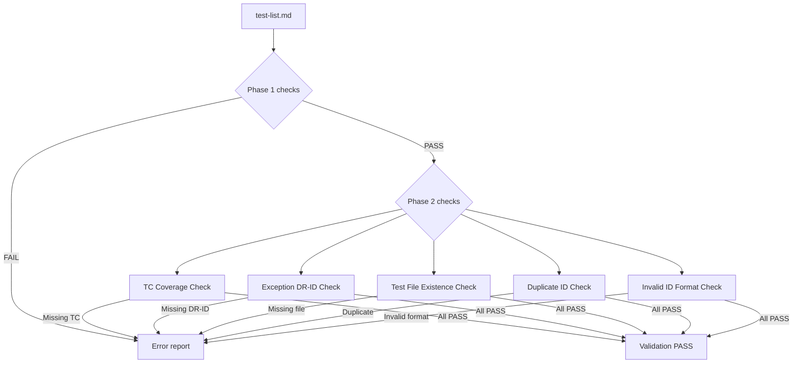

# Inception Deck -- QFAI v1.6.1 Guardrail Hardening

| Item     | Value               |
| -------- | ------------------- |
| Version  | v1.6.1              |
| Codename | Guardrail Hardening |
| Date     | 2026-03-17          |
| Status   | Draft               |

---

## 1. Why Are We Here?

v1.6.0 introduced `test-list.md` as the single ledger for TDD tracking and unified the `qfai-implement` entry point. However, Phase 1 validation only checks structural integrity (required columns, basic parsing). This is **too weak to prevent fraud**: a user can mark items as "done" without a test file, skip TCs entirely, or abuse the "exception" status without accountability. v1.6.1 exists to close these gaps with machine-enforced Phase 2 checks that make coverage gaps, exception abuse, and completion fraud detectable before they reach downstream consumers.

---

## 2. Elevator Pitch

> For **QFAI users** who rely on `test-list.md` as their TDD ledger,
> **QFAI v1.6.1** hardens test-list.md guardrails so that coverage gaps
> and exception abuse are **machine-detected** at validate time --
> unlike v1.6.0, which only checked structural validity.

---

## 3. Product Box

**Front of box:**

> **QFAI v1.6.1: Trust Your Test Ledger**
>
> Machine-enforced coverage. Exception accountability. Completion integrity.

**Back of box -- key features:**

- 7 failure modes for `test-list.md` (F-6101 through F-6107), including 5 new error checks
- Unit/component coverage visualization in the report
- 8 required columns including DR-ID and Evidence
- Updated templates and docs for the new column contract
- Full test coverage: assets tests, init tests, verify-pack updates

---

## 4. NOT List

The following items are explicitly **out of scope** for v1.6.1 and deferred to v1.6.2 or later:

| Item                          | In / Out | Deferred To |
| ----------------------------- | -------- | ----------- |
| Sub-agent roster              | OUT      | v1.6.2+     |
| Evidence contract hardening   | OUT      | v1.6.2+     |
| Selector / orphan checks      | OUT      | v1.6.2+     |
| Watch-it-fail audit           | OUT      | v1.6.2+     |
| Generic spec lint             | OUT      | v1.6.2+     |
| Phase 2 validator checks      | **IN**   | --          |
| Report coverage visualization | **IN**   | --          |
| Template / docs column update | **IN**   | --          |
| Test suite updates            | **IN**   | --          |

---

## 5. Meet Our Neighbors

| Neighbor             | Relationship                                                         |
| -------------------- | -------------------------------------------------------------------- |
| **v1.6.0**           | Foundation -- introduced `test-list.md` and Phase 1 validation       |
| **v1.6.2** (planned) | Next release -- sub-agent roster, evidence hardening                 |
| **CI/CD consumers**  | Downstream systems that consume validator output and reports         |
| **qfai-implement**   | Single entry point unified in v1.6.0; v1.6.1 adds checks it triggers |

---

## 6. Show Your Risks

| #   | Risk                                              | Likelihood | Impact | Mitigation                                                                                     |
| --- | ------------------------------------------------- | ---------- | ------ | ---------------------------------------------------------------------------------------------- |
| 1   | Breaking existing specs with new required columns | High       | Medium | Document migration path; clear error messages pointing to fix                                  |
| 2   | False positives from Layer column parsing         | Medium     | Medium | Only check unit/component layers; ignore others silently                                       |
| 3   | Migration burden for v1.6.0 users                 | High       | Low    | Provide clear upgrade notes; DR-ID and Evidence columns can start empty for non-exception rows |

---

## 7. Size It Up

- **Scope:** The downstream v1.6.1 implementation PR should encompass all release changes in a single PR
- **Components touched:** Downstream implementation PR touches validator, report, docs, templates (`qfai init` assets), tests, verify-pack
- **Estimate:** All implementation changes are synchronized in one coordinated release
- **New error codes:** `TDDLIST_TC_NOT_COVERED`, `TDDLIST_EXCEPTION_MISSING_DR`, `TDDLIST_TEST_FILE_MISSING`, `TDDLIST_DUPLICATE_ID`, `TDDLIST_INVALID_ID`

---

## 8. What Are We Going to Give Up?

| Trade-off                      | Decision                                                                                                                     |
| ------------------------------ | ---------------------------------------------------------------------------------------------------------------------------- |
| Strictness vs backwards-compat | **Strictness wins.** Phase 2 checks emit errors, not warnings. A failing check blocks validation.                            |
| Simplicity vs completeness     | **Simplicity wins.** Selector/orphan checks and evidence contract hardening are deferred to v1.6.2 to keep scope manageable. |
| Coverage breadth vs depth      | **Breadth wins.** Seven documented failure modes are covered at a basic level rather than deeply hardening fewer checks.     |

---

## 9. What's It Going to Take?

v1.6.1 scope is **fixed**. Any scope creep discovered during implementation is deferred to v1.6.2. The boundary is defined by the seven failure modes (F-6101 through F-6107) and their supporting changes to report, templates, docs, and tests.

---

## 10. What Does It Take?

Coordinated changes across the following areas, intended for the downstream v1.6.1 implementation PR:

| Area          | Change Summary                                                                                         |
| ------------- | ------------------------------------------------------------------------------------------------------ |
| **Validator** | Add Phase 2 checks: TC coverage, exception DR-ID, test file existence, duplicate ID, invalid ID format |
| **Report**    | Add unit/component coverage visualization per spec                                                     |
| **Templates** | Update `test-list.md` template to 8 required columns (add DR-ID, Evidence)                             |
| **Docs**      | Update documentation to reflect new columns, error codes, and Phase 2 behavior                         |
| **Tests**     | Assets tests, init tests, verify-pack updates for all new checks                                       |

---

## Validation Pipeline

The following diagram shows how Phase 1 and Phase 2 checks are sequenced:

### Failure Mode Summary

| Code   | Error Code                   | Trigger                                                         |
| ------ | ---------------------------- | --------------------------------------------------------------- |
| F-6101 | TDDLIST_TC_NOT_COVERED       | Unit/component TC in 06_Test-Cases.md missing from test-list.md |
| F-6102 | TDDLIST_EXCEPTION_MISSING_DR | Status=exception without a DR-ID                                |
| F-6103 | TDDLIST_TEST_FILE_MISSING    | Status=done/green/refactor but test file does not exist         |
| F-6104 | _(report gap)_               | Coverage not visible in report output                           |
| F-6105 | _(template mismatch)_        | Docs/templates missing DR-ID or Evidence columns                |
| F-6106 | TDDLIST_DUPLICATE_ID         | Duplicate TDD-ID in a single spec's test-list.md                |
| F-6107 | TDDLIST_INVALID_ID           | TDD-ID does not match the TDD-NNNN pattern                      |
