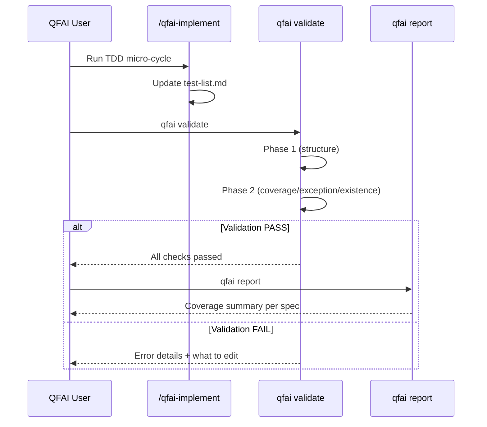

# Story Workshop -- QFAI v1.6.1 Guardrail Hardening

| Item    | Value      |
| ------- | ---------- |
| Version | v1.6.1     |
| Date    | 2026-03-17 |
| Status  | Draft      |

---

## User Stories

| ID      | Story                                                                                                                                                  | Failure Mode |
| ------- | ------------------------------------------------------------------------------------------------------------------------------------------------------ | ------------ |
| US-D001 | As a QFAI user, I want the validator to detect when unit/component TCs are missing from test-list.md, so that I don't accidentally skip required tests | F-6101       |
| US-D002 | As a QFAI user, I want exception status to require a DR-ID, so that exceptions are traceable and accountable                                           | F-6102       |
| US-D003 | As a QFAI user, I want the validator to verify test files exist for completed items, so that completion fraud is impossible                            | F-6103       |
| US-D004 | As a QFAI user, I want duplicate TDD-IDs to be detected, so that the ledger remains unambiguous                                                        | F-6106       |
| US-D005 | As a QFAI user, I want the report to show coverage status per spec, so that I can quickly see what's remaining                                         | F-6104       |
| US-D006 | As a QFAI user, I want the test-list.md template to include DR-ID and Evidence columns, so that the structure matches the validator contract           | F-6105       |
| US-D007 | As a QFAI user, I want TDD-ID format to be validated, so that malformed IDs are caught early                                                           | F-6107       |

---

## User Flow

---

## Example Seeds

### US-D001 -- TC Coverage Check

| #   | Perspective         | Seed                                                                  | Expected                        |
| --- | ------------------- | --------------------------------------------------------------------- | ------------------------------- |
| 1   | Happy path          | All unit/component TCs in `06_Test-Cases.md` appear in `test-list.md` | PASS                            |
| 2   | Negative path       | TC-0003 (unit) exists in `06_Test-Cases.md` but not in `test-list.md` | TDDLIST_TC_NOT_COVERED error    |
| 3   | Edge / boundary     | TC has Layer=integration -- not a unit/component TC                   | Not checked for coverage (skip) |
| 4   | Edge / boundary     | TC appears with status=todo in `test-list.md`                         | Still counts as covered         |
| 5   | Permission / role   | N/A -- CLI tool, no role-based access                                 | --                              |
| 6   | State transition    | TC added to `06_Test-Cases.md` after initial `test-list.md` creation  | Detected on next validate run   |
| 7   | Idempotency / retry | Running validate twice produces same error set                        | Same result                     |

---

### US-D002 -- Exception DR-ID Check

| #   | Perspective         | Seed                                                       | Expected                                     |
| --- | ------------------- | ---------------------------------------------------------- | -------------------------------------------- |
| 1   | Happy path          | Status=exception with DR-ID=DR-0042                        | PASS                                         |
| 2   | Negative path       | Status=exception with empty DR-ID                          | TDDLIST_EXCEPTION_MISSING_DR error           |
| 3   | Edge / boundary     | Status=exception with DR-ID containing only whitespace     | Error (trimmed to empty)                     |
| 4   | Edge / boundary     | Status=todo with empty DR-ID                               | No error (DR-ID only required for exception) |
| 5   | Permission / role   | N/A -- CLI tool, no role-based access                      | --                                           |
| 6   | State transition    | Status changed from todo to exception without adding DR-ID | Caught on validate                           |
| 7   | Idempotency / retry | Same result on repeated runs                               | Same result                                  |

---

### US-D003 -- Test File Existence Check

| #   | Perspective         | Seed                                                            | Expected                                    |
| --- | ------------------- | --------------------------------------------------------------- | ------------------------------------------- |
| 1   | Happy path          | Status=done, Test file=`tests/unit/foo.test.ts` exists on disk  | PASS                                        |
| 2   | Negative path       | Status=green, Test file=`tests/unit/bar.test.ts` does not exist | TDDLIST_TEST_FILE_MISSING error             |
| 3   | Edge / boundary     | Status=todo with non-existent Test file                         | No error (only green/refactor/done checked) |
| 4   | Edge / boundary     | Status=red with non-existent Test file                          | No error                                    |
| 5   | Edge / boundary     | Test file path has backslashes on Windows                       | Normalized to forward slashes for check     |
| 6   | Permission / role   | N/A -- CLI tool, no role-based access                           | --                                          |
| 7   | State transition    | Test file deleted after marking done                            | Caught on next validate                     |
| 8   | Idempotency / retry | Same result on repeated runs                                    | Same result                                 |

---

### US-D004 -- Duplicate ID Check

| #   | Perspective         | Seed                                                                  | Expected                                |
| --- | ------------------- | --------------------------------------------------------------------- | --------------------------------------- |
| 1   | Happy path          | All TDD-IDs are unique                                                | PASS                                    |
| 2   | Negative path       | TDD-0001 appears twice in `test-list.md`                              | TDDLIST_DUPLICATE_ID error              |
| 3   | Edge / boundary     | Single row in `test-list.md`                                          | Always unique                           |
| 4   | Edge / boundary     | Case sensitivity: TDD-0001 vs tdd-0001 -- should these be duplicates? | Case-insensitive comparison recommended |
| 5   | Permission / role   | N/A -- CLI tool, no role-based access                                 | --                                      |
| 6   | State transition    | New row added with existing TDD-ID                                    | Caught on validate                      |
| 7   | Idempotency / retry | Same result on repeated runs                                          | Same result                             |

---

### US-D005 -- Report Coverage Visualization

| #   | Perspective         | Seed                                                        | Expected                                             |
| --- | ------------------- | ----------------------------------------------------------- | ---------------------------------------------------- |
| 1   | Happy path          | Report shows 10/10 unit/component TCs covered, 0 exceptions | Clean summary                                        |
| 2   | Negative path       | Report shows 8/10 covered, lists 2 missing TC refs          | Actionable guidance                                  |
| 3   | Edge / boundary     | Spec has 0 unit/component TCs                               | Report shows "0 unit/component TCs" (no false alarm) |
| 4   | Edge / boundary     | All TCs are exception status                                | Report shows 0 done, N exceptions                    |
| 5   | Permission / role   | N/A -- CLI tool, no role-based access                       | --                                                   |
| 6   | State transition    | After fixing missing TC, re-run report                      | Reflects latest state                                |
| 7   | Idempotency / retry | Same report for same input                                  | Same result                                          |

---

### US-D006 -- Template Update (8 Required Columns)

| #   | Perspective         | Seed                                                                                                                     | Expected                                               |
| --- | ------------------- | ------------------------------------------------------------------------------------------------------------------------ | ------------------------------------------------------ |
| 1   | Happy path          | `qfai init` creates `test-list.md` with 8 columns (TDD-ID, TC-Refs, Layer, Test file, Selector, Status, DR-ID, Evidence) | Validator Phase 2 passes on fresh init                 |
| 2   | Negative path       | Old 6-column template used (missing DR-ID and Evidence)                                                                  | TDDLIST_REQUIRED_COLUMN_MISSING for DR-ID and Evidence |
| 3   | Edge / boundary     | Template has extra columns beyond 8                                                                                      | No error (only required columns checked)               |
| 4   | Permission / role   | N/A -- CLI tool, no role-based access                                                                                    | --                                                     |
| 5   | State transition    | Upgrade from v1.6.0 -- user must add DR-ID and Evidence columns manually                                                 | Validator catches missing columns                      |
| 6   | Idempotency / retry | `qfai init` is idempotent for new projects                                                                               | Same result                                            |

---

### US-D007 -- TDD-ID Format Validation

| #   | Perspective         | Seed                                                        | Expected                        |
| --- | ------------------- | ----------------------------------------------------------- | ------------------------------- |
| 1   | Happy path          | TDD-0001 -- valid `TDD-NNNN` format                         | PASS                            |
| 2   | Negative path       | TDD-ABC -- non-numeric suffix                               | TDDLIST_INVALID_ID error        |
| 3   | Edge / boundary     | TDD-0001-0001 -- sub-ID format; design specifies `TDD-NNNN` | Likely invalid                  |
| 4   | Edge / boundary     | Empty TDD-ID cell                                           | TDDLIST_INVALID_ID error        |
| 5   | Permission / role   | N/A -- CLI tool, no role-based access                       | --                              |
| 6   | State transition    | ID corrected from TDD-ABC to TDD-0001                       | Error resolves on next validate |
| 7   | Idempotency / retry | Same result on repeated runs                                | Same result                     |

---

## Notes

- **No UI requirements.** QFAI is CLI tooling only; no HTML/CSS screen mocks are needed.
- **Target users:** QFAI maintainers and developers using the framework.
- **Scope boundary:** Any story or seed that implies functionality beyond the seven failure modes (F-6101 through F-6107) is deferred to v1.6.2.
