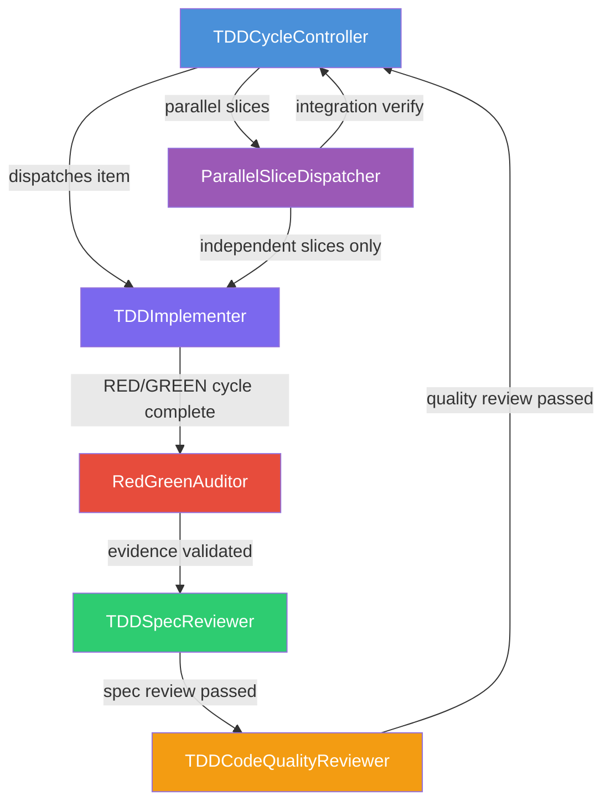

# Inception Deck -- QFAI v1.6.2 Development Toolkit Hardening

| Item     | Value                         |
| -------- | ----------------------------- |
| Version  | v1.6.2                        |
| Codename | Development Toolkit Hardening |
| Date     | 2026-03-20                    |
| Status   | Draft                         |

---

## 1. Why Are We Here?

To make `/qfai-implement` **un-shortcuttable**. v1.6.0 unified the entry point and v1.6.1 hardened the test-list.md ledger, but the orchestration inside the skill remains implicit. Sub-agent responsibilities are informal, completion gates are soft, evidence is thin, parallel dispatch is unconstrained, and docs/wrappers can drift from the canonical skill. v1.6.2 formalizes all of these contracts so that no path through the TDD micro-cycle can bypass watch-it-fail, skip review, produce unauditable evidence, run unsafe parallel slices, or leave stale artifacts behind.

---

## 2. Elevator Pitch

> For **QFAI developers** who depend on strict TDD enforcement,
> **QFAI v1.6.2** hardens the orchestration layer with a formal sub-agent roster,
> completion contracts, evidence contracts, parallel dispatch rules, and synchronized guardrails --
> unlike v1.6.1, which only hardened the test-list.md ledger.

---

## 3. Product Box

**Front of box:**

> **QFAI v1.6.2: Strict TDD with Audit Trail**
>
> Formal sub-agent roster. Un-shortcuttable micro-cycles. Auditable evidence.

**Back of box -- key features:**

- 6 named sub-agents with explicit responsibilities and handoff contracts
- Completion contracts: item completion, spec completion, and completion prohibition conditions
- Evidence contracts: minimum evidence per TDD item with command+result requirements
- Parallel dispatch rules: independent slice only, worktree separation, integration verify
- Required/forbidden phrase guardrails in docs, wrappers, and asset tests
- 5 failure modes addressed: F-6201 through F-6205

---

## 4. NOT List

The following items are explicitly **out of scope** for v1.6.2:

| Item                             | In / Out | Rationale                                                 |
| -------------------------------- | -------- | --------------------------------------------------------- |
| Sub-agent roster formalization   | **IN**   | Core deliverable                                          |
| Completion contract hardening    | **IN**   | Core deliverable                                          |
| Evidence contract hardening      | **IN**   | Core deliverable                                          |
| Parallel dispatch rules          | **IN**   | Core deliverable                                          |
| Docs/wrappers/assets test sync   | **IN**   | Core deliverable                                          |
| Evidence schema versioning       | OUT      | Deferred -- adds migration complexity beyond this scope   |
| qfai upgrade command             | OUT      | Deferred -- separate feature, not a hardening concern     |
| Generic spec-lint                | OUT      | Deferred -- broad scope beyond orchestration hardening    |
| Wrapper framework generalization | OUT      | Deferred -- current wrappers sufficient for v1.6.2        |
| Coverage numerical targets       | OUT      | Deferred -- policy decision independent of this hardening |

---

## 5. Meet Our Neighbors

| Neighbor            | Relationship                                                                         |
| ------------------- | ------------------------------------------------------------------------------------ |
| **v1.6.0**          | Structure -- introduced `/qfai-implement` single entry and `test-list.md` ledger     |
| **v1.6.1**          | Coverage -- hardened test-list.md with Phase 2 validation and coverage visualization |
| **v1.6.2**          | Orchestration -- formalizes sub-agent roster, contracts, and parallel rules          |
| **/qfai-implement** | The canonical skill being hardened; all changes flow through its SKILL.md            |
| **CI/CD consumers** | Downstream systems consuming validation and report output                            |

---

## 6. Show the Solution

The solution is a coordinated hardening of the `/qfai-implement` skill across five dimensions:

1. **Sub-agent roster** -- Six named agents with explicit responsibilities and handoff protocols
2. **Completion contract** -- Machine-enforceable conditions for item and spec completion, plus explicit prohibition conditions
3. **Evidence contract** -- Minimum evidence per TDD item with mandatory command+result pairs
4. **Parallel dispatch rules** -- Independent slice requirement, worktree separation, and post-merge integration verification
5. **Docs/wrappers/assets sync** -- Required and forbidden phrase guardrails enforced by asset tests

### Sub-Agent Orchestration Flow

**Agent responsibilities:**

| Agent                       | Responsibility                                                                          |
| --------------------------- | --------------------------------------------------------------------------------------- |
| **TDDCycleController**      | Orchestrates the overall TDD micro-cycle, selects items, manages completion state       |
| **TDDImplementer**          | Writes failing tests (RED) and implements code to pass (GREEN), performs refactor       |
| **RedGreenAuditor**         | Validates that watch-it-fail and watch-it-pass were genuinely observed                  |
| **TDDSpecReviewer**         | Reviews spec compliance after each item or at spec completion                           |
| **TDDCodeQualityReviewer**  | Reviews code quality, style, and maintainability                                        |
| **ParallelSliceDispatcher** | Validates slice independence, enforces worktree separation, triggers integration verify |

---

## 7. What Keeps Us Up at Night?

| #   | Risk                                                  | Likelihood | Impact | Mitigation                                                               |
| --- | ----------------------------------------------------- | ---------- | ------ | ------------------------------------------------------------------------ |
| 1   | Shortcut paths surviving despite new contracts        | Medium     | High   | Comprehensive negative-path asset tests for each failure mode            |
| 2   | Half-migration state (some files updated, others not) | Medium     | High   | verify-pack checks for required/forbidden phrases across all artifacts   |
| 3   | Parallel dispatch rules too strict for real use       | Low        | Medium | Rules target safety (independence, worktree, integration) not throughput |
| 4   | Evidence contract too verbose for fast iteration      | Low        | Medium | Minimum viable evidence (command+result pair), not exhaustive logging    |

---

## 8. Size It Up

- **Scope:** Single PR delivery encompassing all v1.6.2 changes
- **Files touched:** ~10 files (SKILL.md, wrappers, docs, asset tests, verify-pack)
- **New constructs:** Sub-agent roster table, completion contract section, evidence contract section, parallel dispatch rules section
- **No new CLI commands or validator error codes** -- this is contract hardening within the existing skill

---

## 9. Trade-offs

| Trade-off                        | Decision                                                                                    |
| -------------------------------- | ------------------------------------------------------------------------------------------- |
| Strictness vs flexibility        | **Strictness wins.** Every TDD micro-cycle must pass through all gates; no bypass paths.    |
| Audit trail vs speed             | **Audit trail wins.** Evidence with command+result is mandatory even if it slows the cycle. |
| Formality vs convenience         | **Formality wins.** Named sub-agents with explicit contracts over implicit agent behavior.  |
| Safety vs parallelism throughput | **Safety wins.** Only independent slices may run in parallel; dependent work is sequential. |

---

## 10. What's It Going to Take?

Coordinated changes across the following areas in a single PR:

| Area            | Change Summary                                                                                   |
| --------------- | ------------------------------------------------------------------------------------------------ |
| **SKILL.md**    | Canonical skill update: sub-agent roster, completion contract, evidence contract, parallel rules |
| **Wrappers**    | Wrapper files synchronized with canonical skill changes                                          |
| **Docs**        | Documentation updated to reflect new contracts and sub-agent responsibilities                    |
| **Asset tests** | Required/forbidden phrase guardrails for all five failure modes                                  |
| **verify-pack** | Updated to reject stale references and validate new contract sections                            |
