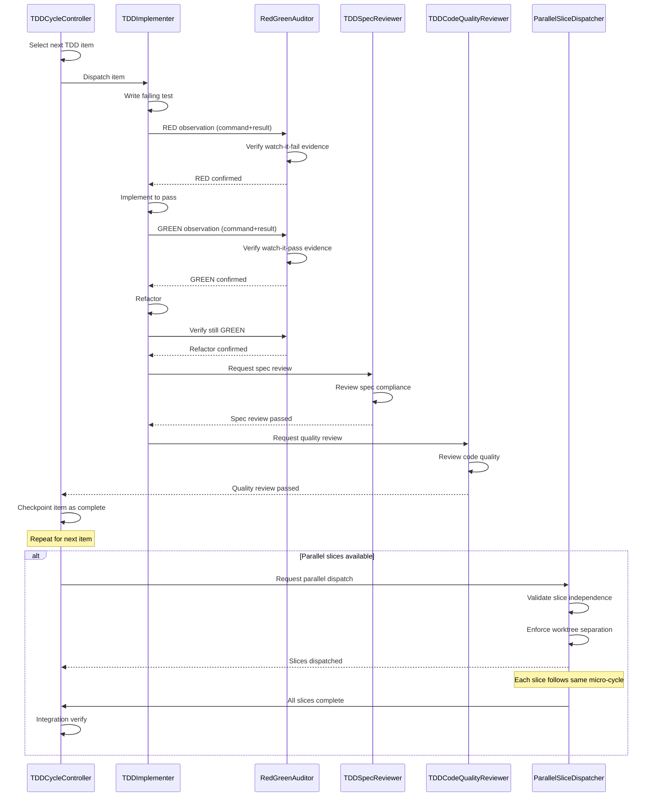

# Story Workshop -- QFAI v1.6.2 Development Toolkit Hardening

| Item    | Value      |
| ------- | ---------- |
| Version | v1.6.2     |
| Date    | 2026-03-20 |
| Status  | Draft      |

---

## User Stories

| ID        | Story                                                                                                                                                        | Failure Mode |
| --------- | ------------------------------------------------------------------------------------------------------------------------------------------------------------ | ------------ |
| US-D-0001 | As a developer using qfai-implement, I want the skill to enforce watch-it-fail/watch-it-pass so that TDD cannot be shortcutted                               | F-6201       |
| US-D-0002 | As a developer, I want independent reviewer gates so that completion requires actual review by TDDSpecReviewer and TDDCodeQualityReviewer                    | F-6202       |
| US-D-0003 | As a developer, I want evidence entries to require command+result pairs so that post-hoc auditing is possible                                                | F-6203       |
| US-D-0004 | As a developer, I want parallel dispatch limited to independent slices with worktree separation and integration verify so that parallel work is safe         | F-6204       |
| US-D-0005 | As a maintainer, I want required/forbidden phrase guardrails in docs, wrappers, and asset tests so that artifacts stay synchronized with the canonical skill | F-6205       |

---

## User Flow

---

## Example Seeds

### US-D-0001 -- TDD Shortcut Prevention (F-6201)

| #   | Perspective         | Seed                                                                                              | Expected                                                         |
| --- | ------------------- | ------------------------------------------------------------------------------------------------- | ---------------------------------------------------------------- |
| 1   | Happy path          | Developer runs micro-cycle: write test -> RED observe (fail) -> implement -> GREEN observe (pass) | Cycle completes; RedGreenAuditor confirms both observations      |
| 2   | Negative path       | Developer skips RED observation and goes straight to implementation                               | RedGreenAuditor blocks progression; item cannot advance to GREEN |
| 3   | Edge / boundary     | Test already passes on first run (no RED state possible)                                          | RedGreenAuditor flags: test must fail before implementation      |
| 4   | Permission / role   | TDDImplementer attempts to self-certify RED/GREEN without RedGreenAuditor                         | Blocked: only RedGreenAuditor can confirm observations           |
| 5   | State transition    | Item transitions from RED -> GREEN without refactor step                                          | Allowed: refactor is optional but GREEN must be verified         |
| 6   | Idempotency / retry | RED observation fails validation; developer re-runs the test and resubmits                        | RedGreenAuditor accepts valid resubmission                       |

---

### US-D-0002 -- Reviewer-Less Completion Prevention (F-6202)

| #   | Perspective         | Seed                                                                     | Expected                                                     |
| --- | ------------------- | ------------------------------------------------------------------------ | ------------------------------------------------------------ |
| 1   | Happy path          | Item passes TDDSpecReviewer and TDDCodeQualityReviewer before completion | Item marked complete                                         |
| 2   | Negative path       | Item marked complete without TDDSpecReviewer sign-off                    | Completion blocked; spec review required                     |
| 3   | Negative path       | Item marked complete without TDDCodeQualityReviewer sign-off             | Completion blocked; quality review required                  |
| 4   | Edge / boundary     | Spec-level completion attempted with 1 item still missing quality review | Spec completion blocked until all items reviewed             |
| 5   | Permission / role   | TDDImplementer attempts to approve its own code quality                  | Blocked: reviewer roles are independent from implementer     |
| 6   | State transition    | Reviewer rejects item; developer fixes and resubmits                     | Item returns to review state; can complete after re-approval |
| 7   | Idempotency / retry | Reviewer approves same item twice                                        | No state change on second approval; already approved         |

---

### US-D-0003 -- Evidence Contract Enforcement (F-6203)

| #   | Perspective         | Seed                                                                          | Expected                                                           |
| --- | ------------------- | ----------------------------------------------------------------------------- | ------------------------------------------------------------------ |
| 1   | Happy path          | Evidence entry contains command (`npm test -- foo.test.ts`) and result output | Evidence accepted; meets minimum contract                          |
| 2   | Negative path       | Evidence entry contains only "PASS" without the command that produced it      | Rejected: command+result pair required                             |
| 3   | Negative path       | Evidence entry is completely empty                                            | Rejected: minimum evidence per TDD item not met                    |
| 4   | Edge / boundary     | Evidence contains command but result is truncated                             | Accepted: result presence is required, completeness is best-effort |
| 5   | Permission / role   | RedGreenAuditor validates evidence format before accepting observation        | Auditor enforces command+result minimum                            |
| 6   | State transition    | Thin evidence submitted first, then replaced with full command+result         | Item can proceed after evidence meets minimum                      |
| 7   | Idempotency / retry | Same evidence resubmitted after validation failure fix                        | Accepted on resubmission if contract is met                        |

---

### US-D-0004 -- Parallel Dispatch Safety (F-6204)

| #   | Perspective         | Seed                                                                                       | Expected                                                     |
| --- | ------------------- | ------------------------------------------------------------------------------------------ | ------------------------------------------------------------ |
| 1   | Happy path          | Two independent slices (no shared files) dispatched in separate worktrees                  | Both run in parallel; integration verify passes after merge  |
| 2   | Negative path       | Two slices share a dependency file; dispatched in parallel                                 | ParallelSliceDispatcher blocks: slices are not independent   |
| 3   | Negative path       | Parallel slices dispatched in the same worktree                                            | Blocked: worktree separation required                        |
| 4   | Edge / boundary     | Single slice submitted for parallel dispatch                                               | Allowed: degenerates to sequential execution                 |
| 5   | Edge / boundary     | Integration verify fails after parallel merge                                              | All slices must be re-examined; merge rolled back            |
| 6   | Permission / role   | TDDImplementer attempts to bypass ParallelSliceDispatcher for parallel work                | Blocked: only ParallelSliceDispatcher can authorize parallel |
| 7   | State transition    | Parallel dispatch completes; integration verify passes; controller resumes sequential flow | Normal state transition back to TDDCycleController           |
| 8   | Idempotency / retry | Integration verify fails; slices re-dispatched after fixing conflicts                      | Fresh dispatch with same independence validation             |

---

### US-D-0005 -- Docs/Wrappers/Tests Synchronization (F-6205)

| #   | Perspective         | Seed                                                                                | Expected                                                        |
| --- | ------------------- | ----------------------------------------------------------------------------------- | --------------------------------------------------------------- |
| 1   | Happy path          | All docs, wrappers, and tests contain required phrases and no forbidden phrases     | Asset tests pass; verify-pack passes                            |
| 2   | Negative path       | Wrapper file contains a phrase from the forbidden list (e.g., stale v1.6.0 wording) | Asset test fails with specific forbidden phrase identified      |
| 3   | Negative path       | Documentation missing a required phrase (e.g., sub-agent roster reference)          | Asset test fails with specific required phrase identified       |
| 4   | Edge / boundary     | Required phrase appears but in a commented-out section                              | Depends on guardrail definition; likely still counts as present |
| 5   | Permission / role   | N/A -- asset tests are automated; no role-based access                              | --                                                              |
| 6   | State transition    | Developer adds missing required phrase; re-runs asset tests                         | Tests pass after correction                                     |
| 7   | Idempotency / retry | Asset tests run twice with same input                                               | Same result                                                     |

---

## Notes

- **No UI requirements.** QFAI is CLI tooling only; no HTML/CSS screen mocks are needed.
- **Target users:** QFAI maintainers and developers using the framework.
- **Scope boundary:** Any story or seed that implies functionality beyond the five failure modes (F-6201 through F-6205) is deferred to v1.6.3 or later.
