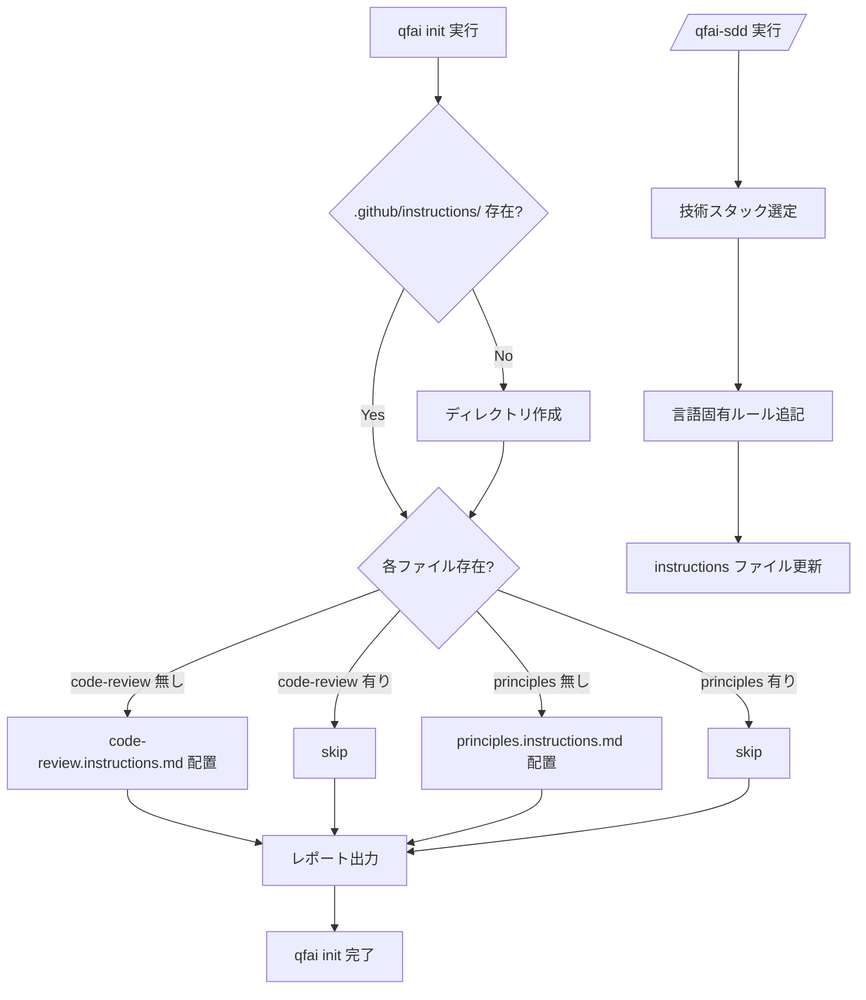

# 02_Inception-Deck

## 1. なぜここにいるのか？

GitHub Copilot のコードレビュー品質を向上させるインストラクション運用を、QFAI パッケージとして標準化・配布するため。

## 2. エレベーターピッチ

**Copilot レビュー品質を気にする QFAI ユーザー** のための、
**qfai init に統合された Copilot レビューインストラクション配布機能** です。
これは **`.github/instructions/` へ汎用コードレビュー指示と設計原則レビュー指示を自動配置** し、
**手動でファイルをコピー＆カスタマイズする手間** とは異なり、
**create-only の安全な配置と SDD フェーズでの言語固有ルール追記** を提供します。

## 3. パッケージデザイン

- `qfai init` 実行時に `.github/instructions/` 配下に2ファイルを配置
- 既存ファイルは一切上書きしない（create-only）
- テンプレートアセットは `packages/qfai/assets/init/.github/instructions/` に格納

## 4. やらないことリスト

| やらないこと                                  | 理由                                   |
| --------------------------------------------- | -------------------------------------- |
| `.github/workflows/copilot-review.yml` の配布 | シークレット依存がありユーザー環境固有 |
| `.github/PULL_REQUEST_TEMPLATE.md` の配布     | プロジェクト固有性が高い               |
| 言語固有チェックの配布                        | SDD フェーズで追記する設計             |
| 既存 instructions の自動マージ                | 複雑性が高く、create-only で十分       |
| `--force` による上書き                        | 既存設定保護が最優先                   |

## 5. ご近所さんを知る

| 関連コンポーネント                     | 影響                           |
| -------------------------------------- | ------------------------------ |
| `init.ts` (syncIntegrationWrappers)    | instructions 配置ロジック追加  |
| init テストスイート (`init.test.ts`)   | 新規テストケース追加           |
| テンプレートアセット (`assets/init/`)  | `.github/instructions/` 追加   |
| `/qfai-sdd` スキル                     | 言語固有ルール追記の仕組み追加 |
| `.github/copilot-instructions.md` 生成 | 既存ロジックへの影響確認       |

## 6. 解決策の概要

## 7. 夜も眠れない問題

- 既存プロジェクトの `.github/instructions/` を壊してしまうリスク → create-only で対応
- 汎用版の品質が言語固有版より低くなるリスク → SDD での追記で補完
- instructions の frontmatter 形式が GitHub 仕様変更で壊れるリスク → 低確率、発生時に対応

## 8. 期間はどのくらい？

v1.6.3 リリースの一部（1スプリント内）

## 9. 何を諦めるのか？

| トレードオフ           | 優先                      |
| ---------------------- | ------------------------- |
| 汎用性 vs 即座の有用性 | 汎用性（SDD で補完）      |
| 安全性 vs 自動更新     | 安全性（create-only）     |
| 機能範囲 vs 速度       | 速度（instructions のみ） |

## 10. 何がどれだけ必要なのか？

- init.ts への配置ロジック追加: 小規模
- テンプレートアセット2ファイル作成: 小規模
- テスト追加: 中規模（create-only、skip、ディレクトリ作成の検証）
- SDD スキル拡張設計: 中規模（別スペック候補）
