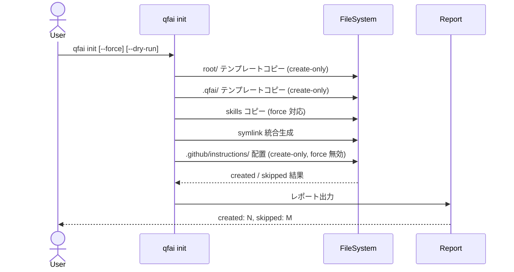

# 03_Story-Workshop

## ユーザーストーリー

### US-01: Copilot レビューインストラクション配置

**As a** QFAI ユーザー
**I want** `qfai init` 実行時に `.github/instructions/code-review.instructions.md` が自動配置される
**So that** GitHub Copilot の PR レビューが構造化された指示に基づいて行われる

### US-02: 設計原則レビューインストラクション配置

**As a** QFAI ユーザー
**I want** `qfai init` 実行時に `.github/instructions/principles.instructions.md` が自動配置される
**So that** Copilot レビューがソフトウェア設計原則に基づく検証を行う

### US-03: 既存 instructions の保護

**As a** 既存プロジェクトの QFAI ユーザー
**I want** `qfai init` が既存の `.github/instructions/` ファイルを上書きしない
**So that** 独自にカスタマイズした instructions が保護される

### US-04: init レポートでの instructions 表示

**As a** QFAI ユーザー
**I want** `qfai init` の実行結果レポートに instructions の created/skipped が表示される
**So that** 何が配置されたか明確に把握できる

## ユーザーフロー

## Example Seeds

### US-01: code-review.instructions.md 配置

| # | Perspective | Example | Seed |
|---|---|---|---|
| 1 | Happy path | 新規リポジトリで `qfai init` → `code-review.instructions.md` が生成される | ファイルが存在しない状態から正常配置 |
| 2 | Negative path | テンプレートアセットが破損/欠損 → エラーメッセージとスキップ | アセットファイル欠損時の挙動 |
| 3 | Edge / boundary | `.github/instructions/` ディレクトリは存在するがファイルはない → ファイルのみ配置 | ディレクトリ存在・ファイル不在 |
| 4 | Permission / role | N/A（CLI ツール、権限モデルなし） | — |
| 5 | State transition | 1回目: created → 2回目: skipped → `--force` でも skipped | 冪等性と force 無効の確認 |
| 6 | Idempotency / retry | `qfai init` を3回連続実行 → 2回目以降すべて skipped | 冪等性保証 |

### US-02: principles.instructions.md 配置

| # | Perspective | Example | Seed |
|---|---|---|---|
| 1 | Happy path | 新規リポジトリで `qfai init` → `principles.instructions.md` が生成される | US-01 と同様のパターン |
| 2 | Negative path | ディスク書き込み権限なし → エラー報告 | 書き込み失敗時のエラーハンドリング |
| 3 | Edge / boundary | `code-review` は既存だが `principles` はない → `principles` のみ配置 | 部分的既存ファイル |
| 4 | Permission / role | N/A | — |
| 5 | State transition | `--dry-run` → created にカウントされるがファイル未生成 | dry-run モード |
| 6 | Idempotency / retry | 同上（US-01 #6 と同一パターン） | — |

### US-03: 既存 instructions 保護

| # | Perspective | Example | Seed |
|---|---|---|---|
| 1 | Happy path | 既存 `code-review.instructions.md` がある状態で init → skip、内容不変 | 既存ファイル保護 |
| 2 | Negative path | N/A（保護はパッシブ動作） | — |
| 3 | Edge / boundary | 空ファイル（0バイト）が存在 → それでも skip | 空ファイルの扱い |
| 4 | Permission / role | N/A | — |
| 5 | State transition | `--force` フラグ付きで init → それでも skip（force 無効） | force が無効であることの確認 |
| 6 | Idempotency / retry | カスタマイズ済みファイル → init 複数回 → カスタマイズ維持 | カスタマイズ保持 |

### US-04: init レポート表示

| # | Perspective | Example | Seed |
|---|---|---|---|
| 1 | Happy path | 新規配置時に `created: 2` が instructions 分に含まれる | レポート正確性 |
| 2 | Negative path | N/A | — |
| 3 | Edge / boundary | 全ファイル既存 → `skipped paths:` に instructions パスが列挙される | skip レポート |
| 4 | Permission / role | N/A | — |
| 5 | State transition | N/A | — |
| 6 | Idempotency / retry | N/A | — |

## スキップした観点の理由

- **Permission / role**: QFAI CLI はローカルファイル操作のみ。認証・権限モデルなし。
- 一部の Negative path / Idempotency: 既存テストスイートで類似パターンがカバー済み（copyTemplateTree のテスト）。
