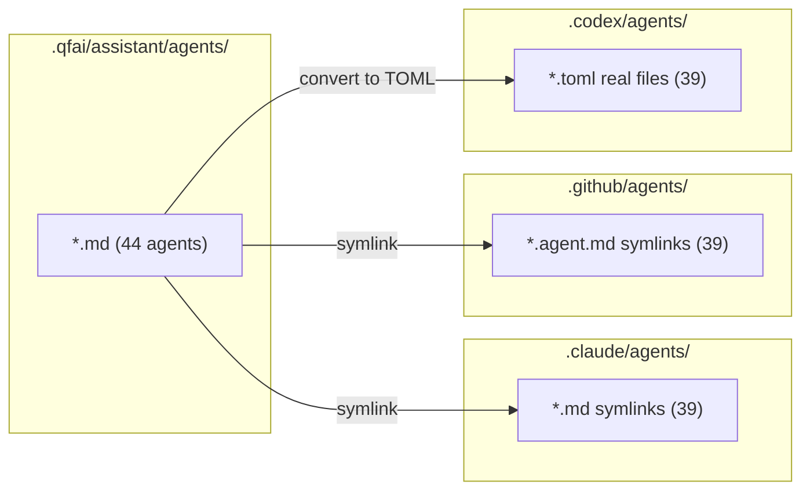

# 02 Inception Deck

## 1. Why Are We Here?

Codex (OpenAI) has officially released sub-agent support. QFAI already provides 39 role-specialized sub-agents for Claude Code and GitHub Copilot, but Codex users currently have no access to these agents. This initiative delivers **platform parity** so that all three AI coding platforms offer the same QFAI agent experience.

## 2. Elevator Pitch

> **For** QFAI users on Codex  
> **Who** need role-specialized AI sub-agents  
> **The** Codex agent TOML pack  
> **Is a** configuration set  
> **That** enables all 39 QFAI agent roles in Codex  
> **Unlike** manual agent setup  
> **Our product** provides pre-configured, role-specialized agents matching Claude Code and Copilot feature parity

## 3. Product Box

### Front of the Box

- **39 role-specialized agents** — architect, engineer, reviewer, QA, and more
- **Role-based sandbox isolation** — review/analysis agents run read-only; implementers get full access
- **Zero-config model inheritance** — agents inherit the model from the parent Codex session

### Back of the Box

- Full parity with Claude Code and GitHub Copilot agent sets
- TOML-native format aligned with Codex platform conventions
- Centralized `config.toml` for global agent behavior defaults

## 4. NOT List

| In Scope                                    | Out of Scope                                        | Unresolved |
| ------------------------------------------- | --------------------------------------------------- | ---------- |
| 39 `.codex/agents/*.toml` files             | 5 extra canonical agents (design-expert, etc.)      |            |
| `.codex/config.toml`                        | `init.ts` auto-generation logic changes             |            |
| sandbox_mode per agent role                 | MCP server configuration                            |            |
| developer_instructions from canonical MD    | Model-specific agent tuning                         |            |
|                                             | AGENTS.md changes                                   |            |

## 5. Meet Your Neighbors



| Direction  | Neighbor                          | Integration Point                                          |
| ---------- | --------------------------------- | ---------------------------------------------------------- |
| Upstream   | Canonical agents (`.qfai/`)      | Source of truth for agent definitions                      |
| Downstream | Codex runtime                     | Reads `.codex/agents/*.toml` at sub-agent invocation time  |
| Sibling    | Claude Code agents (`.claude/`)   | Feature-parity reference                                   |
| Sibling    | GitHub Copilot agents (`.github/`)| Feature-parity reference                                   |

## 6. Show the Solution

### Architecture Overview

```mermaid
flowchart TB
    subgraph Source["Canonical Source"]
        A["44 canonical agents<br/>.qfai/assistant/agents/*.md"]
    end

    subgraph Platforms["Platform Adapters"]
        direction LR
        B["Claude Code<br/>.claude/agents/*.md<br/>(symlinks)"]
        C["GitHub Copilot<br/>.github/agents/*.agent.md<br/>(symlinks)"]
        D["Codex<br/>.codex/agents/*.toml<br/>(real files)"]
    end

    subgraph CodexDetail["Codex TOML Structure"]
        E["name = 'agent-name'"]
        F["description = '...'"]
        G["sandbox_mode = 'read-only'<br/>(reviewers only)"]
        H["developer_instructions = \"\"\"...\"\"\""]
    end

    A -->|symlink| B
    A -->|symlink| C
    A -->|"MD → TOML conversion"| D
    D --> CodexDetail
```

### TOML File Template

```toml
name = "agent-name"
description = "Short description of agent purpose."
sandbox_mode = "read-only"  # only for review/analysis agents
developer_instructions = """
<content from canonical markdown agent file>
"""
```

## 7. What Keeps Us Up at Night?

| Risk                                     | Likelihood | Impact | Mitigation                                              |
| ---------------------------------------- | ---------- | ------ | ------------------------------------------------------- |
| TOML drift from canonical MD             | High       | Medium | Establish update checklist; consider future codegen      |
| Codex sub-agent API changes              | Low        | High   | Pin to current spec; monitor Codex changelog             |
| sandbox_mode misclassification           | Low        | High   | Cross-reference with review-roster.yml                   |
| TOML multi-line string escaping issues   | Medium     | Medium | Validate all 39 files with a TOML parser after creation  |

## 8. Size It Up

| Dimension       | Estimate                                                    |
| --------------- | ----------------------------------------------------------- |
| Files to create | 39 agent TOML files + 1 config.toml = **40 files**         |
| Complexity      | Small-medium — repetitive structure, conversion labor       |
| Duration        | 1–2 implementation sessions                                 |
| Testing         | TOML parse validation + content parity spot-check           |

## 9. What's Going to Give?

Priority order (highest → lowest):

1. **Scope** — All 39 agents must be delivered (non-negotiable)
2. **Quality** — Content parity and correct sandbox_mode classification
3. **Time** — Deliver within current release cycle
4. **Budget** — Minimal resource cost (configuration-only change)

## 10. What's It Going to Take?

| Resource                        | Required | Status      |
| ------------------------------- | -------- | ----------- |
| TOML format knowledge           | Yes      | Available   |
| Codex platform understanding    | Yes      | Available   |
| Canonical agent content access  | Yes      | Available   |
| TOML parser for validation      | Yes      | Available   |
