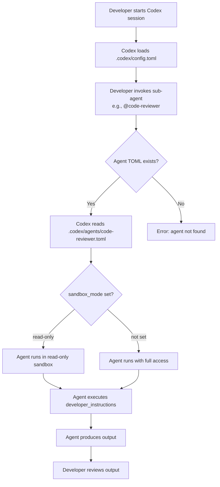
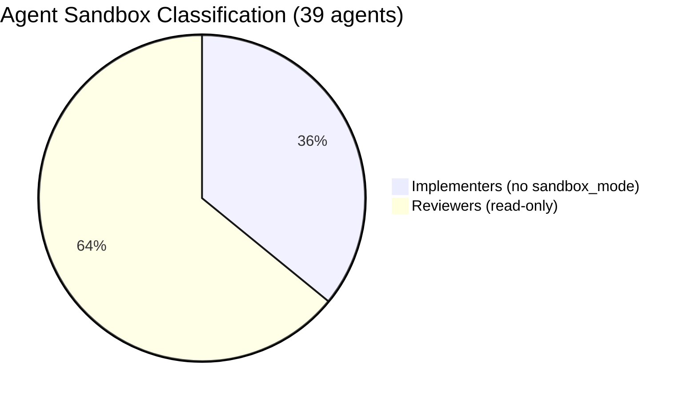

# 03 Story Workshop

> **Note:** This feature is a configuration/infrastructure change, not a UI feature. No HTML mock is required.

## User Stories

### US-001: Codex Sub-Agent Availability

**As a** QFAI developer using Codex,  
**I want** role-specialized sub-agents available in my Codex environment,  
**so that** I can delegate tasks to the same agent roles available in Claude Code and GitHub Copilot.

#### Acceptance Criteria

- AC-001-1: All 39 agent TOML files exist under `.codex/agents/`
- AC-001-2: Each TOML file contains `name`, `description`, and `developer_instructions`
- AC-001-3: `developer_instructions` content is faithful to the canonical `.qfai/assistant/agents/*.md` source
- AC-001-4: Codex runtime can discover and invoke each agent

#### Example Seeds

| Perspective         | Seed                                                                                               |
| ------------------- | -------------------------------------------------------------------------------------------------- |
| Happy path          | User invokes `@architect` in Codex — agent responds with architecture-focused guidance             |
| Negative path       | User invokes a non-existent agent name — Codex returns a clear "agent not found" error             |
| Edge / Boundary     | Agent with very long `developer_instructions` (>10KB) — TOML parses correctly                      |
| Permission / Role   | Implementer agent (e.g., `backend-engineer`) has no sandbox restriction — can read and write files |
| State transition    | Agent is invoked mid-session — inherits parent session's model and context                         |
| Idempotency / Retry | Agent TOML is re-read on each invocation — no stale state between invocations                      |

---

### US-002: Read-Only Sandbox for Review Agents

**As a** QFAI developer using Codex,  
**I want** review/analysis agents to run in read-only sandbox mode,  
**so that** they cannot accidentally modify my codebase.

#### Acceptance Criteria

- AC-002-1: All 25 review/analysis agents have `sandbox_mode = "read-only"` in their TOML
- AC-002-2: All 14 implementer/writer agents do NOT have `sandbox_mode` set (inherit default)
- AC-002-3: Classification matches the role definition in `review-roster.yml`

#### Example Seeds

| Perspective         | Seed                                                                                               |
| ------------------- | -------------------------------------------------------------------------------------------------- |
| Happy path          | `code-reviewer` agent runs in read-only mode — can analyze code but cannot write files             |
| Negative path       | `backend-engineer` agent (implementer) must NOT be restricted — can create/edit files              |
| Edge / Boundary     | Agent whose role is ambiguous (e.g., `coverage-planner`) — classified as implementer per interview |
| Permission / Role   | Read-only agent attempts file write — Codex sandbox blocks the operation                           |
| State transition    | Agent sandbox_mode is set at TOML load time — cannot be changed during agent session               |
| Idempotency / Retry | Re-invoking the same read-only agent produces identical sandbox behavior                           |

---

### US-003: Global Agent Configuration

**As a** QFAI developer using Codex,  
**I want** a `config.toml` that sets sensible defaults for agent concurrency and depth,  
**so that** agent behavior is predictable.

#### Acceptance Criteria

- AC-003-1: `.codex/config.toml` exists and is valid TOML
- AC-003-2: Config includes sensible default values for agent settings
- AC-003-3: Individual agent TOML files work correctly in combination with `config.toml`

#### Example Seeds

| Perspective         | Seed                                                                                            |
| ------------------- | ----------------------------------------------------------------------------------------------- |
| Happy path          | Codex reads `config.toml` at startup — applies defaults to all agent invocations                |
| Negative path       | `config.toml` has invalid TOML syntax — Codex reports a parse error at startup                  |
| Edge / Boundary     | `config.toml` is empty — Codex falls back to platform defaults                                  |
| Permission / Role   | Config settings do not override per-agent `sandbox_mode` — agent-level settings take precedence |
| State transition    | Config is loaded once per session — changes require session restart                             |
| Idempotency / Retry | Loading `config.toml` multiple times produces the same configuration state                      |

---

## User Flow: Invoking a Codex Sub-Agent

## Agent Classification Summary

## Story Map

| Theme              | US-001 (Agent Availability) | US-002 (Sandbox Isolation) | US-003 (Global Config) |
| ------------------ | --------------------------- | -------------------------- | ---------------------- |
| File creation      | 39 TOML files               | sandbox_mode field         | config.toml            |
| Content conversion | developer_instructions      | —                          | —                      |
| Validation         | TOML parse check            | Role classification check  | TOML parse check       |
| Integration        | Codex runtime discovery     | Codex sandbox enforcement  | Codex config loading   |
