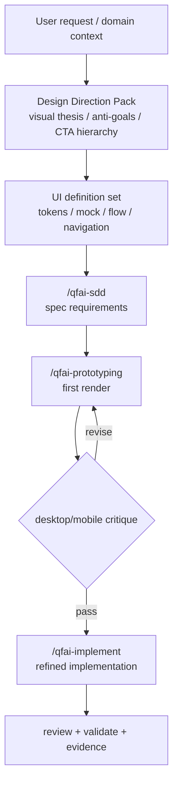

# 02_Inception-Deck

## Q1: なぜ今これを作るのか？

- QFAI は UI 定義の器を持ったが、アートディレクションと導線の質を downstream に強制できていない。
- ユーザー要求は「情報が足りないからダサい」を潰すことであり、discussion から theme / hierarchy / anti-goals を残す必要がある。
- v1.6.5 では、設計情報不足を原因とする generic UI を減らす。

## Q2: エレベーターピッチ

QFAI v1.6.5 は、AI コーディングエージェントだけで premium な UI を実装したい開発者のために、`Design Direction Pack + UI 定義 + 導線設計 + fidelity 評価` を discussion から spec / prototyping / implement まで貫通させる機能強化である。

## Q3: パッケージデザイン

- Front: `Design with intent, not vibes`
- Back:
  - visual thesis と anti-goals を必須化
  - CTA hierarchy / section narrative / navigation を spec に落とす
  - prototype 実装後に desktop/mobile critique loop を要求

## Q4: NOT List

| Item | IN / OUT | Reason |
| ---- | -------- | ------ |
| Figma / Sketch 連携の必須化 | OUT | QFAI は対象 3 エージェントで自己完結することを優先 |
| QFAI 自身の GUI 開発 | OUT | CLI 製品のまま進める |
| 主観レビューのみでの品質判断 | OUT | scorecard と render verification を必須化する |
| generic SaaS card-grid を既定にする | OUT | 明確に避ける対象 |

## Q5: ご近所さん

- `spec-0013`: UI 定義・レビュー体系の既存基盤
- `ui-definition-protocol.md`: downstream 読み取り順序の起点
- `/qfai-prototyping`, `/qfai-implement`: 実際に見た目品質へ効く下流

## Q6: 技術的な解決策

## Q7: 夜も眠れない問題

| Risk | Likelihood | Impact | Mitigation |
| ---- | ---------- | ------ | ---------- |
| 抽象的な aesthetic 要件で終わる | High | High | Design Direction Pack に必須フィールドを定義 |
| downstream が theme を読まず tokens だけ使う | Medium | High | 読み取り順序を更新し、DDP を最上位に置く |
| 見た目の良さが再現不能 | Medium | High | critique loop と scorecard を必須化 |
| 破壊的変更の範囲が曖昧 | Medium | Medium | delta と migration expectation を明記 |

## Q8: 期間とマイルストーン

- M1: discussion で方針・OQ 解消
- M2: `/qfai-sdd` で CAP / spec に分解
- M3: `/qfai-prototyping` で visually strong prototype
- M4: `/qfai-implement` と `/qfai-atdd` で fidelity + behavior を固定

## Q9: トレードオフスライダー

| Value | Priority |
| ----- | -------- |
| Design intent clarity | ★★★★★ |
| Downstream reproducibility | ★★★★★ |
| Backward compatibility | ★★★☆☆ |
| Speed of rollout | ★★★★☆ |

## Q10: 何がどれだけ必要か？

- Orchestrator 1: discussion / review integration
- Researcher 1: official guidance + repo delta
- Downstream skills: DDP を読む前提へ更新
- Reviewers 13: review roster full execution

## Work Orders Summary

| Step | Role (sub-agent) | Task title | Input (refs) | Output (refs) | Status (PASS/REVISE) |
| ---- | ---------------- | ---------- | ------------ | ------------- | -------------------- |
| 1 | researcher | Inception inputs research | `SRC-0001`..`SRC-0007` | Inception decision basis | PASS |
| 2 | orchestrator | Inception deck synthesis | Research memo, repo constraints | `02_Inception-Deck.md` | PASS |
