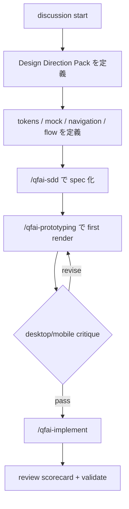
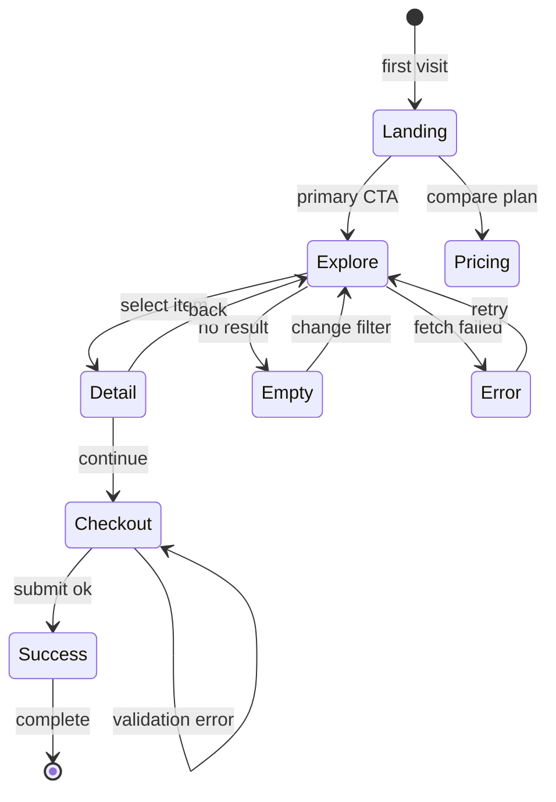

# 03_Story-Workshop

## User Stories

### US-D001: Design Direction Pack

**As a** QFAI user  
**I want** UI-bearing discussion/spec に visual thesis, content plan, interaction thesis, anti-goals を残したい  
**So that** downstream agents が雰囲気や hierarchy を推測せず実装できる

### US-D002: Navigation and Screen Flow as SSOT

**As a** QFAI user  
**I want** 画面遷移、導線、CTA hierarchy、error/recovery flow を明記したい  
**So that** prototype と実装が迷わない導線を持つ

### US-D003: Premium Prototype Loop

**As a** QFAI maintainer  
**I want** `/qfai-prototyping` と `/qfai-implement` が render critique を前提に改善する  
**So that** generic でダサい UI が残りにくい

### US-D004: Design Fidelity Review

**As a** reviewer  
**I want** rendered UI を scorecard で点検したい  
**So that** aesthetic / usability / accessibility / responsiveness を再現可能に判定できる

## User Flow



## Screen Flow



## HTML+CSS Screen Mock

### Design Direction Pack

- Visual thesis: editorial-tech, calm but assertive, steel-blue surfaces with a single ember accent
- Content plan: identity -> proof -> workflow -> action
- Interaction thesis: soft reveal, depth shift on focus, decisive CTA feedback
- Anti-goals: card mosaic, rainbow accents, vague hero copy, decorative charts without job

```html
<section
  style="min-height:100vh;background:linear-gradient(135deg,#07111f 0%,#10233b 55%,#f4efe7 100%);color:#f5f7fb;font-family:'Segoe UI',system-ui,sans-serif;"
>
  <div style="max-width:1200px;margin:0 auto;padding:32px 24px 64px;">
    <header
      style="display:flex;justify-content:space-between;align-items:center;padding:8px 0 40px;"
    >
      <div style="font-size:14px;letter-spacing:.28em;text-transform:uppercase;opacity:.78;">
        QFAI Direction Pack
      </div>
      <a
        style="padding:12px 18px;border:1px solid rgba(255,255,255,.28);border-radius:999px;color:#f5f7fb;text-decoration:none;"
        >Open Critique Loop</a
      >
    </header>
    <div style="display:grid;grid-template-columns:1.05fr .95fr;gap:28px;align-items:end;">
      <div>
        <p
          style="margin:0 0 14px;font-size:12px;letter-spacing:.22em;text-transform:uppercase;color:#ff8a5b;"
        >
          Brand first
        </p>
        <h1
          style="margin:0 0 18px;font-size:clamp(48px,9vw,92px);line-height:.94;font-weight:750;max-width:7ch;"
        >
          Design with intent, not vibes.
        </h1>
        <p
          style="max-width:32rem;margin:0 0 24px;font-size:18px;line-height:1.55;color:rgba(245,247,251,.84);"
        >
          Theme, navigation, screen flow, and critique become explicit artifacts before
          implementation starts.
        </p>
        <div style="display:flex;gap:14px;flex-wrap:wrap;">
          <a
            style="padding:14px 20px;background:#ff8a5b;color:#07111f;text-decoration:none;border-radius:999px;font-weight:700;"
            >Generate Spec-Ready Pack</a
          >
          <span style="padding:14px 18px;border-radius:999px;background:rgba(255,255,255,.08);"
            >No card-grid default</span
          >
          <span style="padding:14px 18px;border-radius:999px;background:rgba(255,255,255,.08);"
            >Desktop / Mobile critique</span
          >
        </div>
      </div>
      <aside
        style="background:rgba(7,17,31,.42);backdrop-filter:blur(12px);border:1px solid rgba(255,255,255,.16);border-radius:28px;padding:24px;box-shadow:0 24px 80px rgba(0,0,0,.22);"
      >
        <div
          style="display:flex;justify-content:space-between;align-items:center;margin-bottom:18px;"
        >
          <strong style="font-size:18px;">Fidelity Scorecard</strong>
          <span style="font-size:13px;color:#ffcfbf;">88 / 100</span>
        </div>
        <div style="display:grid;gap:12px;">
          <div style="display:flex;justify-content:space-between;">
            <span>Visual thesis clarity</span><span>PASS</span>
          </div>
          <div style="display:flex;justify-content:space-between;">
            <span>CTA hierarchy</span><span>PASS</span>
          </div>
          <div style="display:flex;justify-content:space-between;">
            <span>Generic pattern violations</span><span>0</span>
          </div>
          <div style="display:flex;justify-content:space-between;">
            <span>Desktop/mobile render review</span><span>PASS</span>
          </div>
        </div>
      </aside>
    </div>
  </div>
</section>
```

### Raw Mock Snippet

<section data-qfai-screen="direction-pack" data-breakpoint="desktop" style="background:#07111f;color:#f5f7fb;padding:24px;border-radius:24px;">
  <div style="font-size:12px;letter-spacing:.2em;text-transform:uppercase;color:#ff8a5b;">Direction Pack Preview</div>
  <h2 style="margin:12px 0 8px;font-size:40px;line-height:1;">Design with intent, not vibes.</h2>
  <p style="max-width:32rem;color:rgba(245,247,251,.82);">Theme, hierarchy, navigation, and critique are explicit before prototyping starts.</p>
  <div style="display:flex;gap:12px;flex-wrap:wrap;margin-top:16px;">
    <button style="padding:12px 18px;border:none;border-radius:999px;background:#ff8a5b;color:#07111f;font-weight:700;">Generate Spec-Ready Pack</button>
    <span style="padding:12px 16px;border-radius:999px;background:rgba(255,255,255,.08);">Desktop/Mobile Critique</span>
  </div>
</section>

## Example Seeds

### US-D001: Design Direction Pack

| Perspective         | Seed                                                | Notes                      |
| ------------------- | --------------------------------------------------- | -------------------------- |
| Happy path          | visual thesis / anti-goals / CTA hierarchy が埋まる | theme が downstream に渡る |
| Negative path       | visual thesis なしで generic UI が生成される        | validate / review で FAIL  |
| Edge / boundary     | mood は強いが CTA hierarchy が曖昧                  | 変換不能として修正対象     |
| Permission / role   | design-owner が direction を決め reviewer が検証    | 判断責務を分離             |
| State transition    | direction 更新後に mock / flow へ反映される         | traceability 必須          |
| Idempotency / retry | 同じ direction から同じ review 結果が得られる       | 再現性                     |

### US-D002: Navigation and Screen Flow as SSOT

| Perspective         | Seed                                                  | Notes                 |
| ------------------- | ----------------------------------------------------- | --------------------- |
| Happy path          | happy / error / recovery flow が明記される            | 主要導線が迷わない    |
| Negative path       | error/retry flow が欠落                               | OQ または review FAIL |
| Edge / boundary     | mobile では nav collapse、desktop では persistent nav | 両 viewport で検証    |
| Permission / role   | admin 導線のみ追加                                    | role-based flow       |
| State transition    | empty -> explore, error -> retry                      | 状態遷移明示          |
| Idempotency / retry | retry 後も意図した画面へ戻る                          | 外部 I/O 前提         |

### US-D003: Premium Prototype Loop

| Perspective         | Seed                                                  | Notes                         |
| ------------------- | ----------------------------------------------------- | ----------------------------- |
| Happy path          | first render 後に critique して refined render を作る | 2-pass 以上                   |
| Negative path       | code を読んだだけで完了扱い                           | rendered UI review なしは不可 |
| Edge / boundary     | desktop は良いが mobile で崩れる                      | dual viewport gate            |
| Permission / role   | implementer は critic feedback を反映                 | downstream rule               |
| State transition    | prototype -> critique -> revise -> implement          | ループ前提                    |
| Idempotency / retry | 同じ input で critique rubric が同じ                  | scorecard 再現性              |

### US-D004: Design Fidelity Review

| Perspective         | Seed                                             | Notes                 |
| ------------------- | ------------------------------------------------ | --------------------- |
| Happy path          | scorecard >= target で PASS                      | 記録可能              |
| Negative path       | card mosaic / weak hierarchy を検出              | banned pattern        |
| Edge / boundary     | 見た目は良いが contrast 不足                     | aesthetic only を禁止 |
| Permission / role   | frontend/design/integrated UIUX reviewers が協調 | full roster           |
| State transition    | FAIL -> revise -> rerun roster                   | review cycle          |
| Idempotency / retry | 同じ artifact に同じ rubric を適用               | 安定判定              |

## Work Orders Summary

| Step | Role (sub-agent) | Task title                 | Input (refs)              | Output (refs)            | Status (PASS/REVISE) |
| ---- | ---------------- | -------------------------- | ------------------------- | ------------------------ | -------------------- |
| 1    | researcher       | Design principle harvest   | `SRC-0001`..`SRC-0007`    | Story and mock direction | PASS                 |
| 2    | orchestrator     | Story workshop integration | Research memo, repo rules | `03_Story-Workshop.md`   | PASS                 |
