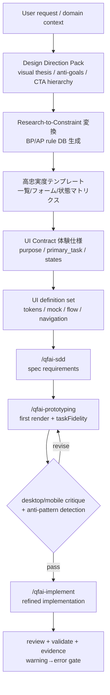

# 02_Inception-Deck

## Q1: なぜ今これを作るのか？

- QFAI は UI 定義の器を持ったが、アートディレクションと導線の質を downstream に強制できていない。
- ユーザー要求は「情報が足りないからダサい」を潰すことであり、discussion から theme / hierarchy / anti-goals を残す必要がある。
- v1.6.5 では、設計情報不足を原因とする generic UI を減らす。
- ChatGPT 分析で generic UI の構造的原因が特定された。テンプレート品質、Research-to-Constraint 変換の欠如、UI Contract の体験仕様不足、validator の warning 止まりが根本要因であり、v1.6.5 で根本対策を入れなければ改善が表面的に留まる。

## Q2: エレベーターピッチ

QFAI v1.6.5 は、AI コーディングエージェントだけで premium な UI を実装したい開発者のために、`Design Direction Pack + UI 定義 + 導線設計 + fidelity 評価` を discussion から spec / prototyping / implement まで貫通させ、ChatGPT 分析で特定された generic UI 発生の構造的原因の根本対策を組み込む機能強化である。

## Q3: パッケージデザイン

- Front: `Design with intent, not vibes`
- Back:
  - visual thesis と anti-goals を必須化
  - CTA hierarchy / section narrative / navigation を spec に落とす
  - prototype 実装後に desktop/mobile critique loop を要求
  - Research-to-Constraint 変換で調査結果を下流拘束条件に変換
  - テンプレート高忠実度化で上流入力品質を保証
  - Warning→Error 昇格で低品質 UI を確実に止める

## Q4: NOT List

| Item                                       | IN / OUT | Reason                                             |
| ------------------------------------------ | -------- | -------------------------------------------------- |
| Figma / Sketch 連携の必須化                | OUT      | QFAI は対象 3 エージェントで自己完結することを優先 |
| QFAI 自身の GUI 開発                       | OUT      | CLI 製品のまま進める                               |
| 主観レビューのみでの品質判断               | OUT      | scorecard と render verification を必須化する      |
| generic SaaS card-grid を既定にする        | OUT      | 明確に避ける対象                                   |
| visual regression screenshot diff 自動化   | OUT      | Phase 3 deferred                                   |
| runtime click path / friction metrics 収集 | OUT      | Phase 3 deferred                                   |

## Q5: ご近所さん

- `spec-0013`: UI 定義・レビュー体系の既存基盤
- `ui-definition-protocol.md`: downstream 読み取り順序の起点
- `/qfai-prototyping`, `/qfai-implement`: 実際に見た目品質へ効く下流
- `SRC-0008`: ChatGPT QFAI v1.6.4 UI/UX 設計機構分析レポート

## Q6: 技術的な解決策

## Q7: 夜も眠れない問題

| Risk                                         | Likelihood | Impact | Mitigation                                             |
| -------------------------------------------- | ---------- | ------ | ------------------------------------------------------ |
| 抽象的な aesthetic 要件で終わる              | High       | High   | Design Direction Pack に必須フィールドを定義           |
| downstream が theme を読まず tokens だけ使う | Medium     | High   | 読み取り順序を更新し、DDP を最上位に置く               |
| 見た目の良さが再現不能                       | Medium     | High   | critique loop と scorecard を必須化                    |
| 破壊的変更の範囲が曖昧                       | Medium     | Medium | delta と migration expectation を明記                  |
| Research 結果が拘束条件に変換されず放置      | High       | High   | Research-to-Constraint 変換ステップを mandatory にする |
| テンプレートが generic なまま更新されない    | Medium     | High   | 高忠実度テンプレートを必須化し validator で検証        |
| warning 止まりで品質低下を防げない           | High       | High   | 主要 UI 品質 warning を error に昇格                   |
| AI が常に最安解（1案のみ）で固定化           | Medium     | High   | primary screen で最低2案比較を mandatory に            |
| taskFidelity 未導入で DOM 充足のみ通過       | Medium     | High   | taskFidelity 評価を fidelity gate に追加               |

## Q8: 期間とマイルストーン

- M1: discussion で方針・OQ 解消（ChatGPT 分析統合含む）
- M2: `/qfai-sdd` で CAP / spec に分解（Research-to-Constraint 変換含む）
- M3: `/qfai-prototyping` で visually strong prototype（taskFidelity 評価含む）
- M4: `/qfai-implement` と `/qfai-atdd` で fidelity + behavior を固定（warning→error gate 含む）

## Q9: トレードオフスライダー

| Value                             | Priority |
| --------------------------------- | -------- |
| Design intent clarity             | ★★★★★    |
| Downstream reproducibility        | ★★★★★    |
| Structural root-cause elimination | ★★★★★    |
| Backward compatibility            | ★★★☆☆    |
| Speed of rollout                  | ★★★★☆    |

## Q10: 何がどれだけ必要か？

- Orchestrator 1: discussion / review integration
- Researcher 1: official guidance + repo delta + ChatGPT レポート分析
- Downstream skills: DDP + Research-to-Constraint + 高忠実度テンプレートを読む前提へ更新
- Validator maintainers: warning→error 昇格対応、anti-pattern 検出バリデータ新設
- Reviewers 13: review roster full execution

## Work Orders Summary

| Step | Role (sub-agent) | Task title                | Input (refs)                                      | Output (refs)            | Status (PASS/REVISE) |
| ---- | ---------------- | ------------------------- | ------------------------------------------------- | ------------------------ | -------------------- |
| 1    | researcher       | Inception inputs research | `SRC-0001`..`SRC-0008`                            | Inception decision basis | PASS                 |
| 2    | orchestrator     | Inception deck synthesis  | Research memo, repo constraints, ChatGPT analysis | `02_Inception-Deck.md`   | PASS                 |
