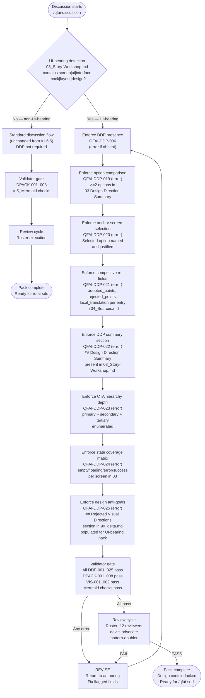

# 02_Inception-Deck

## Q1: Why are we doing this now?

QFAI v1.6.5 made the Design Direction Pack mandatory and introduced 18 DDP validator codes that prevent UI-bearing packs from proceeding without a DDP. The validators fire when required _fields_ are absent — but they do not verify whether the field _contents_ represent genuine design thinking. Post-release evidence shows that:

- AI agents complete the DDP fields with minimal, non-committal text that passes validators while conveying no real direction
- Option comparison is skipped entirely because no validator requires it; AI locks onto a single cheapest approach
- Competitive references are logged as URLs with summaries but the decisions derived from them — what to adopt, what to reject, how to translate — are never recorded
- State coverage (empty, loading, error, success) is left to downstream inference, causing silent omissions
- Design anti-goals written informally in discussion are not persisted in a retrievable location that `/qfai-prototyping` and `/qfai-implement` can read

Every downstream quality mechanism in the v1.7.x roadmap — design contracts, static audit, render evidence, browser QA, external critique, migration — depends on having richer upstream design context. Strengthening the discussion layer now is the prerequisite for every subsequent quality initiative. If we skip this hardening, stronger validators and critique loops further downstream will only report symptoms of underspecified inputs rather than catching real design defects.

## Q2: Elevator Pitch

For **QFAI users who author UI-bearing discussion packs**, who need to ensure AI agents produce intentional, non-generic UIs, **QFAI v1.7.0 "Discussion Design Hardening"** is a targeted template and validator upgrade that enforces structured design decision capture at the discussion stage. Unlike the v1.6.5 baseline which validates DDP field presence, **this release validates design decision quality** — requiring option comparison, anchor screen selection, structured competitive reference rationale, explicit CTA hierarchy, state coverage matrices, and persisted design anti-goals — all as immediate `error`-severity gates for UI-bearing packs.

## Q3: Package Design

**Front of box**: "Discussion packs that actually constrain downstream UI generation"

**Back of box**:

- Option comparison (>=2 options) is mandatory before any design direction is selected; validator QFAI-DDP-019 fires as error if absent in UI-bearing packs
- An "anchor screen" must be explicitly selected from compared options; QFAI-DDP-020 ensures the selection is recorded
- Competitive references in `04_Sources.md` must include `adopted_points`, `rejected_points`, and `local_translation` per entry; QFAI-DDP-021 makes these fields mandatory errors
- A "Design Direction Summary" section in `03_Story-Workshop.md` consolidates the selected option, CTA hierarchy, and state coverage in one retrievable block; QFAI-DDP-022 ensures it exists
- CTA hierarchy must enumerate primary, secondary, and tertiary levels; QFAI-DDP-023 validates depth
- State coverage must enumerate all expected UI states per screen; QFAI-DDP-024 checks matrix presence
- Rejected visual directions and design anti-goals are captured in a new `99_delta.md` section; QFAI-DDP-025 validates the section exists and is populated for UI-bearing packs

## Q4: NOT List

| Item                                                                          | IN / OUT | Reason                                                                                                       |
| ----------------------------------------------------------------------------- | -------- | ------------------------------------------------------------------------------------------------------------ |
| Screenshot capture and visual regression diff automation                      | OUT      | Deferred to v1.7.2+; requires browser infrastructure outside current CLI-first scope                         |
| Browser QA automation (Playwright, Puppeteer)                                 | OUT      | Deferred; adds external runtime dependency incompatible with text-first agent workflow                       |
| External critique adapters (third-party design review APIs)                   | OUT      | Deferred; requires stable external service integration pattern not yet established in QFAI                   |
| Design starter kit / scaffolding files                                        | OUT      | Out of scope; starter kits are a separate authoring concern, not a validation concern                        |
| Heuristic and aesthetic quality checks (subjective ratings)                   | OUT      | Deferred to v1.7.2+; only structural/presence checks are in v1.7.0 scope; aesthetic evaluation is complex    |
| Migration tooling for existing discussion packs                               | OUT      | Deferred; v1.7.0 is additive for new packs; migration helper is a v1.7.1 candidate                           |
| Figma / Sketch integration as a hard dependency                               | OUT      | QFAI maintains CLI-only, text-first workflow; tool independence is a DDP-010 invariant                       |
| Changes to non-UI-bearing discussion pack flow                                | OUT      | Scope is strictly UI-bearing packs; non-UI packs remain on the current validation path unchanged             |
| Modifications to `/qfai-sdd`, `/qfai-prototyping`, or other downstream skills | OUT      | v1.7.0 only hardens the upstream discussion layer; downstream consumers are addressed in subsequent releases |

## Q5: Neighborhood (Adjacent Systems)

- **`ddpValidation.ts`** (QFAI-DDP-001..018): Primary validator file; new v1.7.0 validators (DDP-019..025) extend this module or land in a co-located `discussionDesignHardening.ts`
- **`discussionPack.ts`** (QFAI-DPACK-001..008): Validates structural completeness of the 15-file pack; unmodified in v1.7.0 but its UI-bearing detection logic (`03_Story-Workshop.md` keyword scan) is the trigger for all new DDP-019..025 checks
- **`discussionVisuals.ts`** (QFAI-VIS-001..002): Validates HTML mock and design token presence; unmodified; operates independently
- **`discussMermaid.ts`** (QFAI-DPACK-009..010): Validates Mermaid diagram presence in `02` and `03`; unmodified
- **`qfai-discussion/SKILL.md`**: Skill definition and completion contract; updated in v1.7.0 to enumerate new UI-bearing authoring requirements in the Completion Contract section
- **`04_Sources.md` template**: Upgraded from free-form source log to competitive reference registry; this is a template/schema change, not a code change
- **`03_Story-Workshop.md` template**: Receives new "Design Direction Summary" section; downstream skills (`/qfai-sdd`) already read this file; the new section adds consumable structure without breaking existing reads
- **Prior packs** (`discussion-20260324090005338` and earlier): Unaffected; v1.7.0 only applies to new packs; old packs predate the requirement

## Q6: Technical Solution

The following flowchart shows how the enhanced `qfai-discussion` skill flow works for v1.7.0. UI-bearing packs follow the hardened path (right branch); non-UI-bearing packs follow the standard path (left branch) unchanged.

## Q7: Risks That Keep Us Awake

| Risk                                                                             | Likelihood | Impact | Mitigation                                                                                                |
| -------------------------------------------------------------------------------- | ---------- | ------ | --------------------------------------------------------------------------------------------------------- |
| Authors fill new mandatory fields with low-quality placeholder text              | High       | High   | Validators check field _presence_ and _non-emptiness_; banned-pattern checks catch generic filler text    |
| Option comparison is done but only superficially (both options identical)        | Medium     | High   | DDP-019 requires structurally distinct options; review roster escalates if options are substantively same |
| Competitive reference fields are populated but inaccurate                        | Medium     | Medium | Reviewers are responsible for content quality; validators enforce structure only                          |
| New error-severity validators break existing CI for packs authored before v1.7.0 | Low        | Medium | New validators are scoped to UI-bearing packs only; old packs are not re-validated retroactively          |
| State coverage matrix is present but omits critical states (error, loading)      | Medium     | High   | DDP-024 checks that at minimum `empty`, `loading`, `error`, `success` labels appear in the matrix         |
| Design anti-goals section is populated but not read by downstream                | Medium     | Medium | `SKILL.md` update explicitly mandates that `/qfai-sdd` reads `99_delta.md` Rejected Directions section    |
| TypeScript validator complexity creeps beyond maintainable bounds                | Low        | Medium | New validators follow existing `issue()` helper pattern; unit tests via vitest are required               |
| v1.7.0 scope expands to include downstream skill changes                         | Low        | High   | Strict NOT List enforcement; downstream changes explicitly deferred; scope gate in this discussion        |

## Q8: Timeline and Milestones

- **M1 (Discussion complete)**: This discussion pack is complete; all 15 files produced; OQ register at zero open items; review roster `PASS` — target: 2026-03-25
- **M2 (SDD — spec decomposition)**: `/qfai-sdd` converts this discussion into CAP/spec artifacts; validator specs (DDP-019..025) decomposed into acceptance criteria and test cases — target: 2026-03-26
- **M3 (Implementation)**: New validators implemented in TypeScript; `03_Story-Workshop.md`, `04_Sources.md`, `14_Review-Request.md`, `99_delta.md` templates updated; `SKILL.md` completion contract updated — target: 2026-03-28
- **M4 (Test and release)**: Vitest unit tests written for all new validator codes; `qfai validate` passes on the reference discussion pack; package version bumped to 1.7.0; CHANGELOG updated — target: 2026-03-30

## Q9: Trade-off Sliders

| Value                                   | Priority         |
| --------------------------------------- | ---------------- |
| Design decision quality enforcement     | ★★★★★            |
| Error-severity gates (no silent passes) | ★★★★★            |
| Backward compatibility for non-UI packs | ★★★★★            |
| Scope discipline (no downstream drift)  | ★★★★★            |
| Validator implementation simplicity     | ★★★★☆            |
| Aesthetic / heuristic quality checks    | ★★☆☆☆ (deferred) |
| Speed of rollout                        | ★★★★☆            |

## Q10: What Do We Need and How Much?

- **Validator author (1)**: Implement QFAI-DDP-019..025 in TypeScript following the existing `issue()` helper pattern in `ddpValidation.ts`; write vitest unit tests for each new code
- **Template author (1)**: Update `03_Story-Workshop.md`, `04_Sources.md`, `14_Review-Request.md`, `99_delta.md` templates with new mandatory sections; update `SKILL.md` completion contract
- **Reviewer (12)**: Execute full review roster (10 standard + devils-advocate + pattern-doubler) on this discussion pack and on the spec artifacts produced by M2
- **CI maintainer (1)**: Verify that `qfai validate` in CI correctly gates on the new error-severity validator codes; confirm no false positives on existing non-UI-bearing packs
- **Tech stack**: Node >=18, TypeScript 5.6.3, pnpm 9.12.3, vitest for tests, tsup for build — no new runtime dependencies required

## Work Orders Summary

| Step | Role (sub-agent) | Task title                | Input (refs)                                                     | Output (refs)            | Status (PASS/REVISE) |
| ---- | ---------------- | ------------------------- | ---------------------------------------------------------------- | ------------------------ | -------------------- |
| 1    | researcher       | Inception inputs research | `01_Context.md`, existing validators, `SKILL.md`, roadmap source | Inception decision basis | PASS                 |
| 2    | orchestrator     | Inception deck synthesis  | Research memo, repo constraints, prior discussion packs          | `02_Inception-Deck.md`   | PASS                 |
