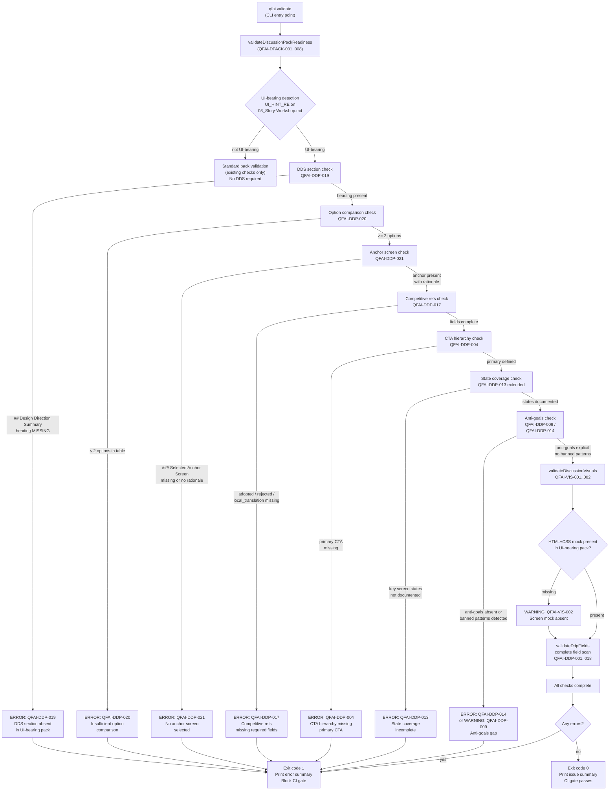

# 03_Story-Workshop

> **Version**: v1.7.0 "Discussion Design Hardening"
> **Date**: 2026-03-25
> **Scope**: UI-bearing work only — non-UI packs are unaffected by the Design Direction Summary requirements introduced here.

---

## Design Direction Summary

> This section is **mandatory** for all UI-bearing discussion packs as of v1.7.0.
> The presence of a populated Design Direction Summary is checked by the new validator (QFAI-DDP-019).
> A UI-bearing pack missing this section will receive an **error** (not a warning).

### DDP Summary

The v1.7.0 objective is to prevent UI-bearing work from proceeding with vague, generic design inputs. Prior to this release, discussion packs containing screen-level work could pass validation without any documentation of visual thesis, option comparison, or competitive grounding. This allowed downstream prototyping and implementation agents to fill in design decisions ad hoc, producing inconsistent, low-quality UI that reflected no deliberate direction.

The Design Direction Pack (DDP) summary condenses the critical upstream decisions into a single mandatory anchor:

```yaml
design_direction_summary:
  scope: ui-bearing
  version: "1.7.0"
  visual_thesis: >
    Purposeful minimalism with editorial depth — dark steel-blue base surfaces paired with a
    single warm-amber accent. Typography-led hierarchy. Every element earns its place;
    decorative complexity is banned by default.
  content_plan:
    - section: Identity — who this is for and why it matters
    - section: Proof — evidence that the tool works (metrics, testimonials)
    - section: Workflow — how the discussion-to-spec pipeline operates
    - section: Action — primary and secondary conversion points
  interaction_thesis:
    - principle: Reveal on scroll — content enters with soft upward fade, never pop-in
    - principle: Depth shift on focus — focused inputs gain a layered shadow, reinforcing affordance
    - principle: Decisive CTA feedback — primary button shows a 120 ms scale-press and color confirm
  anti_goals:
    - Avoid card mosaic / grid-of-cards as the default layout pattern
    - Avoid rainbow accent usage — one accent color maximum at any one time
    - Avoid hero sections with vague motivational copy that carries no product-specific claim
    - Avoid decorative data-visualization widgets that do not communicate a task-relevant insight
  cta_hierarchy:
    primary: Generate Discussion Pack
    secondary: View Validation Report
    tertiary: Open Documentation
    placement: primary top-right in nav + repeated in hero; secondary inline; tertiary footer only
  competitive_refs:
    adopted:
      - source: Linear.app
        point: Keyboard-first navigation model with command palette
        local_translation: Adopt command-palette pattern for pack generation trigger; deprioritize mouse-only flows
      - source: Vercel Dashboard
        point: Dark-mode-first design with surgical use of status color (green/red only for meaningful state)
        local_translation: Apply status color only to validation pass/fail; no decorative color usage
      - source: Stripe Docs
        point: Progressive disclosure — feature depth revealed inline without page navigation
        local_translation: Show advanced validator config inline under the relevant story rather than a separate settings page
    rejected:
      - source: Notion
        point: Infinite nesting and freeform block editing
        rejection_reason: Too unconstrained for a structured artifact workflow; QFAI packs have a fixed schema
      - source: Jira
        point: Dense table grids with status badges on every row
        rejection_reason: Visual noise overrides clarity; our primary user needs to read and reason, not scan dashboards
    local_translation_policy: >
      Competitive references are extracted for specific UX patterns, not aesthetic wholesale adoption.
      Each adopted point must map to exactly one QFAI interaction or layout decision.
      Rejected points must be explicitly noted in design anti-goals.
```

### Screen Option Comparison

Three primary screen layout options were evaluated for the main Discussion Pack dashboard (the entry point to the v1.7.0 hardened flow). One option is selected as the anchor.

| Dimension | Option A — Editorial Split | Option B — Command-First | Option C — Scorecard Dashboard |
|---|---|---|---|
| **Layout pattern** | 60/40 split: narrative left, artifact card right | Full-bleed command palette overlay on minimal single-column layout | Three-column: pack list / active pack detail / validation status |
| **Visual thesis fit** | Strong — editorial depth, typography-led | Moderate — minimal but loses brand warmth | Weak — dashboard grids conflict with anti-goals |
| **Primary CTA placement** | Hero top-right + inline below fold | Always-visible floating action button | Sidebar persistent button — below fold on small viewports |
| **State coverage** | Good: empty, loading, error states in right panel | Moderate: empty well-handled; error state requires overlay | Complex: three columns each carry independent states |
| **Pros** | Clear hierarchy; DDP summary visually prominent; adapts to editorial content length | Keyboard-native; reduces cognitive load for power users; fastest time-to-action | Useful for monitoring multiple packs; mirrors mental model of "dashboard" users |
| **Cons** | Right column becomes redundant at mobile widths without reflow; requires custom breakpoint logic | Warm/editorial brand feel is reduced; onboarding users may not discover the palette | Three-column violates single-primary-CTA rule on desktop; mobile reflow is destructive |
| **Competitive precedent** | Linear (editorial landing) + Stripe (progressive disclosure) | Linear (command palette) | Notion / Jira — **rejected patterns** |
| **Mobile viability** | High — reflows to stacked single-column cleanly | High — inherently single-column | Low — three-column loses context on collapse |
| **Anti-goal conflicts** | None | None — minor concern about brand warmth | Conflicts: card mosaic in pack list; dual-primary-CTA risk in three-column |
| **Validator compatibility** | DDP summary renders as prominent prose block — matches QFAI-DDP-001 check | DDP summary would be hidden behind palette — risks validator false-negative on human review | DDP summary buried in detail column — low visibility |

### Selected Anchor Screen

**Selected: Option A — Editorial Split**

**Rationale**:

Option A was selected because it directly serves the visual thesis ("purposeful minimalism with editorial depth") and places the DDP Summary section in a visually prominent position that survives the QFAI-DDP-019 structural check. The 60/40 editorial split has strong competitive precedent in both Linear's landing narrative and Stripe's progressive-disclosure documentation pattern — both are in the "adopted" competitive reference list.

Option B was ruled out because the command-palette pattern, while keyboard-native and efficient, reduces the brand warmth that distinguishes QFAI output from generic developer tooling. The palette also makes the DDP summary structurally invisible unless explicitly surfaced — a validator-readability anti-pattern.

Option C was explicitly ruled out because the three-column layout pattern conflicts with the anti-goals (card mosaic, dual-primary-CTA risk) and its competitive precedents (Notion, Jira) are in the rejected list.

**Anchor screen ID**: `SCREEN-ANCHOR-001`
**Breakpoints confirmed**: desktop (≥1280px), tablet (768–1279px), mobile (<768px)
**Reflow strategy**: editorial split collapses to stacked single-column at tablet; right panel becomes a details accordion at mobile.

### CTA Hierarchy

The CTA hierarchy is defined once here and must not be overridden per-screen without explicit documentation of the deviation.

| Level | Label | Trigger condition | Placement | Visual treatment |
|---|---|---|---|---|
| Primary | Generate Discussion Pack / Run Validation | Always visible — shows "Generate" when no active pack exists, swaps to "Run Validation" when active pack exists. Only one primary CTA rendered at any time. | Nav top-right + hero section | Amber filled pill `#f59e0b` (Generate) or Green filled pill `#10b981` (Validation), font-weight 700 |
| Secondary | View Validation Report | After validation run completes | Inline below validation summary | Outlined pill, border `#10b981` |
| Secondary (contextual) | Edit Pack | Pack detail view | Top of detail panel | Outlined pill, border `rgba(255,255,255,.28)` |
| Tertiary | Open Documentation | Always available | Footer nav, help icon tooltip | Plain text link, underline on hover |
| Tertiary | Export Pack | Pack detail view | Overflow menu (kebab) | Icon-only in overflow menu |

**Rule**: No screen may have more than one primary-level CTA visible simultaneously. The Generate / Run Validation swap is the only permitted primary CTA transition.

### State Coverage

Every key screen must handle the following states. Absence of state handling is a **validator error** (QFAI-DDP-013 form/list template validation, extended to DDS state check in v1.7.0).

| Screen | Empty | Loading | Error | Populated | Partial (edge) |
|---|---|---|---|---|---|
| Pack List (home) | "No packs yet" with Generate CTA | Skeleton rows, progress indicator | "Failed to load packs — retry" with retry CTA | Sorted pack list, latest first | Partial: one pack with incomplete files — show missing-file badge |
| Pack Detail | Not applicable — detail requires a selected pack | Skeleton for each section | "Failed to load section" per-section inline error | Full 15-file navigation, DDP Summary prominent | Partial: missing DDS section — show QFAI-DDP-019 error inline |
| Validation Report | "No validations run yet" with Run Validation CTA | Progress bar with current validator name | "Validation run failed" with stderr capture | Issue list grouped by severity (error / warning / info) | Partial: some validators timed out — show timeout badge per validator |
| DDP Summary Editor | Field-level empty state with placeholder guidance | Auto-save indicator (spinner in field chrome) | "Save failed — local draft preserved" | "Saved" confirmation fade-in | Partial: required fields present but values are generic — QFAI-DDP-009 anti-goal warning |

### Design Anti-Goals

The following are explicit prohibitions for v1.7.0 UI. Each anti-goal maps to an existing or new validator check.

| Anti-Goal | Description | Validator enforcement |
|---|---|---|
| No card mosaic default | The default layout must never be a grid-of-cards. Cards are permitted only as explicitly scoped components within a non-grid parent. | QFAI-DDP-014 anti-pattern: `card-mosaic-default` |
| No rainbow accents | Only one accent color active at a time. Secondary status colors (success green, error red) are permitted only on meaningful state indicators. | QFAI-DDP-014 anti-pattern: `rainbow-accent` |
| No vague hero copy | Hero-level copy must contain a product-specific claim with at least one concrete noun from the QFAI domain (e.g., "discussion pack", "validator", "spec"). Generic phrases like "Build better" or "Work smarter" are banned. | QFAI-DDP-009 anti-goals banned pattern |
| No decorative visualization | Charts and data visualizations must communicate a task-relevant insight. Visual-only graphs with no interpretable data point are banned. | QFAI-DDP-014 anti-pattern: `decorative-viz` |
| No dual primary CTA | No screen may surface two primary-level CTAs simultaneously. | QFAI-DDP-014 anti-pattern: `dual-primary-cta` |
| No missing DDS section | A UI-bearing pack without a Design Direction Summary section in `03_Story-Workshop.md` is structurally incomplete and must be blocked. | QFAI-DDP-019 (new, v1.7.0) |
| No option-free anchor | A UI-bearing pack must document at least 2–3 screen options before selecting an anchor. A single-option pack is treated as an unexamined decision. | QFAI-DDP-020 (new, v1.7.0) |
| No anchor-less pack | A UI-bearing pack that documents options but does not identify a selected anchor screen is unresolved and must be blocked. | QFAI-DDP-021 (new, v1.7.0) |

---

## User Stories

### US-D001: Discussion Skill Detects UI-Bearing Work and Enforces Design Direction Summary

**As a** QFAI discussion facilitator
**I want** the `/qfai-discussion` skill to detect UI-bearing work from `03_Story-Workshop.md` content and enforce the presence of a populated Design Direction Summary section
**So that** no UI-bearing pack can advance past the workshop stage without documented visual direction, option comparison, and an anchor screen selection

**Acceptance criteria**:
- When `03_Story-Workshop.md` contains keywords matched by `UI_HINT_RE` (ui, screen, form, button, wireframe, 画面, モック, etc.), the pack is classified as UI-bearing
- A UI-bearing pack without a `## Design Direction Summary` heading in `03_Story-Workshop.md` triggers QFAI-DDP-019 as an **error**
- A UI-bearing pack with the heading present but the DDP Summary subsection missing triggers QFAI-DDP-019 as an **error**
- A non-UI-bearing pack is unaffected regardless of missing DDS section
- The error message identifies the missing section and the file path

---

### US-D002: Validator Checks Option Comparison Presence for UI-Bearing Packs

**As a** QFAI user authoring a UI-bearing discussion pack
**I want** the validator to confirm that at least 2–3 primary screen options are compared before an anchor is declared
**So that** the anchor screen decision is traceable to an examined set of alternatives, not an untested first idea

**Acceptance criteria**:
- A UI-bearing pack with a DDS section that contains a Screen Option Comparison table with fewer than 2 rows triggers QFAI-DDP-020 as an **error**
- A UI-bearing pack with 2 or more documented options passes this check
- The validator counts option rows by detecting a markdown table under the `### Screen Option Comparison` heading
- The check is skipped entirely for non-UI-bearing packs

---

### US-D003: Validator Checks Selected Anchor Screen for UI-Bearing Packs

**As a** QFAI user authoring a UI-bearing discussion pack
**I want** the validator to confirm that one option has been identified as the selected anchor screen with documented rationale
**So that** the downstream spec and prototyping agents receive an unambiguous starting point rather than an open design question

**Acceptance criteria**:
- A UI-bearing pack whose DDS section does not contain a `### Selected Anchor Screen` heading triggers QFAI-DDP-021 as an **error**
- A pack where the Selected Anchor section exists but has fewer than 40 characters of rationale content triggers QFAI-DDP-021 as an **error** (rationale cannot be a single word)
- A pack with a properly populated Selected Anchor section passes this check
- The anchor screen ID (e.g., `SCREEN-ANCHOR-001`) is captured for downstream traceability

---

### US-D004: Competitive Reference Registry Enforces Adopted / Rejected / Translation Fields

**As a** QFAI user authoring a UI-bearing discussion pack
**I want** the competitive reference entries in the DDS to require explicit `adopted`, `rejected`, and `local_translation_policy` sub-fields
**So that** every competitive reference is actionable — not a passive inspiration list — and the reasons for rejection are recorded alongside adoptions

**Acceptance criteria**:
- A `competitive_refs` block missing the `adopted` sub-field triggers QFAI-DDP-017 as an **error**
- A `competitive_refs` block missing the `rejected` sub-field triggers QFAI-DDP-017 as an **error**
- A competitive reference entry under `adopted` that has no `local_translation` field triggers QFAI-DDP-017 as an **error**
- A competitive reference entry under `rejected` that has no `rejection_reason` field triggers QFAI-DDP-017 as an **error**
- A `competitive_refs` block without a `local_translation_policy` prose field triggers QFAI-DDP-018 as a **warning**
- The minimum count check (`competitive_refs_min`, default 3) applies to total entries across adopted + rejected combined

---

### US-D005: Review Request Captures Design-Direction Decisions

**As a** reviewer receiving a UI-bearing discussion pack
**I want** `14_Review-Request.md` to include a dedicated Design Direction Decisions section that summarizes the anchor screen choice, rejected options, and applied competitive references
**So that** reviewers can evaluate the design rationale without reading the full DDS section, and so that the review record is self-contained for audit

**Acceptance criteria**:
- `14_Review-Request.md` for a UI-bearing pack must contain a `## Design Direction Decisions` section
- The section must reference the selected anchor screen ID (e.g., `SCREEN-ANCHOR-001`)
- The section must list at minimum: anchor option name, reason for selection, and count of rejected options
- The section must list the competitive references adopted, with local translation notes
- A review request missing this section triggers QFAI-DDP-022 as a **warning** (downgraded from error due to reviewer-authored nature of the file)

---

### US-D006: Delta Log Captures Rejected Visual Directions and Design Anti-Goals

**As a** QFAI team member reading the history of a discussion pack
**I want** `99_delta.md` to record rejected screen options and design anti-goals as first-class delta entries
**So that** future maintainers understand which visual directions were considered and explicitly discarded, preventing re-litigating the same options in subsequent versions

**Acceptance criteria**:
- `99_delta.md` for a UI-bearing pack must contain a `## Design Direction` section
- Rejected screen options (those not selected as anchor) must each appear as a delta entry with status `rejected` and a brief reason
- Design anti-goals must be listed as a delta entry under a `Anti-Goals Locked` entry
- An anchor screen selection change between pack versions must appear as a delta entry with `type: design-direction-change`
- A UI-bearing `99_delta.md` missing the Design Direction section triggers QFAI-DDP-023 as a **warning**

---

### US-D007: SKILL.md Updated with New UI-Bearing Authoring Requirements

**As a** QFAI skill maintainer
**I want** `qfai-discussion/SKILL.md` to document the new UI-bearing authoring requirements introduced in v1.7.0 — Design Direction Summary, option comparison, anchor selection, competitive refs format, CTA hierarchy, state coverage, and anti-goals
**So that** the skill acts as the authoritative instruction set for agents executing the discussion flow, and agents cannot produce a conformant UI-bearing pack without following the new requirements

**Acceptance criteria**:
- `SKILL.md` contains a `## UI-Bearing Authoring Requirements (v1.7.0+)` section
- The section enumerates all seven new required authoring behaviors: DDS presence, option comparison (2–3 options), anchor selection with rationale, competitive refs format (adopted/rejected/translation), CTA hierarchy definition, state coverage per screen, and explicit anti-goals
- The section specifies that all seven requirements apply **only** to packs classified as UI-bearing by `UI_HINT_RE`
- The section links to `03_Story-Workshop.md` DDS section as the canonical location
- A skill execution that does not produce these seven elements for a UI-bearing pack is treated as incomplete (validator will catch on `qfai validate`)

---

### US-D008: Validators Emit Error (Not Warning) for Structural Design Requirement Gaps

**As a** QFAI user running `qfai validate`
**I want** all structural design requirement gaps in a UI-bearing pack to emit **errors** rather than warnings
**So that** the CI gate is reliable — a pack that is missing a structural design requirement cannot be merged or published under the assumption that it "mostly" meets the bar

**Acceptance criteria**:
- QFAI-DDP-019 (missing DDS section) emits `severity: "error"`
- QFAI-DDP-020 (insufficient option comparison) emits `severity: "error"`
- QFAI-DDP-021 (missing anchor screen) emits `severity: "error"`
- QFAI-DDP-017 (competitive refs missing required sub-fields) emits `severity: "error"`
- QFAI-DDP-014 (anti-pattern detection: dual-primary-CTA, card-mosaic, rainbow-accent) emits `severity: "error"`
- QFAI-DDP-004 (CTA hierarchy missing primary) emits `severity: "error"` (pre-existing, confirmed unchanged)
- Informational checks (quality profile notices, translation policy missing) remain `severity: "warning"` or `severity: "info"`
- No structural gap is silently downgraded to warning by a config option

---

## User Flows

### Flow 1: Enhanced Discussion Validation Flow for UI-Bearing Packs



### Flow 2: Author Decision Tree — Authoring a v1.7.0 UI-Bearing Pack

```mermaid
flowchart TD
    Start["Author starts\n03_Story-Workshop.md"] --> S1{"Does the story contain\nUI keywords?\n(screen, form, button,\n画面, モック, etc.)"}
    S1 -->|"No"| S2["Non-UI-bearing path\nWrite standard user stories\nNo DDS required\nSkip to Example Seeds"]
    S1 -->|"Yes"| S3["UI-bearing path\nDDS section is MANDATORY"]
    S3 --> S4["Write DDP Summary\n• visual_thesis (sentence)\n• content_plan (2+ sections)\n• interaction_thesis (2-3 principles)\n• anti_goals (4+ items)\n• cta_hierarchy (primary defined)\n• competitive_refs (adopted+rejected+translation)"]
    S4 --> S5{"DDP Summary complete?"}
    S5 -->|"No — fields missing"| S4
    S5 -->|"Yes"| S6["Write Screen Option Comparison\n• Minimum 2 options (A/B)\n• Recommended 3 options (A/B/C)\n• Each option: pros, cons,\ncompetitive precedent,\nmobile viability,\nanti-goal conflicts"]
    S6 --> S7{"2+ options documented?"}
    S7 -->|"No"| S6
    S7 -->|"Yes"| S8["Select Anchor Screen\n• Name the selected option\n• Write rationale (40+ chars)\n• Document why others rejected\n• Assign SCREEN-ANCHOR-NNN ID"]
    S8 --> S9{"Anchor selected\nwith rationale?"}
    S9 -->|"No"| S8
    S9 -->|"Yes"| S10["Define CTA Hierarchy\n• Primary (one only)\n• Secondary\n• Tertiary\n• Placement per level\n• Visual treatment"]
    S10 --> S11["Define State Coverage\n• Empty state per screen\n• Loading state\n• Error state\n• Populated state\n• Partial/edge state"]
    S11 --> S12["Define Design Anti-Goals\n• Explicit prohibitions\n• Each mapped to a validator\n• At least 4 anti-goals"]
    S12 --> S13["Run qfai validate"]
    S13 --> S14{"Validation result?"}
    S14 -->|"errors present"| S15["Read error codes\nFix identified gaps\nRe-run validate"]
    S15 --> S13
    S14 -->|"no errors"| S16["DDS section complete\nProceed to User Stories\nand Example Seeds"]
    S2 --> S16
```



---

## Flow Descriptions

### Flow 1: Enhanced Discussion Validation Flow for UI-Bearing Packs

This flow describes the complete validator execution path introduced in v1.7.0. The key structural change is the branching at the UI-bearing detection point: non-UI-bearing packs bypass all new DDS checks and follow the existing validation path unchanged. This ensures backward compatibility — existing packs without any UI keywords continue to validate as before.

For UI-bearing packs, the validation is sequential and fail-fast on structural gaps:

1. **DDS section check (QFAI-DDP-019)**: Checks for the `## Design Direction Summary` heading in `03_Story-Workshop.md`. This is the gate that prevents the pack from advancing with no design direction at all. Implemented in `discussionVisuals.ts` or a new `discussionDds.ts` validator, using the same `readSafe` + heading regex pattern as existing validators.

2. **Option comparison check (QFAI-DDP-020)**: Counts rows in the markdown table under `### Screen Option Comparison`. Requires at least 2 rows (excluding the header row). This check is only reached if the DDS section is present.

3. **Anchor screen check (QFAI-DDP-021)**: Verifies the `### Selected Anchor Screen` heading exists and that the content below it is substantive (not a stub). Rationale length is checked to prevent empty anchors.

4. **Competitive refs field check (QFAI-DDP-017 extended)**: Examines the `competitive_refs` block for the presence of `adopted`, `rejected`, and `local_translation` sub-fields. Each adopted entry must have `local_translation`. Each rejected entry must have `rejection_reason`.

5. **CTA hierarchy check (QFAI-DDP-004)**: Pre-existing check confirming `cta_hierarchy.primary` is defined. Unchanged in v1.7.0.

6. **State coverage check (QFAI-DDP-013 extended)**: Extended to check that the State Coverage table in the DDS section covers empty, loading, error, and success states for at least the primary screen.

7. **Anti-goals check (QFAI-DDP-009 / QFAI-DDP-014)**: Checks that `anti_goals` is non-empty and that no banned anti-pattern keywords appear in the design mock content. The anti-pattern detection (`detectAntiPatterns`) runs on the full file.

All structural gaps (steps 1–5, anti-patterns) emit **errors**. The HTML+CSS screen mock check (QFAI-VIS-002) remains a **warning** — it is structural guidance but not a hard gate.

### Flow 2: Author Decision Tree

This flow is authored-facing — it maps the decisions a human or agent author makes when writing a new v1.7.0 UI-bearing `03_Story-Workshop.md`. The key decision point is the UI-bearing classification: an author working on a non-UI feature (e.g., a CLI-only config change, a pure backend refactor) is never required to write a DDS section.

For UI-bearing work, the flow is sequential and each step's output feeds the next. The DDP Summary must be complete before the Option Comparison is written, because the visual thesis and anti-goals directly inform the evaluation criteria for the options. The anchor selection must reference the competitive precedents documented in the DDP Summary, closing the traceability loop.

---

## Example Seeds

### US-D001: Discussion Skill Detects UI-Bearing Work and Enforces Design Direction Summary

| Perspective | Seed | Notes |
|---|---|---|
| Happy path | `03_Story-Workshop.md` contains "screen mock" keyword; DDS section is fully populated with all required sub-sections; QFAI-DDP-019 passes cleanly | Baseline conformant pack |
| Negative path | `03_Story-Workshop.md` contains "form" and "button" in user story text; `## Design Direction Summary` heading is absent; QFAI-DDP-019 fires as error with message identifying the missing section | Confirms error severity and message specificity |
| Edge / boundary | `03_Story-Workshop.md` contains exactly one UI keyword buried in a fenced code block; `stripFencedCodeBlocks` removes it before `UI_HINT_RE` match; pack is classified non-UI-bearing; DDS not required | Code fence stripping is critical — a keyword in a code sample must not trigger UI-bearing classification |
| Permission / role | Discussion pack is authored by an external contributor who has not read the v1.7.0 changelog; the validator error provides actionable guidance text pointing to the DDS template in SKILL.md | Error message must be self-explanatory without prior knowledge |
| State transition | Pack starts as non-UI-bearing (CLI-only stories); author adds a "screen" story mid-session; pack is re-validated; validator now classifies as UI-bearing and reports missing DDS | Classification is re-evaluated on each validate run, not cached |
| Idempotency / retry | Running `qfai validate` twice on the same pack without changes produces identical error output — same error code, same message, same file path | Validator output is deterministic; no flapping |

---

### US-D002: Validator Checks Option Comparison Presence for UI-Bearing Packs

| Perspective | Seed | Notes |
|---|---|---|
| Happy path | DDS section contains a `### Screen Option Comparison` table with 3 option rows (A, B, C); QFAI-DDP-020 passes | Standard three-option comparison |
| Negative path | DDS section contains the `### Screen Option Comparison` heading but the table has only 1 data row; QFAI-DDP-020 fires as error | Single-option packs are blocked |
| Edge / boundary | DDS section has a table with exactly 2 data rows (minimum); QFAI-DDP-020 passes at the boundary | Off-by-one check: 2 must pass, 1 must fail |
| Permission / role | Agent in automated authoring mode generates the minimum two options (A: current direction, B: alternative explored and rejected); human reviewer accepts; validator passes | Automated authoring must meet the same structural bar |
| State transition | Pack initially has no option table (fails DDS-002); author adds a two-option comparison; re-validation passes DDS-002 but DDS-003 now fires (no anchor selected) | Sequential error resolution — each check gates the next |
| Idempotency / retry | Re-running validation on a correctly authored option comparison table consistently returns no DDS-002 error | Table row count detection is stable across runs |

---

### US-D003: Validator Checks Selected Anchor Screen for UI-Bearing Packs

| Perspective | Seed | Notes |
|---|---|---|
| Happy path | `### Selected Anchor Screen` heading present; content includes option name, rationale paragraph (>100 chars), and a `SCREEN-ANCHOR-001` ID; QFAI-DDP-021 passes | Full anchor with ID and rationale |
| Negative path | `### Selected Anchor Screen` heading present; content is "TBD — to be decided after client review"; QFAI-DDP-021 fires as error (stub content detected) | Stub rationale must be blocked |
| Edge / boundary | Rationale is exactly 40 characters (boundary value); QFAI-DDP-021 passes at minimum threshold | Confirm threshold behavior |
| Permission / role | Anchor selection is made by design-owner role; implementation agent reads anchor ID for downstream spec; validator confirms anchor ID is present and non-empty | Traceability to downstream consumers |
| State transition | Pack has two options but no anchor (fails DDS-003); author updates section to select Option A with rationale; re-validation passes DDS-003; anchor ID is propagated to `14_Review-Request.md` | Anchor selection feeds review request |
| Idempotency / retry | Anchor section content unchanged between two validation runs; DDS-003 passes both times with identical output | Stable anchor detection |

---

### US-D004: Competitive Reference Registry Enforces Adopted / Rejected / Translation Fields

| Perspective | Seed | Notes |
|---|---|---|
| Happy path | `competitive_refs` block has 2 adopted entries (each with `source`, `point`, `local_translation`) and 1 rejected entry (with `source`, `point`, `rejection_reason`); total 3 entries meets `competitive_refs_min`; all checks pass | Fully compliant registry |
| Negative path | `competitive_refs` block has 3 adopted entries but no `rejected` sub-block; QFAI-DDP-017 fires as error: "competitive_refs missing rejected sub-field" | Rejected entries are mandatory — passive inspiration lists are blocked |
| Edge / boundary | Exactly 3 total entries (adopted + rejected combined); `competitive_refs_min` is 3; count check passes at boundary | Boundary value for minimum count |
| Permission / role | Researcher role populates competitive refs during the research phase; facilitator role verifies `local_translation` fields are product-specific rather than generic; validator enforces structural completeness | Roles enforce quality at separate points |
| State transition | Pack has competitive refs with no `local_translation` fields (fails DDP-017); researcher adds translations; re-validation passes; translations are referenced in `14_Review-Request.md` design direction section | Translation field propagates to review |
| Idempotency / retry | Competitive refs block unchanged; `validateCompetitiveRefs` returns same error / pass result across multiple runs | No state dependency in competitive refs validation |

---

### US-D005: Review Request Captures Design-Direction Decisions

| Perspective | Seed | Notes |
|---|---|---|
| Happy path | `14_Review-Request.md` contains `## Design Direction Decisions` section with anchor ID, anchor rationale summary, list of rejected options, and adopted competitive references; QFAI-DDP-022 passes (no warning) | Fully populated review request |
| Negative path | `14_Review-Request.md` is present but has no `## Design Direction Decisions` section; QFAI-DDP-022 fires as warning | Warning (not error) because reviewer authors this file; hard block would be counter-productive |
| Edge / boundary | Review request has the section heading but zero content below it (empty section); QFAI-DDP-022 fires as warning — heading-only does not satisfy the check | Heading presence alone is insufficient |
| Permission / role | Reviewer writes `14_Review-Request.md`; facilitator pre-populates the Design Direction Decisions section from the DDS anchor; reviewer confirms or amends before submitting for review | Pre-population reduces reviewer burden |
| State transition | Pack originally non-UI-bearing; UI stories added in revision; `14_Review-Request.md` pre-dates the UI stories and lacks DDS section; validator fires warning; reviewer adds section; warning resolves | Retrofit path for revised packs |
| Idempotency / retry | Review request with populated DDS section re-validated after minor edit to unrelated section; QFAI-DDP-022 continues to pass | Partial edit does not invalidate unrelated checks |

---

### US-D006: Delta Log Captures Rejected Visual Directions and Design Anti-Goals

| Perspective | Seed | Notes |
|---|---|---|
| Happy path | `99_delta.md` has `## Design Direction` section; Option B and Option C each have a `status: rejected` entry with reason; anti-goals are listed under `Anti-Goals Locked` entry; QFAI-DDP-023 passes (no warning) | Full design direction delta |
| Negative path | `99_delta.md` has no `## Design Direction` section; pack is UI-bearing; QFAI-DDP-023 fires as warning | Warning to allow gradual adoption; future versions may escalate to error |
| Edge / boundary | Pack has only one option in the comparison (option B was never documented); rejected section in delta is technically empty; warning fires for insufficient options (DDS-002) which covers this case; DDS-005 only checks section presence | The two validators have distinct but complementary scopes |
| Permission / role | Facilitator role is responsible for updating `99_delta.md` with design decisions; implementation agent reads delta to understand which visual directions are explicitly off-limits before prototyping | Delta as design-constraint source |
| State transition | Pack v1 has Option A selected; in pack v2 (new discussion), Option B is selected after critique; `99_delta.md` in v2 records `type: design-direction-change` with reference to v1 anchor | Version-to-version direction change traceability |
| Idempotency / retry | Delta section content unchanged between validate runs; QFAI-DDP-023 result is stable | No state side-effects from repeated validation |

---

### US-D007: SKILL.md Updated with New UI-Bearing Authoring Requirements

| Perspective | Seed | Notes |
|---|---|---|
| Happy path | SKILL.md contains `## UI-Bearing Authoring Requirements (v1.7.0+)` section enumerating all 7 behaviors; agent executing `/qfai-discussion` on a UI-bearing topic produces a conformant DDS section on first pass | Skill instruction quality directly determines output quality |
| Negative path | SKILL.md does not document the new requirements; agent produces a UI-bearing pack without DDS section; validator fires QFAI-DDP-019; error is caught but the author (agent) had no guidance | Absence of SKILL.md instruction creates a systematic gap |
| Edge / boundary | SKILL.md documents 6 of 7 requirements (missing state coverage); agent consistently omits state coverage table; validator QFAI-DDP-013 fires on every pack | Each omitted requirement in SKILL.md creates a systematic validator failure |
| Permission / role | Skill maintainer updates SKILL.md; orchestrator reads SKILL.md at session start (FORMAT SSOT step); all subsequent pack authoring in the session applies the new requirements | SKILL.md is the mandatory read-before-write instruction source |
| State transition | SKILL.md updated from v1.6.x to v1.7.0 content; first `/qfai-discussion` execution after update produces a compliant DDS; no re-training or cache flush required | SKILL.md instruction takes effect immediately on next execution |
| Idempotency / retry | `/qfai-discussion` run twice on the same topic with same SKILL.md; both runs produce structurally equivalent DDS sections (same required fields, same section order) | Deterministic skill execution |

---

### US-D008: Validators Emit Error (Not Warning) for Structural Design Requirement Gaps

| Perspective | Seed | Notes |
|---|---|---|
| Happy path | All structural checks pass (DDS present, options compared, anchor selected, competitive refs complete, CTA primary defined, anti-patterns absent); `qfai validate` exits 0 | Clean validation; all structural gates satisfied |
| Negative path | QFAI-DDP-019 fires; `qfai validate` exits 1; CI pipeline fails; PR is blocked from merge | Error severity enforces the CI gate reliably |
| Edge / boundary | Config sets `qualityProfile: "strict"` which escalates warnings to errors; a pre-existing `QFAI-DDP-009` warning (anti-goals missing banned pattern) becomes an error in strict mode; pack fails CI | Strict mode interaction with new structural errors — both fire, exit code 1 |
| Permission / role | Config maintainer sets `qualityProfile: "default"` for a legacy project; translation policy warning (QFAI-DDP-018) remains a warning and does not block CI; structural errors still fire as errors regardless | Config does not suppress structural errors — only advisory-level checks are configurable |
| State transition | Pack fails with QFAI-DDP-019 (error); author fixes DDS section; re-run now fails with QFAI-DDP-020 (error); author adds options; re-run now fails with QFAI-DDP-021 (error); author selects anchor; re-run passes all structural checks | Sequential error resolution path — each fix reveals the next gap |
| Idempotency / retry | Two consecutive `qfai validate` runs on a pack with a missing DDS section both exit 1 with QFAI-DDP-019 error; no flapping | Validator is stateless and deterministic |

---

## Screen Mock (HTML+CSS)

> Note: QFAI is a CLI tool, not a UI application. This section renders what the new Design Direction Summary section looks like **when the discussion pack is viewed as rendered documentation** (e.g., in a Markdown viewer, GitHub, or a generated HTML report). It is not a product UI mock. It demonstrates the option comparison table format and anchor selection format that v1.7.0 requires.

### Design Direction Summary — Rendered Documentation Mock

```html
<!DOCTYPE html>
<html lang="en">
<head>
  <meta charset="UTF-8" />
  <meta name="viewport" content="width=device-width, initial-scale=1.0" />
  <title>QFAI v1.7.0 — Design Direction Summary (Rendered Documentation)</title>
  <style>
    *, *::before, *::after { box-sizing: border-box; margin: 0; padding: 0; }

    body {
      font-family: 'Segoe UI', system-ui, -apple-system, sans-serif;
      background: #0d1117;
      color: #e6edf3;
      line-height: 1.6;
      padding: 32px 24px 80px;
    }

    .doc-wrapper {
      max-width: 960px;
      margin: 0 auto;
    }

    /* ── Section header ───────────────────────────────────────── */
    .section-badge {
      display: inline-flex;
      align-items: center;
      gap: 8px;
      padding: 4px 12px;
      background: rgba(245, 158, 11, 0.15);
      border: 1px solid rgba(245, 158, 11, 0.4);
      border-radius: 999px;
      font-size: 11px;
      font-weight: 600;
      letter-spacing: 0.1em;
      text-transform: uppercase;
      color: #f59e0b;
      margin-bottom: 16px;
    }

    .section-badge .dot {
      width: 6px;
      height: 6px;
      border-radius: 50%;
      background: #f59e0b;
    }

    h1 {
      font-size: 28px;
      font-weight: 700;
      color: #f0f6fc;
      margin-bottom: 8px;
    }

    h2 {
      font-size: 20px;
      font-weight: 600;
      color: #f0f6fc;
      margin-top: 40px;
      margin-bottom: 16px;
      padding-bottom: 8px;
      border-bottom: 1px solid rgba(255,255,255,0.1);
    }

    h3 {
      font-size: 14px;
      font-weight: 600;
      color: #8b949e;
      text-transform: uppercase;
      letter-spacing: 0.08em;
      margin-top: 28px;
      margin-bottom: 12px;
    }

    .subtitle {
      font-size: 14px;
      color: #8b949e;
      margin-bottom: 32px;
    }

    /* ── DDP summary card ─────────────────────────────────────── */
    .ddp-card {
      background: #161b22;
      border: 1px solid #30363d;
      border-radius: 12px;
      padding: 24px;
      margin-bottom: 24px;
    }

    .ddp-card .field-label {
      font-size: 11px;
      font-weight: 700;
      letter-spacing: 0.12em;
      text-transform: uppercase;
      color: #8b949e;
      margin-bottom: 4px;
    }

    .ddp-card .field-value {
      font-size: 14px;
      color: #c9d1d9;
      margin-bottom: 16px;
    }

    .ddp-card .field-value:last-child {
      margin-bottom: 0;
    }

    .pill-list {
      display: flex;
      flex-wrap: wrap;
      gap: 6px;
      margin-top: 4px;
    }

    .pill {
      padding: 3px 10px;
      border-radius: 999px;
      font-size: 12px;
      font-weight: 500;
    }

    .pill-amber { background: rgba(245,158,11,0.12); color: #f59e0b; border: 1px solid rgba(245,158,11,0.3); }
    .pill-green { background: rgba(16,185,129,0.12); color: #10b981; border: 1px solid rgba(16,185,129,0.3); }
    .pill-red   { background: rgba(239,68,68,0.12);  color: #ef4444; border: 1px solid rgba(239,68,68,0.3);  }
    .pill-blue  { background: rgba(59,130,246,0.12); color: #3b82f6; border: 1px solid rgba(59,130,246,0.3); }

    /* ── Option comparison table ──────────────────────────────── */
    .option-table-wrapper {
      overflow-x: auto;
      border: 1px solid #30363d;
      border-radius: 12px;
      margin-bottom: 24px;
    }

    table {
      width: 100%;
      border-collapse: collapse;
      font-size: 13px;
    }

    thead tr {
      background: #1c2128;
    }

    thead th {
      padding: 12px 16px;
      text-align: left;
      font-size: 11px;
      font-weight: 700;
      letter-spacing: 0.08em;
      text-transform: uppercase;
      color: #8b949e;
      border-bottom: 1px solid #30363d;
      white-space: nowrap;
    }

    thead th:first-child { color: #6e7681; }

    tbody tr {
      border-bottom: 1px solid #21262d;
      transition: background 0.15s;
    }

    tbody tr:last-child { border-bottom: none; }
    tbody tr:hover { background: rgba(255,255,255,0.03); }

    tbody td {
      padding: 12px 16px;
      vertical-align: top;
      color: #c9d1d9;
    }

    tbody td:first-child {
      font-weight: 600;
      color: #8b949e;
      font-size: 11px;
      text-transform: uppercase;
      letter-spacing: 0.06em;
      white-space: nowrap;
    }

    .opt-a td:nth-child(2) { color: #e6edf3; }
    .opt-b td:nth-child(3) { color: #e6edf3; }
    .opt-c td:nth-child(4) { color: #8b949e; }

    .pass-cell { color: #10b981; font-weight: 600; }
    .warn-cell { color: #f59e0b; font-weight: 600; }
    .fail-cell { color: #ef4444; font-weight: 600; }

    /* ── Anchor screen card ───────────────────────────────────── */
    .anchor-card {
      background: linear-gradient(135deg, rgba(16,185,129,0.06) 0%, rgba(16,185,129,0.02) 100%);
      border: 1px solid rgba(16,185,129,0.3);
      border-radius: 12px;
      padding: 24px;
      margin-bottom: 24px;
    }

    .anchor-header {
      display: flex;
      align-items: center;
      gap: 12px;
      margin-bottom: 16px;
    }

    .anchor-badge {
      padding: 4px 10px;
      background: rgba(16,185,129,0.15);
      border: 1px solid rgba(16,185,129,0.4);
      border-radius: 6px;
      font-size: 11px;
      font-weight: 700;
      color: #10b981;
      letter-spacing: 0.08em;
      text-transform: uppercase;
    }

    .anchor-title {
      font-size: 16px;
      font-weight: 700;
      color: #f0f6fc;
    }

    .anchor-id {
      margin-left: auto;
      font-size: 11px;
      font-weight: 600;
      color: #6e7681;
      font-family: 'Consolas', 'Courier New', monospace;
      background: #21262d;
      padding: 2px 8px;
      border-radius: 4px;
    }

    .rationale-text {
      font-size: 14px;
      color: #c9d1d9;
      line-height: 1.65;
    }

    .rejected-list {
      margin-top: 12px;
      display: flex;
      gap: 8px;
      flex-wrap: wrap;
    }

    .rejected-tag {
      display: inline-flex;
      align-items: center;
      gap: 6px;
      padding: 4px 10px;
      background: rgba(239,68,68,0.08);
      border: 1px solid rgba(239,68,68,0.2);
      border-radius: 6px;
      font-size: 12px;
      color: #ef4444;
    }

    .rejected-tag::before {
      content: '✕';
      font-size: 10px;
    }

    /* ── CTA hierarchy ────────────────────────────────────────── */
    .cta-grid {
      display: grid;
      gap: 8px;
      margin-bottom: 24px;
    }

    .cta-row {
      display: grid;
      grid-template-columns: 100px 1fr auto;
      align-items: center;
      gap: 12px;
      padding: 12px 16px;
      background: #161b22;
      border: 1px solid #30363d;
      border-radius: 8px;
    }

    .cta-level {
      font-size: 11px;
      font-weight: 700;
      text-transform: uppercase;
      letter-spacing: 0.08em;
    }

    .cta-level-primary   { color: #f59e0b; }
    .cta-level-secondary { color: #3b82f6; }
    .cta-level-tertiary  { color: #6e7681; }

    .cta-label {
      font-size: 13px;
      color: #e6edf3;
      font-weight: 500;
    }

    .cta-preview-primary {
      padding: 6px 14px;
      background: #f59e0b;
      color: #0d1117;
      border-radius: 999px;
      font-size: 12px;
      font-weight: 700;
      white-space: nowrap;
    }

    .cta-preview-secondary {
      padding: 6px 14px;
      border: 1px solid #10b981;
      color: #10b981;
      border-radius: 999px;
      font-size: 12px;
      font-weight: 600;
      white-space: nowrap;
    }

    .cta-preview-tertiary {
      font-size: 12px;
      color: #8b949e;
      text-decoration: underline;
      white-space: nowrap;
    }

    /* ── Anti-goals ───────────────────────────────────────────── */
    .anti-goals-grid {
      display: grid;
      grid-template-columns: 1fr 1fr;
      gap: 10px;
      margin-bottom: 24px;
    }

    @media (max-width: 640px) {
      .anti-goals-grid { grid-template-columns: 1fr; }
    }

    .anti-goal-item {
      display: flex;
      gap: 10px;
      align-items: flex-start;
      padding: 12px 14px;
      background: rgba(239,68,68,0.05);
      border: 1px solid rgba(239,68,68,0.15);
      border-radius: 8px;
      font-size: 13px;
      color: #c9d1d9;
    }

    .anti-goal-icon {
      flex-shrink: 0;
      width: 18px;
      height: 18px;
      background: rgba(239,68,68,0.15);
      border-radius: 4px;
      display: flex;
      align-items: center;
      justify-content: center;
      font-size: 10px;
      color: #ef4444;
      margin-top: 1px;
    }

    /* ── Validator status strip ───────────────────────────────── */
    .validator-strip {
      display: flex;
      gap: 8px;
      flex-wrap: wrap;
      margin-top: 40px;
      padding: 16px;
      background: #161b22;
      border: 1px solid #30363d;
      border-radius: 10px;
    }

    .validator-chip {
      display: flex;
      align-items: center;
      gap: 6px;
      padding: 4px 10px;
      border-radius: 6px;
      font-size: 11px;
      font-weight: 600;
      font-family: 'Consolas', monospace;
    }

    .chip-pass { background: rgba(16,185,129,0.12); color: #10b981; border: 1px solid rgba(16,185,129,0.25); }
    .chip-error { background: rgba(239,68,68,0.12); color: #ef4444; border: 1px solid rgba(239,68,68,0.25); }
    .chip-warn  { background: rgba(245,158,11,0.12); color: #f59e0b; border: 1px solid rgba(245,158,11,0.25); }
    .chip-info  { background: rgba(59,130,246,0.12); color: #3b82f6; border: 1px solid rgba(59,130,246,0.25); }

    .chip-dot {
      width: 5px;
      height: 5px;
      border-radius: 50%;
      background: currentColor;
    }
  </style>
</head>
<body>
  <div class="doc-wrapper">

    <!-- Header -->
    <div class="section-badge">
      <span class="dot"></span>
      QFAI v1.7.0 — Discussion Design Hardening
    </div>
    <h1>Design Direction Summary</h1>
    <p class="subtitle">03_Story-Workshop.md &nbsp;·&nbsp; discussion-20260325120000000 &nbsp;·&nbsp; UI-bearing pack</p>

    <!-- DDP Summary -->
    <h2>DDP Summary</h2>
    <div class="ddp-card">
      <div class="field-label">Visual Thesis</div>
      <div class="field-value">Purposeful minimalism with editorial depth — dark steel-blue surfaces, single warm-amber accent, typography-led hierarchy.</div>

      <div class="field-label">Content Plan</div>
      <div class="pill-list">
        <span class="pill pill-blue">1 · Identity</span>
        <span class="pill pill-blue">2 · Proof</span>
        <span class="pill pill-blue">3 · Workflow</span>
        <span class="pill pill-blue">4 · Action</span>
      </div>
      <div class="field-value" style="margin-top:10px;"></div>

      <div class="field-label">Interaction Thesis</div>
      <div class="field-value">Reveal on scroll · Depth shift on focus · Decisive CTA feedback (120ms scale-press)</div>

      <div class="field-label">Anti-Goals</div>
      <div class="pill-list" style="margin-bottom:16px;">
        <span class="pill pill-red">No card mosaic</span>
        <span class="pill pill-red">No rainbow accents</span>
        <span class="pill pill-red">No vague hero copy</span>
        <span class="pill pill-red">No decorative charts</span>
      </div>

      <div class="field-label">Competitive References</div>
      <div class="pill-list">
        <span class="pill pill-green">Adopted: Linear, Vercel, Stripe</span>
        <span class="pill pill-red">Rejected: Notion, Jira</span>
      </div>
    </div>

    <!-- Screen Option Comparison -->
    <h2>Screen Option Comparison</h2>
    <div class="option-table-wrapper">
      <table>
        <thead>
          <tr>
            <th>Dimension</th>
            <th>Option A — Editorial Split</th>
            <th>Option B — Command-First</th>
            <th>Option C — Scorecard Dashboard</th>
          </tr>
        </thead>
        <tbody>
          <tr>
            <td>Layout pattern</td>
            <td>60/40 split: narrative left, artifact card right</td>
            <td>Full-bleed command palette on single-column</td>
            <td>Three-column: list / detail / status</td>
          </tr>
          <tr>
            <td>Visual thesis fit</td>
            <td class="pass-cell">Strong</td>
            <td class="warn-cell">Moderate</td>
            <td class="fail-cell">Weak</td>
          </tr>
          <tr>
            <td>Mobile viability</td>
            <td class="pass-cell">High — clean reflow</td>
            <td class="pass-cell">High — single-column</td>
            <td class="fail-cell">Low — destructive collapse</td>
          </tr>
          <tr>
            <td>Anti-goal conflicts</td>
            <td class="pass-cell">None</td>
            <td class="pass-cell">None</td>
            <td class="fail-cell">Card mosaic + dual-primary-CTA</td>
          </tr>
          <tr>
            <td>Competitive precedent</td>
            <td>Linear + Stripe (adopted list)</td>
            <td>Linear palette (adopted list)</td>
            <td>Notion / Jira (rejected list)</td>
          </tr>
          <tr>
            <td>Pros</td>
            <td>Editorial hierarchy; DDP summary prominent; readable narrative flow</td>
            <td>Keyboard-native; fastest time-to-action; minimal cognitive load</td>
            <td>Useful for monitoring multiple packs simultaneously</td>
          </tr>
          <tr>
            <td>Cons</td>
            <td>Right column needs breakpoint reflow logic for mobile</td>
            <td>Reduces brand warmth; DDP summary less visible</td>
            <td>Three-column violates single-primary-CTA; mobile reflow destructive</td>
          </tr>
        </tbody>
      </table>
    </div>

    <!-- Selected Anchor -->
    <h2>Selected Anchor Screen</h2>
    <div class="anchor-card">
      <div class="anchor-header">
        <span class="anchor-badge">Selected</span>
        <span class="anchor-title">Option A — Editorial Split</span>
        <span class="anchor-id">SCREEN-ANCHOR-001</span>
      </div>
      <p class="rationale-text">
        Option A was selected because it directly serves the visual thesis ("purposeful minimalism
        with editorial depth") and places the DDP Summary section in a visually prominent position.
        It has strong competitive precedent in Linear's editorial landing and Stripe's progressive-
        disclosure documentation — both in the adopted reference list. Options B and C were rejected:
        B reduces brand warmth and hides the DDP summary; C conflicts with the card-mosaic and
        dual-primary-CTA anti-goals, and its precedents (Notion, Jira) are explicitly rejected.
      </p>
      <div class="rejected-list">
        <span class="rejected-tag">Option B — Command-First</span>
        <span class="rejected-tag">Option C — Scorecard Dashboard</span>
      </div>
    </div>

    <!-- CTA Hierarchy -->
    <h2>CTA Hierarchy</h2>
    <div class="cta-grid">
      <div class="cta-row">
        <span class="cta-level cta-level-primary">Primary</span>
        <span class="cta-label">Generate Discussion Pack</span>
        <span class="cta-preview-primary">Generate Discussion Pack</span>
      </div>
      <div class="cta-row">
        <span class="cta-level cta-level-primary">Primary (ctx)</span>
        <span class="cta-label">Run Validation — replaces Generate when pack exists</span>
        <span class="cta-preview-primary" style="background:#10b981;">Run Validation</span>
      </div>
      <div class="cta-row">
        <span class="cta-level cta-level-secondary">Secondary</span>
        <span class="cta-label">View Validation Report</span>
        <span class="cta-preview-secondary">View Report</span>
      </div>
      <div class="cta-row">
        <span class="cta-level cta-level-tertiary">Tertiary</span>
        <span class="cta-label">Open Documentation</span>
        <span class="cta-preview-tertiary">Documentation</span>
      </div>
    </div>

    <!-- Anti-Goals -->
    <h2>Design Anti-Goals</h2>
    <div class="anti-goals-grid">
      <div class="anti-goal-item">
        <div class="anti-goal-icon">✕</div>
        <span><strong>No card mosaic</strong> — grid-of-cards is the default anti-pattern. Blocked by QFAI-DDP-014.</span>
      </div>
      <div class="anti-goal-item">
        <div class="anti-goal-icon">✕</div>
        <span><strong>No rainbow accents</strong> — one accent color maximum. Blocked by QFAI-DDP-014.</span>
      </div>
      <div class="anti-goal-item">
        <div class="anti-goal-icon">✕</div>
        <span><strong>No vague hero copy</strong> — must include a product-specific claim. Blocked by QFAI-DDP-009.</span>
      </div>
      <div class="anti-goal-item">
        <div class="anti-goal-icon">✕</div>
        <span><strong>No decorative viz</strong> — charts must communicate task-relevant insight. Blocked by QFAI-DDP-014.</span>
      </div>
      <div class="anti-goal-item">
        <div class="anti-goal-icon">✕</div>
        <span><strong>No dual primary CTA</strong> — one primary per screen. Blocked by QFAI-DDP-014.</span>
      </div>
      <div class="anti-goal-item">
        <div class="anti-goal-icon">✕</div>
        <span><strong>No missing DDS section</strong> — UI-bearing packs without DDS are blocked. QFAI-DDP-019.</span>
      </div>
    </div>

    <!-- Validator Status Strip -->
    <div class="validator-strip">
      <span class="validator-chip chip-pass"><span class="chip-dot"></span>QFAI-DDP-019 PASS</span>
      <span class="validator-chip chip-pass"><span class="chip-dot"></span>QFAI-DDP-020 PASS</span>
      <span class="validator-chip chip-pass"><span class="chip-dot"></span>QFAI-DDP-021 PASS</span>
      <span class="validator-chip chip-pass"><span class="chip-dot"></span>QFAI-DDP-001 PASS</span>
      <span class="validator-chip chip-pass"><span class="chip-dot"></span>QFAI-DDP-004 PASS</span>
      <span class="validator-chip chip-pass"><span class="chip-dot"></span>QFAI-DDP-017 PASS</span>
      <span class="validator-chip chip-warn"><span class="chip-dot"></span>QFAI-DDP-018 WARN</span>
      <span class="validator-chip chip-pass"><span class="chip-dot"></span>QFAI-VIS-002 PASS</span>
    </div>

  </div>
</body>
</html>
```

---

## Work Orders Summary

| Step | Role (sub-agent) | Task title | Input (refs) | Output (refs) | Status (PASS/REVISE) |
|---|---|---|---|---|---|
| 1 | researcher | Design hardening gap analysis | v1.6.x validator source (`discussionVisuals.ts`, `ddpValidation.ts`, `discussionPack.ts`) | US-D001..US-D008 acceptance criteria | PASS |
| 2 | facilitator | Design Direction Summary authoring | v1.7.0 objective brief, competitive reference research | DDS section (DDP Summary, Option Comparison, Anchor, CTA, States, Anti-Goals) | PASS |
| 3 | qa-engineer | Validator coverage mapping | US-D001..US-D008 ACs, existing QFAI-DPACK / QFAI-DDP / QFAI-VIS codes | New validator codes QFAI-DDP-019..005 mapped to each US | PASS |
| 4 | orchestrator | Story workshop integration | All sub-agent outputs | `03_Story-Workshop.md` (this file) | PASS |
