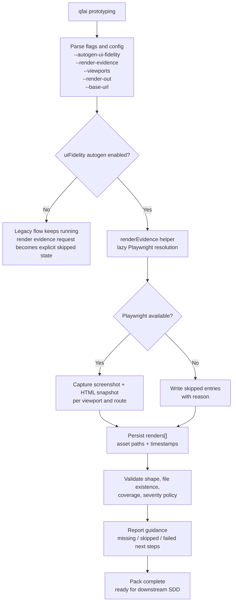

# 02_Inception-Deck

## Q1: Why are we doing this now?

QFAI v1.7.x では discussion / docs / evidence を質の高い入力に揃えない限り、後続の validator や critique が「何を見たか」を説明できない。現状は `qfai prototyping` に render capture の基盤がなく、UI の rendered output が prose に吸収されているため、品質判断が再利用できる形で残らない。v1.7.1 はこのギャップを埋める最初の release である。

## Q2: Elevator Pitch

QFAI v1.7.1 `Render Evidence Automation` は、`qfai prototyping` に rendered output の capture / skipped / failed を structured evidence として保存させ、validate と report がその evidence を理解できるようにする拡張である。browser QA を全面導入するのではなく、text-first のまま render evidence を主証跡に引き上げる。

## Q3: Package Design

Front of box:

- rendered reality を evidence として残す

Back of box:

- `--render-evidence` で render capture を有効化する
- `--viewports` で desktop / mobile などの対象を指定する
- Playwright が使えない環境では `skipped` と理由を残す
- `renders[]` に viewport / status / asset path / timestamp を残す
- validate は shape と file existence を判定し、report は次の行動を案内する
- docs と init assets は新しい evidence model を説明する

## Q4: NOT List

| Item                              | IN / OUT | Reason                                                              |
| --------------------------------- | -------- | ------------------------------------------------------------------- |
| browser QA の full audit          | OUT      | console / network / axe / CWV まで含めると v1.7.1 の scope を超える |
| screenshot diff / baseline 管理   | OUT      | visual regression は別の運用モデルが必要                            |
| external critique provider の導入 | OUT      | v1.7.1 は capture と validation に限定する                          |
| 自動修復 / レイアウト修正         | OUT      | repair は後続 release の責務                                        |
| Figma / Genspark 依存             | OUT      | CLI-first の方針と整合しない                                        |
| 新しい top-level command          | OUT      | 既存 `qfai prototyping` の拡張で足りる                              |

## Q5: Neighborhood

- `packages/qfai/src/cli/commands/prototyping.ts`: render capture の起点
- `packages/qfai/src/core/config.ts`: `uiux.renderEvidence` の設定
- `packages/qfai/src/core/types.ts`: `renders[]` を持つ型定義
- `packages/qfai/src/core/validators/prototypingEvidence.ts`: shape / file existence / coverage validation
- `packages/qfai/src/core/validators/renderCritique.ts`: render evidence を一次情報として読む
- `packages/qfai/src/core/validators/designFidelity.ts`: responsive 根拠の補強
- `packages/qfai/src/core/validators/navigationFlow.ts`: route coverage と render capture の整合補助
- `packages/qfai/src/core/report.ts`: skipped / failed の次アクション案内
- `packages/qfai/assets/init/.qfai/evidence/README.md`: evidence model の説明更新

## Q6: Technical Solution

## Q7: Risks That Keep Us Awake

| Risk                                   | Likelihood | Impact | Mitigation                                          |
| -------------------------------------- | ---------- | ------ | --------------------------------------------------- |
| Playwright 導入が重い                  | Medium     | High   | lazy import と skipped state を採用する             |
| render JSON が肥大化する               | Medium     | Medium | 画像本体は file path のみを保持する                 |
| route capture が不安定                 | Medium     | High   | render-level で partial failure を許容する          |
| legacy markdown-only projects が壊れる | Low        | High   | render evidence を optional source として扱う       |
| severity が強すぎて初回導入が難しい    | Medium     | Medium | qualityProfile と観測状態で ratchet する            |
| docs と validator の整合が崩れる       | Low        | High   | same PR で template / README / validator を更新する |

## Q8: Timeline and Milestones

| Milestone | Content                                           | Target     |
| --------- | ------------------------------------------------- | ---------- |
| M1        | 仕様整理と capture model 確定                     | 2026-03-25 |
| M2        | helper / config / type / validator 方針確定       | 2026-03-26 |
| M3        | docs / init README / report guidance 更新方針確定 | 2026-03-26 |
| M4        | test 観点と failure mode を固める                 | 2026-03-27 |

## Q9: Trade-off Sliders

| Dimension               | Priority |
| ----------------------- | -------- |
| capture の再利用性      | 高       |
| CLI の既存互換性        | 高       |
| degraded mode の明示性  | 高       |
| implementation の単純さ | 中       |
| browser QA への拡張余地 | 高       |
| 差分の小ささ            | 中       |

## Q10: What Do We Need and How Much?

| Role               | Need                                                                  |
| ------------------ | --------------------------------------------------------------------- |
| CLI/runtime author | `prototyping.ts` に flags と helper 呼び出しを統合する                |
| validator author   | render evidence の shape / file existence / coverage を定義する       |
| docs author        | evidence README と report guidance を更新する                         |
| test author        | CLI / core / config の failure path を網羅する                        |
| reviewer           | capture / skipped / failed の境界と backward compatibility を確認する |

## Work Orders Summary

| Step | Role (sub-agent) | Task title            | Input (refs)                    | Output (refs)          | Status (PASS/REVISE) |
| ---- | ---------------- | --------------------- | ------------------------------- | ---------------------- | -------------------- |
| 1    | worker           | Inception first draft | context, design memo, repo SSOT | `02_Inception-Deck.md` | PASS                 |
| 2    | orchestrator     | Inception integration | worker draft, skill constraints | `02_Inception-Deck.md` | PASS                 |
