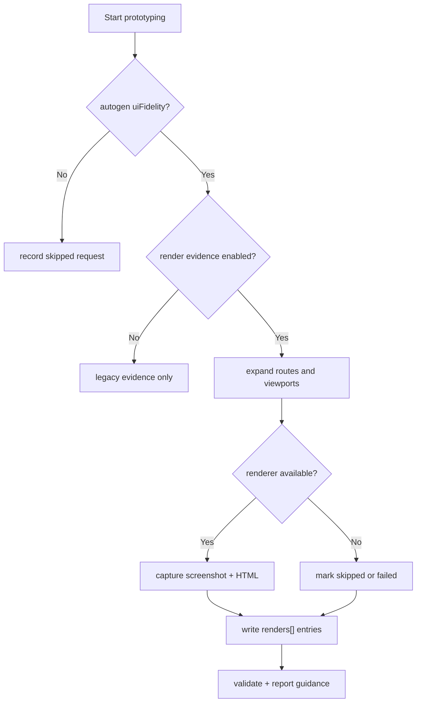
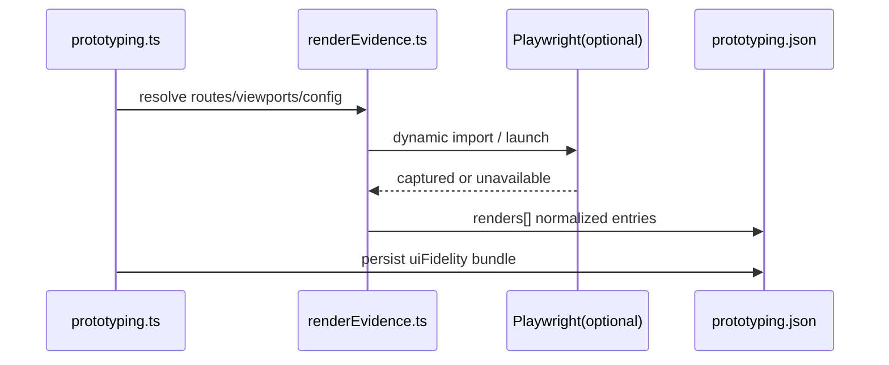

# 03_Story-Workshop

## Design Direction Pack

```yaml
visual_thesis: "Structured evidence first. Rendered reality is captured as JSON metadata plus linked screenshot and HTML assets."
content_plan:
  - CLI options and config entry points
  - Route x viewport render status
  - Validator severity and report guidance
interaction_thesis:
  - Status labels must separate captured, skipped, and failed clearly
  - Each evidence panel must expose both asset paths and next actions
anti_goals:
  - Avoid prose-only evidence with no linked assets
  - Avoid hidden degraded-mode reasons
  - Avoid generic dashboard layout
cta_hierarchy:
  primary: "Run Prototyping"
  placement: "Header action"
```

## Design Direction Summary

v1.7.1 の UI-bearing discussion artifact は、render evidence を「何を見て評価したか」を辿れる summary panel として表現する。主眼は visual polish ではなく、captured / skipped / failed と次のアクションが一目で分かる情報設計である。

### DDP Summary

- scope: `ui-bearing`
- version: `1.7.1`
- visual thesis: structured evidence first。rendered reality を JSON と asset path に接続する。
- content plan:
  - CLI option と config の入口
  - route × viewport の capture status
  - validator severity と report guidance
  - degraded mode の理由と次アクション
- interaction thesis:
  - status は captured / skipped / failed を明確に分離
  - screenshot / HTML / reason を同一面で読み取れる
  - primary action は `Run Prototyping` の 1 つに固定
- anti goals:
  - prose だけで state を説明しない
  - screenshot path を埋め込まず inline binary を持たない
  - failure reason を generic error に潰さない

### Option Comparison

- **Option A**: CLI 内部に render capture を埋め込む。変更ファイル数は少ないが command 責務が肥大化し再利用しづらい。
- **Option B**: `renderEvidence.ts` helper に抽出する。CLI と capture 責務が分離され、v1.7.4 以降に再利用しやすい。
- **Option C**: 新トップレベル command を新設する。surface は明快だが導入コストが上がり v1.7.1 の非目標に反する。

### Anchor Screen Selection

- Selected: Option B -- helper extraction keeps CLI thin and makes route/viewpoint capture reusable.
- Anchor ID: `SCREEN-ANCHOR-001`

### CTA Hierarchy

- Primary: `Run Prototyping` in the header action area.
- Secondary: `Open Evidence Folder` in the result panel.
- Tertiary: `View Guidance` in help text.
- Rule: one primary action only.

### State Coverage

- empty: evidence 未生成で、Run Prototyping を促す。
- loading: route x viewport capture を進行中として示す。
- error: browser launch failure や baseUrl unreachable を理由付きで示す。
- populated: screenshot / HTML path と render status が揃っている。
- partial: route の一部 viewport だけ failed または skipped。

### Competitive References

- Reference: existing `prototypingEvidence.ts`
  - adopted_points: render state validation and file existence checks
  - rejected_points: markdown-only evidence as the sole source of truth
  - local_translation: `renders[]` を validator/report の一次ソースに拡張する
- Reference: existing `renderCritique.ts`
  - adopted_points: markdown critique の後方互換運用
  - rejected_points: critique markdown 必須化
  - local_translation: render evidence があれば opportunistic に参照する

### Design Anti-goals

- Anti-goal: prose-only evidence を許容しない。validator と report が再利用できないため。
- Anti-goal: degraded mode の理由を隠さない。運用判断ができなくなるため。
- Anti-goal: screenshot binary を JSON に埋め込まない。evidence が肥大化するため。

## User Stories

### US-0001: CLI から render evidence capture を起動できる

- As a: QFAI 利用者
- I want: `qfai prototyping` に render evidence 用 option を追加したい
- So that: 既存コマンドのまま rendered output の証跡収集を有効化できる

#### Acceptance Criteria

- `--render-evidence`, `--viewports`, `--render-out`, `--base-url` を受け付ける
- CLI flag は config を override する
- autogen 無効時も skipped reason を evidence に残す

#### Example Seeds

| Perspective | Example | Status |
| --- | --- | --- |
| Happy path | autogen + render-evidence + desktop,mobile で asset が保存される | seed |
| Negative path | render-evidence 指定だが autogen 無効で skipped reason が残る | seed |
| Edge / boundary | desktop のみ指定でも viewport metadata が保持される | seed |
| Permission / role | CI 環境で browser 未導入でも command 全体は継続する | seed |
| State transition | route ごとに captured / failed が混在しても screen は保持される | seed |
| Idempotency / retry | 同一 command 再実行で deterministic な asset naming を維持する | seed |

### US-0002: `uiFidelity.screens[].renders[]` に normalized render bundle を保持できる

- As a: validator / report maintainer
- I want: viewport 単位の evidence state を型付きで保持したい
- So that: JSON を一次ソースとして欠落・失敗・成功を判定できる

#### Acceptance Criteria

- render entry は `viewport`, `status`, `width`, `height` を持つ
- `captured` は `imagePath` と `htmlPath` を必須にする
- `skipped` は `skippedReason`、`failed` は `error` を必須にする
- default path convention を固定する

#### Example Seeds

| Perspective | Example | Status |
| --- | --- | --- |
| Happy path | `/orders` の desktop/mobile が captured で path を持つ | seed |
| Negative path | captured だが htmlPath 欠落で validator error | seed |
| Edge / boundary | `custom` viewport でも正整数 size なら許可 | seed |
| Permission / role | docs consumer が JSON path だけで asset を辿れる | seed |
| State transition | skipped から captured に再実行で更新される | seed |
| Idempotency / retry | same route rerun でも state の意味が変わらない | seed |

### US-0003: renderer 不在時も degraded mode で継続できる

- As a: Playwright を常備できない利用者
- I want: capture 不可でも autogen と validation の主フローを止めたくない
- So that: degraded state を把握しつつ導入障壁を上げない

#### Acceptance Criteria

- Playwright 未導入・launch failure・baseUrl unreachable を reason で区別する
- `failOpen: true` のとき command は継続する
- report guidance に install / start app / rerun が出る

#### Example Seeds

| Perspective | Example | Status |
| --- | --- | --- |
| Happy path | failOpen 環境で skipped reason を記録して JSON 生成まで継続 | seed |
| Negative path | reason 欠落で validator error | seed |
| Edge / boundary | 一部 viewport だけ failed でも他 viewport は captured | seed |
| Permission / role | CI は skipped、ローカルは captured の差分を許容 | seed |
| State transition | skipped after install Playwright で captured に移る | seed |
| Idempotency / retry | baseUrl 起動後の再実行で skipped が解消される | seed |

### US-0004: `qualityProfile` に応じて render evidence 欠落の severity を調整できる

- As a: quality gate maintainer
- I want: default/high/strict で evidence 欠落の重さを変えたい
- So that: first release では導入を促しつつ strict 環境では hard gate にできる

#### Acceptance Criteria

- shape invalid と captured file missing は全 profile で error
- missing render / all skipped / required viewport missing は profile で ratchet する
- skeleton mode では render requirement を適用しない

#### Example Seeds

| Perspective | Example | Status |
| --- | --- | --- |
| Happy path | default profile で missing renders が warning | seed |
| Negative path | strict profile で all skipped が error | seed |
| Edge / boundary | high profile で mobile 欠落のみ error | seed |
| Permission / role | team policy で strict を採用する | seed |
| State transition | same evidence を profile 変更で再評価する | seed |
| Idempotency / retry | rerun without changes keeps same severity | seed |

### US-0005: legacy critique workflow を壊さずに render evidence を opportunistic に使う

- As a: 既存利用者
- I want: markdown critique 中心の project が v1.7.1 で突然壊れないでほしい
- So that: 新モデルへ段階的に移行できる

#### Acceptance Criteria

- `renderCritique.ts` は `renders[]` があれば viewport existence の一次ソースとして扱う
- critique markdown があれば従来どおり読む
- render evidence あり / critique markdown 無しは warning に留める
- `designFidelity.ts` は responsive evidence missing warning を出せる

#### Example Seeds

| Perspective | Example | Status |
| --- | --- | --- |
| Happy path | markdown-only project が従来どおり validate される | seed |
| Negative path | responsive score があるのに evidence 無しで warning | seed |
| Edge / boundary | render evidence あり、markdown critique 無しで warning のみ | seed |
| Permission / role | docs-only consumer は markdown summary を参照できる | seed |
| State transition | legacy project が render-evidence enabled に移行 | seed |
| Idempotency / retry | evidence 追加で false positive が解消される | seed |

## User Flows





## Flow Descriptions

- Flow 1:
  - Entry point: `qfai prototyping --autogen-ui-fidelity --render-evidence`
  - Steps: config normalize -> helper resolve -> route/viewports expansion -> capture or skipped -> JSON persist -> validation
  - Exit point: `prototyping.json` と asset files 生成、または skipped/failed reason の記録

## Screen Mock (HTML+CSS)

```html
<section class="render-evidence-panel">
  <header class="panel-header">
    <div>
      <p class="eyebrow">QFAI v1.7.1</p>
      <h1>Render Evidence Bundle</h1>
      <p class="summary">各 route の desktop / mobile capture 状態を JSON と asset path で追跡します。</p>
    </div>
    <button type="button" class="primary">Run Prototyping</button>
  </header>
  <div class="route-card">
    <h2>/orders</h2>
    <ul class="viewport-list">
      <li><strong>desktop</strong><span class="captured">captured</span></li>
      <li><strong>mobile</strong><span class="skipped">skipped</span></li>
    </ul>
    <p class="paths">orders.desktop.png / orders.desktop.html</p>
    <p class="reason">mobile skipped: Playwright is not installed</p>
  </div>
</section>
```

```css
/* token: semantic.surface */
.render-evidence-panel {
  max-width: 880px;
  margin: 32px auto;
  padding: 28px;
  border-radius: 20px;
  background: linear-gradient(180deg, #0f172a 0%, #172554 100%);
  color: #e2e8f0;
  font-family: "Segoe UI", Arial, sans-serif;
}

/* token: semantic.layout */
.panel-header {
  display: flex;
  justify-content: space-between;
  gap: 24px;
  align-items: start;
}

/* token: semantic.emphasis */
.eyebrow {
  margin: 0 0 8px;
  letter-spacing: 0.16em;
  text-transform: uppercase;
  color: #93c5fd;
}

.primary {
  border: 0;
  border-radius: 999px;
  padding: 12px 20px;
  font-weight: 700;
  background: #f59e0b;
  color: #0f172a;
}

.route-card {
  margin-top: 24px;
  padding: 20px;
  border-radius: 16px;
  background: rgba(15, 23, 42, 0.55);
  border: 1px solid rgba(148, 163, 184, 0.24);
}

.viewport-list {
  display: grid;
  grid-template-columns: repeat(2, minmax(0, 1fr));
  gap: 12px;
  padding: 0;
  list-style: none;
}

.captured,
.skipped {
  margin-left: 8px;
  padding: 2px 8px;
  border-radius: 999px;
  font-size: 12px;
}

.captured { background: rgba(16, 185, 129, 0.2); color: #6ee7b7; }
.skipped { background: rgba(245, 158, 11, 0.2); color: #fcd34d; }
.paths,
.reason { color: #cbd5e1; }
```

## Work Orders Summary

| Step | Role (sub-agent) | Task title | Input (refs) | Output (refs) | Status (PASS/REVISE) |
| ---- | ---------------- | ---------- | ------------ | ------------- | -------------------- |
| 1 | Story Facilitator | User stories and flows draft | design doc, context, inception deck | story draft | PASS |
| 2 | UI/UX Analyst | HTML+CSS mock and state review | story draft, UI requirement | mock notes | PASS |
| 3 | Orchestrator | Story workshop integration | reviewed draft | `03_Story-Workshop.md` | PASS |
