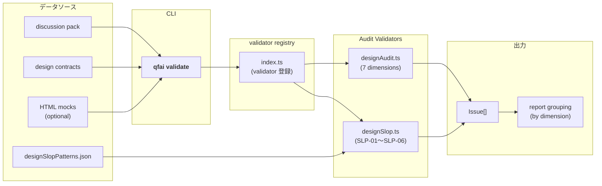

# 02 Inception Deck

> **QFAI v1.7.2 — Design Audit & Slop Guardrails**

---

## 1. Why Are We Here?

QFAI の UI/UX 品質評価に**静的な design audit** と **AI slop guardrails** を導入するため。

現状の validator は「あるべき項目があるか」を検証するが、設計判断の雑さを検知できない。具体的には以下のような品質劣化パターンが見逃される:

- **Generic AI UI** — AI が生成しがちな没個性的・テンプレート的な UI
- **Token drift** — design token から逸脱したハードコード値の混入
- **State omission** — empty / error / loading / skeleton 等の状態定義漏れ
- **Hierarchy weakness** — CTA の優先度や視覚的階層の不備

これらを render/browser に依存せず、構造的・静的に検知する仕組みが必要である。

---

## 2. Elevator Pitch

| 要素 | 内容 |
|---|---|
| **For** | QFAI を使って UI 品質を管理するチーム |
| **Who** | AI 生成 UI の品質劣化（slop）を静的段階で検知したい |
| **The** | QFAI v1.7.2 Design Audit & Slop Guardrails |
| **Is a** | 静的 UI 品質監査機能 |
| **That** | design token drift, CTA hierarchy weakness, state omission, generic AI patterns を検知する |
| **Unlike** | render/browser QA や screenshot critique |
| **Our product** | render evidence 非依存で、構造的に設計品質を監査できる |

---

## 3. Product Box (Feature Highlights)

### Design Audit — 7 つの監査 dimension

| # | Dimension | 概要 |
|---|---|---|
| 1 | `tokenDiscipline` | design token の遵守度を検査 |
| 2 | `visualHierarchy` | CTA・見出し等の視覚的階層の妥当性 |
| 3 | `stateCoverage` | empty / error / loading / skeleton 等の状態定義網羅性 |
| 4 | `densityBalance` | 情報密度・余白バランスの適切性 |
| 5 | `referenceTranslation` | リファレンスからの設計意図の翻訳精度 |
| 6 | `antiPatternRisk` | 既知のアンチパターンとの一致度 |
| 7 | `flowClarity` | 画面遷移・操作フローの明確性 |

### Slop Guardrails — 6 カテゴリの AI slop 検知

| Code | Category | 検知対象 |
|---|---|---|
| SLP-01 | Generic AI Pattern | テンプレート的・没個性的な UI 構成 |
| SLP-02 | Token Drift | design token 外のハードコード値 |
| SLP-03 | CTA Hierarchy Weakness | 主要 CTA の優先度不備 |
| SLP-04 | State Omission | 必須状態の定義漏れ |
| SLP-05 | Density Imbalance | 過密/過疎な情報配置 |
| SLP-06 | Flow Ambiguity | 遷移・操作フローの曖昧さ |

### Quality Profile

| Profile | 用途 | 挙動 |
|---|---|---|
| `default` | 一般プロジェクト | 主要ルール advisory、重大のみ blocking |
| `high` | 品質重視プロジェクト | ほとんどのルール blocking |
| `strict` | リリース前ゲート | 全ルール blocking |

---

## 4. NOT List (Out of Scope)

| In Scope | Out of Scope |
|---|---|
| 静的 design audit | browser QA (console/network/CWV/axe) |
| AI slop 検知 | screenshot critique |
| rule-based / structured report | external AI critique adapter |
| quality profile 切替 | automatic fix / rewrite |
| DDP / Workshop / contracts 横断監査 | visual regression baseline |
| config による enable/disable | Figma / Genspark / MCP 依存 |

---

## 5. Meet Your Neighbors (Stakeholders & Dependencies)

### Upstream（上流依存）

| バージョン | 内容 | 依存度 |
|---|---|---|
| v1.7.0 | Discussion Design Hardening | **必須** — DDP 構造・design contract が前提 |
| v1.7.1 | Render Evidence Automation | optional — HTML mock があればより精度が上がる |

### Downstream（下流影響）

| バージョン | 内容 |
|---|---|
| v1.7.3+ | render/browser evidence 統合、critique adapter |

### External

なし（tool-agnostic 維持）。外部ツール・サービスへの依存を持たない。

---

## 6. Show the Solution (Architecture Overview)

### 処理フロー

1. `qfai validate` コマンドが discussion pack・design contracts・optional HTML mocks を読み込む
2. validator registry (`index.ts`) が登録済み validator を順次実行
3. `designAudit.ts` が 7 つの audit dimension で静的監査を実行
4. `designSlop.ts` が `designSlopPatterns.json` のパターン定義を参照し AI slop を検知
5. 各 validator が `Issue[]` を返却
6. report モジュールが dimension 別にグルーピングして出力

---

## 7. What Keeps Us Up at Night (Risks)

| Risk | Probability | Impact | Mitigation |
|---|---|---|---|
| False positives on minimal/internal tools | medium | medium | UI-bearing gating、style-heuristic advisory、`audit.enabled: false` で無効化可能 |
| Validator sprawl and overlapping logic | low | high | DDP 構造を `ddpValidation.ts` に集約、audit 集約を `designAudit.ts` に一元化 |
| Token drift detection noise | medium | low | threshold-based 検知（単一インスタンスでは発火しない） |
| Report verbosity | low | medium | dimension 別グルーピング、重複 cap で出力量を抑制 |

---

## 8. Size It Up (Effort & Timeline)

### 新規ファイル（3 件）

| ファイル | 役割 |
|---|---|
| `designAudit.ts` | 7 dimension の静的 design audit validator |
| `designSlop.ts` | SLP-01〜SLP-06 の AI slop guardrails validator |
| `designSlopPatterns.json` | slop パターン定義（ルールデータ） |

### 変更ファイル（約 6 件）

| ファイル | 変更内容 |
|---|---|
| `index.ts` | 新 validator の登録 |
| `config.ts` | quality profile・audit 設定の追加 |
| `report.ts` | dimension 別グルーピング出力 |
| `ddpValidation.ts` | DDP 構造の audit 連携 |
| `designToken.ts` | token drift 検知ロジックの拡張 |
| `uiDefinitionConsistency.ts` | state coverage 検証の強化 |

### テスト

| 種別 | 件数 |
|---|---|
| 新規テスト | 2 件（`designAudit.test.ts`, `designSlop.test.ts`） |
| 既存テスト更新 | 約 5 件 |

---

## 9. What's Going to Give (Trade-offs)

| Dimension | Priority | Notes |
|---|---|---|
| **Quality** | 1 | false-positive 最小化が最重要。誤検知が多いと信頼を失い無効化される |
| **Scope** | 2 | 静的監査に限定。render QA・browser QA は後続バージョンで対応 |
| **Time** | 3 | v1.7.0 との互換性維持が必要。破壊的変更を避ける |
| **Budget** | 4 | — |

---

## 10. What's It Going to Take (Team & Resources)

| リソース | 必要性 |
|---|---|
| **TypeScript 開発能力** | validator・config・report の実装に必須 |
| **QFAI validator パターンの理解** | 既存の validator registry・Issue 型・report 構造への適合 |
| **UI/UX design audit ドメイン知識** | audit dimension の妥当性判断、slop パターンの定義精度 |
