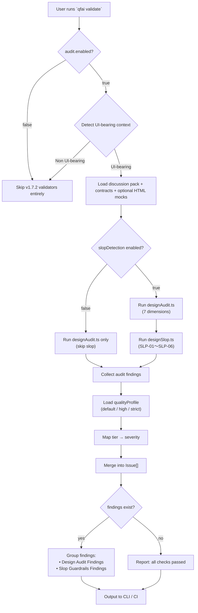

# 03 Story Workshop

> **Note:** v1.7.2 "Design Audit & Slop Guardrails" は CLI validator 機能であり、エンドユーザー向け UI を持たない。HTML+CSS モック・Design Direction Summary は不要。

| Item    | Value                              |
| ------- | ---------------------------------- |
| Version | v1.7.2                             |
| Date    | 2026-03-26                         |
| Status  | Draft                              |
| Scope   | Design Audit & Slop Guardrails     |

---

## User Stories

### US-001: Design Audit 実行

- **As a:** QFAI ユーザー
- **I want:** `qfai validate` で UI-bearing artifact に対して design audit を実行する
- **So that:** design token drift, CTA hierarchy weakness, state omission などの構造的不備を静的に検知できる

#### Acceptance Criteria

- **AC-001-01:** UI-bearing pack に対して 7 dimension (tokenDiscipline, visualHierarchy, stateCoverage, densityBalance, referenceTranslation, antiPatternRisk, flowClarity) の audit findings が出力される
- **AC-001-02:** 各 finding に stable rule ID (QFAI-AUD-XXX) が付与される
- **AC-001-03:** finding に evidence (対象ファイルパス) と remediation guidance が含まれる

#### Example Seeds

| Perspective         | Example                                                                       | Status                                  |
| ------------------- | ----------------------------------------------------------------------------- | --------------------------------------- |
| Happy path          | UI-bearing pack で全 dimension PASS → finding なし                            | seed                                    |
| Negative path       | primary CTA 未定義の anchor screen → QFAI-AUD-001 error                      | seed                                    |
| Edge / boundary     | design tokens 存在するが contracts で raw 値が 5 個ちょうど → threshold 判定  | seed                                    |
| Permission / role   | N/A — CLI ツールでロール区別なし                                              | seed (skipped: CLI tool has no role distinction) |
| State transition    | N/A — stateless validator                                                     | seed (skipped: stateless single-run)    |
| Idempotency / retry | 同一 pack で validate を 2 回実行 → 同一結果                                 | seed                                    |

---

### US-002: Slop Guardrails 実行

- **As a:** QFAI ユーザー
- **I want:** AI 生成 UI の再現性のある低品質パターン（slop）を検知する
- **So that:** generic AI SaaS shell, token bypass, CTA inflation などの問題を早期に発見できる

#### Acceptance Criteria

- **AC-002-01:** SLP カテゴリ (SLP-01〜SLP-06) に基づく slop findings が出力される
- **AC-002-02:** 各 finding に stable rule ID (QFAI-SLP-XXX) が付与される
- **AC-002-03:** designSlopPatterns.json から rule 定義をロードして検知する

#### Example Seeds

| Perspective         | Example                                                                         | Status                  |
| ------------------- | ------------------------------------------------------------------------------- | ----------------------- |
| Happy path          | slop パターンなし → finding なし                                                | seed                    |
| Negative path       | generic centered hero pattern → QFAI-SLP-001 warning                           | seed                    |
| Edge / boundary     | anti-goal に明示的に hero 記載あり → slop 検知しない（intentional）              | seed                    |
| Permission / role   | N/A                                                                             | seed (skipped: CLI tool) |
| State transition    | N/A                                                                             | seed (skipped: stateless) |
| Idempotency / retry | 同一 pack で validate 2 回実行 → 同一結果                                      | seed                    |

---

### US-003: Quality Profile による severity 制御

- **As a:** QFAI ユーザー
- **I want:** quality profile (default/high/strict) に応じて rule tier の severity を制御する
- **So that:** プロジェクト段階に応じて advisory と blocking を切り替えられる

#### Acceptance Criteria

- **AC-003-01:** Tier 1 (structural-blocking) は全プロファイルで error
- **AC-003-02:** Tier 2 (strong-advisory) は default/high で warning, strict で error
- **AC-003-03:** Tier 3 (style-heuristic) は default で info/warning, high で warning, strict で warning

#### Example Seeds

| Perspective         | Example                                                                  | Status           |
| ------------------- | ------------------------------------------------------------------------ | ---------------- |
| Happy path          | default profile で Tier 2 rule → warning として出力                      | seed             |
| Negative path       | strict profile で Tier 2 rule → error として出力、validate が fail-on error で失敗 | seed             |
| Edge / boundary     | config で qualityProfile 未指定 → default にフォールバック               | seed             |
| Permission / role   | N/A                                                                      | seed (skipped)   |
| State transition    | N/A                                                                      | seed (skipped)   |
| Idempotency / retry | profile 変更なしで再実行 → 同一 severity                                | seed             |

---

### US-004: Design Audit/Slop の有効/無効切替

- **As a:** QFAI ユーザー
- **I want:** config で audit.enabled や slopDetection を false にできる
- **So that:** 特定プロジェクトや段階で不要な検知を無効化できる

#### Acceptance Criteria

- **AC-004-01:** audit.enabled: false で v1.7.2 の全バリデータが無効化される
- **AC-004-02:** slopDetection: false で slop バリデータのみ無効化される
- **AC-004-03:** config 省略時はデフォルト（全有効）で動作する

#### Example Seeds

| Perspective         | Example                                                            | Status           |
| ------------------- | ------------------------------------------------------------------ | ---------------- |
| Happy path          | audit.enabled: true, slopDetection: true → 全検知                 | seed             |
| Negative path       | audit.enabled: false → design audit/slop 一切なし                 | seed             |
| Edge / boundary     | audit.enabled: true, slopDetection: false → audit のみ、slop なし | seed             |
| Permission / role   | N/A                                                                | seed (skipped)   |
| State transition    | N/A                                                                | seed (skipped)   |
| Idempotency / retry | config 変更なしで再実行 → 同一動作                                | seed             |

---

### US-005: Report グループ化

- **As a:** QFAI ユーザー
- **I want:** report で design audit findings と slop guardrails findings が分離されてグループ表示される
- **So that:** 問題の種類を素早く把握し、優先度付けできる

#### Acceptance Criteria

- **AC-005-01:** report に "Design Audit Findings" セクションがある
- **AC-005-02:** report に "Slop Guardrails Findings" セクションがある
- **AC-005-03:** 各 finding に rule ID, why, evidence, guidance が含まれる

#### Example Seeds

| Perspective         | Example                                                              | Status           |
| ------------------- | -------------------------------------------------------------------- | ---------------- |
| Happy path          | audit + slop findings あり → 2 セクション表示                       | seed             |
| Negative path       | findings ゼロ → セクション非表示または empty 表記                    | seed             |
| Edge / boundary     | audit findings のみ、slop なし → audit セクションのみ表示            | seed             |
| Permission / role   | N/A                                                                  | seed (skipped)   |
| State transition    | N/A                                                                  | seed (skipped)   |
| Idempotency / retry | 同一入力 → 同一 report 構造                                         | seed             |

---

## User Flows

---

## Flow Descriptions

### Flow 1: Design Audit & Slop Guardrails 実行フロー

- **Entry:** `qfai validate` コマンド実行
- **Steps:**
  1. config から `audit.enabled` を確認。false なら v1.7.2 バリデータ全体をスキップ
  2. Discussion pack を解析し UI-bearing context を検出。非 UI-bearing ならスキップ
  3. Discussion pack, contracts, optional HTML mocks をロード
  4. `slopDetection` 設定を確認
  5. `designAudit.ts` で 7 dimension (tokenDiscipline, visualHierarchy, stateCoverage, densityBalance, referenceTranslation, antiPatternRisk, flowClarity) を分析し findings を生成
  6. `slopDetection` 有効なら `designSlop.ts` で `designSlopPatterns.json` に基づく slop pattern findings を生成
  7. `qualityProfile` (default/high/strict) に基づき tier → severity をマッピング
  8. 全 findings を `Issue[]` にマージ
  9. Report で "Design Audit Findings" と "Slop Guardrails Findings" にグループ化して出力
- **Exit:** CLI / CI に grouped findings を出力。findings がなければ all checks passed を表示

---

## Notes

- **No UI requirements.** v1.7.2 は CLI validator 機能のみ。HTML+CSS screen mock・Design Direction Summary は対象外。
- **Target users:** QFAI ユーザー（CLI / CI 上でバリデーションを実行する開発者）
- **Scope boundary:** design audit の 7 dimension 検知と slop guardrails の SLP-01〜SLP-06 検知に限定。auto-fix や IDE integration は v1.7.2 のスコープ外。
