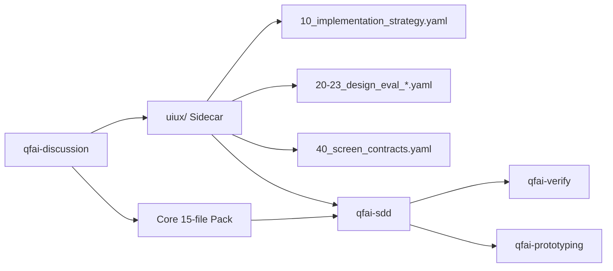

# 02 Inception Deck

## Q1. Why Are We Here?

The current `qfai-discussion` skill cannot produce scoring-ready UI/UX artifacts. When applied to UI-bearing projects, it outputs generic HTML/CSS mock references that downstream skills (`qfai-sdd`, `qfai-verify`, `qfai-prototyping`) cannot score, verify, or use as contract inputs. This blocks the automated quality pipeline for any project with a user interface.

We are here to close that gap by introducing a structured `uiux/` sidecar artifact family into the discussion pack.

## Q2. Elevator Pitch

**For** QFAI users building UI-bearing projects,
**Who** need structured UI/UX design artifacts that downstream skills can consume,
**The** `uiux/` sidecar artifact family
**Is** a discussion-phase artifact set
**That** enables scoring, review, and contract generation for UI/UX design decisions.
**Unlike** generic HTML/CSS mocks embedded in the current discussion output,
**Our product** provides structured, downstream-readable design artifacts with defined scoring axes and screen contracts.

## Q3. Product Box

### Front of the Box

**uiux/ Sidecar Family for qfai-discussion**

- 11 structured YAML/Markdown artifacts covering implementation strategy, design evaluation, and screen contracts
- 3-layer scoring axes (usability, consistency, accessibility) aligned with `qfai-verify` gates
- Drop-in additive extension -- zero breakage for non-UI projects

### Back of the Box

- `10_implementation_strategy.yaml` -- UI implementation approach and technology decisions
- `20-23_design_eval_*.yaml` -- Scoring rubrics across usability, visual consistency, and accessibility axes
- `40_screen_contracts.yaml` -- Formal screen-level contracts consumable by `qfai-sdd` and `qfai-prototyping`
- Batch A/B core template augmentation with UX intent cross-references
- Updated `SKILL.md` with explicit UI-bearing flow branching

## Q4. NOT List

### In Scope

| Item                        | Description                                                     |
| --------------------------- | --------------------------------------------------------------- |
| uiux/ sidecar templates     | All 11 sidecar artifact files                                   |
| SKILL.md update             | UI-bearing flow, sidecar triggers, authoring guidance           |
| Direct template replacement | Templates `03`, `04`, `14` replaced with sidecar-aware versions |
| Batch A/B augmentation      | Core templates gain UX intent cross-references                  |

### Out of Scope

| Item                          | Reason                                                                        |
| ----------------------------- | ----------------------------------------------------------------------------- |
| Validator enforcement rules   | Deferred to v1.7.4+ -- validators need sidecar schema finalization first      |
| Reviewer prompt updates       | Separate concern; reviewer skills consume artifacts but are not modified here |
| Render/browser evidence       | Runtime evidence collection is a `qfai-verify` responsibility                 |
| External critique integration | Third-party design review tooling is out of QFAI scope                        |
| Migration tooling             | Existing discussion packs are not retroactively upgraded                      |

### Unresolved

| Item                                              | Decision Needed By               |
| ------------------------------------------------- | -------------------------------- |
| Sidecar file naming convention finalization       | Before template authoring begins |
| Progressive disclosure strategy for 26-file packs | Before SKILL.md update           |

## Q5. Meet Your Neighbors

### Upstream

- **QFAI v1.7.3 Design Spec** -- defines the sidecar structure and integration points
- **Roadmap Compression Mapping v0.1** -- consolidates the former v1.7.3-v1.7.6 scope into this release
- **Pre-discussion UIUX Architecture Decisions v0.1** -- establishes sidecar isolation and compatibility constraints

### Downstream

- **qfai-sdd** -- consumes screen contracts and design evaluation artifacts to generate SDD sections
- **qfai-verify** -- uses scoring axes from sidecar to run UI/UX quality gates
- **qfai-prototyping** -- reads screen contracts to scaffold runnable UI prototypes
- **qfai-atdd** -- references sidecar artifacts for acceptance test scenario generation

## Q6. Show the Solution

### Architecture Overview

### Key Architectural Decisions

1. **Additive sidecar model** -- The `uiux/` directory sits alongside the core pack rather than modifying it. This preserves backward compatibility for non-UI projects.
2. **YAML-first artifact format** -- Sidecar files use YAML to enable machine-readable scoring and contract extraction by downstream skills.
3. **Cross-reference annotations** -- Core templates `03`, `04`, and `14` are replaced (not patched) to cleanly integrate sidecar references. Batch A/B templates receive annotation blocks that point to relevant sidecar files without changing their existing structure.

## Q7. What Keeps Us Up at Night?

| Risk                                                                                   | Likelihood | Impact | Mitigation                                                                                  |
| -------------------------------------------------------------------------------------- | ---------- | ------ | ------------------------------------------------------------------------------------------- |
| **Authoring friction** -- 26-file output overwhelms authors and reviewers              | Medium     | Medium | Batch grouping in SKILL.md; progressive disclosure; clear authoring order guidance          |
| **SKILL.md ambiguity** -- unclear when to trigger sidecar generation                   | Medium     | High   | Explicit decision gate in SKILL.md with boolean UI-bearing check; worked examples           |
| **Core/sidecar boundary blur** -- responsibilities leak between core and sidecar files | Low        | High   | Strict boundary definition in architecture decisions; review checklist for template authors |

## Q8. Size It Up

### Delivery Slices

| Slice | Description                                                       | Estimate  |
| ----- | ----------------------------------------------------------------- | --------- |
| S1    | Create 11 uiux/ sidecar template files                            | 1 session |
| S2    | Update SKILL.md with UI-bearing flow and sidecar triggers         | 1 session |
| S3    | Replace direct templates (03, 04, 14) with sidecar-aware versions | 1 session |
| S4    | Augment Batch A/B core templates with UX intent cross-references  | 1 session |

**Target release:** QFAI v1.7.3
**Total slices:** 4 internal slices

## Q9. What Are the Trade-offs?

Priority ranking (1 = most constrained, 4 = most flexible):

| Priority | Lever   | Rationale                                                                                                            |
| -------- | ------- | -------------------------------------------------------------------------------------------------------------------- |
| 1        | Scope   | All 11 sidecar files and SKILL.md update are required for downstream consumers to function. Scope cannot be reduced. |
| 2        | Quality | Sidecar artifacts must be scoring-ready. Downstream skills depend on well-formed YAML and correct cross-references.  |
| 3        | Time    | Target is v1.7.3 release, but slipping to a patch release is acceptable if quality is at risk.                       |
| 4        | Budget  | No external cost; work is performed by the QFAI maintainer and AI assistant.                                         |

## Q10. What Does It Take?

### Required Resources

| Resource                | Role                                                                | Availability |
| ----------------------- | ------------------------------------------------------------------- | ------------ |
| QFAI package maintainer | Template authoring, SKILL.md update, review                         | Available    |
| AI assistant            | Artifact generation, cross-reference validation, consistency checks | Available    |

### Infrastructure

No additional infrastructure is required. All artifacts are static YAML/Markdown files within the existing QFAI repository structure. No new CI pipelines, external services, or runtime dependencies are introduced.
