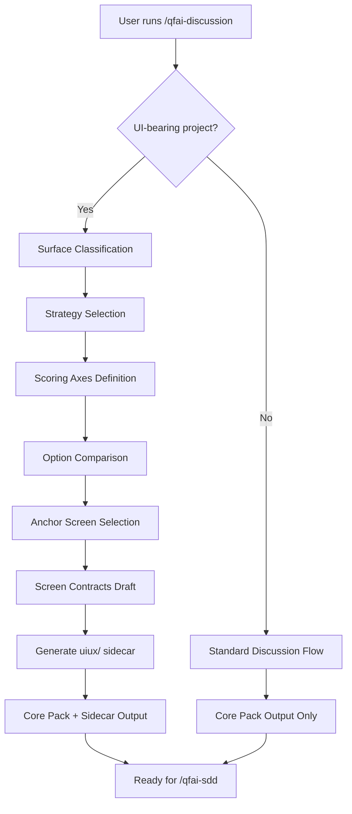

# 03 Story Workshop

> **Note:** v1.7.3 "Discussion/UIUX Authoring Foundation" is an internal tooling change that adds UI/UX authoring capabilities to the `qfai-discussion` skill. It is NOT a UI product itself. HTML+CSS screen mock and Design Direction Summary sections are not applicable.

| Item    | Value                                  |
| ------- | -------------------------------------- |
| Version | v1.7.3                                 |
| Date    | 2026-03-28                             |
| Status  | Draft                                  |
| Scope   | Discussion/UIUX Authoring Foundation   |

---

## User Stories

### US-001: Structured uiux/ Sidecar Artifact Generation

- **As a:** QFAI user running qfai-discussion on a UI-bearing project
- **I want:** discussion to produce structured uiux/ sidecar artifacts
- **So that:** downstream validators and reviewers receive scoring-ready inputs

#### Acceptance Criteria

- **AC-001-01:** When a UI-bearing project is detected, a `uiux/` sidecar directory is created containing all 11 files (00_index, 10_strategy, 20-23_eval axes, 30_comparison, 31_anchor, 40_contracts, 50_review_bundle, 60_critique_loop)
- **AC-001-02:** Each sidecar file conforms to its defined YAML/MD schema
- **AC-001-03:** Non-UI projects skip sidecar generation without errors

#### Example Seeds

| Perspective         | Example                                                                                                     | Status |
| ------------------- | ----------------------------------------------------------------------------------------------------------- | ------ |
| Happy path          | UI-bearing project detected → `uiux/` created with all 11 files, each valid against schema                  | seed   |
| Negative path       | Non-UI project (CLI tool) → no `uiux/` directory created, no error emitted                                  | seed   |
| Edge / boundary     | Project has ambiguous UI signals (e.g., config-only web endpoint) → detection heuristic classifies correctly | seed   |
| Permission / role   | Read-only filesystem → sidecar generation fails with clear IO error, no partial writes                      | seed   |
| State transition    | Re-run discussion on same project after editing context → sidecar files regenerated, previous overwritten    | seed   |
| Idempotency / retry | Run qfai-discussion twice on identical input → identical `uiux/` output both times                          | seed   |

---

### US-002: SKILL.md UI/UX Authoring Guidance

- **As a:** QFAI user
- **I want:** the SKILL.md to guide me through UI/UX authoring decisions (surface classification, strategy selection, scoring axes)
- **So that:** I don't fall back to generic defaults

#### Acceptance Criteria

- **AC-002-01:** SKILL.md includes UI-bearing detection criteria (heuristics and signals used to classify a project as UI-bearing)
- **AC-002-02:** SKILL.md defines completion conditions for UI-bearing projects: strategy selected, scoring axes defined, anchor screen chosen, contracts drafted
- **AC-002-03:** Non-UI completion conditions remain unchanged from previous behavior

#### Example Seeds

| Perspective         | Example                                                                                                        | Status |
| ------------------- | -------------------------------------------------------------------------------------------------------------- | ------ |
| Happy path          | UI-bearing project → SKILL.md flow reaches strategy selection, scoring, anchor, contracts before marking done   | seed   |
| Negative path       | Non-UI project → SKILL.md flow skips UI/UX steps, completes with standard conditions only                      | seed   |
| Edge / boundary     | Project initially non-UI, user adds UI context mid-discussion → SKILL.md detects change, activates UI flow     | seed   |
| Permission / role   | N/A — SKILL.md is a template consumed by the assistant, no role distinction                                    | seed (skipped: no role distinction) |
| State transition    | Discussion progresses from detection → strategy → scoring → anchor → contracts → completion in correct order    | seed   |
| Idempotency / retry | Re-reading SKILL.md with same project context → same detection result and same flow activation                  | seed   |

---

### US-003: Direct Template Behavior/State/Interaction Focus

- **As a:** QFAI user
- **I want:** the direct templates (03, 04, 14) to emphasize behavior/state/interaction over generic visual mock
- **So that:** discussion outputs are actionable for downstream specs

#### Acceptance Criteria

- **AC-003-01:** 03_Story-Workshop template shifts primary focus from HTML mock to behavior obligations (state coverage, interaction contracts, error handling)
- **AC-003-02:** 04_Sources template includes a translation-aware registry with adopted/rejected/local_translation classification for each reference
- **AC-003-03:** 14_Review-Request template adds sidecar artifact review scope (reviewer is prompted to verify `uiux/` completeness)

#### Example Seeds

| Perspective         | Example                                                                                                      | Status |
| ------------------- | ------------------------------------------------------------------------------------------------------------ | ------ |
| Happy path          | UI-bearing project → 03 template generates behavior obligations section instead of HTML mock                  | seed   |
| Negative path       | Non-UI project → 03 template omits both HTML mock and behavior obligations sections (neither applies)         | seed   |
| Edge / boundary     | 04_Sources has zero competitive references → registry table present but empty, no schema violation            | seed   |
| Permission / role   | N/A — templates are internal skill artifacts, no role distinction                                             | seed (skipped: no role distinction) |
| State transition    | 14_Review-Request generated before sidecar exists → review scope notes sidecar as pending                    | seed   |
| Idempotency / retry | Regenerate templates from same discussion context → identical output                                          | seed   |

---

### US-004: Core Template UX Intent Cross-References

- **As a:** QFAI user
- **I want:** core templates (01, 02, 05-12, 99) to include product-level UX intent cross-references
- **So that:** design intent is traceable without fixing concrete UI

#### Acceptance Criteria

- **AC-004-01:** Batch A/B templates include UX intent placeholders that reference design goals without prescribing specific UI
- **AC-004-02:** No concrete UI (specific layouts, colors, component names) is hardcoded in core templates
- **AC-004-03:** Cross-references link to `uiux/` sidecar artifacts when present; gracefully degrade when absent

#### Example Seeds

| Perspective         | Example                                                                                                      | Status |
| ------------------- | ------------------------------------------------------------------------------------------------------------ | ------ |
| Happy path          | UI-bearing project → core templates contain `<!-- UX-INTENT: see uiux/10_strategy.md -->` cross-refs         | seed   |
| Negative path       | Non-UI project → UX intent placeholders render as empty/hidden, no broken links                               | seed   |
| Edge / boundary     | Partial sidecar (e.g., only 6 of 11 files exist) → cross-refs present for existing files, missing noted       | seed   |
| Permission / role   | N/A — core templates are internal skill artifacts, no role distinction                                        | seed (skipped: no role distinction) |
| State transition    | Sidecar generated after core templates → re-generation of core templates picks up cross-refs                  | seed   |
| Idempotency / retry | Regenerate core templates twice with same sidecar → identical cross-references                                 | seed   |

---

## User Flows

---

## Flow Descriptions

### Flow 1: UI-Bearing Discussion Flow

- **Entry point:** User runs `/qfai-discussion` on a project
- **Steps:**
  1. SKILL.md detection heuristics evaluate project context and classify it as UI-bearing
  2. **Surface Classification** — identify the type of UI surface (web app, mobile, dashboard, form-centric, etc.)
  3. **Strategy Selection** — choose a UI/UX authoring strategy based on surface type and project goals (written to `uiux/10_strategy.md`)
  4. **Scoring Axes Definition** — define evaluation axes for comparing design options (written to `uiux/20-23_eval` files)
  5. **Option Comparison** — compare 2+ design approaches against the scoring axes (written to `uiux/30_comparison.md`)
  6. **Anchor Screen Selection** — select the primary screen that anchors the design direction (written to `uiux/31_anchor.md`)
  7. **Screen Contracts Draft** — draft interaction contracts for anchor and key screens (written to `uiux/40_contracts.md`)
  8. **Sidecar Generation** — assemble all 11 `uiux/` files including index, review bundle, and critique loop
  9. **Core Pack Assembly** — generate core discussion pack (01-14, 99) with UX intent cross-references linking to `uiux/` sidecar
  10. Output: Core Pack + `uiux/` sidecar directory
- **Exit point:** Discussion pack is complete and ready for `/qfai-sdd`

### Flow 2: Non-UI Discussion Flow

- **Entry point:** User runs `/qfai-discussion` on a project
- **Steps:**
  1. SKILL.md detection heuristics evaluate project context and classify it as non-UI-bearing
  2. Standard discussion flow proceeds (context, stories, sources, architecture, etc.)
  3. No `uiux/` sidecar directory is created
  4. Core templates render UX intent placeholders as empty/hidden
  5. Output: Core Pack only
- **Exit point:** Discussion pack is complete and ready for `/qfai-sdd`

---

## Notes

- **No UI requirements.** v1.7.3 is an internal tooling change to the `qfai-discussion` skill. It adds the ability to *author* UI/UX artifacts, but the change itself has no end-user UI. HTML+CSS screen mock and Design Direction Summary sections are not applicable.
- **Target users:** QFAI users running the `qfai-discussion` skill on projects that may or may not have UI components.
- **Scope boundary:** This version covers sidecar artifact generation, SKILL.md flow updates, and template modifications. It does NOT cover downstream consumption of sidecar artifacts by validators or SDD generation — those are future scope.
- **Sidecar file manifest (11 files):** 00_index, 10_strategy, 20_eval_axis_usability, 21_eval_axis_consistency, 22_eval_axis_accessibility, 23_eval_axis_delight, 30_comparison, 31_anchor, 40_contracts, 50_review_bundle, 60_critique_loop.
