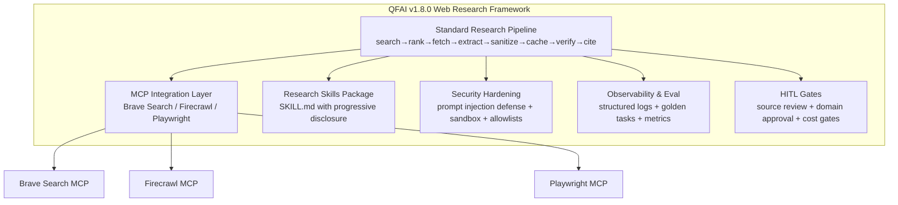

# 02_Inception-Deck

## Q1: Why are we here?

CLI-launched AI coding agents need reliable, secure, and reproducible web research capabilities. Current implementations are fragmented across agents, lack standardized pipelines, and expose security risks from untrusted web content. QFAI v1.8.0 addresses this by providing a framework for web research enhancement.

## Q2: What does success look like?

- A standardized research pipeline (search→rank→fetch→extract→sanitize→cache→verify→cite) implemented as QFAI skills
- MCP server integration templates for search/extract/browser automation
- Prompt injection defense mechanisms built into the pipeline
- Evaluation harness with golden tasks for regression testing
- Documentation and configuration templates for all three major CLI agents

## Q3: Who are the users?

- **Primary**: Developers using CLI AI coding agents (Claude Code, Codex CLI, Copilot CLI) who need reliable web research for coding tasks
- **Secondary**: DevOps/Security engineers configuring safe agent environments
- **Tertiary**: QA engineers building evaluation pipelines for agent research quality

## Q4: What's the solution concept?

## Q5: What keeps us up at night?

- Prompt injection via malicious web content causing unintended tool execution
- Rate limiting / API cost overruns from uncontrolled web access
- Stale or incorrect information poisoning code changes
- MCP server dependency breakage (e.g., Apify SSE deprecation 2026-04-01)
- Complexity creep making the framework harder to adopt than manual research

## Q6: What's in scope?

- Standard research pipeline definition and implementation
- MCP integration templates (Brave Search, Firecrawl, Playwright)
- Research skill definitions (SKILL.md format)
- Prompt injection sanitization layer
- Configuration templates for sandbox/permissions/domain allowlists
- Evaluation framework (metrics definition + golden task structure)
- HITL gate definitions

## Q7: What's out of scope?

- Custom MCP server development (consumers use existing servers)
- LLM model selection or fine-tuning
- GUI/IDE-specific implementations (CLI-only focus)
- RAG infrastructure (embedding stores, vector DBs)
- Organizational SSO/IAM integration specifics

## Q8: How long will it take?

This is a single version increment (v1.8.0). Phased delivery:

- Phase 1: Pipeline definition + MCP templates + security baseline
- Phase 2: Skills packaging + observability + evaluation harness
- Phase 3: HITL gates + documentation + cross-agent validation

## Q9: What are the trade-offs?

| Priority                         | Trade-off                                                              |
| -------------------------------- | ---------------------------------------------------------------------- |
| Security over convenience        | Strict default deny for domains/URLs, even if it slows initial setup   |
| Reproducibility over flexibility | Fixed pipeline stages, even if power users want shortcuts              |
| Simplicity over completeness     | Support 3 core MCPs (search/extract/browser), not all possible tools   |
| Offline-first over live-first    | Cached/indexed results preferred, live access requires explicit opt-in |

## Q10: What does the team need?

- Access to Brave Search API and Firecrawl API for integration testing
- Node 18+ and Docker environments for MCP server testing
- Representative "golden tasks" with known-correct research outcomes for evaluation
- Security review expertise for prompt injection defense validation
