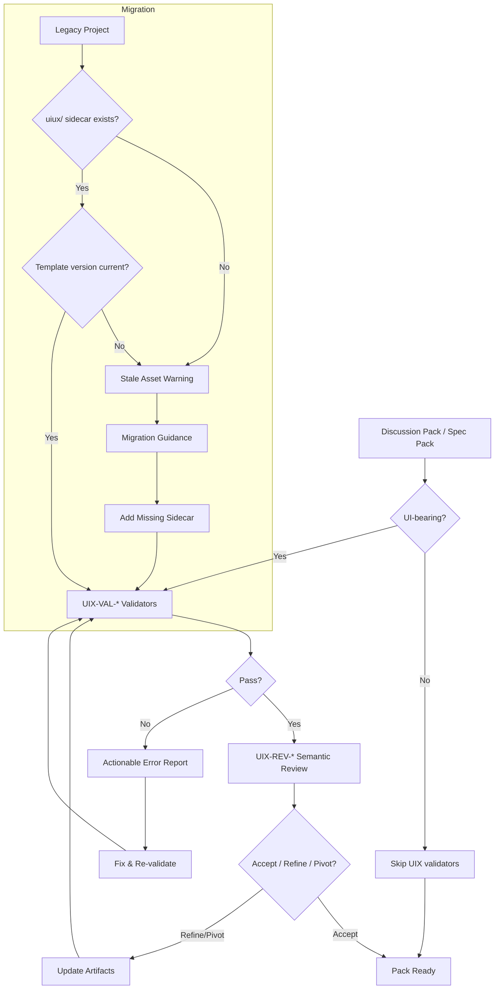

# 02 Inception Deck

## Metadata

| Key           | Value                        |
| ------------- | ---------------------------- |
| Discussion ID | discussion-20260329120000000 |
| Date          | 2026-03-29                   |

## Q1: Why Are We Here?

v1.7.3 で UI/UX sidecar artifact family を導入したが、artifact の「存在」だけでは品質が担保されない。deterministic な構造検証 + semantic な品質レビュー + 既存プロジェクトへの migration path を整備し、v1.7 系を実運用レベルに引き上げる。

## Q2: Elevator Pitch

QFAI v1.7.4 は、UI/UX artifact に対する **deterministic validator (UIX-VAL)** と **semantic reviewer (UIX-REV)** を統合し、missing/weak artifact の自動検出、actionable な report 出力、legacy project への migration support を提供する。

## Q3: Design a Product Box

- **Front**: "UI/UX Quality Gate -- Validate. Review. Migrate."
- **Back**:
  - Deterministic shape/completeness validators
  - Semantic strategy/scoring reviewers
  - Stale asset detection with upgrade path
  - Actionable error messages with fix suggestions

## Q4: NOT List (Out of Scope)

| Item                         | In / Out | Reason                   |
| ---------------------------- | -------- | ------------------------ |
| Browser/runtime evidence     | Out      | v1.8 scope               |
| Render capture               | Out      | v1.8 scope               |
| External critique adapters   | Out      | v1.8 scope               |
| Full-harness orchestration   | Out      | v1.8 scope               |
| Runtime gate redesign        | Out      | v1.8 scope               |
| Cost observability           | Out      | v1.8 scope               |
| Aesthetic taste hard gate    | Out      | Reviewer scope, not gate |
| Strategy "bestness" judgment | Out      | Reviewer scope, not gate |

## Q5: Meet Your Neighbors

- **Upstream**: v1.7.3 sidecar artifact templates, `designAudit.ts`, `designSlop.ts`
- **Downstream**: v1.8 runtime evidence, external critique adapters
- **Adjacent**: CI/CD pipeline (consume `qfai validate` output), IDE extensions

## Q6: Show the Solution

## Q7: What Keeps Us Up at Night?

| Risk                                           | Likelihood | Impact | Mitigation                                              |
| ---------------------------------------------- | ---------- | ------ | ------------------------------------------------------- |
| Validator が厳しすぎて authoring friction 増加 | Medium     | High   | Warning → error ratchet で段階的導入                    |
| Review と validate の責務混線                  | Medium     | Medium | UIX-VAL は deterministic のみ、UIX-REV は semantic のみ |
| Legacy project で stale asset failure 多発     | High       | Medium | Migration guidance + soft launch                        |
| Error message が不親切で導入停滞               | Low        | High   | Actionable message (rule ID + fix suggestion)           |

## Q8: Size It Up

- **Implementation slices**: 4 (validator / reviewer / tests / migration)
- **Estimated validator count**: 10-15 UIX-VAL rules
- **Estimated reviewer check count**: 8 UIX-REV items
- **Test fixtures**: rule-by-rule pass/fail pairs

## Q9: What's Going to Give?

| Priority | Dimension        |
| -------- | ---------------- |
| 1        | Correctness      |
| 2        | Determinism      |
| 3        | Actionability    |
| 4        | Coverage breadth |

## Q10: How Much Time?

v1.7.4 は v1.7 系の安定化リリースであり、v1.8 前の最終整備である。スコープは明確に限定されている。
