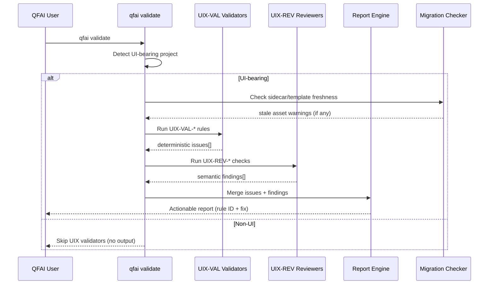

# 03 Story Workshop

## Metadata

| Key           | Value                        |
| ------------- | ---------------------------- |
| Discussion ID | discussion-20260329120000000 |
| Date          | 2026-03-29                   |

## User Stories

### US-D001: Deterministic Validation of UI/UX Artifacts

As a **QFAI user running `qfai validate`**,
I want **UIX-VAL-\* rules to detect missing/incomplete UI/UX sidecar artifacts deterministically**,
so that **I get stable, reproducible validation results without taste-based judgment**.

### US-D002: Semantic Review Integration

As a **QFAI user reviewing a UI-bearing discussion pack**,
I want **UIX-REV-\* semantic review checks to evaluate strategy quality, scoring weakness, and generic fallback risks**,
so that **I receive actionable feedback beyond structural completeness**.

### US-D003: Actionable Report Output

As a **QFAI user receiving validation errors**,
I want **each error to include a rule ID, clear description, and fix suggestion**,
so that **I can quickly identify and resolve issues without guessing**.

### US-D004: Migration Support for Legacy Projects

As a **QFAI user with an existing project created before v1.7.3**,
I want **stale asset detection and migration guidance**,
so that **I can upgrade to the new sidecar artifact structure without manual discovery of gaps**.

### US-D005: Non-UI Project Immunity

As a **QFAI user with a non-UI project**,
I want **UIX-VAL-\* validators to be silently skipped**,
so that **I don't receive irrelevant errors or warnings**.

### US-D006: Verify-Pack Integration

As a **QFAI developer maintaining the test suite**,
I want **verify-pack tests covering the redesign path**,
so that **regressions in validator behavior are caught automatically**.

## User Flow

## Design Direction Summary

### Option Comparison

- **Option A**: Validation-first dashboard with rule family summary, migration guidance, and issue grouping.
- **Option B**: Review-pack-first workflow emphasizing cycle status, reviewer findings, and repair order.

### Anchor Screen Selection

Selected: Option A because deterministic validator output and recovery actions are the primary user need for v1.7.4 stabilization.

### Competitive References

See 04_Sources.md for the competitive reference registry used to derive adopted and rejected patterns.

### CTA Hierarchy

- Primary: "Run qfai validate" action at the top of the flow.
- Secondary: "Open report.md" action after validation completes.

### State Coverage

- empty: No issues found, show clean PASS summary with next optional checks.
- loading: Validation/report commands running with progress note.
- error: Blocking validator error with concrete fix guidance.
- populated: Grouped findings with severity and follow-up actions.

### Design Anti-goals

- Anti-goal: Avoid generic placeholder dashboards that do not explain which validator failed or what to fix next.

## Example Seeds

### US-D001: Deterministic Validation

#### Happy Path

- UI-bearing pack with complete `uiux/` sidecar -> all UIX-VAL rules pass -> zero errors
- Implementation strategy artifact present with all required fields -> PASS

#### Negative Path

- UI-bearing pack missing `uiux/` sidecar directory -> `UIX-VAL-SIDECAR-MISSING` error
- Implementation strategy file present but `approach` field empty -> `UIX-VAL-STRATEGY-INCOMPLETE` error
- Scoring axes file missing `source_translation` for trend-derived axis -> error

#### Edge / Boundary

- Pack with `<style>` tags but no `
` -> should still detect as UI-bearing
- Pack with Mermaid screen flow but no HTML mock -> UI-bearing via flow diagram
- Empty `uiux/` directory (exists but no files) -> treated as incomplete, not missing

#### Permission / Role

- N/A (validator runs as CLI tool, no role-based access)

#### State Transition

- Project starts without sidecar -> adds sidecar -> re-validate -> errors clear
- Stale template version detected -> upgrade applied -> re-validate -> warning clears

#### Idempotency / Retry

- Running validate twice on same pack -> identical issue set (deterministic guarantee)

### US-D002: Semantic Review Integration

#### Happy Path

- Strategy selection well-justified with clear rationale -> reviewer accepts
- Evaluation axes cover all required dimensions without overlap -> PASS

#### Negative Path

- `selection_required=no` without justification -> `UIX-REV-SELECTION-UNJUSTIFIED` finding
- All evaluation axes overlap heavily -> `UIX-REV-AXIS-OVERLAP` finding
- Generic fallback detected in anchor selection -> `UIX-REV-GENERIC-FALLBACK` finding

#### Edge / Boundary

- Strategy with borderline justification -> reviewer flags as `refine` (not hard fail)
- Single-option comparison (no real alternatives) -> reviewer flags weak comparison

#### Permission / Role

- N/A (reviewer runs as automated prompt, not user-gated)

#### State Transition

- N/A (stateless check per run)

#### Idempotency / Retry

- Skipped (semantic review may vary; not deterministic by design)

### US-D003: Actionable Report Output

#### Happy Path

- Error includes `UIX-VAL-001`, description, file path, and `action: "Add uiux/ sidecar directory"` -> user fixes in one step

#### Negative Path

- Error missing action field -> report engine falls back to generic guidance
- Multiple errors on same file -> grouped by file, sorted by severity

#### Edge / Boundary

- 100+ errors -> report truncates with "and N more" summary
- Zero errors -> report shows clean pass summary

#### Permission / Role

- N/A

#### State Transition

- N/A

#### Idempotency / Retry

- Same input -> same report output (deterministic)

### US-D004: Migration Support

#### Happy Path

- Legacy project runs validate -> receives migration guidance with steps -> follows steps -> clean validate

#### Negative Path

- Legacy project with partially migrated sidecar -> specific missing-file errors (not generic "migrate everything")
- Template version mismatch detected but no newer template available -> warning only

#### Edge / Boundary

- Project created at v1.7.3 boundary (has some but not all sidecar files) -> partial migration guidance
- Non-UI legacy project -> no migration warnings at all

#### Permission / Role

- N/A

#### State Transition

- Pre-migration (warnings) -> migration applied -> post-migration (clean)

#### Idempotency / Retry

- Same project state -> same migration guidance

### US-D005: Non-UI Project Immunity

#### Happy Path

- Non-UI project (no HTML, no Mermaid screen flow, no `<style>` tags) -> zero UIX-VAL issues

#### Negative Path

- Intentionally skipped (non-UI projects should never trigger UIX errors)

#### Edge / Boundary

- Project with `<code>` blocks containing HTML examples -> not counted as UI-bearing
- Project with Mermaid `flowchart` (non-screen) -> not UI-bearing

#### Permission / Role

- N/A

#### State Transition

- N/A

#### Idempotency / Retry

- Same project -> same skip behavior

### US-D006: Verify-Pack Integration

#### Happy Path

- All verify-pack tests pass on correct fixtures -> CI green

#### Negative Path

- Fixture missing expected error -> test fails, signals regression

#### Edge / Boundary

- Fixture with ambiguous structure (borderline pass/fail) -> test documents expected behavior

#### Permission / Role

- N/A

#### State Transition

- N/A

#### Idempotency / Retry

- Tests are deterministic
